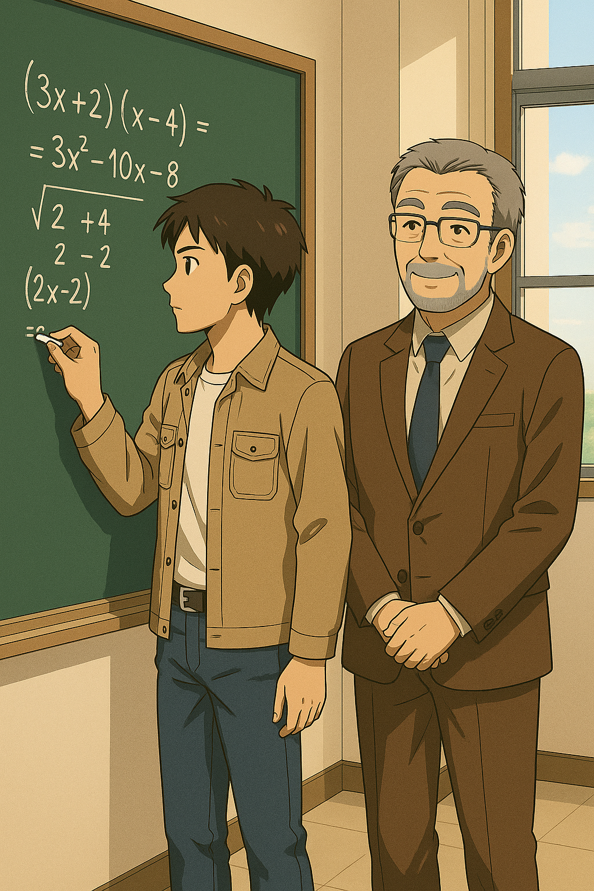
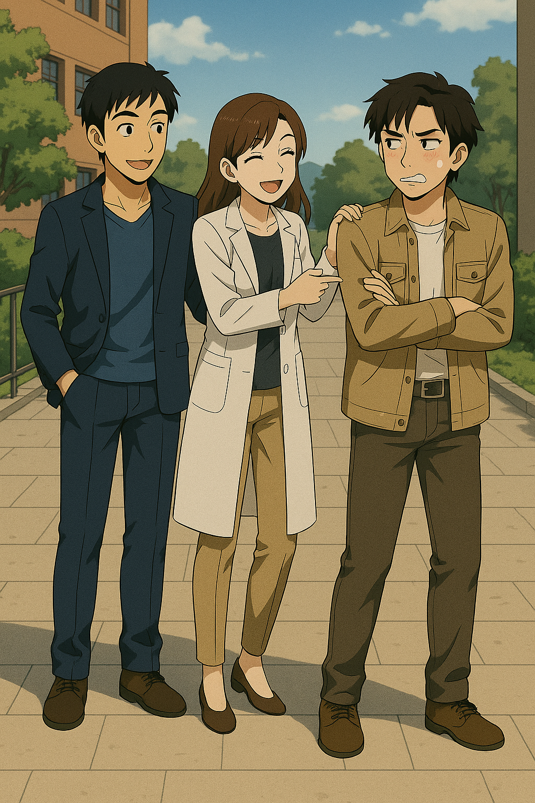

## 第一章：校园
这是一个再普通不过的上海四月的下午。
伊卡斯特学院还在上课时间，整个校园静悄悄，只有春风掠过林间时偶尔带起几声翻动的书页声。在机械与动力学院楼的一间教室里，一堂高级流体力学课程正在进行。教室不大，只有十来个研究生，稀稀落落地坐着。台上，六十岁的顾崇渊教授头发花白，正推着粉笔在黑板上慢慢演算；而第一排正中央，24岁的环境工程系博士生唐海，正坐在桌前呼呼大睡。顾崇渊原本懒得计较，毕竟上高级课的学生少见，偶尔有人打个盹也不是稀奇事。可唐海睡得太显眼了——不仅坐在第一排正中，而且脑袋一下一下地点，像是要把脑门磕到课桌上去。顾崇渊无奈地轻咳一声，放下粉笔，笑眯眯地点了名："唐海同学，可以请你上来算一下这个方程吗？"教室里的气氛微妙地一紧。大家早就对顾老师的这种笑容心知肚明：笑得越慈祥，坑得越狠。后排有同学悄悄把快要摸出来的手机又塞回了裤兜，桌面上一阵刷刷刷的笔记声瞬间响起——哪怕没人听懂，也得装作认真。唐海迷迷糊糊地抬起头，"啊，好。"
他揉揉眼睛，挠了挠头发，踉跄着走到黑板前，抬眼看了一眼题目——二维纳维-斯托克斯方程，幸运的是，只针对稳态不可压缩的牛顿流体，还是只考虑x轴的简化版。他站定，捏起一根粉笔，开始迅速演算。黑板上沙沙作响，唐海的笔迹飞快而流畅，像是肌肉记忆。五分钟后，他放下粉笔，回头："顾老师，我算完了！"顾崇渊眯眼看了一遍黑板，又慢悠悠地扫了一眼唐海，仍是那副和蔼的笑容："很好，唐海同学，哪怕上课没听讲，也能算对，可见功底深厚。"同学们刚刚松了口气，只听顾老师话锋一转："不过——"
他故意拉长了语调，"这道题，本来可以用我们今天讲过的Einstein Notation，解起来更简洁。你不用，啰里啰嗦一大堆，还是得请你出去罚站，反省一下。"唐海一拍脑门，苦着脸"唉"了一声，只好晃晃悠悠地往门口走去。
身后，一群本来心不在焉的研究生顿时全坐直了，连桌下的小动作都僵住，生怕下一个被点到自己。

唐海站在教室门口，脑袋靠着门框，发呆。走廊里一片静谧，只听得远处空调机组低低的轰鸣。他抬眼瞥了一下走廊尽头的挂钟——离下课只剩下五分钟左右。"顾老头儿待我其实也不薄啊。"唐海低笑了一声，嘴角挂着一点懒洋洋的弧度。说起来，他并不是个坏学生。只不过，这两个星期，他每天都要抽空去军部基地，接受飞行员训练。日夜颠倒的高强度操练让他一到寝室就像断了线的风筝倒下；白天在教室、在实验室，也总是提不起精神，连眼皮都在打架。他正这么胡思乱想着，忽然眼前一亮。走廊那头，一个纤细的人影正朝着他缓缓走来。赵以宁。她穿着她最常穿的米色西服和制服裙，一头中短发披在肩上，步履稳重，气质里有一种不动声色的从容。阳光从窗户斜斜照进走廊，映得她的侧脸轮廓柔和而明净，眼神里透着一种令人安心的沉静感。赵以宁是他的国际法课程老师，大他6岁。她是法学院近年来最年轻的副教授，也是学校里赫赫有名的"天才型讲师"，年纪轻轻就被评上了"全国优秀教师"。唐海至今还记得，第一次走进误打误撞选的国际法课堂时，她站在讲台上，一边拨弄着自己的头发，同时略微皱着眉头翻讲义的样子——那一刻，他就被她那种清秀、专注而温柔的气质深深吸引了。一种说不清的情愫，就这样悄无声息地埋进了心底。

赵以宁看到唐海站在教室门口，直勾勾地望着自己，脸颊微微泛起一层淡淡的红。她低下头，假装去整理手里的讲义，耳边却止不住地发烫。很快，她踩着高跟鞋，"哒哒哒"地快步走到他身边，嘴角挂着若有似无的笑意，轻声调侃道："怎么，咱们大学霸唐海，也有被罚站的一天？难不成你是去政治课上捣乱了？"唐海一愣，有些不好意思地挠了挠后脑勺。"宁宁姐——呃，不，赵老师......你就别笑话我了。"他压低声音，有点像做错事的小孩，又带着几分讨好似的亲昵。"这两天我一直在军部基地训练飞行，结果白天上课犯困，被老师当场逮了个正着。"赵以宁闻言，微微蹙眉，有些诧异。"你不是已经退伍4年了吗？怎么又突然回去军训？难道打算回部队发展了？"唐海咧咧嘴，眼神有点躲闪，含糊道："也不是啦......最近我在研究一种便携式能源技术，国家觉得这玩意儿可能在战斗机上能派上用场，所以......他们希望我亲自试飞，收集点一手数据。"说完，他悄悄斜了她一眼。事实上，他隐去了最关键的部分——所谓的"便携式能源"，真正的应用对象并不是普通战斗机，而是军方正在秘密研发的一种全新重型兵器：Manlike
Bastion（MB）——人形堡垒。这是绝密项目，哪怕是眼前的赵以宁，他也不能透露半个字。赵以宁没有追问，但神色明显沉了下来。她静静地望着唐海，眼底浮起一层压抑不住的担忧。"唐海，我认为我了解你。"她顿了顿，声音认真而温柔，"你在技术上的天赋很高，人也很单纯。但也正因为如此，你太容易被那些觊觎你的人盯上。军队那种地方，鱼龙混杂，不是只靠本事就能安身的。"唐海听着，心里暖暖的，又隐隐有点涩。他伸出手指，在自己太阳穴边轻敲了敲："放心啦，我又不是小孩子了，会自己拿捏的。而且，只是学术合作而已，我并没打算重新参军。"

说到这里，他像是突然想起什么，嘴角一勾，笑意又带了点狡黠。他故作轻松地叫了一声："赵老师——"喊到一半，他顿了顿。像是犹豫了一下，又像是下了某种小小的决心。他弯起眼睛，低低笑着改口："......宁宁姐，你这么关心我，昨天我跟你说的话......有没有考虑过呀？"那一瞬间，气氛像被某根细弦悄悄拨动了。 赵以宁一怔，耳根悄悄红了起来。她下意识地别开了视线。 昨天的场景又浮上心头——在一对一的答疑时间结束时，唐海借着请教论文的机会，忽然半认真半冲动地表白了。现在，见赵以宁没反应，唐海又趁机说道，"宁宁姐，我们认识一年多了。我知道，你对我不是没感觉的。"他的声音带着一点点急促，一点点赌气，又藏着年轻人特有的笃定和期待。那种直白而热烈的情感，几乎让人无处可逃。赵以宁又羞又窘，只好抽出一张海报，啪地盖在他脸上，佯怒："臭小鬼，明天晚上记得来！现在我得备下一节课去了！"说完就踩着高跟鞋小跑而去，只留下一个急促却轻盈的背影。唐海呆站在原地，低头一看，手里那张海报上写着：【星期四晚上7点，东楼报告厅。法学院赵以宁主讲：《技术到底是为人服务，还是决定人的命运》。】他痴痴笑着，把纸叠好，轻轻揣进兜里。胸口像被什么东西慢慢填满，暖得有些发烫。

下课铃适时响了。唐海赶忙提起书包，想趁着人群松动的时候悄悄溜走。结果刚走到教室门口，肩膀就被人拍了一下。"好家伙，连顾老头儿的课你都敢睡！我刚才踹了你椅子半天，你一点反应都没有！"唐海连头都懒得抬。不用看，他就知道这欠揍的语气，除了林砚没别人。林砚，是他当兵时同一个班的战友。和他一样，退伍后考进了伊卡斯特读工程。不过和他不同的是，林砚有个好爹——中国人民解放军空军某军区的中将，林伯源。班里知道林砚底细的战友们，要么躲得远远的，生怕得罪了这位公子哥，要么一口一个"林公子"地阴阳怪气。但唐海是个例外。理工男思维的他，对事不对人。俩人分到一组训练的时候，唐海一直是该批评批评，该帮忙帮忙。上一秒还因为打靶输给隔壁组（就差0.1环！）吵得面红耳赤，下一秒又一起扛着枪去靶场，唐海耐心地指导着林砚，和他一起加练。唐海各方面的能力——军事素养、体能、文化课，都胜林砚一筹。林砚从心底佩服他。而唐海也慢慢发现，这家伙跟想象中的高干公子完全不一样：不怕苦，不怕累，没架子，有担当。一来二去，两人就成了铁哥们儿。此刻听林砚嘲笑自己，唐海懒洋洋地反击："我睡不醒还不得谢谢你爸？点名要求我们实验室配合他的研究计划！老师一看我军营背景，直接钦点：哦吼，就你了！然后我就成了主要负责人！谁来救救我啊！"林砚耸了耸肩，嬉皮笑脸地凑过来："哎，我爸的事儿，你撒气撒我身上有啥用？"又忍不住补刀："而且说真的，谁叫你非要选高级流体力学啊？环境学院的老实学水处理不好吗？你一个人跨十几个专业学科，作业做爆，还不考试，防止学分超限。你当自己蝙蝠侠啊？装什么逼？"唐海也笑了，拍了拍他肩膀："你还好意思说我？本科学车辆，现在又成了航天学院的博士生，还同时在船舶学院学二硕。你是想当军委主席啊，海陆空通吃？"

天色昏黄，走廊外有风吹进来，把两个人的影子拉得长长的。两人一边斗嘴，一边顺着学校的小路走着，不一会儿就走到了医学院大楼。忽然，林砚抬头一看，挥舞着手喊道："喂——！我们在这儿呢！"唐海顺着他目光看去，只见一个扎着马尾、穿着白大褂的女孩快步走了出来。是季思澜。林砚交往了一年多的女朋友。说起这季思澜，也是个不折不扣的大学霸——临床医学八年制博士生，主攻整形外科，顺便还在修生物医学工程的硕士学位。别的情侣逛街看电影，他们俩最常去约会的地方，毫无疑问是学校图书馆。而他们做过最浪漫的事，据说是某天晚上，林砚偷偷溜进太平间，陪正在那里值夜班的季思澜，一起熬过寂静又寒冷的一夜。

林砚快步迎上去，一边接过季思澜手里一大包书，一边笑得一脸谄媚："澜澜老婆～我们啥时候一起去市中心新开的那家综合商场玩玩啊？"唐海在旁边翻着白眼。季思澜轻轻"啧"了一声，撇撇嘴："玩玩玩，就知道玩！你这博士读得，怎么比本科生还轻松？你看看人家唐海，上学期还在我们学院修了药理学，平时表现比我们不少医学生还好！要不是他最后翘了考试，拿个4.0肯定没问题！"说着，她又有些担心地转向唐海："听林砚说，你最近老是跑军营？还不分昼夜地做飞行员训练？你又不是空军预备役，也要适可而止啊。"唐海摸摸脑袋，有点不好意思地笑了笑："没办法啊，我搞能源的。如果不亲自上去驾驶一下，就不知道能源供给和转换效率能不能跟上战斗需求嘛。有些很微妙的差异，只有像我这样的科研人员，才能真正理解。比如说啊......"他兴致勃勃地，开始比划着想讲个三维受力分析模型。

林砚立刻打断他，做了个"停停停"的手势，一边转向季思澜，苦着脸求助："老婆，你赶紧给我哥们儿介绍个你们医学院懂点营养学的小护士吧！你看看他这黑眼圈，这状态，是需要好好有人照顾了！"季思澜也笑着打趣："是啊，唐海！你喜欢什么样的女生？跟我们说说，好给你物色物色。"唐海耳根一红，正要说话，结果口袋里那张赵以宁的海报，不合时宜地掉了出来。林砚眼疾手快，一把捞起，定睛一看，脸上顿时露出了一副看穿一切的表情。"老唐，你不对劲啊。"他凑过来，坏笑着低声念："法学院赵以宁......啧啧啧......还是个大美女......不对啊老唐，我明明记得，你在部队里的时候，喜欢听那个叫什么，冰淇淋少女，反正就那个韩国高中生女子组合的歌，我还以为你喜欢萝莉呢！啥时候你成姐控了啊？"他又眯着眼上下打量了唐海一眼，像发现了新大陆一样，补刀道："你啥时候对文科讲座感兴趣了？不是物理，不是化学，居然是法学——啧，啧啧啧啧。明明本科的时候上政治课，回回都因为上课做高数作业，被老师拎出去罚站！结果现在，这个美女赵以宁一开讲座，你就屁颠屁颠跑来了？"唐海涨红了脸："......谁说我对文科没兴趣的，老子上次连TOPIK四级都考过了呢......"林砚毫不留情地出卖了他："狗屁，你明明就是在部队的那段时间空虚，喜欢那个少女组合到无法自拔，居然把韩语都学了！而现在......"说到这里，林砚一脸"我懂了"的猥琐表情："老唐，莫非，你喜欢更刺激的？师生恋？禁断play？哇哦哦哦，你可以啊！"唐海的脸越来越红，气呼呼地留下一句抗议："少废话！......我得去训练了！"他背起包，往校门口快步走去。刚走出两步，他又折返回来，从林砚手里一把夺过那张海报，然后头也不回地跑了。林砚在后面笑得直不起腰，季思澜则也是笑看着唐海的背影，叹了一口气："啧啧，春天来了啊。"

