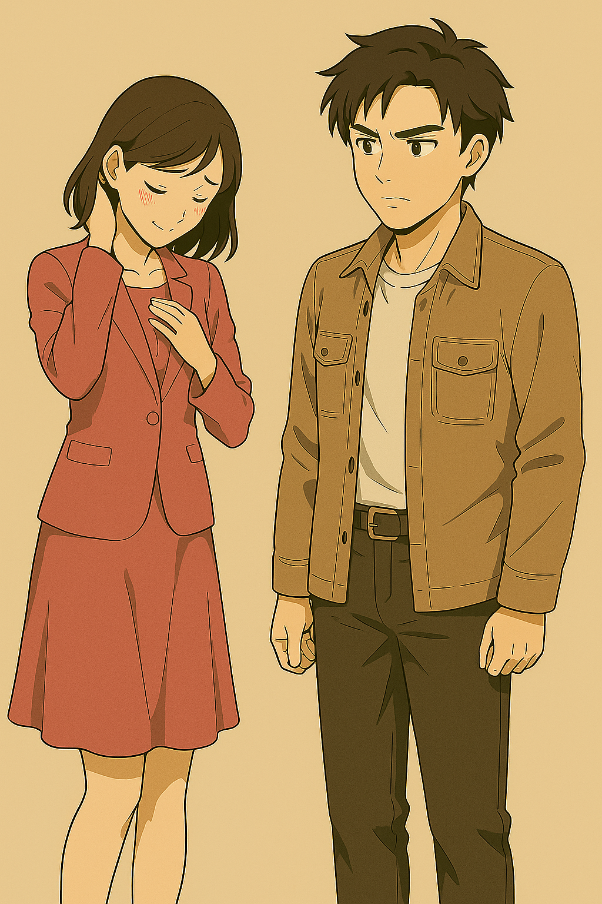
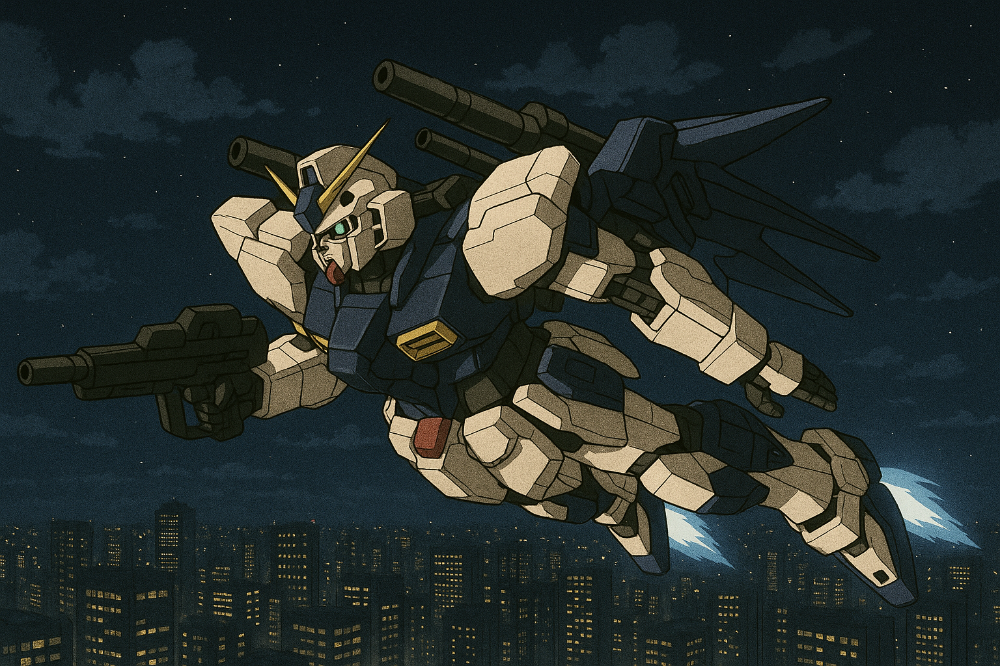

## 第三章：表白
报告结束后，唐海特地留到最后，等所有听众都走完了，再上去和赵以宁打招呼，"嘿。你今天的演讲非常精彩，以及，"他有些不好意思地低下头，"你今天也格外漂亮。"赵以宁脸也有些羞红，"谢谢你。所以，你是找我有什么事吗？"她期待着，也许唐海是来问她表白的结果。事实上，这两天她也很纠结。唐海固然是个非常优秀的男孩子，她在台上谈到他对自己的激励时是真心实意的。年轻的脸庞也有几分小帅，说一点都不动心是不可能的。但她也清楚，自己是他同校的老师，年长他不少。虽然学期结束后，自己不再是他的任课老师，原则上，二人谈恋爱并不会违反任何校规——这是她带着自己特有的职业病，仔细地把那本厚厚的校规，前前后后翻了好几遍，所得出来的结论。但她非常清楚，若真要在一起，来自现实的阻碍和谣言恐怕会比他们想象的还要多。更重要的是，赵以宁隐隐明白：像唐海这样有理想的人，终究不会甘心留在一个城市和她长厢厮守，做一对平凡的学术夫妻的。她回想起第一次在国际法课堂上注意到唐海的情景——那时候，他坐在后排，低着头，似乎在玩什么掌机。她本能地皱起眉，心里断定这是个不学无术的坏学生。可渐渐地，他开始在课堂上提出刁钻而犀利的问题，那些问题不只是表面好奇，而带着真正的思考深度。她收到他的论文时，更是吃了一惊：一个工学院的博士生，居然能在法律理论中捕捉到她的专业同仁都未必能一眼看出的细节和悖论。后来她才知道，唐海不只是偶然选了国际法，他在各个学院都旁听过课——机械、计算机、金融，甚至医学。他像一个对世界贪婪好奇的少年，把学术当成一场冒险。就是在那一刻，她第一次感到了一点钦佩，和一点，难以名状的悸动。赵以宁清楚，这样的男人是有野心的。他注定要走更远的路，去面对更大的风浪，"可是，如果他真的要一个答案，看他现在这么可爱的样子......"赵以宁心里一软，差点就想答应："要不，在一起试试看吧。"

然而，唐海的表情格外严肃认真，让她一怔。她突然意识到，他要问的，也许不是关于表白的事。果然，唐海开口道，"宁宁姐，如果有一件事情，你知道很难做，但你也意识到，可能这个世界上只有你来做，而且非常重要，无法回避。是你的话，你会怎么办？"赵以宁有些震惊，但她也知道，唐海一直是有什么就说什么的性格，如果是一件让他都遮遮掩掩的事，那自己问了也没用。她想了想，微笑着说，"我想我会去做。正如我在报告里说的，我们法律工作者的工作，就是修正体制，让它能抑制恶的同时又鼓励善。你知道，这不是一件简单的事，但我已经决定把这作为我一生的事业去奋斗。而这，正是受到了你的激励。"唐海很认真地看着赵以宁的眼睛。他很少这样认真地注视一个人，但此刻，他几乎无法移开视线。他忽然明白了：自己喜欢的，从来不是单纯的外表。而是她，那个在黑暗与洪流中，也依然坚持微光的人。哪怕前路坎坷，哪怕身处巨浪之中，她也绝不会随波逐流。这时，他突然想起来了什么，声音变得有些急促："宁宁姐，关于我的表白......"赵以宁脸红着轻笑道："不着急，我会认真地给你一个答复的。"两人告别后，唐海下定了决心，给林伯源发了个信息，"林叔叔，就由我去吧。"

出发的日子订好了，就放在伊卡斯特期末考试周后的那个星期一。最近这段时间，唐海虽然一如既往地准备翘掉所有非专业课的考试，但还是有一两门要准备，以及要准备期末开题报告，去朝鲜的学术材料等等，格纳库去得也少了。虽然这次任务总体来说是技术交流，理应没什么危险，但一考虑到其背后的实质，唐海还是有些担心他这次一去不复返。一天晚上，林砚和唐海一起去了趟格纳库。那天属实已经很晚了，格纳库里静悄悄，连王志行都回去了，走之前对着两个年轻人叫着，"你们俩可别他妈乱搞啊，乱搞也别被我发现，不然我和你们俩一起，人头落地！"。在盘古的驾驶舱，唐海像交代遗言似的和林砚交代关于盘古的一切细节。"老唐啊，你只是去朝鲜搞个技术交流，咋被你搞得像去赴死一样的？"林砚有些受不了唐海的絮絮叨叨，也不知道他一直在说的技术细节，是说给他林砚听的，还是只是唐海自己在留遗言。这时候，他看了眼盘古，"老唐，你难道没想过真的开这玩意试试？"

唐海听见林砚这句，忍不住笑了。笑容有点无奈，也有点叛逆。他伸手拍了拍盘古冰冷的外壳，声音带着少年人独有的倔强："当然想过啊。这家伙，从骨架到能源系统，我都跟着一点点搭出来的。要不是上面不让，我早飞它几圈了。"林砚咂咂嘴，靠在盘古的驾驶舱门口，仰头看着那台钢铁巨人："啧......要我说，咱们干脆趁你走之前，偷开它一回得了。"唐海翻了个白眼："疯了吧？一旦系统检测到擅自启封，整个基地能立刻拉响红警。"林砚耸耸肩，笑得吊儿郎当："那也得系统能查得出来啊。万一，有人偷偷给你留了权限呢？"唐海一愣，想起了什么，目光一动。王志行......他记得，那个老整备师临走前意味深长地拍了拍他的肩膀，还压低声音交代过什么。盘古系统里，他确实被偷偷赋予了临时全权限，只是，直到这一刻，他都没真正想过要动用它。唐海垂下眼睑，手指轻轻扣着操作面板的边缘。当他正想拒绝，说一句再等等吧时，看到身边的林砚不见了。再一看，他在舰桥上的控制面板上操作着什么。突然，轰隆一声，盘古头上的门被打开了。林砚坏笑，"哈哈哈哈，我老爹这个老古板，啥玩意儿的密码都设成和我妈的结婚纪念日！"他笑得像个得意的孩子，转过头来对唐海炫耀道，"我小时候溜进他办公室，偷偷用他的电脑打游戏的时候，就发现了！"唐海吓了一跳，"卧槽尼玛！公子哥，这玩意可不是开玩笑的！赶紧关了！！"林砚摆摆手说，"诶呀你急什么嘛！我平时来的时候观察过了，这个基地里夜间巡逻队人员稀少，每到整点和半点，大概每30分钟会有人来基地这儿转一圈。有时候甚至他们很松懈，一小时来一次。这儿的警报都被我关了，所以，赶紧滴！"唐海还想说什么，林砚把他按回了驾驶舱座椅上，"唐老弟，我知道，你是发自内心觉得这次任务危险。所以，哥们儿我是真不想让你留下遗憾......赶紧去吧！15分钟内给老子飞回来啊！不然老子人头落地了，半夜里化成厉鬼来吓死你！"然后他哈哈一笑，就反身跳了出去。

唐海呆呆地望着控制面板，手却已经不由自主地按下了启动键。扫描过唐海的虹膜后，盘古的监控器全部打开，引擎开始轰鸣。"妈的，拼了！就算是对我的努力有个交代！没错，光有模拟系统数据不够，需要真实飞行比对！"唐海一咬牙，一脚踩下能源连接踏板。盘古应声做好了准备姿势，然后像一道闪电一般，从头顶上的门冲出了格纳库。盘古很快就拉到了2000米高空，这还是唐海第一次从盘古内部的监视器里俯瞰这座城市。唐海定了定神，没看到报警系统有什么警告，甚至监视器往下看也只是一片漆黑，没有警察或者军队注意到任何异常。于是他放下心来，尽可能地继续拉升，并且往内陆方向飞去。唐海尝试了不同的姿势，水平飞行，Z字前行，急速停止转换方向，眼镜蛇机动，倒退，自由落体后急速拉升，俯冲，沿水平线360度旋转，甚至躺着水平飞行等等，都可以实现。

虽然没有直接的数据比较，目前也无法测试火控系统，但根据唐海在部队时有限的驾驶坦克的经验，以及近几次在战斗机模拟器上的感受，盘古的机动性、反应速度、任务重构能力，远超现役载具体系的评估模型。确切地说，恐怕再投入十年，传统平台也仍追不上它的作战半径和潜在的火力调度密度。现在，盘古的AI辅助驾驶也在如饥似渴地学习着这些新知识，唐海做的每一个动作它都记住了。机体所用的动力源是混合动能，包括传统的高容量蓄电池和唐海在博士期间所研究出的核动力系统。该核动力系统是盘古乃至整个人形堡垒计划之所以能发展的的根基之一，它围绕着一个小型的可控核聚变炉所组成，而在唐海团队之前，常温可控核聚变已经被实现了几年时间，并作为新能源基础设施，在全球几个发达国家内开始逐步试点铺开，但和传统能源比，成本比较高昂，使用范围还不算广。而且从规模上看，目前的应用都集中在大型核电站这个级别的出力，能做到只有直径为3米左右的一个能源炉的，目前只有唐海他们的团队。由可控核聚变产生的核能，理论上可以被视作永久能源，使得MB这种高耗能的铁疙瘩能投入实战。虽然由于担心这项技术还不成熟，唐海特地加了蓄电池模块作为备用，不过目前看来，核动力系统的表现卓越，根本无需蓄电池的介入。"简直完美！"唐海是这样评价这台机体的。

与此同时，格纳库不远处，基地东门的岗亭内，两名守卫听到了一阵不寻常的低沉轰鸣。一老一少抬头望去，只见夜空中一道炽亮的光痕划破天际，一尊巨大的钢铁身影拔地而起，隐入云层。年轻守卫皱眉："老叔，今晚有飞行演练的计划吗？"老守卫懒洋洋地扫了一眼监控面板，又望望远方天际，摆摆手道："唉，八成又是上头临时安排的系统测试。警报没响，你看，系统没记录异常信号。反正咱也不懂他们现在搞的新技术，管多了反而背锅。"年轻人迟疑着点点头，嘴里嘟囔着："是这样吗......"

总而言之，那晚的试飞没有任何问题，没有惊动任何安保，机体也没有任何损伤。直到他准时在15分钟内飞回格纳库，轻轻降落在原地时，仍不敢相信这是真的。出格纳库的时候已经是深夜12点了，两人只能走很长一段路后，打算打车回学校。等车的时候，林砚问唐海感觉如何，唐海伸了个大大的懒腰，像孩子般地笑了，"值了！"直到回到宿舍后，唐海还是久久不能入睡。他趴在床上，闭着眼还在回味飞行时的感觉，胸口像揣着一颗刚被点燃的小小太阳。

期末考试来了，期末考试又走了，而下周一就是要出发的日子。唐海迟迟没有收到赵以宁给他的回复，于是他决定在离开前，向她问个清楚。意料之外又情理之中地，赵以宁答应跟唐海在晚饭后去海边散散步。很快，时间到了晚上六点。赵以宁从法学院的办公室翩然而至，脸上依然挂着温柔的笑。她随手拢了拢裙摆——一条简单的白色连衣裙——唐海忽然意识到，他曾经无意和她说过，自己最喜欢心爱的女孩穿白色连衣裙的样子。海风微咸，空气中带着潮湿的味道。太阳已经偏西，海面反射着碎金一样的光。唐海和赵以宁沿着海滩慢慢走着，谁也没有开口。唐海略微落后半步，看着赵以宁的侧脸，发丝被风轻轻拂动，轮廓在暮色中柔和得像一幅旧画。他张了张嘴，想说些什么，最后又只是笑了笑，低下头踩着细软的沙子。赵以宁回头冲他一笑，那笑容里没有悲伤，也没有承诺，只是简单、温柔，像一朵被风带走的白花。

他们就这样静静地走着，时间慢得像要凝固。直到一个声音打破了这片宁静。"真巧啊！你们也是期末考结束了，来海边散散心吗？"林砚从远处走来，穿着简单的灰衬衫，手里拿着个小袋子。他停在两人面前，笑了笑，伸出手，"你好！你就是赵以宁赵老师吧？常听唐海提起你！"赵以宁也笑盈盈地伸出手，"你好你好！我猜你是林砚？唐海他也经常跟我说你们在部队里的趣事呢！"林砚笑着听着，突然，他看向了后面的夕阳，用温和中带着狡黠的声音问道，"今天这么美，二位俊男靓女要不要留张合影？以后也算是个纪念。"说完，向唐海眨眨眼。唐海一怔，本能地看向赵以宁。赵以宁只是轻轻点头，目光清澈如海面。林砚掏出手机，站到几步外。唐海站得有些局促，双手不自然地垂在身侧。赵以宁自然地靠近了一步，肩膀与他之间，只隔着一线海风。海风拂过，赵以宁的发丝轻轻扫过唐海的肩膀。唐海下意识抬起手，想替她按住，但指尖悬在半空，最终慢慢收了回来，只是悄悄攥紧了拳头。林砚按下快门。咔嚓一声。一张普通到不能再普通的照片诞生了：傍晚的海边，一个穿着白裙子的女孩，一个穿着浅色衬衫的男孩，站在彼此身旁，笑容安静又遥远。林砚把照片用蓝牙发给二人后，收起手机，又把小袋子递给唐海，说："是上次我爸出差买的表，让我带给你，说谢谢你一直帮他。"唐海开口说谢谢，而赵以宁微微侧头，看着两人，只是笑了笑。林砚没有多留，拍拍唐海的肩膀，意味深长地笑了笑，转身离开，背影很快消失在落日的余光里。海滩重新归于安静，只剩下海浪断续拍打着岸边的声音。唐海低头看着手里的小袋子，指尖无意识地摩挲着。

过了很久，他才低声开口，像是在小心翼翼地试探："宁宁姐......要不，等我回来......咱们也去走一走别的海边？"他侧过头，看着她，眼神里藏着一丝几乎要溢出来的希冀。赵以宁微微一笑，那笑容温柔得几乎让人心碎。她没有立刻回答，只是上前一步，踮起脚，在唐海的左脸颊上，极轻极轻地，吻了一下。那吻温柔得像一片羽毛落下，带着告别，也带着一份藏了很久、却不得不放手的深情。赵以宁退开半步，声音低低地，几乎被海风吹散："唐海啊，如果这个世界允许，我当然想和你一起去很多地方。"她轻轻地笑了笑，目光清澈得几乎残忍："但这个世界......从来就不是让我们随心所欲地活着的地方。"唐海的喉头动了动，像是想说些什么，却最终只是低头笑了一下。他明白了。赵以宁继续轻声说："所以，宁宁姐，会把对你的喜欢留在心里。不会成为你的负担，更不会成为你的枷锁。"海风吹得她的发丝轻轻飘扬，她伸手别到耳后，动作平静得像一场温柔的诀别。"走吧。"赵以宁低声说，"你还有很长的路要走。不要回头。"然后，她向相反的方向，慢慢淡出了唐海的视线，削瘦的身影很快就消失在夜色里。唐海没有再试图挽留，他只是站在原地，拳头在身侧微微收紧，眼眶发烫，却只是低低地笑了一下，什么也没追上去。他抬起头，看着远方那片渐渐被夜色吞噬的海平线，心里久久不能平静。

当天晚上，唐海一个人呆在宿舍里。他坐在床边，手里拿着手机，看着那张林砚帮他们拍的照片，指尖无意识地划过赵以宁温柔的笑容，心里一阵一阵泛着涩意。夜色沉沉，屋里只有微弱的台灯光。空气里，只有浪潮声远远拍打着海岸。他怔怔地看了很久。突然，耳边传来一声："老唐！能听到我说话吗？"唐海吓了一跳，手一抖，差点把手机掉地上。他看来看去，最后目光停留在了林砚给他的袋子上。那个熟悉的声音又说道，"靠，忘说了，这玩意旁边有个红色的按钮，你按一下，停顿一拍，再连续按三下，然后常按，就能说话了。说完话后，放着别动五秒，语音系统自动断开。"唐海摸索着袋子，摸到一个纸盒子和一个塑料盒。他确定声音是从纸盒子里发出来的之后，打开一看，是个手表，也看到了右边的红色按钮。他按照操作按了一通以后，压着嗓子回了一句："能听到。林砚，你大半夜的抽什么疯？"
表里传来林砚那欠揍又兴奋的小声："赵老师现在睡你旁边？啊？是不是啊？！"唐海额角青筋一跳，冷冷回道："滚。老子表白失败，正郁闷呢。"表里顿了顿，然后爆出一句夸张的咒骂声："......操！真的假的？！老子特地等到这么晚才开通通讯，就是怕打扰你俩办正事！结果你告诉我你失败了？！"

唐海懒得搭理他，直接翻了个身，背对着光，语气里带着一点疲惫又带着一点勉强的笑："少废话，说正事吧。"林砚那边沉默了一下，声音收敛下来，带了点正经："行行行，不逗你了。说正事，这块表是定制通讯器，伪装成普通手表的。能直接连接我的设备上，就算你啥都不做，我也能得知你的定位。频道加密，信号跳转，你在朝鲜那边用的时候别大意，只要开机，我就能收到你的位置和短波通话。"唐海听着，默默"嗯"了一声。林砚又停顿了一下，低声加了一句："老唐，我觉得你实在想太多了，去朝鲜交流而已。但如果真出事了，别硬扛，按手表侧面的那个红色小钮，我会尽最大努力把你救回来。啊对了还有！"那头的林砚又想起了什么似的，"袋子里还有个小盒子，是我媳妇儿特别给你开的一些处方药，可能在朝鲜可以用上。"唐海垂着头，一只手扣着照片边缘，另一只手摸着手表。他没有说"好"，也没有说"谢谢"。只是低低地笑了一声："知道了。"林砚最后嘟囔了一句，"你小子，可得活着回来啊......"然后就挂断了通讯。

