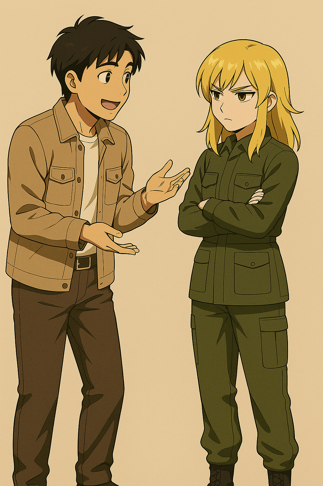

## 第四章：星星
去朝鲜的旅程意外得顺利，经过三个小时不到的飞行，高丽航空的飞机稳稳地降落在了平壤顺安机场。在过海关安检的时候，唐海还有些紧张他的手表型通讯器被发现，但朝方的士兵只是随意摆弄着他所有的随身物品，眼睛却盯着他的口袋。唐海心领神会，急忙掏出提前准备好的两包中华烟递了过去，对方眉开眼笑，很快就给他的护照上敲了通过章。来接唐海的车也早在机场门口等候多时了，唐海的座位那里的车窗被完全被贴成了黑色，而陪行人员则是有意把他挤在座位上，絮絮叨叨地用含糊不清的中文和他聊天，让他无法透过司机的角度观察他们的具体路线，他干脆就不理会对方，把眼睛闭上了。

过了很久，唐海被带到了一个军营里，他被安排在一个会客室里等待着。不一会儿，一个中年人从大厅的一边出现了。"您好！"他用蹩脚的中文说道，"您就是唐海吧！我叫做崔光烈，是我们朝鲜人民军平壤军区的陆军中将，特地来接待您的！"崔光烈微笑着，身形挺拔，穿着一身剪裁得体的军装，朝唐海走来。唐海也站起身，礼貌地向崔光烈用韩语打招呼，"您好！我是伊卡斯特学院的唐海，见到您很高兴！"崔光烈眼神里闪过什么，然后立刻变得语气亲切，仿佛多年未见的亲人："哎呀，唐同志，终于见到你了。我们很早就听说了你的事迹，这么年轻，就在能源技术和机体设计上做出如此卓越的贡献，真是时代的骄傲啊。更没想到的是，你还会说我们的语言！"他上前一步，伸出双手热情地握住唐海的手，掌心温暖而有力。崔光烈微笑着继续说道："我们的国家，非常重视像你这样的年轻人。技术，智慧，忠诚，这才是未来真正需要的力量。这次的交流，是双方友谊的新起点，当然，也是你亲自见证伟大事业的机会。"他轻轻拍了拍唐海的肩膀，目光柔和。但唐海却觉得，这种目光像一道无形的网，悄无声息地将把自己笼罩其中。"希望你能尽情地交流，也希望你能习惯这里的规矩。我们会一直陪伴着你的。"他说完，笑得更加慈祥了些，仿佛真的是一位值得信赖的长者。但是一瞬之间，他的语气冷了一些，"不过，你讲朝鲜语的时候，我希望你能尽快改掉那种南边的腔调。听着太杂、太轻浮了。我们这里讲的是正统的平安道方言，希望你能学会。"唐海撇了一眼崔光烈身后的走廊上，那些若有似无的摄像头，只是说了句，"好的，请您多指教了。"

崔光烈微笑着，像是突然想起了什么似的，回头招了招手。从大厅另一侧，一个身穿军绿色作训服的年轻女子走了过来。她皮肤白皙，五官精致，有一头金色的齐肩短发，腰背挺得笔直，举止干练而利落。走近了，唐海注意到，她那漂亮的浅棕色的眼眸中，透出着一股并不怯懦的眼神，甚至带着一丝几乎藏不住的骄傲。崔光烈笑着介绍道："这位是苏贞花同志，是我们技术局的优秀骨干，接下来，你在这里的一切技术交流，由她来全程协助。贞花，这位是中国来的唐海同志，他朝鲜语说得不太地道，但交流应该没问题。"说着，他意味深长地补了一句："年轻人之间，沟通起来，总是更轻松愉快的嘛。"唐海淡淡一笑，朝苏贞花礼貌地点头，对方也向他一笑，却有些媚意过浓："我是苏贞花，您就是唐海唐同志呀？久仰大名，今后请多指教。"唐海眼神沉了下去，在心底，警铃已经悄悄响起。"太刻意了。美人计，用得太熟练了。"他暗暗想着，但面上仍然保持着恰到好处的客气微笑。"幸会，苏同志。我是唐海。接下来的时间，就请多多指教了。"他轻轻握了握对方伸过来的手，很快收回，力度恰到好处，既不冷漠，也不多余。苏贞花也微微一怔，她感觉到，眼前这个年轻的男人，看自己的眼光不像是在军队内部习惯的其他男人的目光那样，压抑中又带有些猎奇，他的眼里有种身上有种说不出的冷静和倔强。"无论如何，绝不是那种可以轻易被掌控的人！"苏贞花心里微微一动，一丝本能的战栗掠过。

崔光烈安排苏贞花带唐海去他的宿舍后，又微微一笑，"唐同志，祝你在这里愉快！有机会的话，我们或许会再见面的。"苏贞花带着唐海，两人一前一后，到了唐海所住的宿舍大楼。苏贞花回头，摆出一个灿烂的笑容说，"唐同志，我就送你到这里了，我很期待下午见到你！"这时，唐海脸上的礼貌笑意也随之冷却下来。他直视着苏贞花，眼神沉了几分，声音低而清晰："苏贞花，对吧？我想告诉你，我很清楚你们在玩什么把戏。想通过你来套取情报，对吗？"苏贞花微微一怔，但很快又恢复了冷淡的表情。而当唐海话一出口，他就觉得自己可能太冲了，但箭在弦上，他只能硬着头皮说下去，试图让语气平静得近乎冷漠："你确实很漂亮，或许其他人会被你迷惑。但很遗憾，我不会吃这套。"苏贞花怔了一下，显然没料到唐海会这么直白。她像往常一样试图冷笑，却没能完全收住那一丝颤意，声音清冷而克制："唐先生，我们带着最大的诚意邀请你来，是把中国人当作朋友、老师来看待的。"她顿了顿，眼底划过一丝冰冷："既然你是这样看我们的，那我也不必虚与委蛇了。"苏贞花挺直了腰背，语气更加冷淡："坦白讲，这次所谓的'交流'，我本人从一开始就没抱什么期待。"她看着唐海，咬了咬唇，眼神里带着一点倔强的锋芒："实话说，我国的国防科技水平，远远在你们之上。"最后，她微微侧头，声音压得极低，却异常清晰："所以，唐先生，请你不要自我感觉太好。"说完，她没有再看唐海，转身离开，只留下一抹干净利落的背影。

唐海把行李箱提进了自己的小房间，步伐沉稳，但心里却隐隐有些发闷。回想起刚才的话，他咬了咬牙："我真是个笨蛋，果然还是太冲了点啊。"他不傻，也不是完全没有同理心。他明白，无论苏贞花此刻扮演着什么角色，她本身，也不过是这个体制里的一个小齿轮罢了。就像他自己，也不总能左右自己的命运一样。更现实的是，如果真的想完成任务，想探到有价值的情报，苏贞花，恐怕是最接近突破口的人。唐海抬手捏了捏鼻梁，暗暗叹了口气。"算了，之后找机会......道个歉吧。"

到了下午，按照日程安排，苏贞花准时来接他，准备陪同他参观基地其他几个实验区。唐海原本打算趁机找个合适的话题，委婉地缓和两人之间的气氛。但苏贞花不知是生气还是确实对唐海没有兴趣，从头到尾没有给他一点机会。比如在参观一个兵器基地时，唐海试图缓和气氛，开口说一句：“苏同志，这里的设备看起来挺先进，你们平时也用这些吗？”但苏贞花只是冷冷地“嗯”了一声，然后加快步伐。再比如，两人路过食堂时，唐海用近乎讨好的口吻说道："苏同志，刚在吃午饭的时候，我发现你们提供的泡菜居然有6种不同的口味！贵国的饮食文化还真博大精深呢！"苏贞花这次干脆理都不理，就像没听见一样。她全程冷着脸，声音清冷而简短，所有的话，都严格停留在"介绍设施"或者"赞美祖国"的范围内，不多说一句废话，不给任何私人接触的空间。唐海几次想开口，话到嘴边又咽了下去。空气里，一直弥漫着微妙又压抑的僵硬感。就这样，一整个下午的行程，两人几乎是沉默着走完的。

直到傍晚时分，他们回到了基地一栋隐蔽的小楼，来到了一间办公室门口。苏贞花推开门，淡淡地说："这儿是我的办公室，有什么事可以来这里找我。今天就到这里，辛苦你了。"声音客气，但冷冰冰的。唐海不想错过这最后的和好机会，忙不迭地问，"请问，我可以进来看看吗？"苏贞花也不想多说一句话，就说："随便。"唐海厚着脸皮进来了，这间办公室看起来十分简朴，让他回想起了小学的时候，经常罚站的老师们的办公室。突然，他看到苏贞花的桌面上有一个相框，照片上其中一个显然是苏贞花小时候，那时候她看起来就像一只漂亮的洋娃娃，而身边则站着一个朴素的朝鲜妇女抱着她笑着，照片右下角还用蓝色的水笔写着"Звезда"。这时候，苏贞花发现了唐海的目光看向这张照片，赶忙上去把相框往桌上一扣，恼怒地说道，"你们中国人就是这样没礼貌的吗？"唐海赶忙道歉，他挠了挠头，声音有点结巴："我......我不是故意看你的照片，真的，只是觉得......挺特别的。"然后，他有些抑制不住好奇地说，"......星星？那是你的名字吗？"苏贞花一惊，"你会说俄语？"唐海点点头，"在软件上学过一点，不过仅限于几个单词而已。"苏贞花的眼眶似乎有些泛红，她转过身去，过了一会儿又转了回来，恢复了平静。她看着唐海说道，"是的，那是我原来的名字。我的爸爸是前苏联派过来的工程师，生下我之后苏联解体，他就杳无音讯了，只留下我和妈妈在这里。"然后，她彻底恢复了冷漠的声音，"怎么样，你满意了吗？你什么都不懂，少管我的事。"唐海意识到自己有些失态，结结巴巴地说："不是......不是的......我只是觉得，你应该经历了很多。"然后他立马告辞，退出了办公室，结束了一天的行程。

回到房间后，唐海的心里有些不能平静。来这里之前，他阅读过不少关于朝鲜的历史，也读过一些脱北者的书。在朝鲜，所有民众都被粗略地划分成三种身份："核心阶层"、"动摇阶层"与"敌对阶层"。这是体制内部一种不成文却处处生效的"成分标签"，不仅影响每个人能读什么书、住在哪个城市，甚至决定了一个人的子女未来是否有资格参军、进入大学、甚至结婚。而作为一名苏朝混血儿，苏贞花毫无疑问地被打入了敌对阶层。唐海闭着眼睛都能想象，小时候金发棕眼的苏贞花会受到多少来自同学和老师的恶意，会被贴上多少"异类""可疑分子"的标签。她或许从未真正拥有过属于自己的玩伴，也从未在学校里被老师真正赞赏过一次。哪怕成绩再好，哪怕行为再端正，那种自小就深埋在人心中的警惕与偏见，早已将她隔离在社会的边缘之外。而这样的她，现在可以站在平壤的内城，成为了一名朝鲜人民军中的一员，甚至辅佐崔光烈这样的高官，她需要熬过多少多少血泪般的训练和屈辱。想到这里，唐海忽然意识到，苏贞花的那种冷漠，并不只是出于一时的敏感，而是她多年来被环境训练出的自我保护本能。

唐海靠在床头，点开了桌上的一盏小灯，目光却落在墙角那个隐隐泛红的监控探头上。他不确定崔光烈是否正在监视，但他几乎可以确定，自己来平壤之后说的每一句话、做的每一个动作，都不再属于自己了。沉默中，他想起了自己在学韩语的时候，曾经通读过朝鲜半岛的历史，在教科书的边角处记着他这些年对东北亚格局的一些思考，也记录着当年查阅到的关于"主体思想"演变的材料。可现在，他突然觉得，这一切理论性的认识，都过于轻飘了。真正生活在这片土地上的人，是用骨头和血在与体制碰撞，而不是在纸上讨论"政治标签的异化机制"或"制度性排斥的社会学模型"。"哪怕苏贞花是一个陷阱，她首先是一个人。"他在心里这样告诉自己。哪怕这个人，被训练成了冷漠的机器，也曾是一个拥有"星星"这样漂亮名字的小女孩。

而苏贞花，一直在办公室里没有离开。屋内安静得仿佛能听到呼吸的回声。苏贞花站在桌前，手掌还覆在那只被扣倒的相框上，指尖微微发颤。她知道，自己今天失态了。那个中国人，不仅戳穿了她的任务意图，还窥探了她不愿示人的过去。按理说，她应该更加警惕，甚至提出更换接待人选，把一切危险的苗头掐灭，但她却没有。最重要的理由，当然她是不想错过这次难得的机会——毕竟这场由崔光烈一手布置的策反外籍年轻技术人员的任务，简直是为她量身定做。这样完美契合的任务，或许她这一生都不会再有第二次，她怎能不紧紧攥住？但是，比起任务本身，苏贞花隐隐感到了，自己对这个年轻的中国技术人员产生了一种微妙的好奇。她轻轻把相框扶正，用指腹拂去玻璃上细微的灰尘，目光落在那行蓝色的俄语笔迹上——Звезда。"星星......"她低声念了一句，声音像夜色一样寂静。那个男人的眼神，在脑海里挥之不去。不是轻佻，不是猎奇，也不是审视。是一种她陌生的东西：尊重。哪怕他说话很冲，但那并不是轻视，而是......一种稚嫩而笨拙的自我防御，而苏贞花，对这种感觉再熟悉不过了。苏贞花发现，她很难形容自己的心情，有一些自己被看穿的恼怒和不安，但又莫名的，有些释然和解脱感。她坐在椅子上，最后轻轻哼了一声，"这个呆子，真奇怪。"

