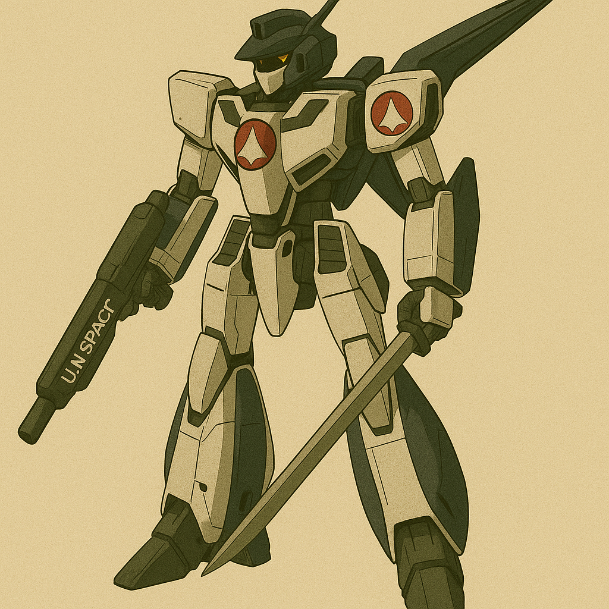
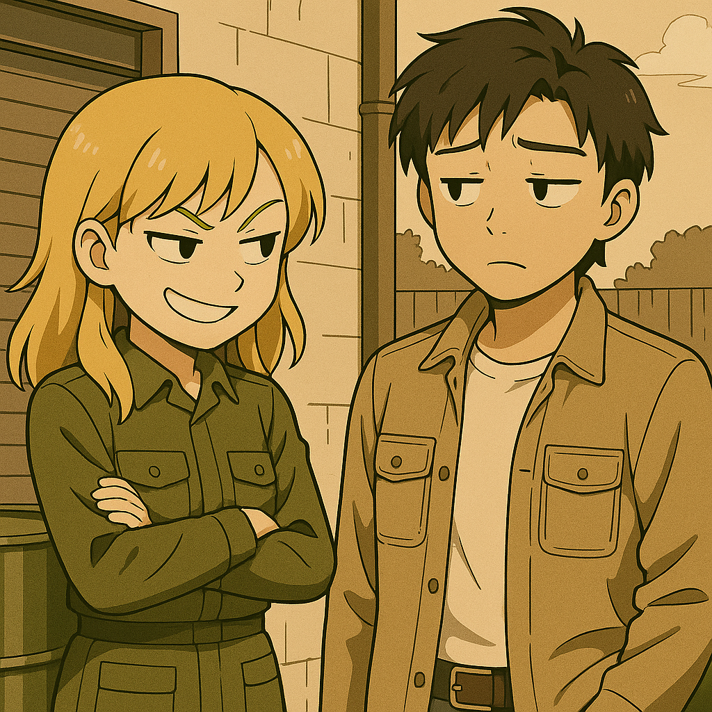
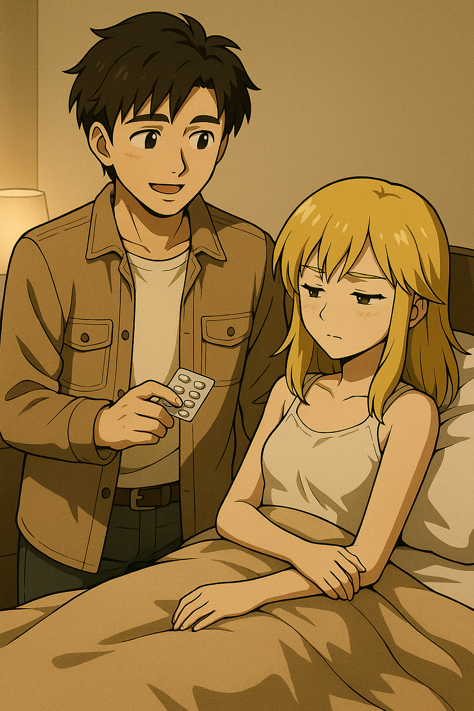
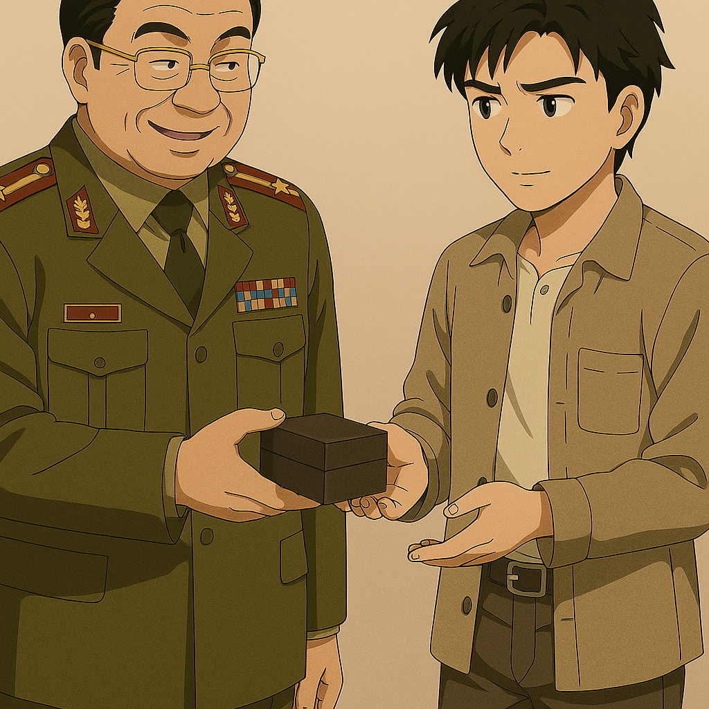

## 第五章：启端
第二天，苏贞花一早就来接唐海了。不知道是不是出于对唐海昨天出言不逊和窥探她秘密的报复，她凌晨4点半就来敲他的门，"唐同志，起床了！"声音清冷、克制，却又莫名带着一丝愉快的调子。唐海来开门的时候顶着一头乱蓬蓬的头发，眼睛都睁不开，但当他看到苏贞花那张冷若冰霜的脸时，不由得一激灵。"早......早上好啊，苏同志。你们朝鲜人都不睡觉的吗？"看着唐海狼狈的样子，连衬衫扣子都扣错了一颗，苏贞花不由自主地漏出了一丝笑，"唐同志，我们都是社会主义的接班人，怎么可以贪图睡懒觉？我听你们中国有句话，生时何必久睡，死后自会长眠。"唐海想了半天，想起来这是高中生用来讽刺高考的段子，不由得撇嘴，"该知道的你们不知道，不该知道的你们倒学得挺快......"苏贞花又恢复了她的冷淡："你说什么，唐同志？""没......没什么......你等我几分钟。"唐海手忙脚乱地穿上衣服，外套里也带上了季思澜给他开的那盒处方药。昨天他打开看了，主要是一些对乙酰氨基酚类的感冒药，布洛芬，用于杀菌的莫匹罗星软膏，碘伏，阿莫西林口服片，以及一些纱布和小绷带，确实是生活中很急需但朝鲜不可能搞到的药。他心里暗暗对着季思澜膜拜了一下，"嫂子的大恩大德，唐海来世再还！"

吃过早饭，苏贞花就带领唐海往军营隔壁走，唐海注意到，那是一个类似军火库的工厂，但是......"这幢楼也太高了吧！！"唐海忍不住说道，"苏同志，这里面是什么呀？"苏贞花没有接话，只是沉默地往前走。走到大门口，那里有一扇沉重的铁门，让唐海不由自主地想起了存放盘古的格纳库。但就算如此，整整40多米高也太夸张了，什么样的大家伙，需要这么大的格纳库来存放？两人登记完之后，苏贞花按下了指纹，铁门向两边缓缓打开。唐海看到眼前的东西后，不由得心生震撼。那是整整齐齐的两排，各5架的MB，左臂持有一把加特林机枪，右臂则持有一把利刃。MB的头像飞机的头折叠着，驾驶舱看起来就在机头这里。腿部粗壮，脚则像是鹰爪一样。没等唐海问话，苏贞花就微微一笑，声音里颇有些自豪，"这就是我们国家的MB，猎鹰！由我所就读的平壤综合大学机械工程系设计并制造，可以说是我们平大的骄傲！"

唐海走近了一点，仰头看着那台高10米的钢铁巨物。灯光从天顶洒下，将"猎鹰"投出锐利的影子，线条并不复杂，构造甚至称得上有些简朴，但从枪臂到鹰爪式的腿部结构，每一寸都透露着一种粗暴而直接的力量感。"真没想到......"他喃喃地说，"你们居然真能把MB造出来。"苏贞花侧过头，盯着他："你这话什么意思？""没别的意思。"唐海摊摊手，脸上是那种典型的"理工男观察记录"表情，"我主要是好奇这台机体的设计思路。从结构上看，猎鹰的主要设计思路偏向接近压制型步兵单位......是冲击和占领用的吧？那驾驶舱为什么要做成飞机头的样子呢？""因为这并非普通的MB，确切地说应该叫TMB，可变式人形堡垒，为了兼具火力和机动性而特地和战斗机的设计思路融合而成。简单地说，在空中移动的时候，机头和腿会收缩，整台机体呈战机状飞行，而在陆地战和狙击战的时候，则可以变身成现在这样，对目标进行打击。"苏贞花冷笑一声说，"至于你问我所谓的设计思路，我可以明确告诉你，是用于维护祖国尊严和主权完整的。"唐海的注意力则完全被放在了前半句，"从泛用性角度看，这种MB，说到底就是可以近战的战斗机。论战场适应能力，可能还不如传统战机加坦克的组合，造价还贵得多......你们为什么还要坚持打造这样的MB呢？"苏贞花静静地看着他，目光里没有愤怒，反而透出一种制度灌输下的冷静和理所当然："为了保护领袖，这点牺牲不算什么。"

"......我知道，我知道，"唐海举起双手，像是在哄人，"别误会，我不是看不起你们的设计，恰恰相反，我是真的挺佩服你们能设计出这个结构的。"唐海全然忘记了这里是其他国家的军营，伸出手这里摸摸，那里敲敲，眼睛闪着某种专属于工程师的光。职业的本能让他很快就看出结构细节的优劣，甚至，他的脑子已经开始自动给这台MB做改进设计了。他对着空气说道："不过这机体整体看起来有些笨重，尤其是在站⽴时，加特林的重⼼前移会导致变形的不流畅。⽽且说到变形......"他转头看向苏贞花，完全没有注意到她脸上的表情变得越来越冷，"其实我们也曾考虑过类似的结构，但操作系统写起来太复杂，⽽且万⼀出故障，那机毁⼈亡是铁板钉钉的。你看这边⼈形结构下的喷射⼝，下⾯和机⾝连接的地⽅有明显的烧焦处，说明变⾝时喷射没有及时停⽌，会有安全隐患。还有，通过这⾥的⽓味，我判断这是柴油电池混合的动⼒系统。这种动⼒系统在普通家用轿车上没问题，但如果部署在MB这种能源需求瞬息万变的载具上，非常容易自燃，和国际标准的战⽃载具⽐是有差距的......"说完，他才察觉到苏贞花的沉默。她站在猎鹰的影子下，神情冷峻而刚毅。唐海愣了愣，心里这才有点后知后觉："......我是不是说太多了？靠靠靠，不该这么直接的。这可是别国的军营，不是实验室。"他张了张嘴，试图补救："当然，我只是随口一说。真要深入分析，得看整套设计图才行。"可这句解释，反而显得更像掩饰。唐海在心里抽着自己的耳光："宁宁姐说得没错，我真是太单纯了，不适合军队这种地方......"一边想着，他一边偷偷瞄向苏贞花的方向。

苏贞花没有动，只是转过头，语气如刀锋一样锋利："有差距？至少我们用自己双手打造出了猎鹰，没向任何国家伸手要援助，也没靠过别人扔下来的残羹冷炙。如果这叫'有差距'，那也许是我们太自尊了吧，唐同志。"唐海一愣。他本能地想回一句什么，却看着她那副挺拔冷峻、背后是猎鹰的身影时，喉咙动了动，什么都没说。他突然意识到，这个女孩虽然年轻，却早已习惯了将自己藏在一层厚厚的国家语言和冰壳后面，所有柔软的地方，都埋在她那句"太自尊了"里。唐海低下头，轻声说："......我不是那个意思。"苏贞花没有回应，只是冷冷地转身。"走吧。"她语气没有起伏，"你今天要看的还不止这一个。"她走在前面，靴子踩在金属地板上，每一步都像是从体制里走出来的回音。"等......等一下！"唐海突然指向后面角落里，被一大块厚厚的军绿色的布罩着的巨大物体，"我能看看那个吗？"苏贞花回头，看向他所指的方向，突然语言变得极为冷峻，"那不是你应该好奇的东西，唐同志。我想，你看到了猎鹰，应该已经足够向你们领导汇报了吧。"说完转身就走，全然不顾唐海的一脸错愕。他这才发现，原来自己的意图早就暴露了。但他还是忍不住回头看了看那30多米的庞然大物，而他清楚，这座高得不正常的格纳库正是为了这个怪物而建造。"这一定藏着什么了不得的东西......"而在唐海看不见的角度，苏贞花的心里却在暗暗佩服唐海强大的工程直觉和分析问题的能力，可也在无奈他迟钝的政治神经。但无论如何，她的目光还是忍不住多停留了几秒，像是在重新打量这个原本她以为只是来走过场的“技术官僚”。或许，他比她想的更有趣。苏贞花的嘴角轻轻地翘了一下："......这个书呆子。"

两人刚走出格纳库，突然门卫室的人把苏贞花招呼了过去，并把电话听筒递给了她。她拿起电话，认真地听着，点了点头后，说了一句"保证完成任务！"然后她就快步走回唐海身边，说道，"对不起，唐同志。计划有变，我要去执行一项紧急任务，我们今天的参观就到这里。你请回吧，你应该记得回去的路？"唐海点点头。苏贞花刚走，却又停住脚步，转头看向唐海，露出一丝不易察觉的坏笑，"或者，唐同志，没什么事的话，请你也来帮忙吧。毕竟我今天带你看了你想看的，你也应该做些什么来感谢我才是。"说罢，不容他拒绝，她大步流星地往一个方向走去。唐海一个头两个大，"什么跟什么啊，这女人......"大约十五分钟后，他们俩走到了一间军工厂仓库的后面，而旁边正是潺潺流动的大同江的一个分支，哗哗的江水奔腾不息。苏贞花指着几个整齐排放的铁桶说道，"唐同志，这里是一些工业发烟硫酸，是我们给MB制作电池用的原料。我需要测一下硫酸的纯度。没问题的话，我需要你帮我一起搬到仓库里。"她指了指仓库的后门。"切，原来是叫我来做苦力的......"唐海忍不住有些抱怨，而苏贞花正色道："为了社会主义做贡献，怎么能叫苦力呢？唐同志，恕我直言，你不仅说话有南边的口音，思想觉悟也不高。在我们这里，这是很危险的！"说罢，便要上手去拧开桶上的检测口。多年来接触蓄电池工艺的经验让唐海立马警觉了起来，他赶忙拉住了她："等一下！这种工业硫酸封装的时候往往是在密封环境下。你打开桶之前不测一测桶内压？万一硫酸喷出来你怎么办？"苏贞花冷笑道，"你们这些发达国家来的男人，嘴上说得比我们这儿的干部还多。说到底，不还是怕了这点硫酸？你是来参观的，还是来教我做事的？"唐海表面上不敢响，心里轻声抗议，"我是来帮忙干苦力的！"

苏贞花径直走向其中一桶硫酸，短暂皱眉，手指紧了紧测试眼上的盖子，一用力，把它拧开了。一瞬间，一股淡黄色的黏性液体"嘭"得一声喷溅了出来。唐海大叫一声不好，赶忙一个箭步冲过去，把苏贞花往后一扯。也多亏了这一扯，浓硫酸没有直接溅到她的皮肤上，但硫酸结结实实地浸透了她薄薄的军服。苏贞花肚子上和腿上感到一阵刺痛，忍不住呻吟了起来。唐海眼疾手快，把外套一脱，一把箍住苏贞花的脖子，拉着她一起跳进了旁边的大同江。清凉湍急的水快速带走了苏贞花衣服上的酸液，但也正是稀释效应，让她的衣服和皮肤温度急剧升高，她不由得惨叫了起来。唐海则卯足力气，护着苏贞花防止她被湍急的水流冲走，他心跳得像擂鼓，手忙脚乱地撕扯她的衣服。"喂，你干什么......"苏贞花大惊失色，脸涨得通红，忍不住身上的疼痛，从牙缝里蹦出几个字。"别乱动！我得赶紧把你的衣服扒掉，不然你死定了！"他忍不住开启了中文回怼。苏贞花一愣，完全听不懂他说了什么，但看着唐海焦急的神情，只能任由他摆布。唐海的动作一边急切，一边又不得不克制住自己。他的视线不自觉地飘忽着，几次试图扭开脸，却又不得不仔细查看那些被灼伤的皮肤。他咬着牙，试着闭着眼地摸索着将她的衣物一件一件扯下，但又怕不小心碰到伤口，内心焦灼得仿佛也被灼烧了一般。他强迫自己放空脑袋，将注意力集中在伤口和安全上，而不是她的身体。每揭开一点衣物，他都像在与自己的羞耻心搏斗，但他清楚，只要晚一秒，后果就是毁灭性的。最后，唐海用尽全力，终于扒掉了苏贞花的全部衣物。

唐海紧紧地抱着苏贞花在江水中足足冲洗了半个多小时，保证身上没有任何酸液残余，才敢慢慢上岸。这时候，不只是太过疼痛还是被冷水冲得失去了意识，苏贞花已经昏了过去。唐海赶紧铺开自己的大衣，让她躺在地上，又把自己身上的衬衫脱了下来，拧干后给苏贞花盖上。这时候，他在静下心来看她的伤口，大片皮肤已经发黑，渗出混合着血液的液体，这是细菌感染的迹象。他不敢再抬头多看一眼，专注地盯着伤处，仿佛只要凝视一点点伤口之外的区域，自己就会越界，触犯了什么。唐海不敢怠慢，赶紧从大衣口袋里摸出季思澜给的那盒药，打开苏贞花随身携带的军用水壶，用纱布浸湿，混合了一些碘伏，小心地擦洗着伤口。"啊......"昏迷中的苏贞花发出了一丝痛苦的呻吟，唐海的手抖了一下，忍不住小声说着，像是在安慰小妹妹一样，"对不起贞花，你忍一忍，会有点疼......"伤口消毒完毕后，他又打开莫匹罗星软膏，给她在伤口处认认真真地涂抹了一遍，最后又把所有纱布都拿出来，尽可能地给她包扎了伤口。看着躺在地上的苏贞花，唐海不知道该怎么办。没有通讯工具，这荒郊野岭的工厂附近也没有人，他没法直接找到救援，但他更不能直接把人放在这里不管。最后，他叹了口气，把药盒收好后，一把把她背了起来，往自己宿舍一点一点走去。

到了傍晚的时候，外面的天已经黑了。苏贞花眼睛猛地一睁，从床上蹦了起来。"我这是在哪儿？"她本能地拉起被子遮住身体，左看看右看看，看到了在旁边看书的唐海，心里不由得警觉了几分，但又隐约中觉得他救了自己，口气有些软了下来，"我怎么了？"唐海看着她有些生气，又有些心疼，带些训斥的口吻说，"我让你开硫酸桶前测个桶内压，你不听，现在肚子和腿还疼吗？下次千万别这样了，搞不好是要丢了命的！"苏贞花还有些嘴硬道，"为了我们伟大的革命事业，牺牲自己的性命又怎么样！"唐海本还想教她中国的另一句话，"身体是革命的本钱"，但看着她倔强的样子，他硬生生地把话咽了回去，无奈地扶了扶额头："好好好，别硬撑了，你赶紧把这药吃了！"说罢，他把手里的一杯水和几片阿莫西林抗生素药片递了过去，"防止细菌进一步感染你的身体用的。呐，这些都拿去，一次吃一片，一天三次，吃五天，千万不能断！还有这个，"他又从药盒里拿了点布洛芬片，有些絮絮叨叨地叮嘱道，"布洛芬。你可能今明两晚会低烧。如果烧得难受的话可以吃点，一次吃两片，最多四片，间隔六小时。尤其记得睡前吃，能睡得踏实些，以及多喝水！"犹豫了一下，唐海干脆把整个药盒都给了她，"别多吃！剩下的你就自己留着，紧急的时候能用到。"苏贞花低头接过药盒，手指无意识地抠着盒子边缘，不知道应该说些什么。顶着一头金发褐眼的她，从小就在别人的冷眼中长大，似乎没有人再像这样一样纯粹出于关心她而和她对话。不，苏贞花甚至都不知道这叫关心，她只觉得心里暖暖的，好舒服。"......谢谢。"她轻声说出这个词，那是她平时只在面对领袖时才说出口的语言，而这一次，她第一次想为自己说一次。唐海见她服软，便笑了笑说，"我刚才已经托门卫给医务室打电话了。一会儿医务人员就该来了。"不知道为什么，苏贞花有些失望。她似乎感受到自己想在这里多呆一会儿，但似乎又确实无法否认唐海的做法才是最适合的。她看着手里的药盒，不由得嘟囔了一句："这个呆子......"

不一会儿，就传来一阵敲门声。打开门，是四个扛着担架的医护人员，以及崔光烈跟在身后。医务人员把苏贞花抬走后，崔光烈紧紧地握住唐海的手，语气诚恳地说，"唐同志，对于这件事，我真的不知道怎么感谢你才好。你的这种行为，不只是对战友的关爱，更是对我们国家的深情厚谊。希望你能接受我的一点心意。"说罢，他拿出一个精致的小盒子递给唐海，里面是一枚徽章，那是每个朝鲜人都拥有的，印着领袖头像的徽章。唐海带着些复杂的情感，最后双手接过，说了句标准的平安道方言，"谢谢！"

