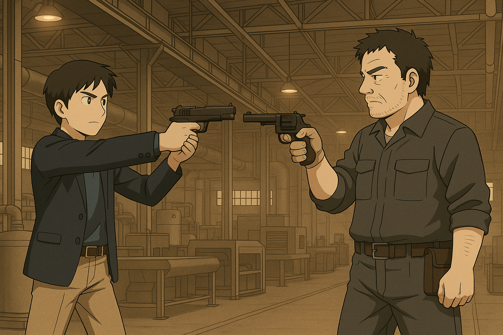
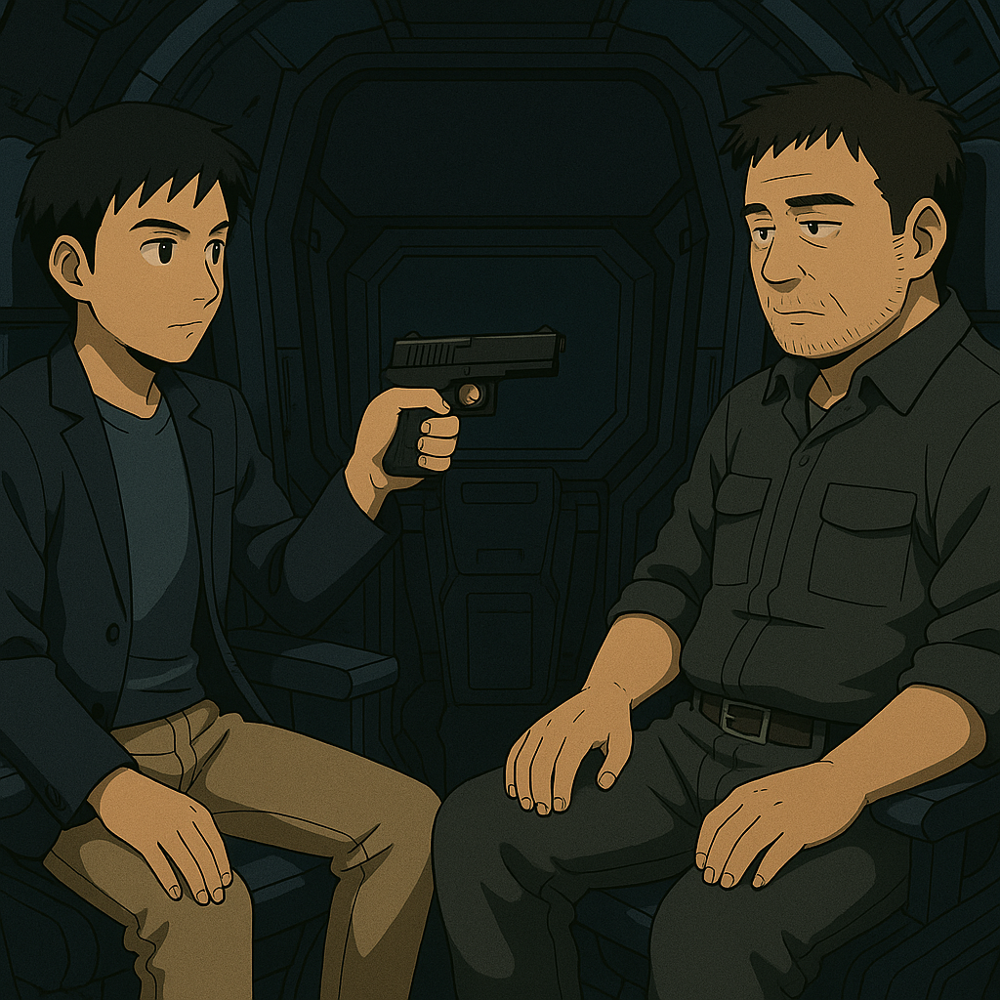

## 第八章：星轨
而回到林砚这边，他挂断对讲器后，赶紧披上外套冲了出去。他正准备出门，犹豫了一下，从门口上锁的抽屉里，偷出了林伯源的证件和配枪，带在身上以防万一。他打车到了熟悉的小山坡后面，摸着小路找到了格纳库的入口。"站住！什么人！"门口的士兵拿着枪指着林砚这位不速之客。林砚则是淡定地拿出自己的身份证件，以及他老爹的最高权限签章说，"我是林砚，盘古的核心技术员之一。我代表林伯源将军，前来调查我们MB的一个致命缺陷。事态紧急，请你们放行。"见两个士兵犹犹豫豫，他大方地拿出了自己的手机，"林伯源将军的号码就在这里。你们要不要自己打过去确认一下？我提醒你们，如果任务耽误了，我不能保证你们的饭碗。"两个士兵面面相觑，交换眼神，显然谁都不敢真的拨。最终，他们收起了枪，摆摆手，"你进去吧。"林砚一边摆出一副"算你们识相"的表情，一边默默擦了擦头上的冷汗，咬牙切齿地想着，"妈的，还好这个逼装住了。唐海这个混蛋，又欠我一条命！"

林砚刷进格纳库的大门，一路狂奔，忙不迭地冲到盘古面前。"但是，这个大家伙要怎么启动呢......"他正在想着怎么办才好，突然听到后面"咔哒"一声枪上膛的声音。他一个侧翻，掏出了配枪，指向前面，一看，是王志行拿着枪指着他，便立刻放下了心。"王叔！"他立马放下了枪，"是我！林砚！"王志行看清了他的脸，也大吃一惊，放下枪，"公子哥儿！你大半夜地跑来这里干什么！我以为是唐海那小子又想儿子了呢！"林砚紧张地说，"王叔，我也不知道怎么了。但唐海在朝鲜那边出事了！他要我赶紧调动盘古给他送去。"王志行眼珠子都快瞪出来了，"什么玩意儿？盘古？你怎么送过去？你开过去啊？"林砚摇摇头，"就算我行，时间也来不及。我们在化工园区那边有一条星轨，简单地说就是把盘古装到运载机上，射到宇宙轨道后，从那里抛下机体到指定地点。"这时候，林砚突然想到了什么，他冲到王志行面前，还不等他反应，用近乎恳求的口吻说道，"王叔，这个计划至少需要两个人，一个操作星轨，一个操作盘古，把盘古开到指定的运载器上。我是航空学院的博士生，最近正好在研究星轨，所以我对星轨的操作非常熟悉。而你是整备工厂盘古团队里最资深的技术员？求求你了，能帮帮我吗？"王志行有些无语，"太乱来了，你们真是太乱来了！"林砚则动用了他十二分的诚意："求求你了王叔！你知道，我兄弟这个人脑子一根筋，做事也很谨慎。如果是他提出了这种要求，那一定是迫不得已！"王志行从口袋里摸出一根烟，划了半天打火机没能划出火苗。他看了看烟上的"玉溪"二字，又想起唐海那憨憨的微笑，忍不住咬牙切齿，"妈的，那你快点！格纳库的操作你能做的吧？关掉警报，打开舱门！我来教你怎么弄......"说到这里，他突然无奈地摇摇头，"得，我想起来了，前两天我看系统日志里有近30分钟的奇怪操作，也是关掉警报，打开舱门，甚至盘古都出动了！是你们俩吧？"林砚嘿嘿一笑，没有说话。王志行苦笑着划拉了一下打火机，打火机里的火苗应声窜出。

林砚熟悉地敲入他爸的密码，格纳库的警报被切断，格纳库库门打开。王志行则已经坐在了盘古的驾驶舱里，等林砚操作完成上来后，关闭了盘古的舱门，一脚能源踏板，盘古冲出了格纳库，再一次翱翔在了上海的上空。"公子哥儿，你是说化工园区？那应该是这里......"王志行在地图上设了个坐标，打开了自动飞行，盘古平顺地朝着那里飞去。"哦吼，看来上次唐海那小子调教过这台机器了，AI已经能很平稳地做出飞行动作了。这小子，真有两把刷子......"他暗暗赞叹道，然后，他看着林砚的脸，又气不打一出来，"妈的，老子工作了35年，一直是模范标兵！这一回被你们两个兔崽子一通乱搞，我的养老金看来是泡汤了，还得进去吃一辈子牢饭！ 他妈的，这样养老金倒是真可以省下来了......"林砚嘿嘿一笑说，"放心王叔，这我有办法！"王志行撇了撇嘴，没说什么，却看到林砚一直拿着枪指着自己，大惊："你干什么！"林砚对着盘古的机舱内监视器努努嘴，"呐，你的养老金能不能保住，就靠这个了！"王志行苦笑着摇摇头。

到了化工园区，林砚赶紧冲下盘古，又冲进了他平时搞科研的中央控制室。他看了眼定位器，发现代表唐海位置的红点几乎在某个坐标不动，他知道，唐海应该已经就位了。于是，林砚启动了系统。瞬间，王志行面前的一座伪装山体缓缓打开，只见里面是一条抛物线状，直冲云霄的轨道，而上面停泊着一台航天器一样的东西。林砚紧张地在中控室里操作着，全然不顾旁边的警报大作。他飞快输入坐标，调整磁力生成器的功率，心里默算着轨道跳投的抛物线轨迹，自言自语道，"星轨系统一切正常，磁力生成器就位，航天器运作良好，抛射台功能正常，抛射坐标：柳京饭店，设置完成。最后，航天器入口，打开！"他按下回车键，王志行就看到航天器的门缓缓打开。林奕刚准备下一步动作，突然听到和唐海的通讯器里传来了声音："老林！你们在投掷盘古的时候，让它以平躺的方式进入大气层......"他一愣，刚准备回复，就听到几声枪响从通讯器里传来，然后戛然而止。他知道，唐海可能正在逃离追兵，所以他也不敢发声。林砚思虑了几秒，然后用中心通讯器对王志行说道："王叔，能听到吧！你赶紧把盘古开进航天器里的指定位置，系统会有提示的。以及帮忙给盘古设置一个自动巡航模式，当它被抛射时，姿势改为仰投，尽可能把驾驶舱暴露出来！等盘古被固定后，你就赶紧下来报警，说我挟持了你！盘古刚才的舱内录像应该已经发到军部数据库了！"王志行又大惊："这怎么行！公子哥儿你不要命了！"林砚一边继续手里的操作，一边微笑着说，"我答应过你的，你的养老金会安然无恙的！你快点，我们没时间了！再迟疑，唐海就没命了！"王志行不敢怠慢，全然按照林砚的指示一步步操作。等他完成一切设置，抓着绳梯下来后，一口气跑出了航空器，航空器的门缓缓关闭。

这时，林砚也已经赶到了，他把枪指着王志行，"王叔，委屈你和我在这儿等会儿。应该很快就有人来了！"果然，没过多久，几辆警车就到了他们身边。正当警察刚下车时，就听见"轰隆"一声巨响，航天器喷着蓝色的火焰，开始往前推进。慢慢地，航天器的速度越来越快。它在轨道上高速滑行了一段时间，然后腾空而起，直冲宇宙。夜风夹杂着机油味扑面而来，发射器的引擎轰鸣震得地面都在颤抖。远远地，林砚看到三架看不清型号的战斗机从天边俯冲过来，对着航天器的方向开了两炮。不知是不是航天器已经飞得太高，还是速度太快，航天器毫发无伤。"这准头也太差了......"他一边笑着，一边任由警察给自己戴上手铐。

十几分钟后，航天器像一枚静默的流矢，掠过地球暗影，滑行到中国境外的既定轨道。它的腹部已开始吻上高层大气，稀薄的气流在舷壁摩擦出金色的电弧，如同在星空中燃起的微型风暴。随着下潜，气流阻力渐次攀升，船体震颤着，将力量一点点蓄入钢筋般的骨架。在抵达投放的临界高度时，舱门缓缓开启，一抹黯金的轮廓被推向虚空——那正是盘古，这台沉睡的试验型人形堡垒。随即，释放机构如弦离弓，将它抛向大地。喷射口喷出短促的白雾，盘古在失重中翻转、校准、伸展，最终缓缓摆成仰泳的姿态，背对着大地，仿佛在拥抱整片天空。几秒后，它闯入地球浓密的大气，周身燃起炽烈的焰羽，如神话中的陨星，划破长空，向着命运的落点坠去。

