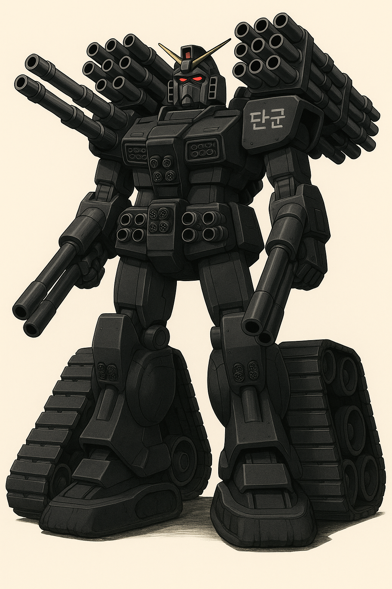
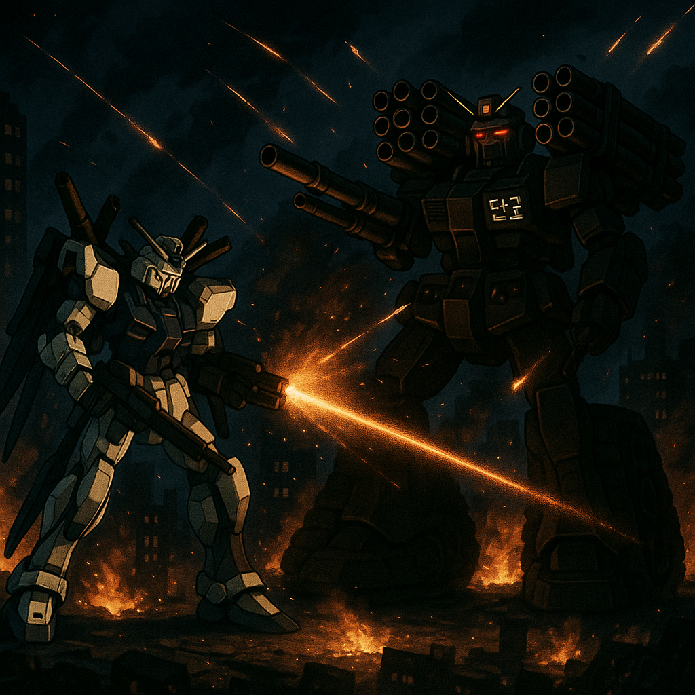
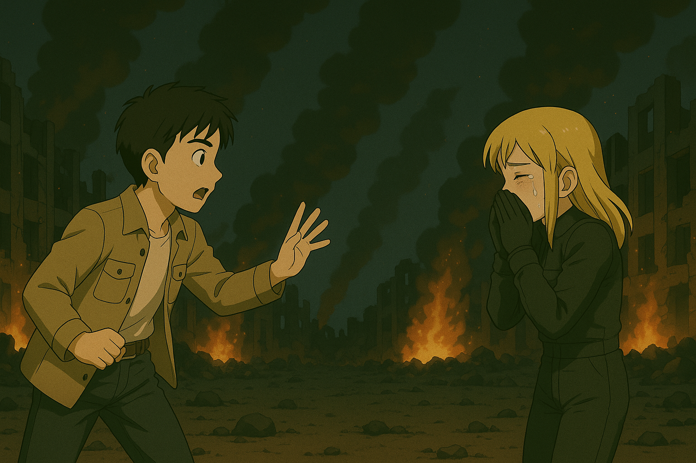
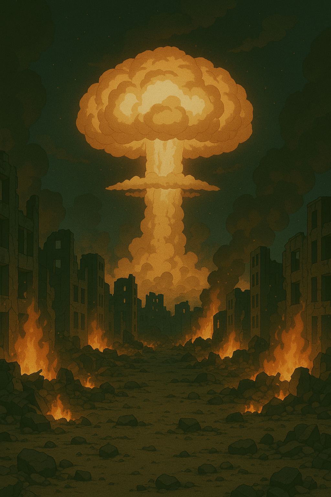

## 第十章：坠地
"很奇怪啊......"唐海一边飞，一边喃喃自语。虽然在途中，有三三两两的猎鹰MB和空军战斗机试图拦截他，也被他一一击退，但再怎么说，这火力网也太稀疏了。在平壤上空穿梭时，他产生一种极不协调的感受："该出现的兵力没出现。有些单位像是提前撤了。火力部署不是朝我布防，而是朝另一个方向倾斜。难道朝鲜的军队号称世界前40，其实际兵力就这......？"突然，他注意到前面有一个黑压压的巨影压了过来，而盘古的索敌系统也"滴滴滴"地报警。"终于来了吗，主力军？"唐海刚想着，就看到两枚穿甲弹，伴随着三枚高爆弹迎面袭来。唐海一边向旁边躲开，一边用磁轨炮还击。炮弹爆炸了，火光照亮了眼前的敌人：那是一台高约30多米的重型MB，下肢虽然有大腿的形状，但主要靠着其巨大的履带状驱动。双手的部分则简单粗暴，直接被做成了两门双管炮，看起来像是用前苏联大口径的战列舰舰炮改装而成。两边肩部则是各部署着一排俄式榴弹炮，胸口则有两挺加特林机枪。而最惊人的则是机体的背部，背着一个巨大的多管火箭系统，少说也有五百多枚火箭弹蓄势待发。"册那，朝鲜人到底是造MB，还是把整个军火库背过来了？"看着眼前仿佛来自地狱的恶魔，唐海不禁倒抽一口凉气。这时，他注意到了左右两肩上各刻了"단군"的字母。"檀君......是吗......"他自言自语道。

对面的檀君已经开始攻击了。毫无保留地，檀君的主炮直接对着唐海的方向来了一轮输出，同时放出一百多枚火箭弹。唐海哪儿见过这阵势，火力像雨点一样地朝自己打过来，赶紧把防御任务交给AI，自己则调整喷射口，向各个方向展开Z字飞行，以扰乱对面的准星和弹道。盾牌帮助抗下了几发火箭弹，但持续的撞击让它也不堪重负，不一会儿就"砰"地一声碎掉了。剩下的无数枚炮弹和火箭弹擦身而过，向平壤市中心而去。不一会儿，大同江边的主体思想塔被拦腰断成两半，重重地砸了下来，殃及到周边一片建筑，而凯旋门也被削掉了一大半，在月光的照耀下显得格外滑稽。平壤市中心多处起火，但檀君没有任何停下来的意思，反而一路向市中心进发，似乎想要阻止盘古往苏贞花以前待过的集中营。唐海大惊，打开公用频道大喊，"你疯了吗！这是你们的首都诶，那么多居民在！你不怕殃及民众吗？！"但似乎对面没有听到，继续前进，履带不停地压过路面和低矮的基础设施。唐海不想把战火烧到无辜的人头上，于是他操作盘古，对着檀君连开两枪，意图阻止檀君继续前进。檀君无从躲避，但它凭借着及其厚实的铠甲硬生生地接下了磁轨炮的炮弹，看起来毫发无伤。唐海更加惊恐了，他没想到对面的装甲居然和猎鹰的设计思路天差地别，看来完全是舍弃了机动性而换来的防御力。没能阻止住檀君，盘古只能掉头向市区方向飞去。与此同时，檀君驾驶舱内，驾驶员听到唐海的喊话，但并未接通频道。驾驶员只是微微皱眉，觉得这口音虽然是南方口音，但有种莫名的熟悉感，似乎曾经在哪儿听过这种腔调。她的右手放在武器系统的开火按钮上，手指迟迟没有按下。耳机里传来指挥部的声音："目标正前方，不要犹豫，开火。摧毁未知MB。"驾驶员深吸一口气，眼神复杂。"......遵命。"看到盘古逃跑，檀君则开足马力，紧追不舍，却又小心翼翼地尽量不碰到一些路径。

此时，在平壤以外的战区，几乎呈现出一面倒的压制。以美韩联军为主力的机械化部队正迅速突破朝鲜边境防线，南浦港方向的两栖登陆部队已经攻入内陆，开城走廊的重型坦克群势如破竹。韩国空军的F-35、KF-21，以及美军的B-2轰炸机在电子战飞机的支援下，对朝鲜纵深火力点和通讯枢纽实施了持续打击。朝鲜方面的防御部队零散而混乱，MB部队的猎鹰机群主力军已经被联军的无人攻击机群逐步消灭。战线正在崩溃。而毫无疑问的，在那个被人忽视的平壤战场，盘古与檀君依然在夜空中激烈地纠缠。

随着AI辅助驾驶学习的深入，唐海已经可以把绝大部分躲避任务交给盘古，而自己终于有机会判断一下当前的战局了。随着战斗的深入，唐海发现了檀君有些奇怪的现象。明明是个杀人不眨眼的家伙，对于民居、医院、学校和平壤著名的一些建筑都能无差别打击，但似乎对面驾驶员有在刻意避免一些目标，比如万寿台上的领袖雕塑。一开始，唐海认为是驾驶员对于领袖依然有敬畏之心，这情有可原。但当他发现檀君为了攻击他，毫不犹豫地连同领袖雕像一起，炸掉了锦绣山太阳宫和革命展示馆后，他意识到情况似乎没有这么简单。把所有异常的点连起来后，唐海注意到，两条地铁——革新线和千里马线上的某几站——确切地说，他和苏贞花一起走过的那几站上的建筑和相关风景，几乎都幸免于难。以及檀君似乎非常在意东平壤，这让唐海想起，刚才它拼命阻止盘古往劳改营前进的样子。还没等他想明白，又一轮炮火攻击过来了，这次比刚才的更猛烈。唐海赶紧切换到全火力爆发模式，把能打的火药都打了出去，形成一道火力墙，勉强阻止住了大部分炮弹，但自己的弹药也所剩无几。而两枚漏网之鱼的榴弹炮，则精准地穿过了柳京饭店，那个全世界最高的金字塔式建筑也应声倒地，扬起的灰尘像浓雾吞没街道，空气中弥漫着烧焦的金属味，好像在宣告一个政权的破碎。

"既然连磁轨炮都无法突破它的装甲，那只能试试这个家伙了！"唐海展开左臂上的青缸剑，开足马力向檀君飞去。檀君举起左臂格挡，却被飞驰来的青缸剑连同两门舰炮炮管，齐齐地削了下来。"有戏！"唐海乘胜追击，一个后空翻后，又一口气近距离从檀君的胸口路过。随着一阵火花闪过，加特林机关枪也被屠戮殆尽。檀君的驾驶员似乎有些恼了，一口气释放了剩下所有的火箭弹。盘古用尽全力，仍然无法完全躲避，右手臂连同磁轨炮被炸飞，左腿也被燃烧着的火箭弹击中，瞬间熔掉了。而平壤的街道自然就更惨了，未来科学家大街被飞弹打成一片废墟，而仓田街、黎明街、四二五文化广场小区住宅楼等相对低矮的平房则是完全被火海吞噬。唐海忍不住对着通讯器大喊，"别打了！你真的完全不顾别人的性命吗？你到底为什么而战斗？"对面驾驶舱仍是一片沉默，过一会儿，似乎断断续续地传来一些声音，"......为了革命......不怕......牺牲......""女人的声音？"唐海大惊，有些不知所措。但是无论对方是男是女，阻止这台大杀器继续是他当前的首要任务。

平壤防空指挥部内，崔光烈焦头烂额。首都圈外围完全失守，而平壤本身，也被那台身份不明的MB打得一片狼藉。他正焦虑地调度残余部队，忽然，桌上的红色专线电话响了。崔光烈愣了一下，接起。一个不容拒绝的声音从电话那端传来，语气平静而冷酷，没有任何商量余地。崔光烈的表情从困惑，到震惊，再到彻底的绝望。他站起身，像失了魂一样机械地点头："好......好......"挂断电话，他脸色惨白，浑身发抖。片刻后，他艰难地转向属下，声音嘶哑而破碎："最......最高领袖下令......对平壤，发射......末日核弹。"属下们面面相觑，有人下意识地问："不......不对外反击吗？美韩的本土......"崔光烈惨笑一声："我们引以为傲的战略核打击体系，早在一个小时前就被联军打崩了。导弹基地尽毁，潜艇被歼灭，发射车无一能动。"他顿了顿，声音像铁块砸在地面上："我们只剩这一发，能掌控的，只有我们自己的死亡。"指挥室一片死寂，没人敢说话。只有远处的大屏幕上，盘古与檀君还在平壤夜空中纠缠，像两只宿命之兽，毫不知情地继续战斗。

唐海的右臂几乎麻木了。早在半个小时前，他的手就握不住操纵杆，每次尝试动作，剧痛便如刀割般从骨头深处迸发，汗水湿透了他的衣服。他面色惨白，视线死死锁定前方的屏幕，不敢有一丝松懈。可檀君，也已经弹尽粮绝。主武器早被盘古摧毁，背后的火箭弹和肩上的榴弹炮一发不剩。只剩下右臂的两门舰炮，黑洞般的炮口沉默而冰冷，正直指盘古。盘古的左臂，青缸剑已然弹出，剑锋映着火光，冷冷地瞄准了檀君。双方驾驶员都明白。这一击，将决定生死。寂静，像死神的倒计时。盘古先动了。唐海一脚踩下最大推进，整个机体嘶吼着冲刺，绕开舰炮的准星，剑锋直指对方驾驶舱。但檀君出人意料地，没有开炮。它挥舞右臂，把空空的炮管当作棍子般横扫而来。唐海一惊，正想着躲避，但已经来不及了，炮管重重击打在盘古身侧。那一刻，唐海只觉得整个机体仿佛撞上一堵移动的钢铁城墙，身体被安全带勒得生疼，耳中一片轰鸣，视觉短暂一片空白。盘古像被拍飞的飞鸟，猛地翻滚出去。可就在飞出的刹那，唐海咬紧牙关，反手猛力一拉——青缸剑划出一道银白的弧线。剑刃狠狠砍下，将檀君驾驶舱的装甲生生劈开。两台机体双双倒地，火花四溅，铁甲扭曲，金属呻吟。唐海拼命拉动操纵杆，但盘古的动力系统，只剩下一片死寂。监视器亮起。檀君，已将炮口重新瞄准了他。那黑洞般的炮口映在屏幕中央，仿佛死亡的瞳孔。

唐海浑身血液凝固，喉头紧锁，连呼吸都变得艰难。原来，面对死亡，人不会尖叫，也不会正义凛然。只有心跳的停顿，和语言的窒息。就在这时，火光照亮了驾驶舱内的剪影，映出一张熟悉的脸。唐海盯着屏幕，极力控制着指尖颤抖，调出画面，放大——"苏贞花？！"声音在密闭的驾驶舱里炸响，他几乎不敢相信自己的眼睛。随即，他猛地解开安全带，推开舱门，大声呼喊："Звезда！是我！快住手！！！"炮管渐渐地被放下。通讯器里，一个迟疑的声音响起，带着难以置信的颤抖："......唐海？唐海？！真的是你吗？！"苏贞花的声音，从怀疑，到惊喜，最后哽咽得难以自控。"是我！唐海！能......能再见到你......真是......"她的声音破碎，双手合十捂住嘴，泪水不断滴落。"太好了，Звезда......居然是你，太好了！......我早该想到是你！"唐海也流泪了，声音沙哑却坚定，嘶声喊道："你！你不用再战斗了！！快！！下来！！我带你走！！再也没有人能伤害你了！！！"苏贞花泣不成声，哭腔中带着无与伦比的幸福感，拼命点头："好！好！好！我......我相信你！我想跟你走！！唐海，唐海！！！"

苏贞花正准备启动升降梯向唐海那里冲过去，突然，檀君的热能感应器同时有了反应。苏贞花定睛一看，天边有一颗不起眼的飞弹正稳稳地向平壤市中心飞来。她隐隐看到了飞弹上印着朝鲜的国徽，倒吸一口凉气，"核弹头！"她只在一次绝密的军事训练时见过这颗弹头，而现在，一连串疑问同时向她涌来。"为什么我们自己的核弹打向平壤？""因为我失败了吗？""这到底是不是核弹？是不是我搞错了？""会不会是来支援我的？"但显然，弹头的距离已经不容许她找出答案了。这时，苏贞花看了看下面，还在对着她挥着手的唐海，似乎下定了决心，毅然决然地重新回到了檀君的驾驶舱，启动了机体。唐海大惊，赶紧大吼，"Звезда！你干什么！！快下来啊！！我这就带你走！！！"苏贞花急得掉眼泪，她什么都来不及说，只是一边开足了喷射器的马力，一边用尽自己最大的力气吼道，"呆子！！你趴下！！！！"然后，檀君拔地而起，朝向核弹头的方向飞去。苏贞花望着越来越近的核弹头，轻轻地说道，"我不是一开始就清醒的，我只是被你带出去看了一眼阳光，然后我再也回不去了。就让我最后保护你一次，唐海......"话音未落，檀君撞上了核弹头，平壤的上空出现了一朵蘑菇云，整片天空犹如白昼。唐海一开始正在震惊于苏贞花的突然转变，但他在最后关头终于看懂了苏贞花的良苦用心，赶紧钻到盘古残骸下的一个三角安全区，但还是被核爆的闪光，爆炸声和冲击波彻底震晕了过去。

