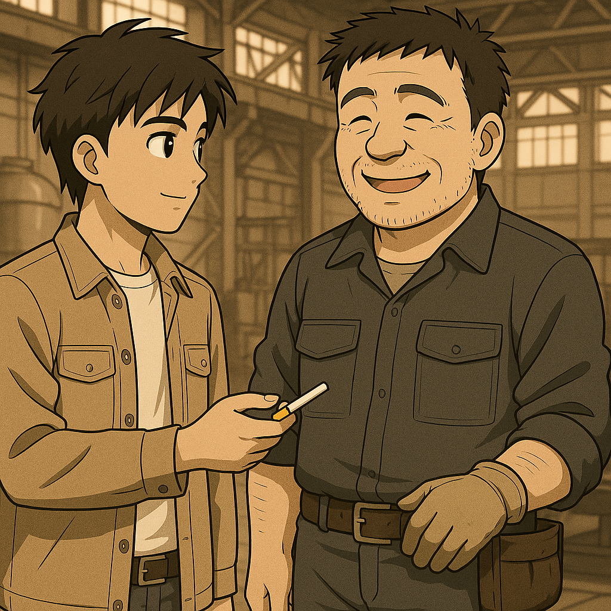

## 第二章：盘古
坐了大半个小时地铁，唐海终于到达了这条线路的终点站。走出站口，夜风扑面而来。他犹豫了一下，又拐进了路边的一家小超市，要了一条玉溪烟。他把烟揣进兜里，又沿着那条熟悉的小路，一路向山里走去。作为军用基地的重要组成部分，军方格纳库当然不会设在市区。哪怕是到这里的道路，也被悄悄隐藏了起来。唐海轻车熟路地摸进一条山间小径，又穿过一片安静得过分的小树林，眼前终于出现了一面沉重的铁门。他取下烟，刷了指纹，又靠近虹膜识别器。"滴——"低沉的电子声响起，厚重的铁门缓缓向两边开启。穿过一条长长的昏暗走廊，在微弱的灯光尽头，唐海终于看到了那头庞然大物，盘古。即便是他，看了无数次，心脏依然会在这一刻，轻轻一跳。"不管看多少次，这家伙都太了不起了。"唐海仰头，默默地打量着面前的巨型机体。盘古，全高15米，空载重量10吨。左臂装备攻防一体的盾式折叠剑。外表看似半臂长的盾牌，实则内部藏着一柄名为【青缸】的粗刃长刀，只需一次旋转，即可变形突击。右臂，是一条极拟真的机械臂，五指灵活如人类，手中握着名为【养由基】的磁轨炮，射程与动能远超传统火器。小腿前缘各自搭载着一把铡刀式近战武器，即使失去上肢，也能以腿部劈砍敌人。背部，驮着由轰-6战机改装而成的飞行背包，肩部两侧伸出的大型加特林机关炮，机翼下挂载着六枚多用途导弹。更深处，腰间收纳着两门折叠式鱼雷发射器，专为近岸与浅水战斗设计。从近战、中程到远程，从陆地到水下，真正实现了三位一体的全域打击。但最引人注目的，仍然是盘古那张近乎拟真的人脸——用于监测的两个监视器，位于下颌处的喷嘴，以及太阳穴位置镶嵌着两门小型机关炮，冷漠的轮廓线条下，是一种人类本能感到不安的表情空白。当然，现在最让工程组头疼的，不是武装系统，也不是机动性能，而是动力。如何让这个钢铁巨兽飞得又快又稳，真正实现在复杂战场环境下的快速部署与回收，才是唐海和能源技术小组的主要研究课题。但唐海的感情，远不止是面对一台精密武器的敬畏。他参与过盘古的每一寸成长。作为动力系统总技术负责人，盘古的能源路径的计算，外装甲结构的修正，电路的调试，乃至操作系统最初的框架搭建，唐海都有份亲手参与。连\"盘古\"这个名字，也是唐海取的。他就像是这台机体的父亲，亲眼看着它从零件堆里一点点拼装成型，最终成为这座格纳库中沉默的巨人。唐海缓缓吐出一口气，嘴角带着一点若有若无的笑意。\"盘古啊，以后，还得麻烦你了。"他轻声说着，抬手，像拍孩子一样，轻轻拍了拍盘古漆黑冰冷的脚踝装甲。金属的回响声，在空旷的格纳库里，悠长地回荡着。

"哟，又来看儿子了？"不远处，传来了一阵洪亮的声响。唐海抬头一看，不出所料，整备师王志行叼着烟，热情和他打招呼。王志行是一位有着几十年经验的老师傅，年轻时就是后勤兵，退伍后就留在了部队里继续干整备，整台盘古的实际建造装配正是由王志行团队负责的。如果说唐海他们是盘古的父母，那王志行团队可以说是盘古的接生医师。"哈哈是啊。对了王叔，这是我和林砚一起，买来孝敬您的！"说着，他就把刚买的烟递了过去。王志行看着烟盒上"玉溪"二字，哈哈大笑，"要我说，还就是喜欢和你们年轻人打交道！说起来，那个常和你一起来的公子哥儿呢？今天咋就你一个人来？"唐海笑笑，"啊，他不是主要负责机械结构部分么，那部分搞定啦。最近他去研究星轨去了，将来发射盘古用的。我是动力系统还没搭完，所以得接着来加班呐！"王志行抽着烟，颇有些佩服地眯起眼睛看着唐海，"听上次那两个工程师说，从软件到硬件，你都有深入参与？我看他们平时技术上遇到啥问题，也动不动就说'记下来，明天问唐海'。现在机子都搭建完毕了，你还跑来搞模拟飞行。我看你，志向是大得很呐！"唐海挠挠头，不知道怎么接话比较好。好在王志行没有再为难他，笑了笑说，"去吧，我白天的时候帮你把最新的动力参数输进我们的模拟系统了，你试试。另外，"虽然没有别人，他还是压低了声音，"我帮你偷偷提高了你在盘古系统里的权限。理论上如果你需要，按下启动键后，让操作面板上的摄像头扫描你的虹膜，就可以完全控制这台机器了。"然后他像开玩笑似地说，"但要是你小子真敢启动，给我格纳库开个洞，老子饶不了你！"唐海一边哈哈打趣，一边溜进了旁边的模拟驾驶舱。"嗯，上次的新系统果然牛逼，盘古的速度提升了15%，近战武器的出力也提高了。不仅如此，"唐海一边暗暗分析，一边把操纵杆推到了极限，"就算像这样头朝下180度，整个机体还是能稳稳地向各个方向飞行。最后，我再试试最极限的情况......"唐海矫正了模拟器里机体的姿势，对准远处的目标，打开了全火力爆发系统。一霎时，模拟器里的盘古对着远处打开了所有炮门，子弹、炮弹、鱼类弹和巡航导弹鱼贯射出。"嗯。。这个时候果然机体还是会有些不稳定，看来喷嘴处的自控系统还是要微调一下。"他一看手表，已经9点半了，再不收工就赶不上最后一班地铁了。他这么想着，刚出驾驶舱，整个人就有些眩晕，摇摇晃晃地站不住，跪了下去。他大喘几口气，苦笑道，"看来比起宁宁姐，还真是找个会照顾人的小护士更适合我呢！"

第二天早上，唐海刚刚晕晕乎乎地起床了，就看到一条导师的短信："今天不用来实验室，请直接去格纳库。上面有重大任务发布。"唐海赶紧洗漱一下吃了早饭后，往格纳库赶。一个小时后，当他赶到现场时，还没进去，他就看到门口停着一架军用直升机，"是什么大人物来了吗？"他满腹狐疑地想着。当唐海最终进到格纳库中央，发现平时冷冷清清的格纳库热闹了很多，几乎整个整备班的团队都在，各种设备嗡嗡作响，通讯台上有人紧张通话。而更多的人，则是围着一个穿着军装的高大身影。他仔细一看，正是林砚的父亲，林伯源，正在一边仔细听取整备班和科学工程团队的报告，一边抬头看着盘古。见到唐海来了，林伯源一改脸上严肃的表情，微微一笑，"啊，我们的大功臣来了。"一边说着，他一边把手伸了出来，"好久不见，唐海。听说你这段时间很努力，成果也颇丰啊！"唐海一边握手，一边做出他招牌动作挠挠头，说道，"林将军过奖。盘古昨天我在模拟系统里测试过了，基本调试得差不多了，只是有些小细节需要改。具体是这样......"他正要继续，林伯源制止了他，并用一个"请"的手势，把唐海和其他人带到了作战分析室，"关于盘古我们一会儿再说，现在我们有个紧急的任务。"

他打开幻灯机，屏幕上显示了几架模糊的，又有点像飞机，又有点像人形机器的机体。"这是我们卫星图拍到的。我们隔壁的邻居，朝鲜，前几年向我们请教了MB技术，之后就杳无音讯了。而这段时间，我们通过卫星图无意间拍到了，他们似乎已经部署了这种奇怪的机体。而且不只是局部，在平壤、罗先、开城等地区都有这种机体活动的痕迹。"林伯源说道。"所以这是一种MB吗？看着似乎更像战斗机啊？"下面有个工作人员提问道。林伯源摇摇头，"我们无法确定。军部试图向他们探口风，他们却三缄其口，只说，希望我们可以派技术员过去细谈。我们不知道他们葫芦里卖的什么药，但确认他们MB部署的真实情况，对我国的国家安全格外重要。"又有一个技术员提问道，"我们不是一直宣传，中朝两国一衣带水，情如兄弟么？我们热心支援他们的军事发展，透露MB技术给他们，怎么这种时候他们开始装起来了？"林伯源又是苦笑着摇摇头，"所以啊，我让你们多学习技术以外的知识，至少看看新闻。中朝两国，虽然名义上是共产主义阵营的好兄弟，但事实上，在苏联还在世的时候，两国之间的明争暗斗一直没有断过。不说这么远，就说这几年，朝鲜在我国边境的核试验愈加嚣张，延边地区频频受到地震和核污染的威胁。"大家沉默了，林伯源最后说道，"这也是为什么我们决定趁着今年中朝建交周年之际，由我们这边派出技术员，去摸清他们MB应用的具体情况。"

这时，他的目光落在了唐海身上，"唐同学，经过我们军部讨论，认为你是最适合的人选。不仅因为你是我们这里最了解MB技术的，同时我们也掌握到，你在学校里修习过韩语，大四的时候还顺利通过TOPIK的4级？"唐海有些如坐针毡，他点点头，"......是的，我确实会说点韩语。但是，我不是军方人员，就这么去执行一个军事任务，真的好吗？"林伯源此时走下讲台，一把把手搭在唐海身上，"唐海，正常情况下，这种任务绝不会交给你这样的学生。但现在，我们找不到比你更合适的人。你懂盘古，懂韩语，受过军事训练。事实上，也正是因为你此时不是军方人员，我们才决定选中了你，这样不容易引起他们的怀疑。更何况，万一遇到紧急事件的话，我们相信，经过完整军事训练的你，应急反应能力也会比普通科研人员会更好。"最后，他诚恳地说道，"唐海。林叔叔也真的不想逼你，但这件事，事关我们每个人的安危，这个任务也确实只有你最合适去完成。就算是为了大家，请你接下来，好吗？"
他怔了怔，心里乱成一团，不仅仅是出于害怕，而是一种说不清的悲伤和抗拒。但他还是低下头，缓缓说道："林将军，请让我考虑一下，好吗？"林伯源如释重负地笑了："可以的。给你一天的时间，够了吗？"唐海点点头。

这天傍晚，夜幕低垂，东楼报告厅里已经坐了二三十个学生，气氛安静而庄重。窗外晚风拂动旗杆，发出细微的叮叮声，像一曲低调的前奏。唐海提早到了十五分钟，坐在靠近中间的位置。他本来不擅长在这种正式场合久坐，但今天，莫名地没有一丝烦躁。他指尖轻轻摩挲着口袋里的那张讲义纸，心脏跳得比平时稍微快一点点。七点整，赵以宁出现在讲台上。她穿着一件精心剪裁的白色套裙，整个人显得格外清冷而干净，像夜色里一抹被月光轻轻照亮的光。她的眼神沉静如水，裙摆随着她的步伐轻轻摆动，腰线利落，线条柔和而克制，既不张扬，也不隐没，让人一眼便能感受到她那种安静自持的力量。在一片微弱的掌声中，她微微点头，目光扫过台下的学生们——仿佛只是平静地巡视，却在掠过唐海那一刻，停顿了极短极短的一瞬。唐海察觉到了。他心脏像被微风拂过，轻轻一颤，但他什么也没做，只是坐直了身子，目光专注地望着她。

赵以宁微微一笑，启唇开讲："大家好，今晚我们探讨的话题是——技术到底是为人服务，还是决定人的命运。"她的声音不高，却异常清晰，像夜色里一泓泉水。"技术发展到今天，已经远远超出了单纯工具的范畴。每一次技术革新，都不仅仅是创造便利，也在无形中塑造着我们的社会、制度，乃至价值观本身。"她顿了顿，眼神微微一暗："有时候，技术甚至反过来决定了我们的选择，乃至生存方式——而我们，却未必意识到。"唐海听着，指尖在膝盖上缓缓收紧。赵以宁的话语，像是穿透了空气，一寸一寸触到他的心里。她不是在单纯讲理论。她在讲他的未来，在讲他们之间的距离。

赵以宁继续说道："个体与系统之间，往往是不可对等的力量关系。一项技术一旦成型，或许就会被别有用心地利用到未曾设想的领域。而当一个人掌握了某种技术，或成为某项技术的关键时，他也许会被推向一条他从未主动选择的道路。"接着，她深吸一口气，说道，"比如，有医学院的同学在这里。你们熟悉的环磷酰胺，是一类氮芥类抗癌药，至今仍是治疗某些血液肿瘤的一线药物。但它的源头是什么？是芥子气——一战中首次大规模使用的化学武器。"台下有人轻轻吸气。"带有氯乙基基团的化合物，到底是武器，还是药物？它是拯救生命的希望，还是夺走生命的利刃？"

她轻轻转了个话题："还有学化工的同学应该知道，弗里茨·哈伯。他发明了人工合成氨气的方法，极大推动了化肥工业，支撑了20世纪全球粮食生产，拯救了亿万人的生命。但也是这位科学家，在第一次世界大战中，亲自领导德国的化学武器研究，指挥了氯气等毒气的实战使用，导致无数人死于非命。"她微微吸气，声音依旧平稳："哈伯——是救人的天使，还是杀人的恶魔？"教室里静得仿佛连呼吸声都凝滞了。

赵以宁目光沉静，继续道："学习计算机的同学们应该知道，1983年，美国国防部命令所有ARPANET节点统一切换到TCP/IP协议，也就是我们至今仍使用的互联网基础通信协议。互联网，让信息传播空前自由，却也在不知不觉中，成为最锋利的监控工具。"她微微眯了眯眼睛，声音低下来："由互联网公司提供源头数据，美国国家安全局监控了普通民众的电子邮件、聊天记录、语音、文件......这就是震惊世界的棱镜计划。然而，也正是美国国家安全局的员工斯诺登，或许也是亲自参与了监控民众工作的一员，实名向全世界揭露了这个计划。"台下没有人发出声音。空气仿佛凝固了，只剩下赵以宁沉稳而清晰的声音，在空荡荡的报告厅回荡："所以互联网，是好是坏？斯诺登，是邪恶的帮凶，还是正义的勇士？"她顿了顿，像给所有人留下思考的余地。

然后，声音变得格外冷静又坚定："我们常说，技术是中立的。它的善恶，取决于使用它的人。但人本身，又何尝不是中立的？"她扫视着全场，眼神冷静而透亮："人的善良与邪恶，从来都与他们所处的环境，乃至所身属的体制息息相关。体制能引导人性善的一面，也能放纵人性恶的一面。"赵以宁收回目光，微微一笑，声音柔和却有着无法忽视的力量："作为法律工作者，我们的职责，正是帮助体制发扬人性中善的力量，抑制诱导作恶的机制。而这，才是决定技术最终走向的关键所在。"说完，她微微合上讲稿，眼神在台下掠过，再次在某处停留了一瞬。唐海坐在座位上，怔怔地望着她。

此时，台下有个女生举手提问："赵教授，您是法学博士，但却引用了很多科学领域的例子。请问，您是怎么做到跨学科知识这么丰富的？"赵以宁笑了，眼神下意识地掠过台下那个熟悉的身影，轻声答道："因为，我有一位很特别的朋友。他总是愿意挑战自己的边界，跳出舒适区，去学习很多原本与他专业无关的知识。这种好学的精神，深深感染了我。我也开始尝试打破领域的界限，让自己的知识体系更完整。"她停了一下，目光扫过满座的年轻面孔："我想，在座的各位年轻朋友们，在未来选择同行者，无论是朋友，还是伴侣的时候，都应该找那种能带着自己一起成长的人。"唐海怔怔地坐在台下，耳根子慢慢烧红了。

