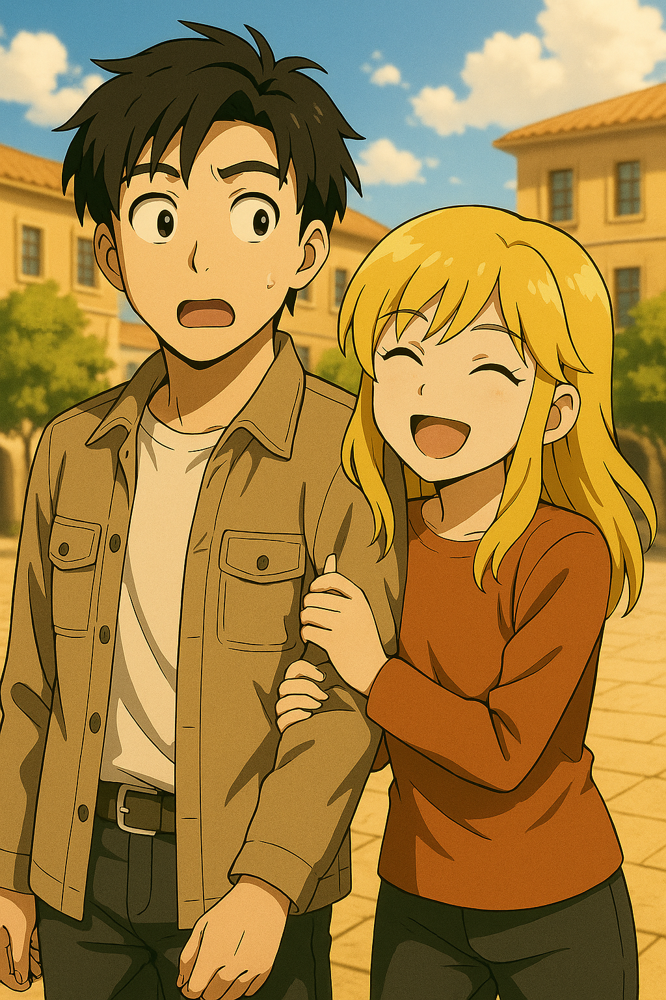
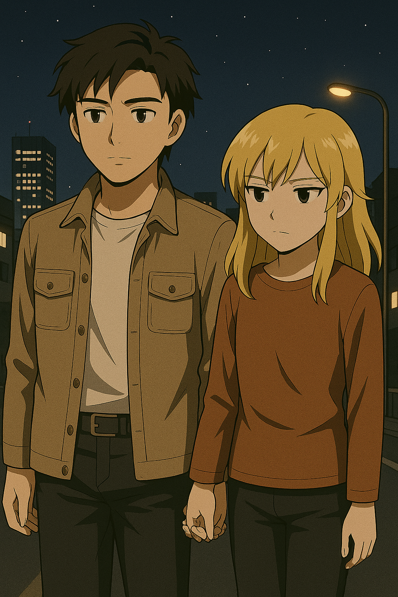

## 第六章：平壤
第三天，苏贞花应该是在养病，所以没有出现。唐海一个人在军营里到处逛逛，基本摸清了这里能去的每一个角落。他试图找到昨天格纳库的路，但似乎一旦靠近那个方向，就有宪兵把守，没有特别的通行证，谁都过不去。唐海只能作罢。

又过了一天，唐海吃过早饭，正靠在床上看书。房间里的钟指向早上八点，他轻轻合上书页，心里冒出一句："不知道苏贞花还好不好？"就在这时，房门响了。他开门，看到苏贞花站在门口，虽然脸色算不上是特别好，但看得出，恢复得还不错。她今天没有穿平时的军服，而是特意换上了一件橘红色套头衫和蓝黑色的麻布裤，看起来青春又爽朗了不少。她的脸上带着得意又不怀好意的笑容——不同于第一次见面时那种公事公办的克制微笑，这次，她像是专门来捉弄他的。唐海一时又好笑又心疼："你来干什么？你现在应该躺在病床上！"苏贞花扬了扬下巴，"我从医院溜出来了。你是我的监管对象，我不来，谁知道你会在这儿干什么坏事？"唐海一脸服气地笑了："好好好，我的小长官。那你就躺在床上监督我，我哪儿都不去，行不行？"

他回头正准备去铺床，身后却传来一句轻轻的声音，语气里带着点促狭，又有一丝兴奋："要不要，和姐姐一起去逛逛平壤？"唐海一愣，转过头："什么？！你认真的？"苏贞花挺起胸膛，语气半真半假地调侃："当然！唐海同志，你可不要误会了。和自己的长官一起逛平壤，欣赏这座伟大的城市，也是你的任务之一。请你配合！"唐海一边穿外套一边嘟囔着，"听说你们街上到处都是警察，我们外国人根本不能自由走动吧。要是被抓了你可得出面。""哼，"苏贞花也有些苦恼，环顾了一下房间，突然她看到了桌上的那枚徽章，眼睛一亮，像发现了秘密通行证似的，"徽章！你居然拥有我们的领袖徽章！"她拿起来打量了一下，然后回头冲唐海笑得像个得意的小女孩："那就没问题了！戴着这个，你走到哪儿都不会有人拦你！说不定还有人向你敬礼呢！"唐海狐疑地看着她："真的假的？不会走着走着就进局子吧？""你放心。"她把徽章一板一眼地别在他胸口，语气突然认真了一点，"能拿到这个徽章的外国人，不是普通人。你现在可是被体制接纳的人了。"唐海低头看了一眼胸口，徽章冰凉地贴在衬衫上。

"啊对了！"苏贞花从房间角落的一个旧军用储物箱里翻出一顶灰色军帽，帽檐有些旧，但徽章还亮着。"戴上。"她说得很自然。唐海一脸惊慌："你疯啦？我要是被当成冒充军人——""别说话。你今天是科学院外籍顾问，配合检查就好。万一有人盘问，我来应付。"她顿了顿，给他帽子压得正一点，低声说："你不知道，穿得像体制的人，才不会被体制管。"
唐海还在发愣，苏贞花已经站在门口，朝他挥挥手："走吧，唐同志！今天你由我带路。"唐海没再说话，只是微微吸了口气，然后跟上了苏贞花雀跃的脚步。他意识到，似乎他和苏贞花之间，正在产生一些莫名的相互信任，而这种信任，正悄悄地超出了任务允许的范畴。

而此时，在苏贞花养病的医院里，病房护士发现她不见了，赶忙慌张地跑向值班台报告：“苏贞花不见了。”对讲器里静了几秒，传来一句低沉却清晰的回复：“不用管。”信号切断，走廊再次恢复寂静。

走出军营的时候，门口的士兵正准备阻拦。但当他们看到唐海左胸上那枚熠熠生辉的领袖徽章时，突然正色道，"长官好！"然后给唐海敬了个礼。唐海一边像模像样地回礼，一边冲苏贞花眨眨眼，苏贞花也悄悄地对着他吐了吐舌头。在距离军营不远处，苏贞花甚至特地指着一处隐蔽的角落，冲着唐海神秘地说，"在那里有一辆摩托，不知道是哪个军官停在这里的。我和这个军营里的士兵们，没事就会悄悄骑着玩儿！"唐海有些惊讶地问，"你这么小一个女孩子也会骑摩托？"苏贞花则有些不高兴地嘟着嘴，"你小看姐姐！唐同志，对长官不敬，你知道在这里是犯了大忌吗？"然后她自己也咧开嘴一笑，"不过我们还是老老实实地去搭地铁吧！"唐海有些不满地抗议："你老是姐姐姐姐的，怎么看都比我还小吧！你几岁呀？"苏贞花则是回过头，莞尔一笑，"我听说，问女士的年纪是不礼貌的。"然后又加了一句，"呆子！"唐海挠挠头，也嘿嘿一笑。

他们从革新线的三兴站上车。地铁上，唐海是第一次近距离看到真正的朝鲜老百姓。乘客们的表情或疲惫，或麻木，和车站里如宫殿般的装饰，以及壁画上人民的笑容形成了鲜明的对比。坐了一站路后，苏贞花带着唐海从革新线熟练地转乘到了千里马线，一路向南。车上的乘客一如之前的紧张，甚至在唐海和乘客们对视时，他们警惕地避开了自己的目光。但在到达荣光站时，突然车厢里进来了很多面带微笑、穿着得体的乘客。他们衣服干净无尘，远不像是在三兴站上看到的乘客。他们每个人都拿着当天的《劳动报》，或阅读，或相互讨论，一副其乐融融的样子。唐海正觉得奇怪，苏贞花则轻轻地告诉唐海："这里是外国人被允许坐车的两站之一，而这帮人都是演员。"他们俩从荣光站下了车。马路虽然不像国内车水马龙，但时不时会有汽车驶过。唐海注意到，其中不乏老款奔驰、宝马和沃尔沃等豪车。他们走着走着，苏贞花刻意跟唐海保持了一段距离。唐海不解地问，"你干嘛？"苏贞花一边看着路人，一边小声说，"你没觉得大家都在看我们吗？""......所以呢？这有啥奇怪的吗？""当然奇怪！我一直听说外国人很容易在我们国家引起别人关注，我不喜欢被关注，所以我得离你远点！"唐海有些无奈，"你觉得大家看我们，是因为我是外国人？"苏贞花也觉得有些不解，"不然呢？不过我也不理解，你和普通的平壤男人看着没啥区别，也没多帅啊？"唐海忍不住苦笑着说，"我的好姐姐，你真的觉得你这样金发褐眼的美女在平壤街头很常见是吧？"苏贞花这才发现大家看的是她，吐吐舌头，"人家也是第一次离开军营这么到处跑嘛！"

不一会儿，苏贞花指着眼前一幢高楼说道，"我们去里面坐坐吧！"唐海定睛一看，正是著名的高丽饭店。这时，苏贞花靠过来，趁人不注意，悄悄地帮唐海解下他的徽章，帮他脱下军帽，而自己的徽章也解下了。"这里是不允许本地人进入的，这样我们看起来就像一对外国人了！"他们往饭店门口走去。果然，不仅没有人拦住他们，甚至还有一个保安模样的男子用英语对他们说，"请你们回饭店！外国人没有陪同是不能随便出去走动的。"他们径直坐电梯到达41楼的咖啡厅，而苏贞花显然很紧张，不敢坐下。唐海有些嘲笑她似的说："你怎么比我还紧张？"苏贞花又羞又恼，嘟囔着，"我也是第一次来嘛！我常常路过这里，从没想过自己能走进去。"唐海试图拉着她坐下，苏贞花没有拒绝。唐海熟练地点了一杯自己最爱的耶加雪菲，给苏贞花则要了一杯卡布基诺，同时点了一些吃的当午饭。苏贞花皱着眉头试了一下咖啡，"噗"地一口喷到了唐海脸上，小声说道，"呸，怎么像汽油一样，难喝死了！"唐海则绅士地用餐巾纸擦了擦脸，笑道，"这玩意喝了精神可好了！我本科的时候全靠这个提神！"苏贞花恍然大悟似的说道，"明白了！你们也是军训完很累，所以喝这个，为了学习不犯困？"唐海有些错愕，"啊，我们上大学就是上大学，不用军训。"苏贞花轻声说，"我一直以为，大学和军校是一个意思。"唐海便和她讲起了他的大学生活，提到了他的朋友们，林砚，季思澜，也提到了赵以宁。在唐海聊起赵以宁的时候，苏贞花低下了头，棕色的眸子轻轻一转，突然问道："你说的这个赵老师，她漂亮吗？"唐海的心突然有些堵得慌，他看到苏贞花杯子里的咖啡几乎一点没动，便转换话题说，"比起这个，怎么样，我的长官姐姐，你敢喝完这杯咖啡吗？"苏贞花显然有些被激到了，她拿起杯子，眼睛一闭，咕嘟咕嘟地把整杯咖啡一口气喝了下去。她放下杯子，唐海注意到隔壁桌有几个人在看，连忙小声提醒："低调点，你刚刚太高调了。"她怔了一下，像被突然按下了什么遥控器，坐得笔直，一言不发。正好吃得也差不多了，唐海一边付了钱，一边悄悄地拉着她出了咖啡馆说，"好姐姐，咖啡是要一点点喝的！"苏贞花不屑地撇撇嘴，"你们外国人可真麻烦。不过，这个味道似乎也没那么讨厌哦。"

两人出饭店时，悄悄地又别回了自己的徽章，唐海也戴上了军帽，趁着门口的保安不注意溜了出来。另一边的保安注意到了，刚想阻拦，唐海指了指身上的徽章，对面立正，敬了个礼后就不说话了。唐海轻轻摩挲着胸口的徽章，半开玩笑地低声道："这玩意......还真是通行证。"，而苏贞花则是十分自豪地笑道，"那当然。在朝鲜，只要我们认你是自己人，那我们之间就是亲如一家的！不像外面的世界这么复杂。"两人沿着大同江慢慢走着，一边走一边聊。"Звёздочка。"苏贞花突然蹦出一个俄语单词，"我妈妈小时候就是这么叫我的。""Звёздочка？我记得是小星星的意思，很亲昵的称呼。你的妈妈一定很爱你吧，所以你再忙，也要经常回去看看妈妈呀！"唐海说着，心里庆幸他在Guolindo上俄语学得还算认真。没曾想，苏贞花眼神暗了下去："你知道，我们这样的，在这里连笑都要小心。人家看你一眼，就知道你不是'纯的'。我记得我5岁的一天晚上，我妈妈突然被抓去做劳动改造，然后我就再也没见过她了。"然后她抬起头，很认真地对唐海说，"只有我们两个的时候，你可以叫我Звезда吗？"唐海愣了一下，感到有些心酸，忙不迭地点头，"好的，Звезда。请你也不要叫我同志，叫我唐海吧！"他用食指在苏贞花手上，比划出了自己的中文名的写法，而苏贞花把自己的手放到了心口上，微笑着说，"我记住了，唐海。"

过了一会儿，两人走到了平壤最著名的景点——万寿台。高耸的铜像在午后阳光下泛着古铜色的光芒，两位领袖并肩而立，表情庄严。巨大的广场游人如织，但却格外得安静。只有几个清洁工扫地的声音，连说话声都仿佛会被铜像压低了音量。苏贞花站在铜像前，神色忽然严肃起来，轻轻理了理自己上衣的褶皱。她走上前一步，微微鞠躬，然后转过头对唐海低声说："来这里，不管你信不信，都必须要行礼。"唐海犹豫了一下，还是走过去，在她身边站定。他看着眼前的铜像，心里一时有些说不出的滋味。最后只是低头点了一下头，算是交差。他一转头，看到苏贞花正在对着铜像，默默流下两行热泪，看起来真情实意，像是想到了什么过世的亲人。唐海看着她的侧脸，眼神柔和了几分："所以，现在的你，还相信这些吗？为了保护领袖，什么牺牲都值得？"她没有马上回答，只是望着那两尊铜像出神。许久，她才低声说："我不知道......也许吧。我信我得活下去，我信我不能出错。我信，只有把这些做得足够标准，别人就不会怀疑我了。"说完，她转头看着唐海，脸上没有笑，"小时候学校每个月都要组织我们来一次。天气再冷也不能戴手套，风再大也不能低头。谁的弯腰角度不标准，谁哭不出来，回去就要挨训。有时候，我实在流不出眼泪，就会想想妈妈，眼泪就止不住了"。唐海没有说话，只是轻轻握住了她的手。她惊了一下，本能地想缩回去，但最终还是没有动，只是手指轻轻回握了一下。他们站在铜像下，彼此之间没有再说话。阳光照在他们脚下的地砖上，把两个微弱的影子，投在了领袖像的脚边。从广场离开时，她悄悄地问唐海，"你们也要对领袖敬礼吗？"唐海一时语塞，不知如何作答，只能说，"很久以前似乎是需要的。"这时候，一队游客走过，而其中一个男子看到了他们。"嘿！你是中国人吗？"他热情地用中文和唐海打着招呼，一看到旁边的苏贞花，又切换成了英语，"你旁边的是你女朋友吗？真漂亮！今天天气这么好，要不要我给二位合个影？"又是拍照！唐海又想起了和赵以宁合照的海边的那个傍晚，心里又泛起了一阵酸涩。而这时，身边的苏贞花却主动挽起了唐海的胳膊，微笑着用英语回答道，"是的，我是他女朋友！就麻烦你啦～"唐海一惊，还来不及反应就被苏贞花拉到了一边。"茄子！"男子用拍立得给他们一张合照，然后把照片递给苏贞花，"送给你们啦！"照片上，一个一脸惊讶的男孩和一个害羞地笑着的女孩。苏贞花一边看着，一边笑道，"哈哈哈你拍得好丑！"

唐海挠挠头，正不知如何作答，突然，苏贞花像下定决心似的，突然对唐海眨眨眼，"怎么样，要不要看看真正的平壤？"唐海则一脸茫然，"难道，这里不是平壤吗？"苏贞花摇摇头，"这里的平壤属于外国人和高官们，我想带你看看我小时候住的地方。走吧！"唐海心里一紧，加快脚步跟了上去。他们从千里马线的凯旋站上车，坐了一站后又从战友站换乘革新线，一路坐到了最东边的乐园站。两人一路往东，绕过了动物园的后门，走过了河岸边的运输通道，又趁人不注意，从旧铁轨上穿过。苏贞花还从地上抹了点土，涂在了唐海的衣服上，"这样，你看起来就像是来这里考察的科学家了！一路上万一遇到检查，你不许说话！"路边时不时有老农打量他们，而偶尔遇到士兵盘查，苏贞花拿着自己的军官证，很凶地对着士兵叫着，"这可是住在未来科学家大街的科学家！来我们这里考察田地的质量！"吓得士兵立马放行。

穿过又一段废弃的铁轨后，唐海终于明白，所谓"平壤的另一面"，不只是地图上的方向。他们走进了一片破败的住宅区。街道是泥土路，两边的房屋低矮，砖墙斑驳，有些屋顶干脆盖着防水油毡。孩子们在巷子里追着一只没毛的猫跑，几个老人坐在门口，眼神呆滞地看着他们。"我小时候就在这儿。"苏贞花低声说，"那边第三排，水泥预制板小平房门口种了棵槐树的那家，是我外婆家。"唐海不自觉地放轻了脚步。他看到不远处一扇破窗户上贴着一张褪色的画像——那是领袖的肖像，但已经模糊得几乎认不出轮廓。"你们也挂画像吗？"他轻声问。苏贞花点点头，淡淡地说："不挂，怕挨罚；挂了，也怕风把它吹坏。怎么都错。"他们继续走着。唐海隐隐感觉，这个女孩正一步步带他走进她生命中那个被彻底埋藏的角落。又过了一会儿，苏贞花带着唐海熟练地爬上一座山头。苏贞花指着远处，说得很轻，也许只是漫不经心地说：
"那边有山，你知道吗？他们试爆的时候你们那边的窗玻璃都碎了。"
"不过官方不会告诉你这些。"
唐海惊讶地问："你怎么知道的？"苏贞花轻笑说："你以为我们不看地图？"
他低声问："那边真的是？"
苏贞花不回答，只说："你们中国人总是笑话我们的先军政治，说我们是战备前线，其实你们应该更担心。"最后，她指向另一座山头，"那片山你看到没？自从我和我妈分开后，就被带到了那里。说是劳动营，其实就是关起来，教你怎么做个听话的兵器。有一年我逃出来两小时，从那里跑到这儿......最后还是被抓回去了。"
唐海没多想，只低声问： "你怎么记得路线？" 苏贞花：
"晚上走的。地上有道大水管，一直往东流。"

黄昏时分，唐海和苏贞花穿过一条狭窄的小巷，两边是陈旧的水泥墙壁，偶尔有一两只猫从垃圾桶边跃出。他低头想着刚才苏贞花提到的核试验，正觉得心烦意乱。下一秒，他的肩膀就被人猛地一按。"啪"地一声，他被苏贞花按在了墙上。"你——"唐海刚想说话，她却毫无预兆地吻了上来。那吻没有感情，没有温度，只是机械地贴上来、推动，仿佛一项受训后的动作。唐海反应过来，迅速偏头挣脱，"你在干什么！"他压低声音，语气里是突如其来的慌乱。苏贞花站在他面前，脸颊微红，眼睛却异常清澈地望着他，"我......有点想和你那个。""哪个？"唐海的心开始往下沉。"就是那个。"她认真地答，像在背诵一段早就熟记的答案，"晚上在床上可以脱衣服。白天在办公室的话，只要脱裤子就可以了......很快。崔将军说，这样是他奖励我......"唐海的呼吸猛然一滞。他从未想过，会在一个女孩嘴里听到这样的话，而她的表情——居然是温柔与认真掺杂着几分羞涩。"你知道你在说什么吗？"他声音发颤地问。苏贞花点头，理所当然地说："知道啊。虽然有时候疼，但后来偶尔也觉得，也挺好......如果是你，我感觉应该会更好。"唐海眼神中露出了一丝惊惧，而女孩继续说，"崔将军似乎很喜欢这样，说是这样就代表他对我好。我......我也想对你好。"那一刻，唐海几乎听见自己心里有什么东西被撕扯着，一颗心支离破碎。他终于明白，这个从见面起就带着戒备、控制一言一行、永远挺直背脊的女孩，为了"活下去""被信任""向上爬"，学会了把自己的身体，当成一件可以使用的工具。她甚至不知道，什么是自愿，什么是羞辱，什么是爱。他想骂人，想发火，却发现根本不知道该把怒气发泄在谁身上。他想一拳砸在墙上，又怕吓到眼前的女孩。他也想安慰她，却又知道，她不需要"可怜"，她甚至不明白，为什么她是"可怜"的。唐海深吸一口气，一把将她抱进怀里。他的动作很轻，像怕惊动了什么。他贴在她耳边，低声道："Звезда......哪怕就今晚，别再跟他'那个'了，好吗？"苏贞花没有说话，她只是怔怔地站在原地，过了一会儿，轻轻地点了点头。她的脑子里并不完全明白这句话的意义，只是心里某个地方很安静很安静，好像有什么地方松动了。像是......温暖，十分温暖的感觉，像在妈妈的怀抱里，又有点想哭。唐海没有再问，也没有再说。他只是抱了她一会儿，然后像什么都没发生过一样继续走向下一条街。但她追了上来，牵住了他的手。唐海怔了怔，没有松开，就这样紧紧地握着。

两人就这样，沉默地牵着手，慢慢地往军营走。他们很默契地没有去坐公交，看着身边的景色慢慢地从昏暗破败，到有了一些灯火，再到能隐约看见高楼大厦。街道空旷，风有些凉，却不刺骨，像是替他们藏起了彼此的体温。他们距离大同江很远，看不到歌里唱的那样，静静的江面上灯光潺潺流动的样子，但唐海和苏贞花似乎就想这样，在平壤的夜晚，悄悄地牵着手，一直一直地信步走下去，守着独属于两人的秘密时光。有那么一瞬，唐海甚至产生了错觉：好像这座城市从未兵荒马乱，好像他们不是两个完全不同的国家的公民，也不是各自制度里的齿轮和兵器。好像他们只是一对普通的年轻男女，在考试季结束后的深夜散步，谁都不好意思先开口说些什么。但就在那样的沉默里，苏贞花轻轻收紧了他的手指，像是在确认他还在。唐海低头看着她，想说点什么，却最终只是轻轻应了一声："嗯。"就像是回答了她从未说出口的问题。

