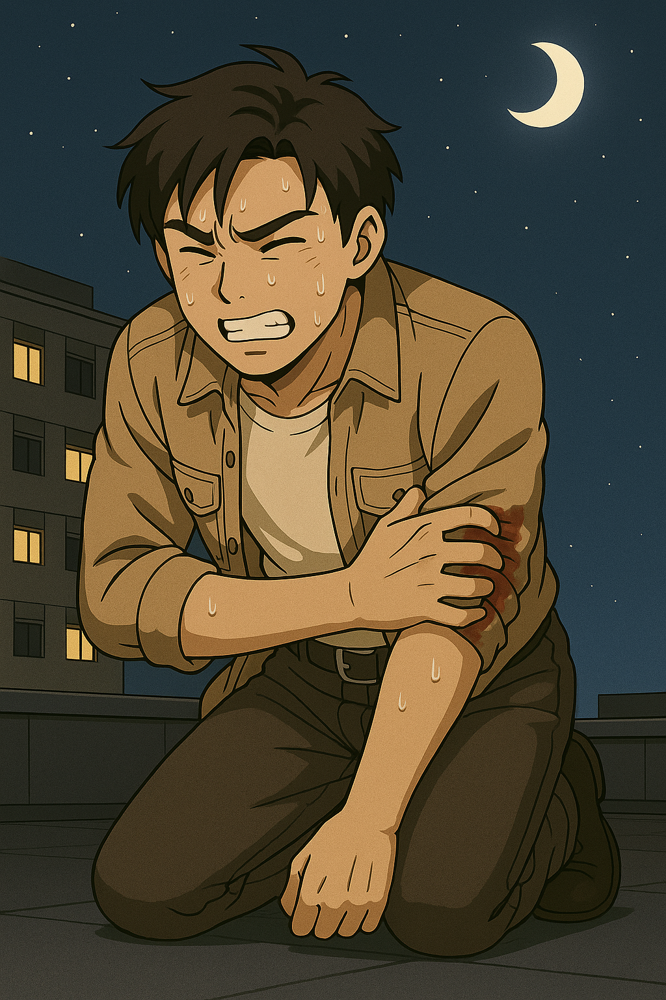

## 第七章：危机
两人就这样走到了军营。当他们身影出现的一霎那，两束探照灯就打在了他们身上，刺得他们睁不开眼睛。唐海用手臂遮挡着，眼睛努力地适应着强光，发现几个人影直挺挺地站在那里，其中一个人慢慢地走到了他们前面。"欢迎回来啊，二位！"说话的正是崔光烈。黑暗中，唐海看到，他尽力保持着和蔼的微笑，但眉宇抽动、面部不时轻颤，像是在极力压住某种即将喷薄的情绪，"我们一早过来，就发现你们一个不在房间里，另一个也不在病床上。方便问一下，今天二位去了哪里呢？"唐海正想护住苏贞花，却发现几个宪兵早就齐刷刷地跑过来，控制住了她，而他自己身后，也站着两个虎视眈眈的宪兵，手里的枪正闪着凛凛寒光。"我们今天去考察了一些平壤著名的景点，将军。"唐海喉头动了动，强压住下意识想要后退的冲动，语气尽力平稳地说，"我一直对这座伟大的城市的历史和景观充满兴趣，难得有机会，便不由自主地想去看看。苏同志不顾自己身体上的痛苦，顺从了我任性的请求。"然后，他对着被押解着的苏贞花，换上了标准的平安道腔调，大声说道，"苏同志，谢谢你今天带路！我度过了在这里最愉快的一天！"苏贞花勉强抬起头，对着唐海笑了一下，用谁都听不见的声音说了一句："这个呆子......"。

崔光烈嘴角有些抽动，他挥了挥手，让宪兵把苏贞花带走了。唐海赶紧上前，语气几乎带着哀求："是我一个人执意要出去的，苏同志只是......只是看我可怜，才陪了我一趟。请别为难她。"崔光烈又换上了他一贯的笑脸，"啊，唐同志，你不要误会！毕竟你们今天的行程不在我们的安排之内，因此我们只是进行例行询问，请你理解。"然后，他又看着唐海的眼睛说道，"唐同志，你贵为来访嘉宾，又不顾自己的安危，拯救了我们的同志，我们完全相信你的诚意和忠诚，也非常重视和你的合作。请安心留在平壤，你的访问行程不变，技术交流不变。请早点回房休息，我就不送了。"唐海略带迟疑，但也没更好选择，回到住处，心绪不宁地过了一夜。

苏贞花被宪兵押到了崔光烈的住处。门一开，她被重重地推了进去。身后的门"嘭"地一声关上，锁闩落下的声音像是铡刀落下。她站立不稳，靠着墙缓缓坐下，心跳急促，像是回到了那个她最不愿回想的夜晚。脚步声从走廊远处传来，一步步，沉重却稳如鼓点。门外响起宪兵例行的敬礼声，"崔将军，您辛苦了。"门被推开了。崔光烈站在门口，眉眼间带着一股压抑的暴怒。他没有看她，只是进来，关门，然后反锁。屋内很安静。苏贞花站起来，强撑着开口，"将军，我......"话还没说完，一记重重的耳光甩来，将她打得失去平衡。她跪倒在地，嘴角渗出血来，还未回神，第二下又袭来，将她整个人摔倒在床脚。空气变得凝重。苏贞花蜷缩着，不知该怎么反应，只是本能地护住自己。崔光烈站在她面前，喘着粗气，手指颤抖，像在极力控制情绪。他猛地扯下腰间的军帽，狠狠摔在地上。"你以为我不知道？你以为你真逃出来了？你以为你们俩今天一切顺利，真的只是走运？"他的声音低沉如地雷炸响，"怎么样，高丽饭店的咖啡好喝吗？"说到这里，崔光烈一脚踹翻椅子，猛地抓住苏贞花的后领，将她扔到墙边，怒声咆哮：“今天我特地没动手，放任你们去，是因为我好奇——一个像你这样的人，脱缰后会奔向哪儿。没想到啊，苏贞花。你跑着跑着，居然还让人家跑到你心里去了！”她没有回答，只是咬紧牙关。崔光烈的眼神里带着一种近乎羞辱的愤怒，像是被剥了皮的猛兽。“你是不是以为，今天是真的自由？你是不是以为，他真拿你当人看了？”苏贞花一言不发，捂着被打肿的脸，低着头。崔光烈却步步逼近。“你忘了你是谁了？你不过是个监视装置，是试验用的诱饵。徽章、行程、对话、数据包，全都在我们眼皮子底下！你笑，他看；你哭，他听——我们每一帧都分析过！”他俯下身，在她耳边吐字如刀：“我们想看他会不会信你，结果你先信了他。你他妈以为他带你去喝杯咖啡，你就能从狗变人了？我们本来是安排你看看，他能不能最终为我们所用。这一切原本在控制之中，都他妈被你搞砸了！”

崔光烈一边骂着，一边把手伸向了皮带。突然，苏贞花像是记起了什么似的，低低地、断断续续地说："将军......就今晚......不要，好吗......"。他俯身靠近，语气里不再是将领的权威，而是一种变调的占有欲和妒火："你以为你可以对别人好？你这样的东西，也配选择自己想对谁好？"屋内再无人言语，只有崔光烈压抑不住的喘息声，像野兽临近猎物前的粗重鼻息。苏贞花的哭泣早已微弱，声音被压在喉咙深处，只剩下身体的微颤和一丝微不可闻的哀求。许久之后，崔光烈冷冷地起身，整了整衣襟。"明天，跟我去一个地方。你不会死。但你会知道，什么叫生不如死。"他说完这句话，摸了摸苏贞花的上衣口袋，摸出了她和唐海的合影。他利落地撕掉了照片，打开门，消失在走廊尽头。门"咔哒"一声被重新锁上，房间再次陷入沉默。苏贞花跪在床边，久久没有起身，眼泪无声地落在冰冷的地板上，落在了那张被撕碎的照片上。她试图捡起地上的碎片，一片片拼着，却怎么也拼不回来。指尖轻轻一松，整个人倒在了地上。

第二天，唐海如常被安排参观其他工厂、演示操作台、与其他工程人员交流，只是带领他的人换成了平壤综合大学的另一个青年大学生。他试图在流程空隙间问起苏贞花，被以各种理由搪塞："她今天调去别的部门了。""听说她身体不适。""她不在名单里，应该不是你要见的人。"甚至午饭过后，他又问起了带他的这个小青年，"苏贞花到底去哪儿了？？"小青年带着一种冷漠和戏谑的神情，只回了他一句，"我们这里，似乎没有一位叫做苏贞花的同志。"唐海越想越不对劲，他找遍了办公楼、演示大厅、甚至隔壁的医务室，却没有一个人提起她的名字。像她从未走过这栋楼的走廊，从未坐在军营食堂吃过饭，从未牵起过他的手。仿佛他越是试图寻找，越是发现，无论是从每个人的嘴里，还是这里的每一处角落，都预示着苏贞花这个人从未存在过。晚上，他突然想到了什么，假装在床上侧过去躺下。在尽可能避开监控以后，他悄悄摘下自己衣服上的徽章，把它向自己的手表靠近。很快，他就听到了手表的扩音器里，传来了轻微的"吱吱"的电流声。那一刻，他全明白了。"册那！这个老畜生！"他心里暗暗地骂道，同时又痛心自己为什么没能早点注意到，这个徽章里装着窃听装置。唐海这才意识到，自己和苏贞花的平壤一日游，完完全全地暴露在了别人的监控之下。他也猛地意识到，自己在这里已经不安全了。他定了定神，悄悄地把徽章放在了床上，走下床披上大衣，大大咧咧地自言自语道，"啊，尿急了尿急了！"然后走出房门。轻轻带上门后，他迅速躲到了一个隐蔽的角落，拿起手表，对着那个红色按钮按了一下，停了一拍，再按了三下，然后急促而轻声地呼叫着，"老林，你在吗？"

手表那头经过短暂的沉默，便传来了林砚的声音："卧槽，哥们儿，你真遇上麻烦了？"唐海迅速地说道，"没时间解释了。一个小时内，我会赶到平壤的柳京饭店顶楼。你看看能不能想办法把盘古送到那里？""什么？盘古？？你到底要干嘛？"林砚表情一变，沉默数秒，然后立刻接话道，"唯一的办法可能就是尝试从外太空抛射机体到你那里了。你知道，你需要的不只是盘古，而是一条星轨！"唐海笑了，"怎么样，林大公子，你是我认识的人里，唯一能调得动一条星轨的。"林砚又犹豫了好一会儿，然后咬着牙说，"行，老子帮你想办法，一个小时后，我会试着让盘古从天而降，降落到柳京饭店旁边。你小子他妈的，可别死了啊！"说完，两人默契地掐断了联系。"那么现在......"唐海眯起眼睛，估算了一下从这里跑到军营门口最短的路径，然后爆发式地从一个监控看不见的位置，跳到了楼下的灌木丛中。他一个前滚翻站了起来，拼命地猫着腰，向军营门口冲去。军营门口，两个看守正在巡逻，但由于天黑，他们显然无法注意到每一个角落。唐海趁他们不注意，一个箭步冲了出去，然后定了定神，摸黑找到了苏贞花昨天早上提过的，藏着摩托车的地方。黑暗中，油箱上哈雷摩托的标志闪着寒光。他不敢怠慢，一脚跨上摩托车，拧开插在上面的钥匙，摩托车引擎"轰"地一声响了。这响声惊动了守卫，他们举着枪冲了出来，"什么人！不许动！"但唐海已经听不到了。他驾驶着摩托车，拼命回想着昨天在地铁站里看到的，革新线的路线图。他现在在三兴站附近，而柳京饭店则在同一条线路上的革新站。唐海沿着昏黄的街灯一路狂奔，夜色逐渐拉开，远处的三角形轮廓渐渐跃入视野：柳京饭店，像一把插在黑夜中的利剑，直指苍穹。

柳京饭店，是平壤著名的一座高达105层的金字塔形摩天大楼。它始建于1987年，因多次停工被称为"世界上最著名的烂尾楼"之一。尽管外观已完成，但至今尚未正式对公众全面开放。除了外表辉煌的LED屏幕，里面没有任何投入运营的设备。不过幸运的是，唐海发现了大楼中心轴这里有一部施工用的电梯。在读本科做认识实习的时候，唐海曾参与过某大楼的废水管的安装调试，那时候他见过工人师傅操作过这种电梯。他试图回忆着当时的操作，关闭电梯层门。他打开操作面板，发现最高能到80层。唐海咬着牙，按下了确认键。电梯缓缓上升，隐约间，他似乎听到下面有士兵闯了进来，说了句"在这里！"然后两梭子弹射了过来，但好在已经拉开了足够距离，枪已经打不中了。唐海心惊胆战，还好是有惊无险地到了80层。从这里开始的楼层施工还未完成。裸露的混凝土结构，缺乏基本的电力、管道和装饰设施，​整体呈现出"混凝土鬼楼"的景象。而且墙体漏风现象严重，80层的高度，外面的巨风可不是开玩笑的，呼呼地从墙体缝隙里钻进来，像是塞壬的笑声回荡在这里。突然，他听到电梯缓缓下去的声音，"靠，忘记切掉电源了，来不及了！"他懊恼地想着，但动作没有半分犹豫，赶紧想办法找逃生通道。

等他摸黑一圈，终于在一个不起眼的门后面找到了楼梯，他已经听到电梯在缓缓上升的声音了。唐海看了看时间，和林砚预约的时间大概还有20分钟左右。他一咬牙，就赶紧往楼梯上冲去。刚跑了三层，他就听见楼下有士兵追上来的声音，以及手电筒的光在四处乱照。他知道，自己必须抓紧时间，因此也无暇特地掩藏自己的脚步和呼吸，只是拼命往上跑。"他在这里！"下面的士兵听到了声音，手电筒齐刷刷地照了过来，子弹也随之而来。唐海一个躲闪不及，灼热的疼痛像红铁划破皮肤，瞬间烧开了衣袖，鲜血灌满手肘。他几乎是跪着爬到下一阶梯的。他刚想从大衣口袋里摸出季思澜给他的药盒，才想起来已经全部送给苏贞花了。"册那！"他暗暗骂了一句，只能用左手捂着伤口，双腿一刻不停地向上移动。每上一级，他都感觉自己腿骨要裂开，心跳撞得像快烧坏的引擎，但他除了绝望地往上移动外，没有其他选择。过了15分钟左右，唐海终于爬到了塔顶天台。他累的单膝跪地，一边粗口喘气，任由狂风吹在自己脸上，一边看着天上。天上什么都没有，只有夜空中闪烁的星星，以及那一轮皎洁的上弦月挂在天上，把他的影子拉得很长。

