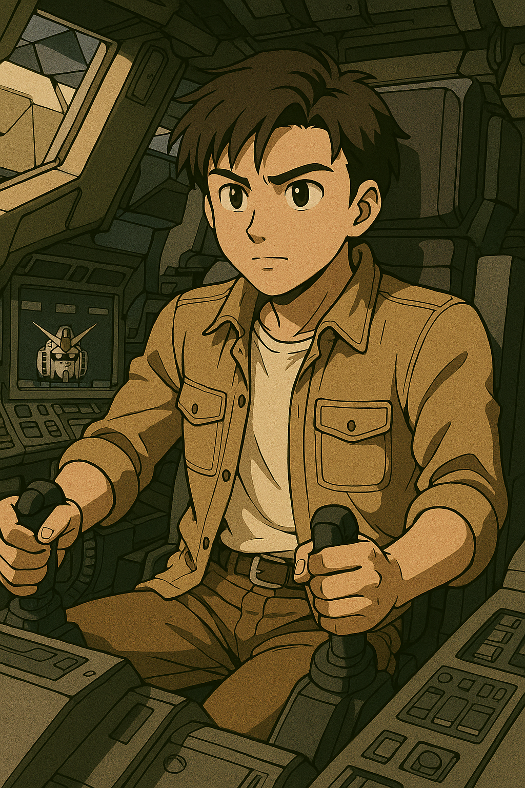
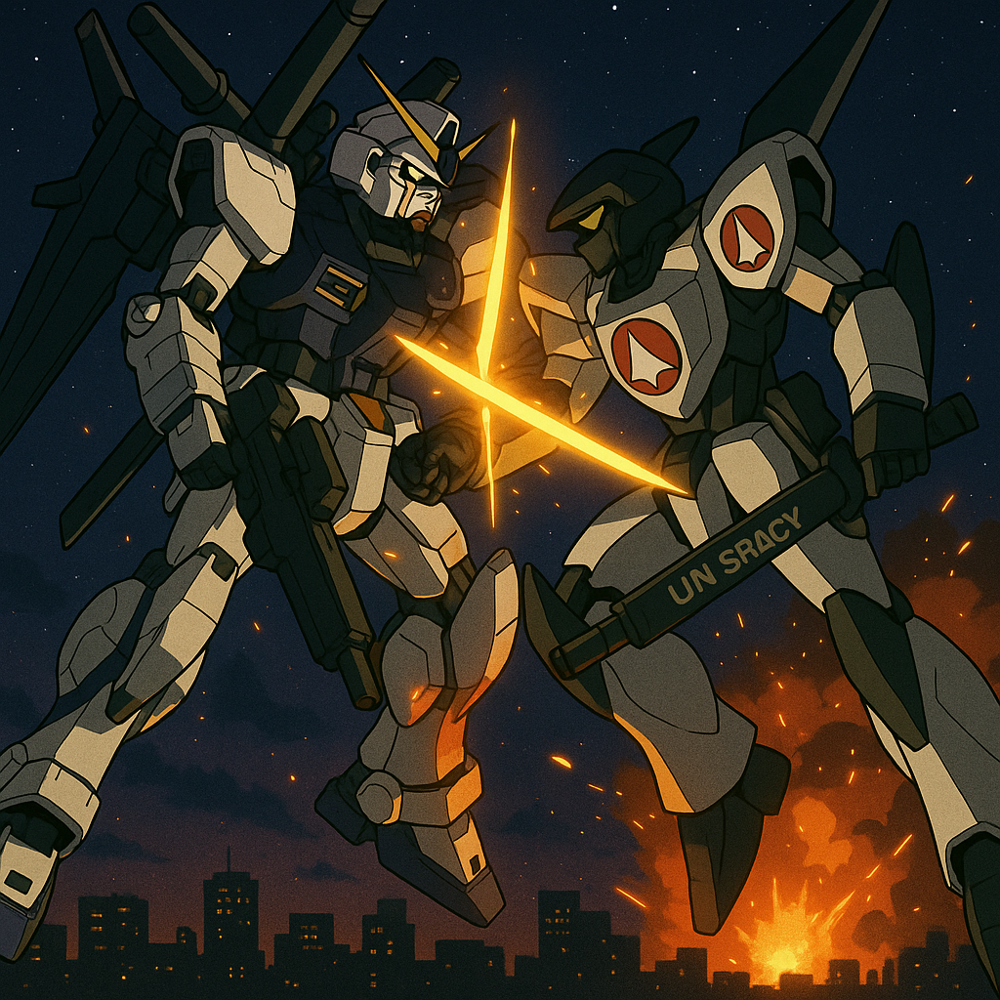

## 第九章：燃星
唐海依然在柳京饭店的楼顶喘着粗气。这时候，他注意到，天上似乎有一颗发光的星星在往自己这里坠落。再过了一会儿，他定睛一看，是盘古！盘古就像远古传说中的巨人那样，张开着手臂，以躺着的姿势从天而坠。背部的主喷射口在徐徐地控制着自己的速度，而身上的其他喷射口则是在不停地稳定姿势，尽可能地保持自由落体的速度的同时，能最大限度地把驾驶舱暴露出来。"柳京饭店高330米，按照自由落体粗略计算，我有8秒的时间，不然我就立刻摔成肉饼子......"唐海撕下自己衣服的一条布，用力按压住伤口处，勉强止血的同时，正在默默计算，突然听到"砰"的一声，子弹从他身边擦过。追他的士兵们上来了！而此时，盘古也已经快到他的头顶上了。唐海快步冲到大楼边缘，看准了时机。当第一个士兵一边开枪一边冲到天台时，他只看到唐海的身影从边缘消失了。"我打中他了！"士兵高声叫嚣着。而唐海当然没被击中，但此刻的他因缺氧而渐渐昏沉。他仿佛看见了赵以宁温柔的笑容，穿着白色的连衣裙，静静地站在海滩上，好像在等待着他的告白。他又仿佛看见苏贞花模糊的背影，带着羞涩地问他："只有我们两个的时候，你可以叫我Звезда吗？""Звезда！"他猛然惊醒，耳边响起盘古传来的那道"嗡嗡——嗡嗡——"的警报声，仿佛来自宇宙的召唤。他拼命按耐住狂跳的心，伸出左手，用力抓住盘古表面上的一个抓手。然后他反身一跃，摔进了盘古的驾驶舱。舱门缓缓关闭时，他伏在操作台上，大口喘息着，心跳如鼓，几乎不敢相信自己还活着。而此时，盘古的操作面板上亮起了警告：「试验体盘古，连接建立。战斗权限未登记。是否执行：违规启动？」唐海没有丝毫犹豫，果断按下了执行键。他戴上头盔，屏住呼吸，迅速确认各项系统指标：一切就绪。

盘古依然在下落，他握紧控制杆，踏住了动力踏板。盘古的主推进器喷出了一股能量，在快要落地的时候用一种近乎仰泳的姿势，平躺着擦过平壤街上的柳树。然后，他把控制杆往前一推，盘古被拉升了起来，如火箭一般窜到了天上。柳京塔上的士兵看着这一切目瞪口呆，连忙向上级报告，"出现不明飞行物！"而此时的唐海经过了最初的劫后余生，慢慢地冷静了下来。一瞬间，他有点不知道应该去哪里。是的，他当然担心苏贞花，也知道她恐怕命运多舛，但是现在，他非常清楚一件事。他是一个MB驾驶员，一个中国MB驾驶员——这是板上钉钉的事实。虽然他很清楚，中朝两国之间并不像宣传口那样铁如兄弟，甚至也有些剑拔弩张，但毕竟面子上还是社会主义阵营的邻居。如果他就这样贸然地闯入甚至破坏朝鲜的设施，那从国家层面来说，无异于代表中国向朝鲜宣战。"要不就赶紧往回撤吧！"他这样想着，推动方向杆，正准备向西飞去。突然，他的通讯器里传来了公共频段的声音，"那台未知MB就在前面！""是哪里来的？哪个国家向我们宣战了吗？""报告长官，没有任何国家的标识！"唐海突然意识到，如果贸然往中国飞，那反而暴露了自己的身份，那这将是共和国建国史上最严重的一场外交灾难。事实上，他相信如果他真的往回飞，那他将会遭受到来自祖国空军最亲切的问候，飞其他任何国家也是同理。"撤退路线不明，通讯受控，无法与祖国联络......"分析着分析着，在这个节骨眼上，唐海突然发现，自己唯一的选择，就是直接和对手开战，直到把任何可能发现他身份的人消灭掉。"这......这难道不是说明......我要端了整个朝鲜军事力量？？？"唐海突然觉得把盘古运过来是他做过最愚蠢的决定之一。

但现实已经容不得他犹豫，因为索敌警报器已经响了。他瞄了一眼监控，三台猎鹰MB从他后方高速接近。"别无选择，只能硬着头皮上了！"唐海想着，驾驶舱中的他咬紧牙关，指尖微微用力，控制杆被按得更紧。猎鹰的加特林像雨点一般打来，唐海闪避不及，AI自动驾驶却触发了防御模式，举起受伤的剑盾挡住了。这块盾比普通板甲要厚，所以虽然被子弹打出了很多凹坑，但并没有伤到机体本体。而做完一轮攻击的三架猎鹰眼见对方并无大碍，则立马切换成飞行模式，往天上冲去，然后又重新变成MB模式，向唐海俯冲过来。唐海试图用磁轨炮瞄准，但他忘了锁定，磁轨炮第一发直接打飞，震得整具机体偏离航向。猎鹰轻松躲开，提剑砍了过来。唐海避开了第一击，AI帮助用盾扛住了第二击，但第三击直接砍掉了盘古右臂上的肩甲上的一小块。虽然并无大碍，但肩甲碎片掉落时，唐海控制不稳，盘古一个踉跄，险些栽进旁边的电视塔。这让唐海意识到，再这么躲下去是没用的，猎鹰虽然制作粗糙，但速度确实快，刚做完这轮攻击，三架机体则又变成了飞行模式拉开距离。唐海拼命回想着在格纳库看到猎鹰的情景，快速分析着它们可能的弱点。然后，他一脚踏板，冲向了其中一架。在飞行模式下的猎鹰的速度显然技高一筹，根本不拿盘古的追击当一回事。而另一架猎鹰，趁着盘古在做追击时，正准备切换到MB模式对其展开致命一击时，突然盘古一个回头，扛起磁轨炮，"砰"的一声，直接击毁了这架猎鹰。唐海喘着粗气，"没错，猎鹰最大的弱点，一个是其板甲不够厚，另一个也是致命的一点，因为操作系统的限制，变身的时候连动力系统切换都如此吃力，那恐怕无法攻击！"他赌对了。剩余两架猎鹰驾驶员看到自己同伴被击落，更加恼怒，他们不断地变身攻击后又变身飞走，试图打游击。而盘古则是跟随着他们，当对方变成飞行模式的时候，他就开头部机关炮骚扰，而对方变成MB形态时，它又提刀佯攻，逼得猎鹰不停切换模式。突然，两台猎鹰先后着了火，两道火光像流星坠落，在平壤夜空划出一道长长的灼痕，随着飞行员"朝鲜民主主义人民共和国万岁！"的口号，坠机化为灰烬，发出震耳欲聋的爆炸声。而这正是唐海记得的猎鹰的另一个问题，在不停变换形态的情况下，动力系统容易自燃！唐海看着下面的火光，大口喘着粗气，却没有一点轻松的感觉。看着控制面板上闪烁的警告灯，唐海心里非常清楚，这一切只是开始。他不知道他还要战斗多久，更不知道，朝鲜那深不见底的军事实力，他区区一台盘古如何应付。

"去救苏贞花吧！"这个念头又一次钻入他的脑袋。是的，既然避无可避，那至少去救下这个国度里，唯一真正在乎过他的人。这样做，心里也会好受一些——至少，他还能说服自己是出于理性，而不是情感。可他不知道苏贞花在哪里。只能凭借记忆，搜寻一点可能的蛛丝马迹。唐海打开地图，发现自己距离革新线的乐园终点站并不远。再往东飞，就是她前几天带他去过的、小时候被关押的劳改营。他想起她说过的那句话："地上有道大水管，一直往东流。"他根据地图上的水路分布，推演出可能的路径，锁定一个坐标，毫不犹豫地飞去。事实上，他自己都觉得这个决定可笑。即使真的找到那个劳改营，又有谁能保证苏贞花会被关在那里？更别提——她还活着吗？"且不论她在哪儿，我以什么样的名义去救呢？战友？好朋友？下属？还是......仅仅作为一个关心她的人？"唐海在驾驶舱喃喃自语。他甚至不知道，如果真能顺利救下她，该对她说什么。他也不知道，能带她去哪儿。总而言之：他不知道她在哪儿，也不知道怎么救，甚至不知道救下来以后怎么办。但他知道一件事——如果此时不往那里去，他一辈子心里都过不去。想到这里，他更用力地踩下动力踏板。机体猛然加速，尾焰在夜色里拉出一道灼亮的轨迹。

唐海不知道的是，此时朝鲜的军部高层乱成一锅粥，但根本不是因为他一台小小的MB，而是南边突然向他们宣战了。十分钟前，韩国突然向包括朝鲜在内的全世界宣布，要"彻底解除来自北方的威胁，用雷霆行动终结几十年来南北两国的长期对峙"。青瓦台发布声明："朝鲜已严重违反《板门店宣言》和国际停战协议。鉴于朝鲜武装势力近日对我国边境及国民安全构成严重威胁，政府已无法坐视不理。经国家安全会议决定，我军将采取必要的军事措施，以确保国家主权和国民生命安全。而为切实阻止朝鲜政权策动的即将实施的大规模挑衅，我军已启动先发制人防御行动。"朝鲜高层还未完全反应过来，大韩民国国军已经突破了非军事区的多处防线。炮火首先打在开城附近的前沿阵地。随后，韩国空军的F-35编队在美军的电子战飞机掩护下，跨过三八线，对平壤以南的数个军事目标实施外科手术式打击。朝鲜对空火力仓促启动，但由于指挥系统混乱，多个防区误判自己人机群，甚至发生了误击事件。与此同时，韩国陆军机械化部队和海军陆战队越过开城走廊，并在黄海方向实施快速两栖登陆，逼近南浦港。朝鲜劳动党中央军事委员会和国家安全保卫部同时接到报告："南方攻击已造成首都防御圈部分瘫痪。""无法确认'猎鹰'中队的通信。""未知MB继续活动，疑似与南方进攻同步。"崔光烈此刻正站在平壤防空指挥部的巨型电子地图前，脸色阴沉得像暴风雨前的海面。他根本没太多心思去理会那台"误闯的未知MB"。"南边居然真的敢打过来......"他低声骂道，随即扭头，"启动特别状态：所有可用的MB集结，优先拦截南方机械化突击部队。对于未知MB，仅派出【檀君】一机对抗。"军官愣了一下："将军，仅靠一台从未启用过的机体去对抗那个未知MB......？""你还没明白吗？"崔光烈一掌拍在桌上，青筋暴起，"那个MB或许正是南方的幌子。他们打算用这台机体把我们牵制在首都，等我们反应不过来时，从南口和黄海突破！""......是！"军官立正，立即调动部队。这时他注意到，电子地图上那台标记为"未知MB"的红点，正在离开首都防区，朝着地图上一个不起眼的小区域——曾经的革新劳改营飞去。而崔光烈的出击命令，已经被传到了那台名为檀君的MB调度室那里。调度室发布命令道，"檀君，准备出击，拦截未知MB！""收到。朝鲜人民军机械部队，檀君，出击！朝鲜民主主义人民共和国万岁！"驾驶舱里传来驾驶员清脆悦耳的声音。这时，上海某空军军区的办公室内，一个略有些白发的男人正在打电话。"消息已经透给那边吗？我们的MB......"他顿了顿，听到对方的答复，微微一笑："好，那太好了。"挂掉电话，他坐回办公桌前，目光落在桌角的一张老照片上。那是一张一家三口的合影——他站在右侧，怀里揽着早已去世的妻子，身旁那个笑得灿烂的男孩，正是他引以为傲的儿子：林砚。
