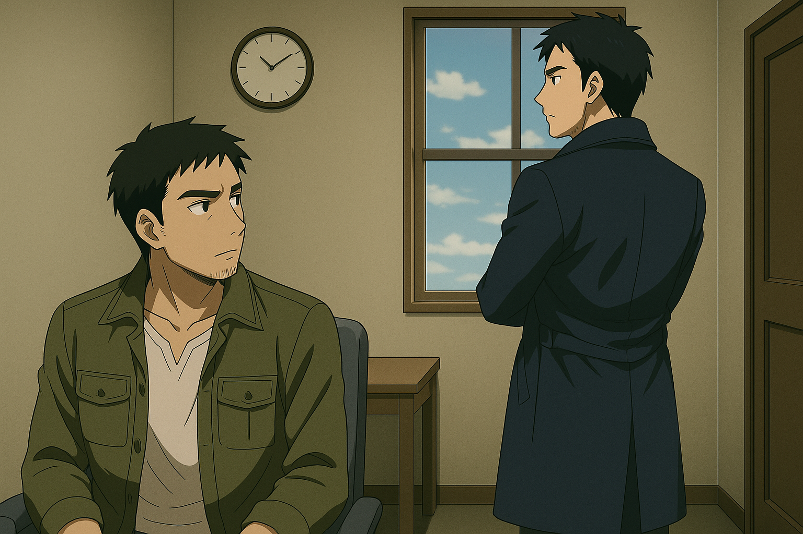

## 第一章：再起
十五年后，伊卡斯特学院依旧坐落在上海的那条老街上。唐海的名字，早已从新闻与军事档案中淡去，留在了伊卡斯特，成了一位资源与环境工程学院的一名资深研究员。

大部分人提起唐海，都知道他主攻绿色城市设计与新能源基础设施的大规模部署，参与过多个国家级花园型城市的改造项目，甚至在清洁能源学界，赢得过几次国际奖项。只不过，由于唐海富有争议的历史背景，他不被允许直接带研究生，只能和其他导师做联合培养。这些学生取得的成果，自然不算在他名下，甚至连署名作者里也少有出现他的名字。人们往往只能在作为第一作者的学生注释中，依稀看到唐海所领导的实验室的痕迹。但他从不计较，依然亲力亲为地指导着学生们，因此在教职工间的名声一直很好；而他的学生们，虽然大多不清楚唐海的过去，就算被问到，他也是三缄其口，但无论是生活上还是学业上，唐海都尽心尽力，几乎是倾尽所有地为他们保驾护航。每逢学生遇到科研低谷或生活困顿，唐海总是第一个察觉，带着宛如兄长般的耐心和温和，陪着他们一点点走出来；有人晚上十一点给他发实验数据，他能立刻回图；有人论文卡在死胡同，他就陪着通宵推演公式。实验室要是做出什么成果，他往往会高兴地自掏腰包，请全实验室的学生到陆家嘴的高级酒店搓一顿自助餐。每到毕业季时，他总是动用自己全部的人脉和资源，不论是工业界还是学术界，只为给学生安排一个适当的去处。渐渐地，学生们从崇拜唐海的专业水平，到敬佩他的人品，让他总是能轻易地和所有学生打成一片。每当考研的时候，一些消息灵通的学生们，可以不顾唐海在h-index排名上的默默无闻，抢着要报考和他相关的实验室。在小绿书上的必选导师红黑榜中，他也是伊卡斯特环境学院里，宝藏研究生导师的第一人选。

在他的实验团队里，有两位唐海精心栽培的得意门生。其中一位叫程致远，生物医学工程学院研究生，博士三年级，本科时是本院的年级第一名，大四的时候直接获得保研资格。他是一位专攻脑机接口的天才，擅长将神经映射与信号处理技术结合，他在这方面的理论研究所达到的深度远远超越了唐海的设想。脑机接口，作为人机交互领域的新兴媒介，正以前所未有的方式推动着城市环境设计的发展，尤其在个性化与自适应空间、沉浸式无障碍设计以及虚拟现实城市规划等前沿领域展现出巨大潜力，是唐海的实验室里最前沿的课题之一。只不过，程致远是个资深宅男，他曾经因为连夜排队等待偶像的新专辑发售，错过了第二天的组会，被组里当作光辉事迹传了很久。作为前女团追星族，唐海深知这种感觉是多么难以自拔，因此对于程致远，他是经常头疼，又无可奈何。

而另一位沈柏言，是由外校推荐，通过国家级特等奖学金免试录取，现就读于光电学院，博士二年级生。他专注于束流诊断的研究，一种在现代加速器系统中，用于测量特定位置带电粒子束状态参数的关键技术，为加速器及束流传输系统的运行提供重要依据。在核聚变装置中，束流诊断还被用于监测中性粒子束注入系统的束形和能量效率，是评估反应堆功率输出、保障长时间高功率稳定运行的核心手段，对唐海核能装置的工程化部署，具有重大的意义。沈柏言平时戴着黑框眼镜，可能是从小失去双亲的关系，他冷静、寡言，拥有一种不属于年轻人的沉稳，只有在提到和他相依为命的哥哥时，才会难得展露出一丝笑意。唐海常常在沈柏言的神情中，看到一种似曾相识的倔强。比起程致远，唐海确实对沈柏言更加放心一些，在不同的项目需要合作时，团队领导的任务也经常交给他。

程致远有时候一些工作来不及收尾，作为师弟的沈柏言也总是默默顶上，别无二话。程致远缺席组会的时候，沈柏言也会主动把会议笔记转发一份给程致远。而相应的，在团队合作时，有时候沈柏言的一些失误导致项目受阻，程致远总是把责任全揽到自己身上，为此他多挨了唐海不少骂，然后转头笑嘻嘻地说"没事，我脸皮厚，被骂习惯了！"和其他朋友出门游玩时，他也不忘带上不擅社交的沈柏言一起。因此虽然在实验室时，二人之间话不多，仅限于实验项目的交流。但私底下，他们的关系其实很不错。

然而，在这一切温暖与光亮的背后，却潜藏着另一幅图景。只有极少数人知道，在学院深处的一栋无人问津的旧实验楼里，唐海正带领着一个隐秘的小型研究团队，继续着十五年前遗留的事业：下一代人形堡垒（MB）技术的研究。他的专长，早已从常规的核能发生器转向了超小型核能驱动装置：一种分布式能源系统的基本单位，理论上能让单兵级MB维持作战数周的能量核心。这样一来，MB在几乎无限能源的支撑下，将不再是只能连续作战数小时的火力怪物，而会进化为全能作战平台：能同时执行侦察、强袭、突击与持久战，甚至也能胜任后勤运输。它们不再仅仅被定位于一个作战单位的一部分，而是一台MB本身就是一支独立的部队。从事这样的研究，并不是唐海的初衷。只是他心里明白，自己能在这套制度里苟延残喘，从来不是出于谁的宽容仁慈，而是因为他身上尚存不可替代的价值。体制需要的，从来都不是环保城市的设计者，更不是新能源的倡导者，而是能为它打磨出最锋锐兵器的人。毫无疑问，这才是他存在的意义。他的价值，不只是那个曾亲身驾驶MB冲锋陷阵的士兵身份，更在于他能成为整套庞大武器系统背后的设计师、策划者——一个将记忆、经验与血痕统统转化为冷冽科技的幸存者。而在那片早已化作焦土的平壤——现在被更名为柳京——的废墟上，他或许是唯一仍背负着那段历史的人。

而在学院之外，世界正悄悄改变。伊卡斯特周围的老街巷，那些过去深夜还能听到大学生争论政治的路边摊，如今被新装上的监控探头照得通明。桌上的啤酒瓶旁，人们学会了压低声音，说到敏感话题，互相碰一下杯，笑一笑："哎，算了算了，话不多说，都在酒里，喝吧。"校园宣传栏换了新内容：旧日的科技竞赛和青年创业榜单，被【民族复兴，统一大业】接力横幅取代。楼道电视屏里，穿着迷彩的青年志愿者拍着胸脯喊着"请祖国挑选我"。政治课上，老师讲到台湾问题时，前排学生带头喊"寸土不让"，后排有人耳机里正放着C站吐槽视频："保家卫国？先保住我家阳性不隔离吧。"而校园里，疫情的余震还在空气里：快递柜上喷着褪色的消毒水痕迹，超市门口有人习惯性地找二维码扫描，哪怕早已取消。熟人之间聊天，谁提起那段封城、白纸运动、连花清瘟和大喇叭，都笑着摆手："哎哟，你可闭嘴吧，真不怕进去啊？"Q信群里最流行的段子，是"封一代""润一代""躺一代"互相调侃。更远的地方，地铁站台上贴着"防范敌特渗透，人人有责"，一旁站着巡逻的便衣，眼神锐利地一遍遍扫过人群。年轻人习惯了在音符跳动上刷完民族主义短视频，再翻开编乎匿名抱怨，"什么时候工资能过5000啊？"或"我爸妈工厂的养老保险，什么时候补发？"

但是，对于共和国来说，更糟糕的事，莫过于经济的裂缝一眼可见：股市连环暴雷，小散血本无归，证券群里骂声一片。街边小店疫情后勉强撑起卷帘门，但熬不过来年的房租。夜市摊上，白领们捧着一串一块钱的钵钵鸡，一边笑骂，一边看着一条条热搜："【重磅】美国昨日又发生严重枪战！当地民众感慨生活水深火热！"，"【专家分析】内部问题？勿被境外势力带节奏！"，"【爱国青年】我要报名参军，守卫祖国！"，夜色下的城市像一口闷着的锅。

在这样压抑的氛围下，感到恐惧的不只是普通人，还有那些握着权杖的人。他们知道，维稳与生存已经成了同义词。于是，【祖国统一】，这个快被遗忘了十年的词，被重新擦亮、被包装、被推上讲台，以前所未有的频率，上头条、上弹幕、上横幅、上领袖的演讲稿。曾经的长期战略，变成了唯一能重新激起民众热血、遮住内部困局的"救命王牌"。台湾，不再只是地图上的岛屿，不再只是南海对岸的光点，而是这个庞大体制最后一次向自己证明存在合理性的赌注。

那一天，林砚亲自来了。他身穿空军将领的深蓝色常服，领章上闪着银色的少将军衔。与十五年前那个总是玩世不恭的理工男不同，如今的林砚，眼神冷峻，步伐沉稳，每一个动作都像是为整个国家的机器量身定制的齿轮。他没有客套，开门见山："唐海，台海的局势，已经进入倒计时。"他的声音低沉，却不容反驳。"这是国家层面的战争，不是兄弟之间的游戏。你明白的，上面的要求不容置喙，需要我们速战速决——现在经济大环境不好，而一场持久战的代价极其高昂，我们拖不起。"

唐海沉默了。他当然明白。自从清零政策后的动荡开始，国家早已将统一视为维稳与重塑民族主义的双重支柱。如今，政治与军事早已交融为一。台海，不再是地缘冲突，而是体制自保的最后手段。林砚走到窗边，背对着他说："而这次我来找你，是因为人形机动堡垒，也就是MB，必须登场。这是当今世界，一场中型战争中，能迅速决定胜负的必要力量。而全国——不，可能在世界范围内，只有你有实战经验，并且还活着。"说完，林砚叹了口气，"我知道，这不是你的责任。但我们走到今天，有些路，已经没有人可以退了。"他转过头，眼神少见地带着些许请求的意味："国家需要你，兄弟更需要你。我不想强求，但......如果你还能站起来，就只有你了。"

事实上，唐海并非毫无准备，他对林砚的拜访，心里也早就有底。过去几年，他早已在暗中协助军方开发下一代MB的同时，也被指派担任新生代驾驶员的教官，负责人员选拔、基础训练与模拟战演练。甚至在他的研究团队里，那几个最聪明的学生，包括程致远、沈柏言他们，已经接受了相应预备战术操作训练。而他们各自的研究，也远不像表面看上去那样"和平"或"绿色"。程致远主导的脑机接口技术，在助力城市设计的表面下，正被当作新型MB精神感应系统的核心——这是一种通过读取机师脑电波，直接操控机体的技术，使MB能够执行近乎拟人的精细动作。而沈柏言研发的束流诊断系统，其本质上也不仅限于精准调控民用核能装置，还被用于协助研制超远程、高精度、高能量的武器制导模块。这种由超远距离精准制导的高能武器，为轻量化、模块化的先进远程打击系统提供技术支撑。当他们得知自己的研究将被纳入军用技术体系，成为新一代MB项目的一部分时，没有人表现出犹豫或恐惧。相反，那是一种近乎兴奋的反应：摩拳擦掌，跃跃欲试，仿佛终于等到了真正能施展才华、验证理论的战场。他们年轻，充满锐气，对于"研究"不再满足于实验室中的数据与论文，更渴望将成果投向现实、投向挑战。而MB——这种几乎出现在每一个男孩童年幻想中的钢铁巨人——无疑是他们实现梦想、投身未来的最完美载体。他们渴望冲破安全边界，接受风险的洗礼，渴望证明自己不仅能思考，更能改变——就像十五年前的唐海自己，带着理想与野心初入这片未知领域时那样。

可是，亲自作战？他的右臂，早已不属于肉体。当年新朝鲜战战争归来后，因被子弹击伤而没有及时处理伤口，右肢被切除以防全身性的感染。季思澜——林砚的妻子、大学时期就在一起的恋人，现任瑞华医院整形外科主治医师，为他装上了智能义肢。那只假手，外观与真实无异。甚至为了使得义肢的反馈更加接近原生的手臂，唐海特地和程致远合作，和季思澜一起，将实验室最新研发的脑机接口嵌入到了义肢里。如果不是亲密的人，根本察觉不到这是一只假肢。甚至在小型马达的加持下，唐海发现，这只义肢竟然能够发挥出比原生上肢更强大的力量。并且这十五年来，唐海自己一直有定期在军方接受飞行训练，慢慢地适应了利用自己的义肢掌握操作杆的感觉。同时，他通过盘古从朝鲜战场上所获得的影像资料和测量数据，改进了那套MB模拟飞行器，加入了这几年研究所获得的最新参数，优化了盘古的设计，以及尽可能地重新构建了猎鹰和檀君的模型。在模拟器中，唐海一遍遍地正面击败了那台模拟出来的檀君，也一次次地救下了那个不存在的苏贞花。但他也深深地知道，机械终究只是机械，无论是灵敏度还是精度，替代不了原生的手臂，更是替代不了过往的伤痕。要重新面对一个荷枪实弹的战场，他的心里没有把握。

还有，那莫名其妙的头痛。自从近距离接触过核爆之后，他的神经系统就像某种混乱的网络。根据他有限的医学知识，他认为这是某种基因突变。通过季思澜的安排，瑞华医院为他进行了最全面的生理检查。血压、心率、血液指标，一切正常得像教科书一样标准。然而，当脑电图的结果出来时，所有人都沉默了。那是一幅他们从未见过的图景：大脑的额叶与颞叶呈现出一种，在清醒状态下，绝不可能出现的、超高频的、规律性的同步率放电。从唐海如常的肌肉活动来看，这并不符合任何一种已知的癫痫的病理特征；而他持续而真实的头痛，也远非一般的心理性创伤后应激反应所能解释。它更像是一种全新的、尚未被定义的、大脑的运作模式。连季思澜这位天才，在面对这份充满了矛盾的数据时，也只能无奈地承认："我......完全不能理解。"

不过，可能这也是为什么，那些复杂到近乎自毁的脑机接口，只有在他身上，运行得完美无瑕——因为他神经元的放电能在极高同步率下同频共振，信号就像激光般纯净，使得接口可以得到了无干扰的理想输入。这种脑机接口的原理其实不难理解：通过读取神经元的放电活动，再由深度学习模型将这些电信号转化为具体的动作指令。只不过不同于大多数通用脑机接口，这里承担解码任务的深度学习模型采用了混合专家架构——它能够根据不同类型的神经信号，动态挑选最合适的专家子模型来处理，从而让信号转译更为精准和稳健。更关键的是，他们通过多次皮层脑电图的追踪，发现神经元的放电并非杂乱无章，而是像一张隐形的流形，把所有与手相关的动作整齐地排列在一个连续的拓扑空间里。伸指、握拳、旋腕，这些动作在那个空间中彼此相连，像是山谷与山峰之间的起伏。于是，在模型的训练过程中，程致远特地融入了神经拓扑流形的理论，用以约束神经信号的潜在分布，让不同动作之间的连续性与层次关系分布在不同的子专家模型上。经过一系列超参数的调试，门控网络被显式地训练去捕捉数据的低维拓扑特征，使各个子模型的责任区域平滑地拼合在一起，覆盖整个神经流形。加上程致远嘴特别甜，很快就和瑞华医院整形外科、复建科，甚至运动医学科的教授们打成一片。也正因如此，他得以接触到大量与手臂运动相关的神经数据，使得这一套解码系统的精度和鲁棒性再次被显著提升。完美的输入配上精心训练的模型，最终，在脑机接口的控制下，唐海大脑传出的那些看似零散的神经信号，也能被网络自然而然地分派给合适的专家模型，使义肢精准而流畅地做出和原生上肢近乎同样复杂的精细动作，几乎与真实手臂无异。这样的完美效果，连程致远也大呼牛逼，经常找唐海做他试验机的小白鼠。

同时，如果说能自如地操作义肢是来自命运对失去右臂的补偿，那唐海随之获得的另一种异样的能力，就更像是一场源于异世界的天启了——他能"感到"他人当下的情绪，有时候，甚至能捕捉到别人脑中正在发生的思维片段——不是通过逻辑，而是用身体、神经和直觉，感知真相。在他看来，那不是超能力。那是一种恐惧，一种诅咒。也是一种被战火和科学共同烙印的印记。不过，这种感知能力，唐海目前从未告诉过任何人。

唐海抬头，看着林砚。"我知道。"一边说着，他一边直视林砚的眼睛。声音平静，但心底的涟漪早已泛起。他的感知再次无声地启动，在林砚刚才那一连串坚定的话语下，藏着一丝微不可查的犹豫，以及......恐惧。那不是普通军官对战局的担忧。那是一个知道这场战争或许无法收场的将领，对未知未来的恐惧。而唐海，读懂了。

他当然不想再上战场。不单是因为身体的伤痕，也不是因为苏贞花时而出现在他的梦里扰得他不得安宁，更是因为那场朝鲜的战争后，他早已对被利用的痛感清晰到骨子里。他知道，国家的意志，往往和士兵的牺牲之间，存在着令人麻木的距离。可即使如此，他也无法完全否定自己过去所相信的一切。从小接受的教育，那些关于国家统一与民族复兴的叙述，虽然在多年反思和现实的冲击下变得复杂模糊，但某种本能的认同依然残留。

更重要的是——他放心不下那几个初出茅庐的研究生。他们是那么的聪明，却年轻，意志坚定，却还没有真正面对过死亡的凝视。如果他不出手，这些年轻人将被直接推上前线，像十五年前的自己那样，毫无准备地走进死亡。当然，还有林砚。这个兄弟，多年来一次次在军部高层为他说话，才让他摆脱了软禁，摘除了那只沉重的电子脚镣。如果没有林砚，他可能到死，都无法踏出那个冰冷的宿舍半步。欠下的情，是该还了。十年的软禁生活，早已磨去了当年的愤怒与反抗。他不再是那个意图挑战体制的理想主义者。他学会了妥协，学会了等待，学会了以另一种方式生存。

但即使如此，在内心最深处，还有一个声音在提醒他：这不是正确的选择，相反，这可能是一条不归路，不能就这样妥协。他决定联系一个人。赵以宁。许久未见的旧友，也是当年唯一不愿妥协的人。在几年前，唐海的软禁被解除后，他终于被允许拥有了通讯工具，也是在第一时间，他小心翼翼地翻出了那张有些泛黄的卡片，按照她曾经留给自己的联系方式，忐忑地在通讯软件里搜索着。好在她的号码没变，似乎一直在给他留着一个独属于他的位置。经过短暂的寒暄，唐海知道了，自离开伊卡斯特后，赵以宁远赴瑞士日内瓦，加入了联合国，成为专攻冲突调解和战争法的国际法律师，同时在日内瓦学院担任国际法的教授。但是，十几年的隔阂，已让两人之间原本的千言万语，也变成了相顾无言。但现在，是时候了。或许，她会给他一个答案。

告别林砚后，唐海打开通讯软件，找到了这个许久没有联系的名字。屏幕上的头像静静地亮着，仿佛十五年的时间，从未改变过。他坐在研究院小屋的一隅，光影从窗外斜斜照在桌面上。他戴上耳机，屏幕接通。赵以宁出现了。她现在正身处某个海岛的办公室，背景墙上贴着一幅难民迁徙数据图。一道道红线交错延伸，上面用英文标注着："失踪"、"跨境"、"遭袭"。屏幕中的她，眼角已有细密的皱纹，中短发早已留长挽起，发丝间透着几缕银白。可她的神情，比十五年前更加沉静。赵以宁静静地听完了唐海的描述，开口了："你要我说实话？"唐海笑了笑："我从来不怕你说实话。"赵以宁点点头："你还记得小时候学历史，学祖国统一、外敌欺辱、亡国灭种，是不是？"唐海轻声："......记得。"赵以宁沉静地接话："那是一个完整的叙事结构。我们从小就学会了——对抗、牺牲、集结、统一。但你知道吗？我去了很多国家后才发现，那种结构，其实并不天然。它是灌输的。"

唐海皱眉，没有说话。赵以宁继续："当然，这种灌输有它的历史意义。但作为现代人，我们应该清楚地看到其两面性。就拿台海问题而言，统一，不等于正义。尤其当统一的前提，不是'他们想回来'，而是'我们要让他们回来'。"她停顿片刻，语气冷静："那不是复兴，那是吞并。"唐海微微吃惊，低声问："你觉得......台湾不是中国的一部分？"赵以宁淡淡一笑，仿佛早预料到这个问题："你觉得'一部分'，是地理上的？文化上的？语言上的？唐海，你很清楚，我们在讨论主权与同意。"她的声音坚定，却不显激烈："如果你要救人，那你上战场，我不会拦你。但如果你说，你是为了'祖国的荣耀'去打这一仗，那我必须告诉你，你心里已经有一半，不再是那个我认识的你了。"唐海低头，眼神动摇。赵以宁接着说道："最终做决定的权利，毫无疑问，在你的手上。但你问我认不认可这场战争，我只能说，这不是民心所向的统一，而是在投票机器的掩护下，大大方方地拿起子弹上了膛。"唐海低声说："......你变了。你曾经说过，要致力于完善体制。"赵以宁静静道："我没有变，我这十五年来一直在做同样的事。只不过，是我终于开始有选择了，选择体制并不喜欢的方法。"

屏幕静默。只有远方她海岛上传来几声鸟鸣。唐海仿佛不是在和赵以宁对话，而是在和少年时的自己对话——那个还不知道，"忠诚"与"真理"并不是同一个词的少年。最后，赵以宁劝道："你是我唯一见过，拿着枪的时候也能保持自我判断的人。我不希望你，十五年后，成了别人手上的枪。"

