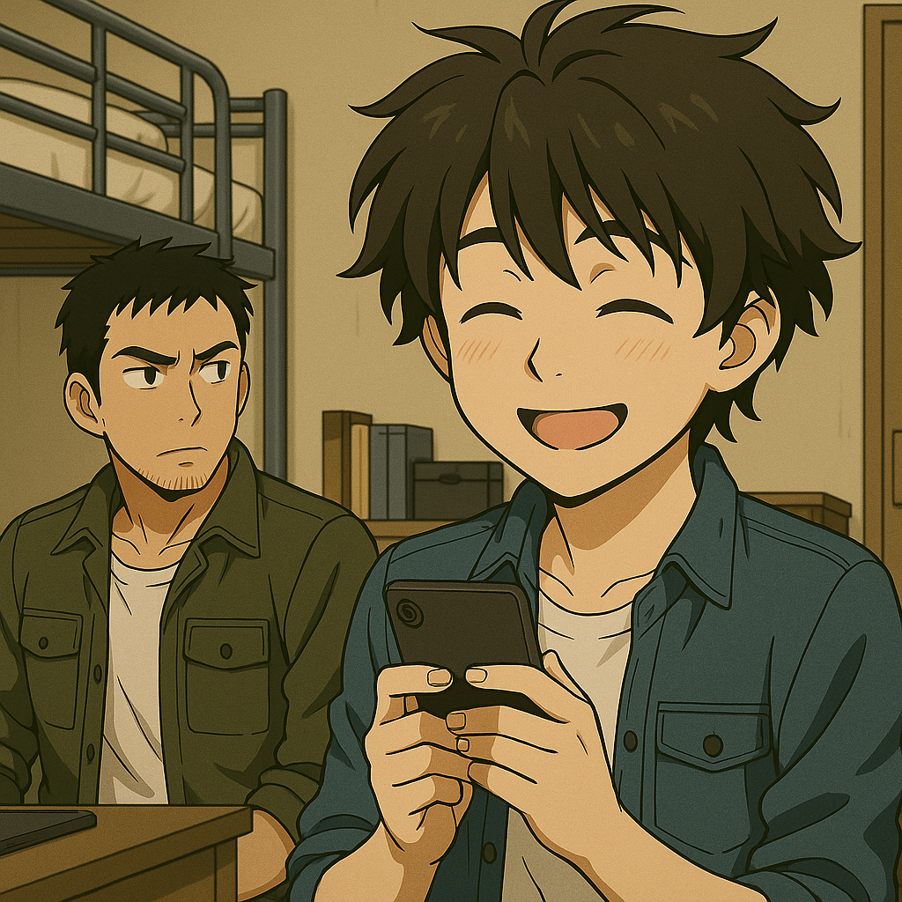

## 第二章：陷阱
赵以宁的话虽然让唐海心底有所触动，但他知道光靠理想，不足以改变现状。何况台海问题是现在中国手上最优先考虑的问题，如果想避免最坏的结局，必须亲自了解台湾方面的底牌。伊卡斯特学院与台湾的台清大学一直维持着学术交流。唐海通过林砚那边给的情报得知，台清大学不仅是台湾顶尖的工程院校，也是岛内军方的重要研究合作伙伴。这次，他决定带上自己的两个研究生，以新能源合作研究的名义，赴台进行一次学术访问。抵达桃园机场那天，天空有些阴沉，空气潮湿。新闻屏幕上滚动播放着实时影像——中俄联合舰队正在台湾海峡以东海域集结，空军战机在海峡上空巡航。画面下方的字幕不停滚动："国防部已启动最高级别应对预案。"

他们经过多重安全检查与背景核验。机场的气氛不同于平日，人群沉默，工作人员神情紧绷。唐海走过安检，义肢引发的警报声嗡嗡作响。海关人员一度提高了警觉，但经过解释，最终放行。他注意到，安检区外围站着数名全副武装的宪兵，还有隐约可见的便衣安全官员在人群中巡逻。台湾社会的开放表面，正被一种无形的紧张气氛所取代。

取行李区，人流拥挤嘈杂。程致远推着行李车，一边用手提电脑快速查看最新的脑机接口同步实验数据。他的脸上写满了年轻研究员对数据的执着与骄傲。就在这时，人群中传来一阵轻微的惊呼。"砰"的一声，程致远猛地撞上了一人。手中的电脑几乎掉落，他本能地一把拎住——那是他的全部研究成果。"对不起！"他低头，看到了一个摔倒的女孩。程致远脸涨得通红，赶紧伸手将她扶起，手忙脚乱地检查电脑和对方是否受伤。她的脸庞陌生而又熟悉。他仔细看了看怀里的女孩，惊呼道，"你，你是宫知遥？"他兴奋地转向唐海，"老师，你知道吗？！"程致远声音里难掩兴奋，"她是Stella9的团长，宫知遥！我简直......简直......本命出场啊！"Stella9。台湾当前最火的女子偶像团体，分别由宫知遥，橘子悠和白绪寒，三个年轻漂亮的女孩组成。而宫知遥，正是三人中的领队。因为程致远的惊呼，身边也有一些粉丝认出了她们，纷纷靠了过来想要合影，签名。宫知遥牵着程致远的手站稳，微笑着点头，带着两个妹妹们专业地和粉丝们互动着，短暂的尴尬化作轻松的寒暄。慢慢地，人群散开了一些，而唐海刚想开口，突然头一疼，感知到一种前所未有的异样。他的脑海中突兀地响起两道凌厉的脑电波，混杂着交织着的恨意与恶意，向他袭来。他的眉头紧蹙。目光迅速扫过眼前的三位女孩。最后，锁定在宫知遥的脸上。而她，也正看着他，眼神复杂，短暂交会。就在那一瞬间，远处机场的广播里传来通知："鉴于台海局势升级，请乘客留意航班动态。"然后，宫知遥微笑，点头，仿佛什么都没有发生。简单的自我介绍后，两拨人发现，他们的目的地，都是台清大学。宫知遥对程致远表达了感激："真的谢谢你扶起了我，不然我就要在粉丝面前出丑了。"她解释，她们此行是为了在台清大学，举办一场纪念性的演唱会。而那所学校，正是她们三人相识的地方。离开前，宫知遥回头，轻轻朝程致远挥了挥手。程致远笑得合不拢嘴。唐海则注视着她，眼神深邃，脑海中的脑电波残响仍未散去，甚至比刚才更为强烈，仿佛有什么声音在低语："不该来的你，来了。"

师生三人辗转倒车，来到了新竹，也是台清大学的主校区所在地。台清大学校园宽广，翠绿的树荫下，风吹起初夏的暖意。唐海与研究生们来到环境与能源学院。学院院长亲自迎接，穿着考究，态度亲切。他说着软糯的国语，尽力营造学术的中立氛围。事实上，唐海他们这次的交流来之不易。由于两岸关系紧张以及这两天的中俄联合军事演习，这次交流的申请在台清的管理层这边受到重重阻碍。而正是由于院长的坚持，唐海他们最终才能被批准过来。"科学不应因政治而止步，"院长微笑着说道，"即使我们的政府与军方正在做他们的事，我们也永远欢迎能源技术的突破，无论它未来是否只为照明服务。"

几架战机掠过晴空，留下细长的白色尾迹。这是中俄联合演习第二天，海峡对岸的军舰正缓缓逼近台湾东部海域。唐海听出了弦外之音。但他没有表态，只是微微颔首。他能感觉到，这个校园表面自由，但权力与冲突的暗潮，早已潜藏其中。

唐海一行人被安排进了台清大学西区的学生宿舍。那是一栋奇特的建筑，从远处望去，整座楼就像一只竖起大拇指的手。十五层高的主楼，下方宽阔，越往上越细，像是在为整座校园"点赞"。"真是一个奇特的造型啊！"程致远不由得惊呼。他们被安排在六层，也是学生区的最高层。从阳台望出去，能俯瞰对面的沙滩和海岸线。波浪一排排涌上来，像时代的潮水，周而复始。唐海特地去楼道观察了一下这栋奇怪的建筑，发现六层之上，没有普通的楼层。七层开始，建筑收缩成了一根笔直的塔台："拇指"的形状。而塔台的尽头，第十五层，是天文学院的专属观测站。两台巨大的观星仪正对夜空，仿佛在窥视宇宙深处的秘密。六楼东侧是电梯和逃生通道，西侧，一座螺旋楼梯蜿蜒而上，从六楼起，直通天文台。

安顿好行李后，唐海与研究团队立刻投入当天的学术交流活动。程致远和沈柏言轮流展示了新能源技术的最新进展。台清大学的学生和教授们都表现得很有礼貌，但几乎不主动提问，即便回应，也只是客套的称赞，没有深入讨论的迹象。唐海心中升起一种警觉：年轻人不爱说话，可能是紧张，可台清的教授们也同样克制，这不像是学术的冷淡，更像是被要求的"谨慎"。当然，唐海没有忘记他的初衷。几天的会议中，唐海尝试旁敲侧击。他调阅公开数据库，查找任何"下一代MB（人形机动堡垒）"的研究痕迹。他询问台方的能源控制组、机械工程组、人工智能研究人员，"是否对神经同步系统的军事应用感兴趣？"得到的回答如出一辙："尚未涉及。""不在本校研究方向。""相关资料应由国防学院管理。"
他甚至试图通过几位台清的老教授套话。一位能源工程的资深教授微笑着回答："您提到的这些......似乎属于'高阶产业项目'。我们只是基础研究单位。"
唐海心里更确定了一件事：这里，确实隐藏着什么。但入口，暂时还找不到。台方在刻意阻隔，而且隔得很专业。

那天夜里。台清大学的宿舍静悄悄的。海风带着咸湿的味道，在阳台边吹过。唐海站在阳台，远眺对面的沙滩。海浪拍岸的声音单调而沉稳，像遥远战鼓的回响。身后，门被敲响。程致远站在门口，怀里抱着笔记本。"老师，你看看我这个脑机同步模型怎么样？"唐海正要回应，忽然，心脏猛地一紧。一股熟悉的脑电波，从校园某处悄然浮现。那种感觉，就像风暴前夕的涌浪，凌厉，精准，且远远强于几天前在机场的那次。"来了。"唐海喃喃。"......老师？"身边的程致远小心翼翼地喊了一声，把他拉回了现实。唐海皱着眉头，盯了好一会儿："同步回路延迟太高，不适合实战，回去重写。"程致远委屈地低头，准备收电脑。唐海顿了顿，轻声补了一句："不过你比我当年强。再调一调，能上战场。"程致远眼睛一亮："真的吗？"唐海看着他，第一次没说反话："真的。"

第二天，除了会议上的例行讨论，唐海没有获得任何实质性进展。台清团队依旧保持礼貌的疏离。讨论的深度被巧妙地控制在安全区，仿佛所有人都在扮演一个剧本里的角色。当天傍晚，愁眉苦脸的唐海被院长邀请，参加一场迎客晚宴。校园灯光柔和。音乐悠扬，空气中弥漫着淡淡的海风和花香。台清大学为了营造开放多元的形象，邀请了多位国际学者和企业代表出席。而Stella9的三位成员，也穿着便服出现，与普通学生无异。校方介绍时，称她们为："台清音乐系毕业生，现为台清挂名修学分的公众人物。"言外之意：她们是大学多元与开放的象征，也是台清与社会的联系桥梁。唐海站在餐桌前，目光扫过现场，只有宫知遥那一刻回望了他一下——眼神带笑，却很深邃。

随着音乐响起，舞蹈阶段开始。Stella9三人穿过人群，径直来到唐海一行人面前。宫知遥走向程致远，嘴角带着甜美的笑意："你不是说......你最喜欢我吗？那就跳一支吧——你会跳对吗？"程致远结巴地点头，感动得像中了大奖。唐海站在一旁，面无表情。但他的精神感应已悄然展开。就在音乐响起的瞬间——一丝极低频的神经扰动波穿过了会场。不是攻击。是试探。

这时候，另一位活力满满的团员白绪寒，径直走向了唐海，非常自然地牵起他，轻声问："听说您是研究能源的？您在跳舞的时候，会思考反应堆的热效率吗？"唐海一怔，微笑回应，试图感应她的大脑波动，却几乎什么都感应不出来。"她不是感应者。"他心里默默确认。而最后一位团员，橘子悠，挂着微笑走到沈柏言面前，正准备开口，只见沈柏言面色尴尬，说："我不太擅长跳舞......不好意思。"橘子悠一瞬间停顿，但很快回以一个标准偶像笑容："哎呀～那就下次吧，工程师大人。"唐海扫了她一眼。就在那一瞬，捕捉到极其细微的高频干扰——她像是"在强制压制某种主动读取机制"。他下意识地记在脑子里："该成员疑似拥有强自控型收发感应波，可以强自抑制，具备'主动回避'特征。她在这方面，似乎比宫知遥还强！"

一曲开始，白绪寒微笑着牵起唐海的手。他条件反射地准备配合转身，却发现她的五指扣合时，几乎像是标准机械接触训练——
精准、有力、没有任何浪费的空间。 她动作轻盈，裙摆飞舞，但转身时唐海明显察觉到裙下掠过的一瞬大腿内旋爆发力——那不是单纯跳舞用的。"作为偶像，她可能只是很敬业，这无可厚非......遗憾的是，这种敬业，我偏偏在军方见过。"
他没说话，只是默默地陪她跳完了整支舞。

而另一边，宫知遥的舞步专业得近乎优雅的本能，每一个旋转都恰到好处，漂亮却不张扬，轻盈却不疏离。她脸上挂着的笑容，时时刻刻地展露出，自己是一个完美无瑕的偶像。程致远跟得有些踉跄，但在她节奏明晰的带领下，他竟渐渐放松了。他不敢太用力握她的手，却又舍不得放松。他望着她那双柔和却深不见底的眼睛，怔怔地说：“......知遥姐，我可以......这么叫你吗？”宫知遥依旧微笑，声音清澈：“当然可以呀。怎么突然问这个？”“因为我觉得......你很近，但又好远。”他轻轻地说，“你明明跳得很开心，可你的眼神......好像一直都在某个别的地方。”

宫知遥的动作轻微顿了一下，嘴角的笑容并未散去，但眸中划过一丝微妙的裂痕。她含笑摇头："小鬼，你想太多啦。粉丝都说我眼神杀，可能你被迷住了？"程致远却没有笑："我不是乱说的......我是学脑机接口的，天天和人的情绪信号打交道。我看过太多掩盖的表情，也知道，笑容底下，其实也可以藏着很多......很痛的东西。"这句话，让宫知遥的瞳孔收缩了一瞬。他继续，语气略带不安，有些支支吾吾却坚定地说道："如果......你真的不开心，也没关系。我只是想告诉你，你不用总是一个人扛着那些......我不知道你经历了什么，但如果你需要的话，或许我......可以......"那一刻，宫知遥仿佛听不见音乐。她望着眼前这个不知深浅的男孩，一句句直刺她心底的话，像是某种从未设防过的信号，击穿了她那层早已训练得固若金汤的心。舞曲渐入尾声，她忽然轻轻靠近，在最后一拍的停顿中将唇贴近他的耳边，嗓音低得像风："谢谢你......那就拜托你了。"那一瞬间，程致远的脸红得像熟透的蕃茄。他不知道那句"拜托你了"意味着什么，但他知道，那一刻她的声音，是真的动了心。

晚宴结束，程致远兴奋得无法入睡，跑来跟唐海说："老师，她们真的像普通人一样啊！特别是团长宫知遥，真的一点架子都没有......"唐海没有回应。他站在窗边，手肘搭在栏杆上，夜风吹过。他的感应器短暂震荡了一下，仿佛有人在远处"尝试搜索他"，但又很快断开。唐海转身对程致远一笑，却忍不住揉了揉手腕，"我感觉，要不我真的老了，要不这些姑娘不只是跳舞的。"晚上，唐海躺在床上，三位少女的脸在他面前挥之不去。他心里细细盘算起来，虽然目前已有迹象表明，白绪寒没有感应能力，但她的体术显然已经被训练到了极限；而橘子悠，虽然只有短短一瞬间的接触，但足以看出，她的感应能力已经到达了自己无法企及的高度。至于宫知遥......"她不是像橘子悠那样有来自精神力的压迫性，也不像白绪寒那样暴力精准。但很显然，她是三人小队的核心。说起来，她像一个操偶师......不，她是棋手，最会选择牺牲的人。包括自己。"唐海沉默了一下，眼底闪过一丝复杂："我从没见过一个能把危险藏得这么优雅的。毫无疑问，她是个危险人物，而且是三人中最危险的。可是，她究竟要做什么呢......？"

又过了一天，到了傍晚，研究室唐海对着终端屏幕调阅台清的电力系统分布，旁边是程致远在帮他处理设备调试。唐海皱眉："你昨天跳完舞就一直神游，今天数据都录错了三次。你身体不舒服吗？"程致远结巴："没......没事老师，我就是有点......累。"唐海紧紧盯着他，试图使他的感应系统启动，但读取到的只是一些浅层激动、多巴胺分泌回路——和那些兴奋到通宵打游戏的少年几乎无异。"这小子到底怎么了......？"当晚，程致远离开后，唐海独自在阳台，夜风带着演唱会的布置声飘来。他望着楼下挂着Stella9巨幅宣传海报的教学楼，手指敲着栏杆，义肢传来细微回馈噪音。"哪里不对劲......但我找不到任何一点证据。"他回头看着程致远的房门关着，隐隐传来轻哼的旋律。"......大概是我太紧张了吧。"而程致远回宿舍后，他坐在床边，一边听着歌，一边反复看着手机上一条加密聊天记录：
"期待明天晚上见你～记得房号别写错哦，我可是为你准备了特别的时间——宫知遥️～"

