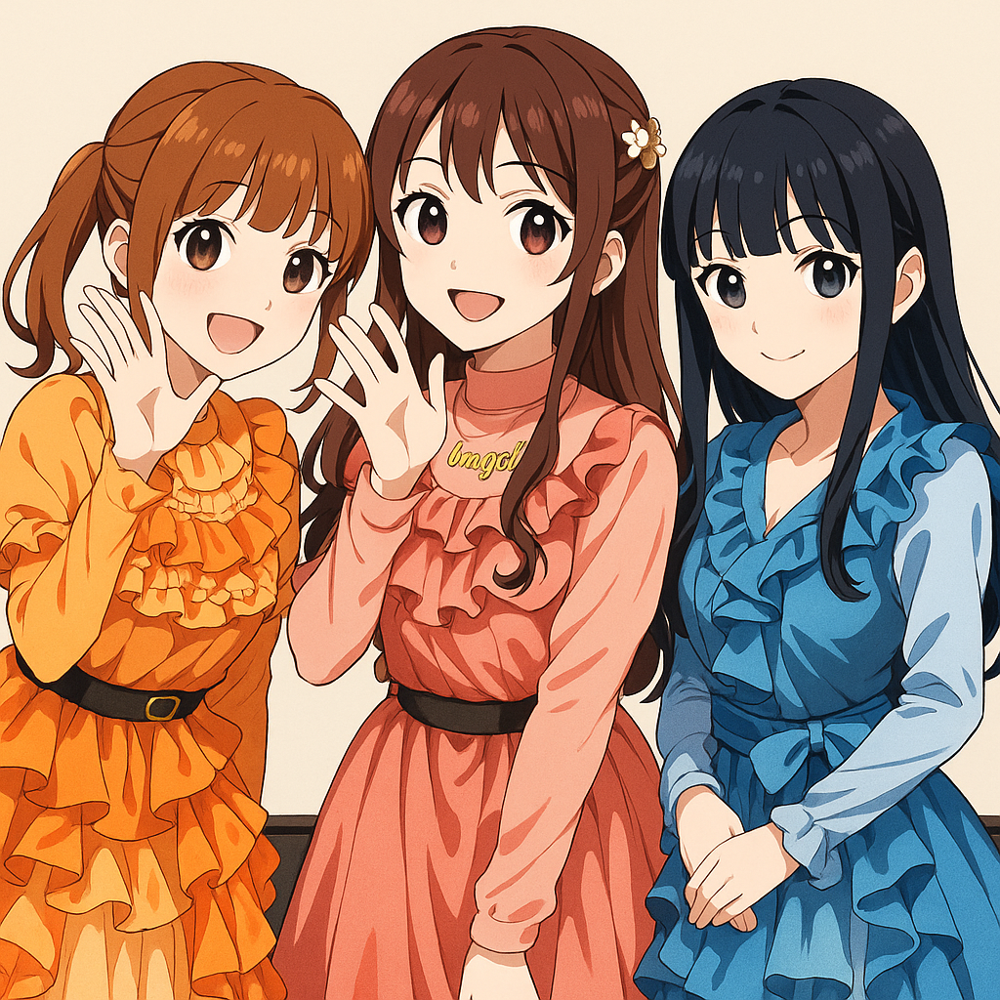
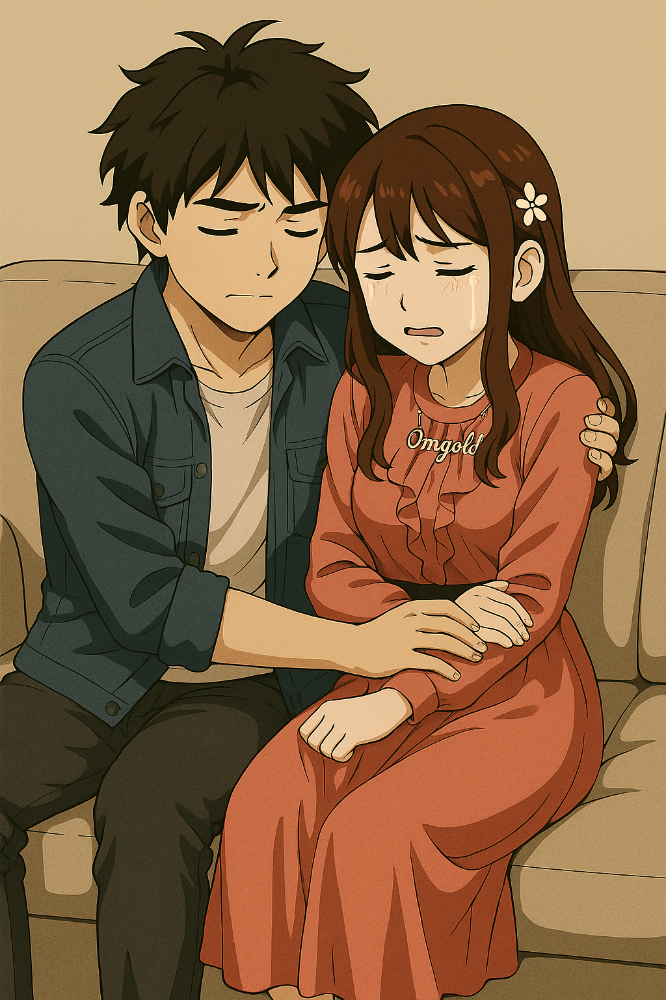
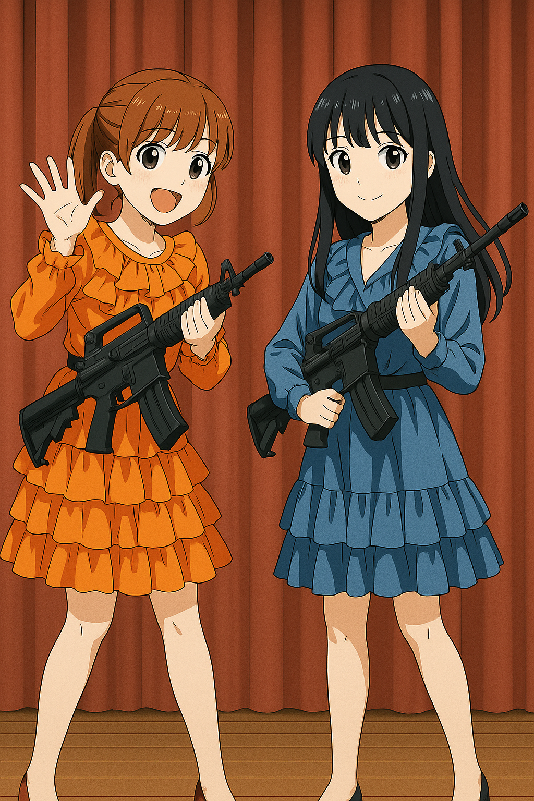
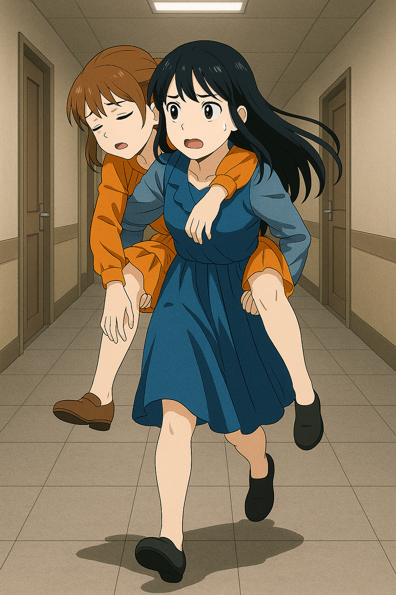
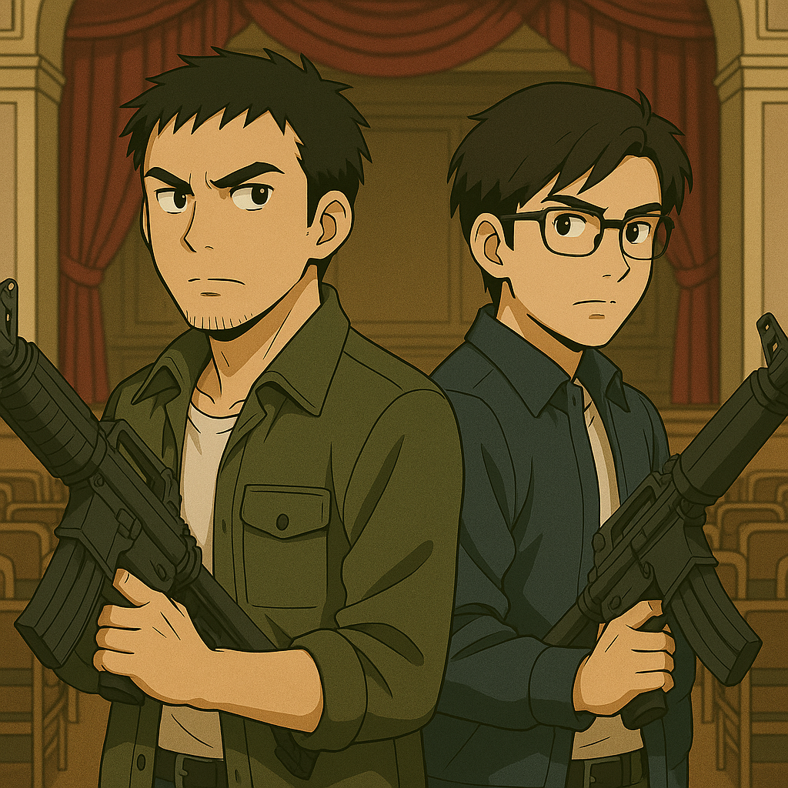

## 第三章：鲜血
为期两周的访学过去了一半，调查却像撞上了一堵透明的墙，毫无进展。而演唱会的日子倒是来了，定在了傍晚六点，台清大礼堂举行。一大清早，环能院院长笑着送来了三张演唱会的VVIP票，第一排正中。"宫知遥小姐的一片心意，盛情邀请你们过去。"院长强调道。唐海看着票，心里五味杂陈。他依然不知道宫知遥的葫芦里卖的什么药，本想拒绝，但想到程致远脸上那种混杂着崇拜和渴望的、属于二十岁年轻人的光芒时，他把拒绝的话咽了回去。

谁知道程致远这小子竟装起了逼，从下午开始，就兴奋地把自己关在房里，说是要为晚上的"本命出场"做最帅的准备。可到了傍晚，他又突然说，有个算法的灵感来了，死活不肯出门。"唐老师！我知道那天那个脑机同步回路怎么改了，你们先去！我搞定了这个就来！"他隔着门喊，声音里透着一种唐海听不懂的兴奋。唐海没再多问，只带着沈柏言，走进了礼堂。礼堂很大，来的人却不多，第一排更是只有他俩。正当唐海觉得奇怪的时候，演唱会开始了。三位女孩分别穿着粉紫色，薄荷绿和琥珀金的表演服亮相，青春洋溢地出现在舞台上。宫知遥对着麦克风喊道，"谢谢校友们能在期末考试期间依然来支持我们，祝在场和不在场的大家学业都顺利！！"唐海这才想到现在是六月考试季，难怪人这么少。加上女孩们用了一首她们的成名作《lively》引爆全场，气场全开，歌词里满是"缤纷色彩"，"活力满满"这样的字眼，瞬间点燃了本就稀疏的观众。连唐海都发现，自己的脚尖，竟也不自觉地跟着节拍打了起来："毕竟她们也是台湾的年轻人嘛，对我们有点敌意也很正常。可能确实是我想多了吧！"曲终，灯光转暗。短暂的休息后，当舞台再次亮起时，上面却只有橘子悠和白绪寒。那个舞台的绝对中心，那个叫宫知遥的女孩，却不知所踪。

而程致远，当然没有心思去研究枯燥的算法，而是在等着一场约会。六点二十左右，房间的门被敲响了，他急忙去开门，而门口正是他朝思暮想的宫知遥。房门关上的一刻，程致远的世界里，只剩下她。她还穿着那身粉紫色的演出服，身上带着舞台灯光的余温和一丝若有若无的香气，像一个不真实的、从梦里走出来的精灵。他刚要开口，就被她紧紧拥住。她的身体在微微发抖，不是演出来的，程致远能感觉到。"我想和你说个秘密，"她靠在他的肩上，声音轻得像耳语，"一个，谁都不知道的秘密。"他们坐在沙发上。宫知遥没有开灯，任由月光透过百叶窗，照在她光裸的背上，也将房间切割成黑白两色。她的声音轻缓，带着一种决堤前的克制颤抖，"其实，我是个朝鲜人，十二岁之前一直在平壤长大。十五年前，战争毁了我的一切。一个机动兵器毁了我的家......我失去了父母和弟弟，只剩我一个人，被人从瓦砾堆里拖出来。我还记得那时我看到的天空——是紫色的，像死神在笑。"她突然停住，抬手按住了自己的太阳穴，眉头紧锁，发出一声极力压抑的、小兽般的呜咽。"头疼吗？"程致远心疼地问。她摇摇头，勉强挤出一个比哭还难看的笑容："老毛病了......十五年前留下的。我的家成了一片废墟，我自己虽然侥幸逃脱，但也受到核辐射影响，头时不时隐隐作痛。之后我的世界一片灰暗，哪怕后来辗转到了台湾被收养，哪怕进入了台清，遇到了我的姐妹们出道，我也从来没有真正地开心过。"她看着他，眼睛在黑暗中亮得惊人：“但我从来没和任何人说过这些。因为他们不懂。可我看到你的第一眼，我就知道，你不一样。你的笑容从那天起就感染了我，我不由自主被你吸引......"她忽然凑近，鼻尖几乎要碰到他的鼻尖，声音轻得像蛊惑："程致远，你明媚得像个小太阳......能不能，只照亮我一个人？你能接受.....这样残缺的我吗？"

程致远几乎没有犹豫，一把抱住眼前楚楚动人的宫知遥："当然，知遥姐，我愿意永远保护你。我希望......以后你悲伤的时候，我能陪着你，一起替你承担那份痛苦。""谢谢......"宫知遥低声回应，眼里泛着雾气，正准备吻上去。却被程致远那格外认真、格外温柔的眼神拦住了。他像是想了很久，又像只是顺着心意轻声补了一句："如果，哪天你真的痛了，想要放手也没关系，我会等你先放手。"宫知遥怔了一下，眼神轻微震动，仿佛这一刻真的犹豫了什么。然后，她慢慢伸出手，扶住他的脸，缓缓贴上他的唇。唇齿间有苦涩，也有一种像是命运弥散的味道。他们沉默地靠在一起，一切静得诡异而温柔。时间似乎失去了刻度。

忽然，她俯身贴近他的耳边，语气温柔得像在哄孩子入眠："你愿意信任我吗？完全的那种。"林致远轻轻点头，闭上眼睛。他没看见，她已将手悄然搭上自己脖子上的月牙吊坠，轻轻旋转了一下。吊坠滑开，露出银白的锋刃。她低头吻在他颈边，唇停顿了两秒，随即动作如风，左手封住他口鼻，右手一线而过。没有多余力道，没有重复动作。利刃割破了动脉，也割断了他满怀憧憬的一生。一道滚烫的弧线划破了沉默，血雾喷溅在墙上，染出一片深色的印记。很快，程致远那汹涌的搏动归于平息，只剩最后一滴殷红，像一颗失去温度的宝石，沿着宫知遥修长的指尖，缓缓滑落，最终无声地滴下。她抱着他的身体轻声说："谢谢你，让我知道，我不是完全无法被爱。"然后，她起身，神色平静，取走了沙发旁的那台手提电脑。

演唱会的灯光晃动着，电子节拍一浪接一浪地砸在礼堂的墙面。唐海靠在椅背上，有些失神。整整一个多星期调查无果，他明显觉得，自己的耐心快要耗尽了。事实上，这几天以来，他一度怀疑自己是不是老了，反应慢了。而台上的音乐似乎让他回到了学生时代，那个看着赵以宁脸红、与林砚斗嘴的年纪。可已经过去了五六首歌，主唱宫知遥却依旧没有回到舞台。这两天他被迫听着程致远的叨叨，不得不对这支女团以及背后的历史有所了解。这个组合的成员来来去去，最终才好不容易成型，而这多亏了宫知遥的坚守。宫知遥是粉丝们公认的，整支乐队的灵魂，也理所因当的，是整个乐队人气最高的，拥有最多的粉丝。因此，最受欢迎的主唱只唱了一首就连续缺席那么久，这种情况实在不寻常。他眉头微皱，习惯性地启动脑机接口，精神感应的探针扫过全场——却只捕捉到一片死寂。不是放松的安静，而是一种被刻意清空、了无生息的空白，仿佛他附近的听众们，都没有任何情绪。"沈柏言。"他低声唤。年轻的研究生坐在旁边，神情也有些迷惑，"老师，她们主唱是不是出事了？"唐海没有回答，只是顺手理了理袖口。那是他下意识的信号——准备行动。

就在下一首曲目结束，灯光渐暗的瞬间，橘子悠和白绪寒动作一致，从舞台一侧的放水台与化妆品工具箱下，抽出了两把机枪。动作干净利落，显然不是临时起意。空气仿佛在那一刻凝固了。学生席上爆发出低声惊呼，逐渐汇成一片骚动。橘子悠依旧挂着偶像标准的微笑，声音甜美却冷冽："各位同学不要慌，我们学校正被对岸的间谍入侵，已经锁定目标，请无关人士立即有序撤离。"广播同时响起，机械的女声反复播放："校园已进入应急疏散程序，请全体师生立即离开学校。"学生们开始朝出口奔去，脚步声、椅子碰撞声混杂。人潮混乱，却又在广播的"安抚"下不至于失控。这是经过心理战术设计的驱散——避免不必要的媒体曝光与恐慌。唐海刚要站起，脑海里一阵刺痛。同步波！比前几天晚宴时那次更强，带着精准的定位意图。"咔哒。"他侧头，身后那排四名学生模样的青年，臂膀已被黑布缠住，枪口稳稳指向他的腰侧。他们的步伐、武器握持、视觉锁定——不是新手，是专业的近战围控队形。沈柏言手下意识地探向外套下摆——空的。他低声苦笑："老师，我们为了坐飞机，这次没有带武器。"唐海不说话。他缓缓举起双手，冷静地扫视四名武装者。唐海脑中的精神感应探针捕捉到他们的脑波——再次确认了他们训练过的抑制模式，情绪稳定，信息屏蔽，无法读取。而台上的橘子悠，仍带着那个甜美的、训练出来的、伪装的笑容。只不过，她嘴角抿得更深了。

舞台上灯光冷冷地扫过。橘子悠与白绪寒缓缓端着枪，从台阶一步步走下，动作优雅得几乎像彩排好的舞蹈。可黑色枪口的寒光提醒着每个人——这不是舞台剧。后排的黑衣人们早已堵死了出口。他们的身影隐藏在人群散去的阴影里，像噩梦中无声的狩猎者。唐海目光扫过四周，精神感应的探针轻轻启动。一片混沌的心理噪音——压抑、恐惧、屈服的情绪覆盖了整个礼堂。这是对方有意制造的心理压迫场。过了一会儿，礼堂清空了，只剩下堵在门口的黑衣人，以及橘子悠和白绪寒，六支枪指着站在原地的唐海和沈柏言师徒。橘子悠走到走到了唐海面前，笑容完美，嘴角却在微微发颤。那不是因为紧张，而是激动，也是仇恨。这时，环能学院院长步履从后台走出，脸上带着和煦的笑容，手上拿着一把手枪。"怎么样，唐教授。"他的声音低沉且愉快，仿佛只是学术交流的延续。"在台清，找到你想要的东西了吗？"唐海一时语塞，但他知道，拖延时间，比一切更重要。院长自顾自地说下去："你们难道不奇怪，这种局势下，你们的访学申请为什么会被批准？还是你亲自带队，唐海——新朝鲜战争的元凶，MB领域的元老？"他的话像刀锋，试图刺破唐海的心理防线。听到"元凶"两个字，沈柏言不由自主地瞪大了眼睛，难以置信地看向老师，但唐海的表情冷得像钢铁。"信息。"院长伸出一根手指，点在空气中。"我们的优势，从来不是技术，不是系统，不是偶像——而是信息。"唐海轻轻开口，声音稳如山岳："现在还不开枪，说明我们手里有你们想要的东西。说说吧，是什么？"院长大笑："不愧是你！"他目光扫过唐海和沈柏言，继续说道："你是你们小组负责模块化便携式核能的专家，你身边的年轻人是超远距离精准高能粒子武器制导的核心。至于你们团队的另一位......"白绪寒抢着说道，"遥遥姐应该已经搞定他啦，从他那天看着姐姐的眼神，我们就知道，我们吃定他了！"橘子悠说道，"虽然同样的诱敌战术对你们无效，但现在你们已经在我们的控制之下了，现在请你们跟我们回房间，把你们笔记本电脑里的内容交出来吧！"

而这时候，宫知遥也不轻松。她来不及擦掉身上的血迹，打开程致远的手提。不出所料，指纹解锁，她抓着程致远的手，解开了电脑，费了一些功夫，找到了他的感应式脑机接口的全部资料。她从随身带着的包里找出发信器，把资料往台军资料中心。但这台电脑显然有些极高的自我保护意识，一旦发现有资料往不明终端传送，就每十秒要求一次指纹解锁。她把程致远的指尖按在解锁器上，随着电脑"滴"的一声再度亮起屏幕，她抬头看了一眼时间——还有11分钟。每十秒一次验证，这意味着她还要......至少面对六十七次尸体的残温。她本该麻木。但不知为何，每一次触碰，那只手就越来越像真的握住她的手，像在说："没关系，我会等你先放手。"她咬了咬牙，没有哭。事到如今，带着尸体跑已经来不及了，脖子上的月牙小刀也不可能快速切割手指，宫知遥只能守在原地，静静等待资料传送，并祈祷妹妹们可以拖住唐海二人久一点。不知为何，她忽然想起了小时候在平壤路边，抱着弟弟的手掌，一起取暖的场景。她哽咽着，轻轻说了一句没人能听见的话："......如果那天我也死掉，是不是就不会这么痛了？"

白绪寒半开玩笑地举起枪，轻轻顶了顶沈柏言："工程师大人，我们走吧。"她的语气里混杂着调皮与命令，像是在邀请舞会，而不是押送人质。第一次面对真实的武力威胁，他的手指微微颤抖，但努力装出冷静。"老师......"他低声唤道。唐海用余光制止了他，只是微微点头。沈柏言的手下意识收紧，虽然心跳在加速，但脑海里已经开始计算对方的行动路线和可能的反制方案——这正是唐海多年训练的成果。橘子悠笑了笑，笑容逐渐收敛，手微微发抖，枪口直指唐海的义肢："十五年前，就是你破坏了我们的家园，杀害了我们的家人！拜你所赐，我也成了核辐射的受害人，而每当想到你还活着，我的头就不由自主地痛了起来！"那一刻，橘子悠的心理屏蔽失效。从汹涌的脑电波中，唐海的精神感知读取到一连串混乱的情绪：恐惧、仇恨、悲伤、以及深埋的——对"活着的渴望"。唐海这才惊觉，这三个女孩，或许都是新朝鲜战争的受害人。一瞬间，他的心里涌起了一股愧疚和歉意，但他知道，这不是简简单单地道歉就能解开的。于是，唐海深吸一口气，冷冷回应："如果痛觉还在，你至少还是个会思考的人。可惜，你把思考让给了仇恨。"

橘子悠瞳孔一缩，正要反击，突然，啪！唐海的义肢释放出强电流，电光划破空气，通过枪柄下的金属片触发，击中了橘子悠的手臂和神经枢纽。她发出一声短促的惊呼，整个人瘫软下去，枪掉在地上。唐海的义肢被残余的电流包裹着，而五根手指的指尖，各有一个无法轻易看到的金属片，一旦接触，电流就可以从那里迅速释放出来。电光划破空气的瞬间，唐海已经动了。他从瘫软的橘子悠手中夺过枪，毫不迟疑。反手一记枪托，"哐"的一声砸飞了白绪寒的枪；随即枪口一转，一枪击中台上，正举枪准备射击的院长的胸口，将他撂倒在地！几乎在同一时刻，沈柏言领会了信号。他像一头蓄势已久的猎豹，猛地扑向地上的枪。起身，瞄准，扣下扳机——动作的流畅与速度，早已超越了十五年前的唐海。一串短促的点射过后，门口的四名黑衣人应声而倒，没有一句多余的声响。"干得漂亮，柏言。"唐海呼出一口带着硝烟味的浊气。但他脸上的赞许还未散去，就已凝固。他猛地转头——舞台的另一侧，那两个女孩的身影，已经消失在了阴影里。幕后的通道里，白绪寒正背着半昏迷的橘子悠向楼外跑着，橘子悠迷迷糊糊地说道，"真是，每次都给你添麻烦......"她的手虚虚地捂住腹部，刚才的电击让神经系统紊乱，但她强忍着剧痛。白绪寒则边跑边说，"小悠姐你在说什么呀！我们三姐妹本来就是一家人，什么麻不麻烦的。倒是你现在这样，还能启动那个吗？"橘子悠点了点头。

剧场里弥漫着硝烟和血腥混合的刺鼻气味。沈柏言半跪在地，熟练地从一具黑衣人尸体上卸下弹夹，头也不抬地调侃："老师，你这义肢是皮卡丘同款？十万伏特？"唐海翻了个白眼："怎么，你还想死在这儿？"沈柏言耸耸肩："倒不如说，至少不是被唱跳俱佳的偶像干掉，算我死得体面点。"唐海叹了口气，声音里透出一种疲惫："她们不是偶像。只是......被政府逼着拿枪的孩子。"他俩望着这里一地狼藉，忽然发现，台上的院长还在动——他挣扎着想要站起，却只是微微抽搐，喉咙发出低哑的喘息声。唐海眼中寒光一闪，三步并作两步冲上舞台，一把揪住他的衣领，把他从地板上拎了半坐起来。他张了张嘴，却忽然发现，自己不知道该说什么，最终只吐出一句："十五年前的新朝鲜战争......你们就是这么告诉你们的学生的？说我就是那个战争的元凶？"院长咳出一大口混着血泡的黑血，脸上却是一种解脱般的、诡异的笑意。他用尽最后一丝力气，嘴角泛着铁锈味的笑意，喉咙里挤出几个破碎的音节："你......你觉得......兵......器......有......必要......知......道......"他还没说完最后一个词，瞳孔已经开始扩散，整个人像被系统强制关机了一样，一秒内，彻底失去意识。唐海怔怔看着他倒下，那只义肢微微收紧，指节在无声中颤抖。

