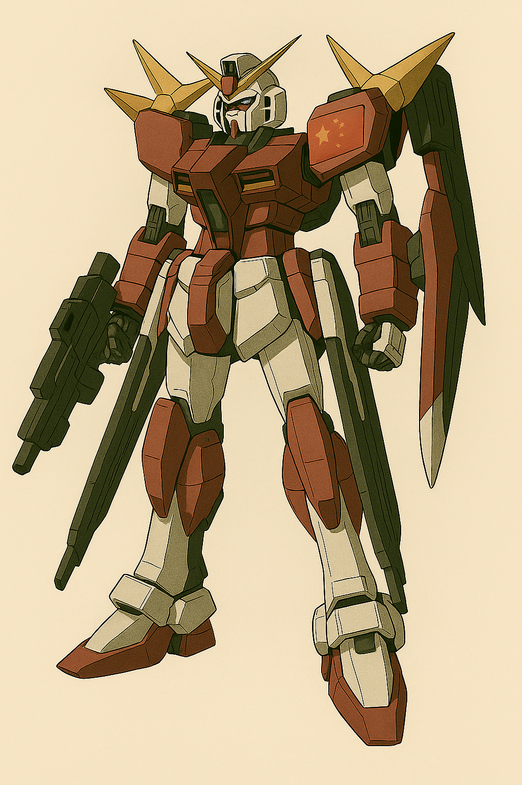

## 第七章：继承
他们的脚步终于停下。两人已经走到了格纳库深处，一台巨型MB立于光场之上，维修臂还在调整它的腿部转轴，工程灯下它的轮廓仿佛一头沉睡的野兽。林砚看了一眼那台MB，语气突然沉了下来："你知道第一战的事了吧？我带的整整一支空军王牌突击师，全灭。你学生——沈柏言——他哥，沈柏骁，也在其中。死前把战斗录像回传了。"林砚打开了一台电脑上的视频，指着屏幕，看着唐海，语气低沉："你还记得我们上次碰到的那台刺猬MB吧？这次，它又来了。但完全不一样了。"他调出一段战斗录像，投影在格纳库主控室的中空光场上。"起初没什么变化，它还是那副模样：背上一堆刺，前面五门主炮，老样子。但我们直接派了二十架战斗机上去骚扰，它居然......根本没反应。像是在等我们靠近。"画面中，二十架战机呈夹击态势接近MB，距离缩短至近战区。下一帧——那台MB的"刺猬炮"忽然如藤蔓般迅速展开，二十多门磁轨浮游炮瞬间从母机后背剥离，以极其灵活的方式悬停于空中——每一门都对准了一架战斗机的头顶。下一秒，所有浮游炮精准射击，十几架战机瞬间爆炸，残骸四散。林砚按了暂停，盯着唐海看："这不是我们上次见到的那种战术部署了。这特么是......全域火控系统。它不再靠母机单点发炮，而是像——像某种分布式猎杀系统。每一门浮游炮，都有自己的目标识别与弹道预测能力。而且反应极快，精度极高。"他补了一句，声音压得更低："就像......这些武器，能预判我们飞行员的操作习惯。我甚至一度怀疑，它在'读'我们的意图。"

唐海听到这儿，脸色也沉了下来，死死盯着录像。那台MB的移动轨迹、浮游炮的切换速度、还有那若有若无的姿态调节......"......不对劲。"他眼睛眯了起来，喃喃自语："不仅仅是火控系统升级了......连整台MB的行动方式，也发生了根本性的变化。"他调出几个特写画面，快速切换。"你看这里，悬停状态下，它几乎没有明显的推进喷口动作......却能精准前进、后撤、转向、侧滑，全程平稳。这不是传统喷射控制......是靠精神感应框架微调的——就像人在水下游泳时，靠手指、脚尖的细微动作修正方向。"林砚听得一愣一愣，但他也看出端倪。唐海继续道："我们的实验课题，就是试图让MB通过脑机接口直接读取人类的意念，将此通过脑电波接收器，将此转化为电信号，对事物做出控制。因此若将该技术应用于MB，它便可以直接通过驾驶员意念，对机体进行姿态调整和操作火控系统。程致远才刚搭完原型，他们已经实战部署了。"他咬了咬牙，低声说："这不是山寨，而是超前实现。"林砚一边听一边皱眉。"等等，老唐，你这么说——拥有这玩意的人不就跟超梦似的？想飞就飞，想用意念把人炸了就炸了？那还打个屁啊？"唐海终于被逗笑了："你想多了。脑电波只是一种信号，而非能量本身，只是能在脑电波接收器的帮助下，同步移动感应装置而已，又不是直接把脑电波化成剑气射出去，就像遥控器可以驱动几吨的车，但并不意味着遥控器输出了能量。想飞就飞，那不就跟左脚踩右脚起飞一样？真要那么牛逼，人类早超进化了。"

他话锋一转，陷入沉思："不过......哪怕如此，精神负荷也太大了。"他开始用手指比划："要控制二十多门浮游炮，持续同步感应、弹道计算；同时协调主炮、微推进姿态调节、电磁盾时序；还要进行态势感知和目标追踪......"他忽然停住，脸色一变："就算是橘子悠那样的顶尖感应者，我都不信她能一个人完成。"林砚歪着头："橘子......啥？这听起来像你撩的妹子。你小子去台湾到底是科研访问，还是参加相亲大会了？"唐海没理他，眉头紧锁，一连串神经电信号的建模结构在他脑海里闪过。林砚见状也收起玩笑，认真地问："不是一个人能搞定的话......是不是就意味着——这台MB，是两个人开的？"唐海猛然瞪大眼睛，整个人像被电击了一样。"对......对！没错！！一个控制浮游炮与精神框架，另一个负责主炮、推进与防御系统。她们配合得太默契了——这正需要她们十几年如一日地协同训练才能做到！"他一拍大腿，几乎喊出声："所以她需要白绪寒的帮助！这台MB是双人协同驾驶！这就是答案！！"林砚愣在原地，看着唐海像福尔摩斯上身一样原地觉醒，只能憋出一句："......白绪寒又他妈是谁？"

唐海便把上次直升飞机上来不及交代的细节从头到尾跟林砚说了一遍，林砚这才慢慢明白全部的来龙去脉，评价了一句，"好在你们的模块化便携式核能技术和超远距离精准制导技术没有被偷走。"唐海点点头，"是的，但实话说，我还不知道这两项技术怎么成为此次战役的突破口。便携式核能技术已经研发验证完成，可以立即投入生产实战，但这只是解决了能源供给的问题，并非攻击手段。沈柏言那边这两天我估计进步神速，但说道怎么用的话，暂时......诶，等等！"唐海赶忙调出了数据库中程致远留下的笔记和资料，仔细看了看精神感应装置接收脑电波的原理章节。他快速分析着，"脑电波是无法像光一样直接传播，必须透过某种介质。脑电波只是我们人类给起的名字，当然本身不是波动，但却有波动的一些性质。两个人之间同时有脑部活动时，脑电波之间会形成某种共振，因此感应者可以借此读取对面的心思。但非活体的精神感应装置不同，是不会产生脑电波的。虽然精神感应装置可以接收脑电波并转化为电信号输出，但前提是，脑电波要可以准确传递到装置中去。根据我们的实验，电磁波是一种很好的介质，这也是为何感应者和装置之间，能透过带电导线连接的话，就可以顺利传输信号。""这也是为何他们的MB需要那个电磁盾技术，"林砚台此时也终于能插上话，"确切地说，是电磁场发生器。因为其中展开的电磁场可以让刺猬毛在其中活动自如。"唐海用力地点点头，"没错！所以只要能确定那个电磁盾所产生的电磁场的有效直径，加以电磁场强度的临界值估算，就能知道那个浮游炮能飞多远了！同时，超远距离打击或许是一个可靠的突破口，因为再牛逼的点电场也不可能大到覆盖整个台湾海峡！"

短暂的兴奋过后，两个人又双双陷入了沉默，因为他们同时意识到了一个问题，那就是怎么才能确实地确定敌方电磁场的作用半径呢？更何况，岛上会不会有额外部署一些电磁场发生器，来强化浮游炮的作用范围，以及对方会不会有其他感应者，可以操作复数单位的浮游兵器？无论如何，这不是一个简单的估算就可以完成的，必须要有谁能亲自上阵去观察，而且不能是普通的士兵，他们终究只能用人命去换回几段录像，勉强只能用来定性，但远不能定量解析其中具体的工程参数。总而言之，必须是一个能操作战斗单位前往前线，并且有对脑机接口技术有深入了解的人。"看起来，恐怕这个星球上，能胜任此项任务的人就只有......"林砚心里冒出一个名字——一个让他既安心又不安的名字。他转头，目光不自觉地落在唐海身上。而唐海一言不发，转头看向了旁边正在接受机器手臂作业的MB。

那是一台以盘古为原型的机体，外骨骼搭建基本完毕，主武器也准备就绪，基本沿袭了盘古的装备。推进器部分则暂时留白，因为工程团队正在加紧按照唐海之前的模块化便携式核能技术的原型实施生产制造，打算装备到这台新机体上。以及内骨骼部分还在作业中，因为此前程致远主导开发的脑机接口技术虽然不完美，但一代技术原型已然就绪。就像唐海说的，只要驾驶员和精神感应装置通过导线相连接，就可以通过接收驾驶员的脑电波来传递更精确的信号，使得机体做出更灵活，近乎拟人的动作。这是早就计划好的，只不过台清比他们更进一步，已经基于这个技术，研制出了无线火控系统，而唐海清楚，这是他们无论如何都不可能在短期里做到的。

唐海理了理思路，转头看向了好友的眼光，"我知道了，我去便是。这台机体要多久准备好？以及内骨骼终端和驾驶舱的连接导线可能要改，加入我义肢里所用到的这种仿生材料......不，或许整具内骨骼中的神经网络都需要这种材料。"林砚看着他的朋友，带着一种默契又有些不舍的口吻说道，"三天。我早就预料到会走到这步，所以之前已经从我老婆那里偷偷调取了你这具新义肢的技术资料，我们的科研团队已经在跟进了，因此三天足够了。以及，这架机体的正式名称，在我们内部暂定为【盘古II式】。"林砚话音刚落，格纳库的操作台突然响起提示音，负责外骨骼装配的一名工程师连线了他们，"长官，内骨骼安装模块的生物适应导线接入实验刚才通过了初步验证，仿生丝线确实具备优秀的导通性和柔韧性，可以和现有的神经接口框架兼容。"唐海点点头，转向林砚说："我明天就进模拟舱，先让系统重新训练我的义肢反馈频率，后天进入全身同步模拟。没问题的话，第三天就直飞台湾。"林砚也点点头，但眼神里依然藏着一点犹豫："你知道这意味着什么吧？我们只是想确定敌人的数据，你只需要侦察，不需要作战。"唐海轻笑，"可你也知道，我从来不相信任务会按照原定方向发展。"林砚也笑了："你这性格那么多年都没改。真要是对上她们，你该怎么办？""我不知道。但我现在只关心一件事。"唐海顿了顿，望向盘古II式在格纳库顶灯下闪着寒光，脑子里突然闪过那天在天文台上，宫知遥留给自己的，在那轮皎洁的下弦月和星空的照耀下，跳下去时决绝的背影，"如果这真的是人类第一次精神感应战争，那我至少得弄清楚，我们究竟是在和敌人交战，还是在和我们自己创造出的欲望与执念对抗。"他也不知道自己为何突然说出这句话，而一边的林砚也迷惑地看着他。唐海笑了，"没什么。放心吧兄弟，有盘古II式在，我们会胜利的。"

