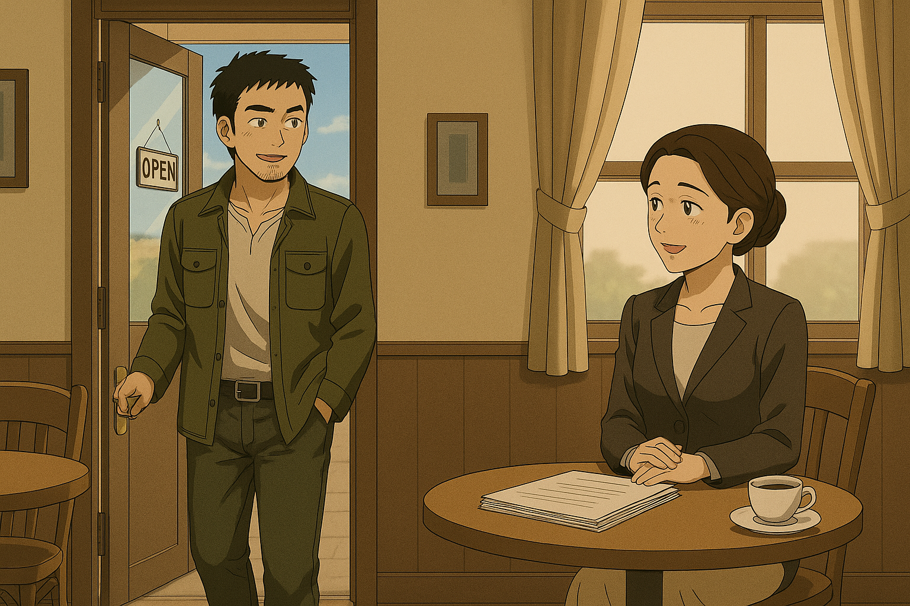
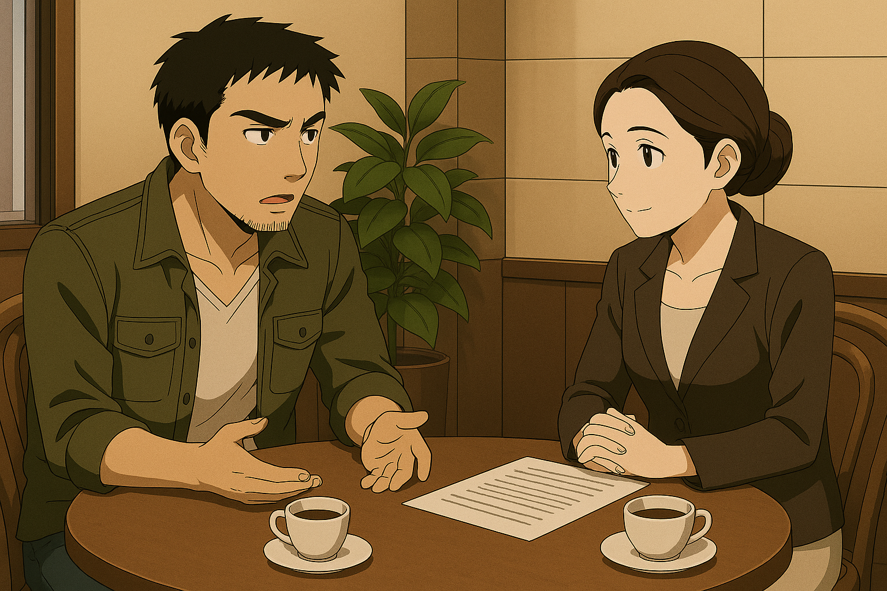
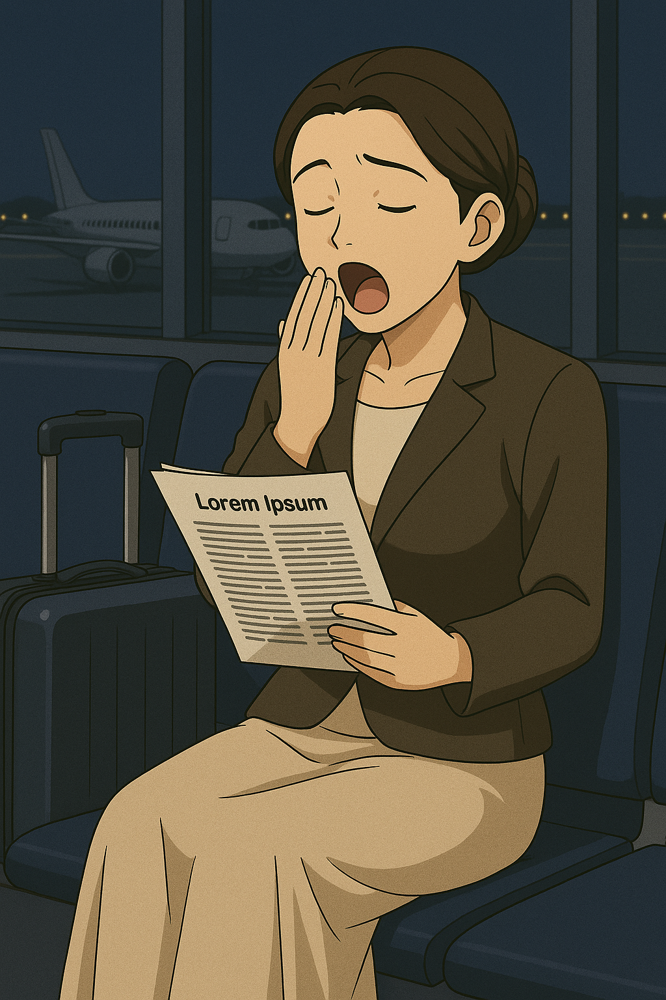

## 第八章：重逢
唐海抱着复杂的心情走出格纳库，驱车前往自己伊卡斯特的宿舍。半路上，他又打开了电台，电台里除了之前滚动播报的几条新闻外，又突然插播了一条新闻："台海局势牵动着全世界人们的关心，也引起了联合国的高度重视。昨日，联合国冲突与和平组织抵京访问，与我国法学界人士会晤，商谈当前战争局势的相关事宜以及背后的法律因素。"
唐海低声喃喃，"法律？"这个词让他不由自主地想起了她——那个始终和这两个字站在一起的人。尽管他们前不久才有过一段深谈，但他知道，很多话，他们都还没来得及说清。这时，仿佛有什么命运的回响，他的手机亮了一下。发件人：赵以宁。【我明天会抽空飞一趟上海。你有空聊聊吗？】

他们约在了第二天傍晚六点，伊卡斯特门口的咖啡馆见。时间是唐海定的，而赵以宁也立马就同意了。唐海本想着，这样也正好不影响白天自己在格纳库的工作，但事实并非如此。"唐教授，今天是您第三次录错设备参数了吧？您不要紧吧？"负责参数校对的工程师对着唐海客客气气但又显然有些不耐烦地说道。"啊......对对对，不好意思不好意思，还不是很习惯这个义肢，抱歉哈哈哈。"唐海打着哈哈，想起了这一幕似曾相识，好像前不久他才这么说过程致远。他不由得揉了揉太阳穴，是啊，虽然断断续续和赵以宁有几次视频交流，但真的面对面，还是这十五年来的第一次，确实很难专心。他定了定神，确认了所有参数输入正确，打开了模拟系统。他小心翼翼地，试图让盘古II式的左腿随着自己的大脑命令微微移动，像控制着自己的腿一样。"动了动了！唐教授，您是想试着让左腿往上抬大约7度左右吗？"下面的工程师大喊。唐海点了点头，微笑着回复道，"没错！看来效果很好！"他们又调试了其他部位，盘古II式动作流畅，可以完全根据唐海脑中的想法行动。以及第一批核能引擎也到位了，唐海忙着和工程人员校对数据，指导安装，一天下来忙得不亦乐乎，但他也一直盯着手表。时间很快到了下午5点，是时候准备出发去咖啡馆了。

伊卡斯特学院门口的那家咖啡馆坐落在老街的一角，门头很小，外墙爬满了蔷薇。唐海到的时候，天还没有完全黑。他穿着一身深灰色衬衫，头发略显凌乱，还沾着点机油的味道。他有点紧张，但又不愿承认自己紧张。他轻轻地推门而入，空气中混着浓郁的咖啡香和旧木头的味道。他第一眼就看见了坐在窗边、正低头看着几份资料的赵以宁。她和以前似乎不太一样了。唐海记得她在当老师的时候，总是留着一头温婉的齐肩中短发，喜欢穿着一套略显严肃的制服裙，眉眼间尽显温柔。而现在的她长发挽起，穿着浅驼色风衣，米色长裙，眉宇间多了几份凌厉，也多了点疲惫。岁月显然没有放过她，但也没打垮她。

她抬起头，看见唐海，脸上的神情一瞬间从专注切换成了一种淡淡的笑容，那是熟悉的、却也略带生疏的表情。她起身点点头，"好久不见，唐教授。"唐海走上前，拉开她对面的椅子坐下，刚想开口，却发现喉咙有些干。他咳了一声："的确是，好久了，赵律师。"赵以宁招了招手，服务员走过来。她熟练地点了两杯手冲，一杯是唐海当年最爱的耶加雪菲——她竟然还记得。"你还在用那套义肢？"她放下菜单，声音低而清晰，像是多年未变的课堂口吻。唐海怔了一下，摇头："不，前段时间炸了。刚刚才装上新模型，是我和季医生一起优化过的。......你还记得这些？"赵以宁轻轻苦笑了一下："你以为我真的放得下你吗？不说你本人，你们的那场台湾之行，全世界都在看。我在日内瓦的时候，联合国冲突与和平组织的人把你们所有和新朝鲜战争相关的资料都翻了个底朝天，尤其是关于盘古残骸的资料和你们当时的作战记录......他们中已经有不少人查到了你直接参与了新朝鲜战争。你知道，在他们眼里，你就是那个事件的中心。""所以，你这次回来，是为了......？"唐海问。赵以宁没有立刻回答。她的手指摩挲着杯口，眼神落在窗外逐渐亮起的街灯上："我这次回来，的确是出于工作安排。冲突法庭需要有人来厘清当前台海冲突背后的'合法性论证'。你知道的，这不是我愿意做的事......但我必须来。"唐海没有说话。他看着她，突然意识到赵以宁和他之间并不再是简单的"旧识"关系。他们站在了不同的立场上，却都扛着比个人感情更沉重的东西。"唐海。"赵以宁摩挲着手中的资料夹，终于低声开口，"你知道你现在的行动，正在被定义为战争潜在执行者之一吗？你的技术正在改变战争的结构。你说你不是军人，可你现在比军人还要深地参与进去。你有没有想过......你有没有后悔？"这句话如一块沉石投入湖中，打破了两人之间的短暂平静。唐海看着杯中的黑咖啡，那是他曾无数次在实验室通宵时的伙伴。以及，他想起了在高丽饭店里，那杯苦涩的耶加雪菲，只不过，那时候坐在自己身边的，是苏贞花。他摇了摇头："后不后悔......我觉得并不重要。只是......我也还不知道，这一切会带我们走向哪里。"赵以宁没有追问。她只是缓缓把手里的资料合上，然后说："那就告诉我，你还记不记得我们曾经讨论过的那个问题——技术的发展，究竟是服务于人，还是替人决定命运？"

唐海抬头与她四目相对，久久没有说话。之后，唐海眼神落在赵以宁合上的资料上，声音低了下来，带着一种连他自己都无法分辨的情绪："我不知道技术到底能不能决定别人的命运......"他停了一下，又开口，语气像是从胸腔深处压出来的："但我知道，我的学生，被他们割开了颈动脉，血溅满了整个房间。我们的王牌机师，仅仅一战，就全军覆没。"他终于抬起头看向赵以宁，眼中没有怒火，只有压抑的痛："如果这一切注定要发生，那我至少希望，我爱的人们......不是白死的。"

赵以宁听完，没有立刻回应，只是盯着他看了几秒，忽然轻轻地笑了，眼神中却带着一丝怜悯。"唐海......聪明如你，应该早就开始反问你自己了吧？"她将手指轻轻扣在桌面上，语气平稳却如针刺入心："你口中的敌人......他们真的想要夺走你爱的人吗？还是说，如果不是你们主动入侵，他们根本就不需要拿起武器自卫？"她顿了顿，语气微微一低："你说你不希望你爱的人白死......可你有没有想过，他们......也曾失去过他们所爱的人？你们手上的鲜血，就那么干净吗？"咖啡厅陷入片刻安静。窗外夜色渐深，光影在两人之间斑驳地摇曳，像是现实和信仰之间那条越来越模糊的界线。

唐海没有立刻回应。他低下头，看着自己的右手——那只用仿生材料重建的义肢，手指轻微地颤了颤。"......我当然想过。"他的声音低哑，像是从嗓子深处挤出来的，"如果这是一场'你死我活'的战争，我至少还能安慰自己，是战争本身逼得我们成了刽子手。"他抬起头，眼神复杂而疲惫地看向赵以宁："可偏偏不是。偏偏每一步......都是我亲自选择的。"他苦笑了一下，"我学生的死，不是为了守护什么伟大目标。他只是跟着我，走上了一条他根本没机会拒绝的路。而对面......那些人，我甚至看不清他们是敌人，还是另一个我。这才是荒唐的地方。"

他闭上眼睛，像是在极力压制心中某种情绪。但话语仍止不住地涌了出来——"最荒唐的是，我甚至面对他们都没有杀意。杀害我学生的凶手就近在咫尺地正对着我的枪口，我却迟迟无法扣下扳机。但......可能是因为被软禁怕了，由于我的软弱无能，想要苟活下去，不得不违背自己的意志，遵从体制的要求，日复一日地做着我所抗拒的研究，一步一步地踏上这条不归之路。你能理解这种感受吗，宁宁姐？"他声音压得更低，嗓音微颤，有些哽咽，像是个做错了事的孩子："我能学通十八个领域的知识，我能教书育人，我甚至能带兵打仗。但是——"他猛地偏过头去，没有让赵以宁看到他眼角的湿意。"我保护不了我的信念，保护不了我的学生，保护不了我的兄弟，保护不了我想拯救的人和城......"他停顿了一下，声音几不可闻地补上一句："......也保护不了你，甚至还要你为了我，走到那一步。"沉默几秒后，他仿佛终于耗尽了力气，轻声道："我想，这可能就是所谓的命运的诅咒吧？"

赵以宁看着眼前的男人，想到了十五年前在高级法官房间里那屈辱的一夜，也不由得湿润了眼眶，不愿意去细想。但她知道，唐海那看似自白的叙述，实际上是在对自己提问，希望她能解答自己内心深处的困惑，而她必须回答。于是赵以宁理了理情绪，抬起头认真地说:"是的，或许这是一种命运的诅咒。但是，很可贵的是，作为体制里的一员，你依然没有放弃独立思考，你意识到了国家叙事的荒谬之处。这确实是你痛苦的根源，但也是你真正的力量的来源。并且，"赵以宁搅动着眼前的杨枝甘露，一字一顿地说道，"你有枪。我相信很多人都有改变这个系统的志向和决心，故事书里也告诉孩子们，勇气就是一切。但我们成年人都知道，没有真正的武器，什么都是空谈。但是，你恰恰是掌握着最强的枪的那个人。"正如每次和赵以宁的对话一样，唐海的心里就像被平静的水面被投入一块巨石。他难以置信地看着赵以宁，而她的话在继续，"是的，你会说和整个体制比，你一个人的力量微不足道。但你或许也意识到了，你所拥有的力量，可能已经超过了体制可以应对的上限。"最后，赵以宁像是开玩笑地说，"毕竟你在很多历史书里，是可以一机单刷全球前40强的武装力量的存在呢！但是......"唐海抬起头，看到赵以宁似乎有些不好意思地摇摇头，没有继续说下去。

唐海没有立刻回应。他只是静静地看着赵以宁，眼神深处翻涌着什么，像是回忆，也像是挣扎。脑海中，一张张脸在黑暗中浮现——程致远倒在血泊中的侧影，苏贞花冲向核弹的MB，宫知遥那道最后的背影，沈柏骁燃烧的战机......还有他自己，在柳京塔顶仓皇逃窜，转身跳上盘古时的模糊轮廓。也许她说得对。他早已不只是那个被系统拣选和驱使的齿轮。他，有枪。他也许，真的可以选一条不一样的路。

这时候，一边的服务生不合时宜地走了上来，"对不起，先生，女士，我们这里要打烊了，所以你们看能不能......？"赵以宁站了起来，从包里拿出一张纸钞放在桌上，微笑着对唐海说，"我也确实得去机场了，今晚11点飞。唐教授，很高兴能再次能和你聊天，祝你一切顺利！"唐海也站起了身，"也很高兴能再次见到你，赵律师，希望你一路平安。"望着逐渐远去的赵以宁的背影，唐海突然有种说不出的失落。他决定无视季思澜的警告，为了自己动用一次感应力，搞清楚那个他困惑已久的问题："过去了十五年了，赵以宁到底还爱不爱我？"他发现，和读取即时记忆不同，若想要读取长期的记忆，需要他高度专注的注意力，就像在一个嘈杂的环境中，只有仔细听，才能分辨出自己想要的声音。唐海轻轻吸了一口气，集中精神，对着赵以宁感应了起来，静静地等着结果。在大量的记忆碎片中，他看到了，这十五年来，赵以宁为了国际和平到处奔波。她去过阿富汗，面对塔利班，冷静地为了当地妇女的利益据理力争；她也去过苏丹，在南北两国的边境线之间调停不同教派之间的矛盾；她还去过俄乌战场前线，在随时会出现的俄罗斯无人机的炮口下，为了饱战乱之苦的乌克兰人民送水送食物送医疗资源。她似乎一直在奔波，唐海几乎读不出她在爱情方面有任何记忆。这一刻，他对赵以宁升起了一股无比敬重的感觉，为自己还在纠结她是否爱他而羞愧。但又在记忆流的最深处，他读到了一个片段：当赵以宁从前线带着满身疲惫，回到了自己在日内瓦阔别已久的家时，拿起落满灰尘的书桌上，她和唐海在伊卡斯特校园沙滩上，林砚为他们拍的那张合照，轻轻地擦了擦相框上的灰。唐海有些释然，当他慢慢放松注意力时，他感知到了她最新鲜的记忆，那是她知道，今天组织给她订的机票是今晚6点，她正无奈地想着，只能在候机室里读论文熬个通宵，坐凌晨4点的红眼航班回京。以及，还有她刚才没有说完的话："......但是你在我心里，始终是那个背着书包，认真却总不敢抬头回答问题的理工男。希望你，别忘了这一点。"

赵以宁当然是不知道这一切的，她打开门，出去了，而记忆流也慢慢消失了。这时，刚才那个服务生又打断了唐海的思绪，"额，对不起先生，本店已经很久都没有用现金柜了，能否麻烦您用移动支付结个账？"唐海捂着有些晕晕乎乎的脑袋，但似乎突然释然了，笑着说，"是啊，支付现金的时代早就过去了不是吗？"他拿出了手机付了账。走出店门后，唐海坐上车，不由自主地在导航上输入了去机场的路，但犹豫了半晌，终究擦掉了输入框里的文字，把车往宿舍停车场开去。

