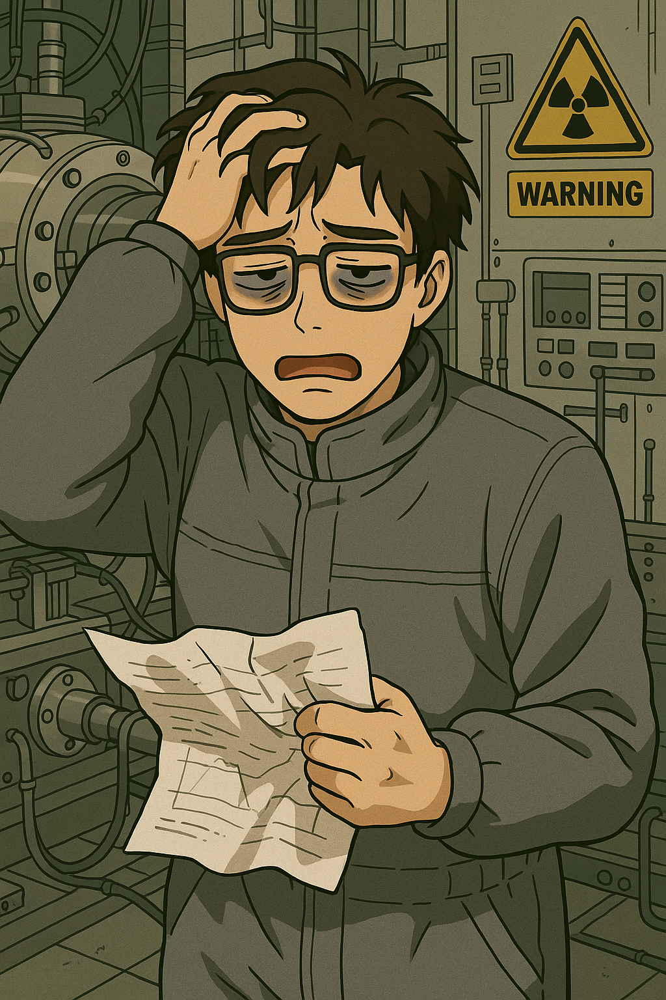
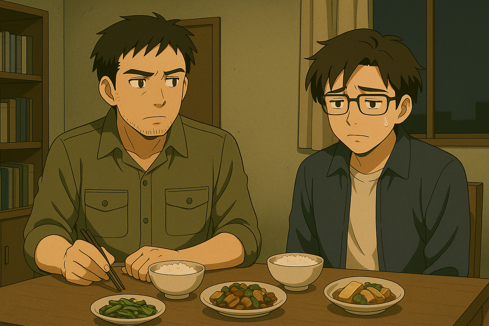
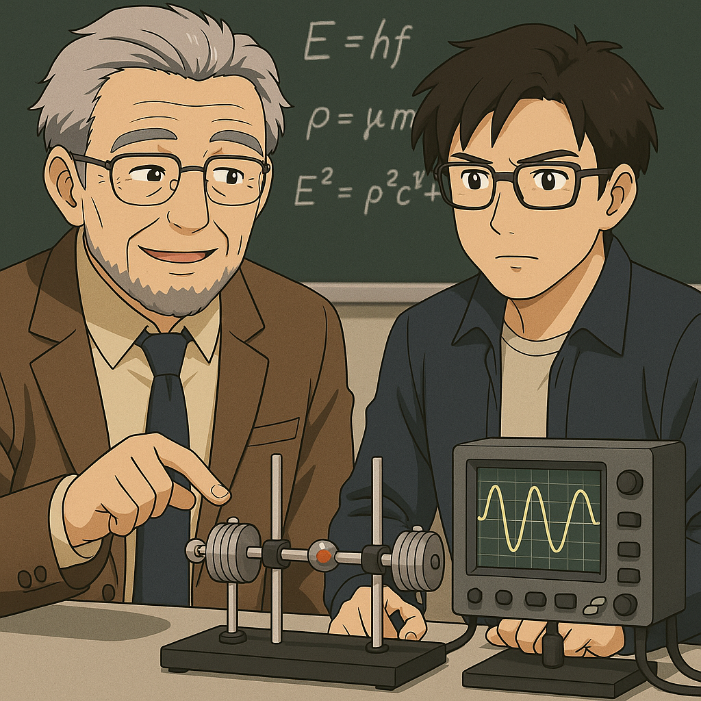
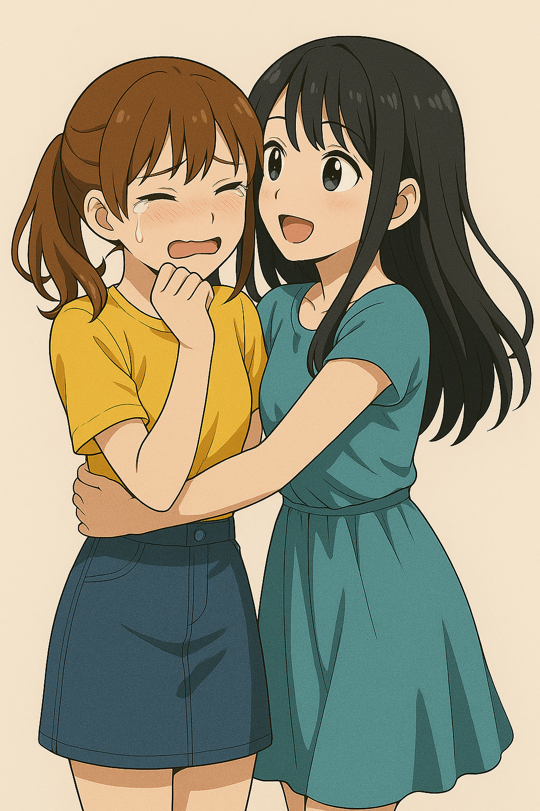
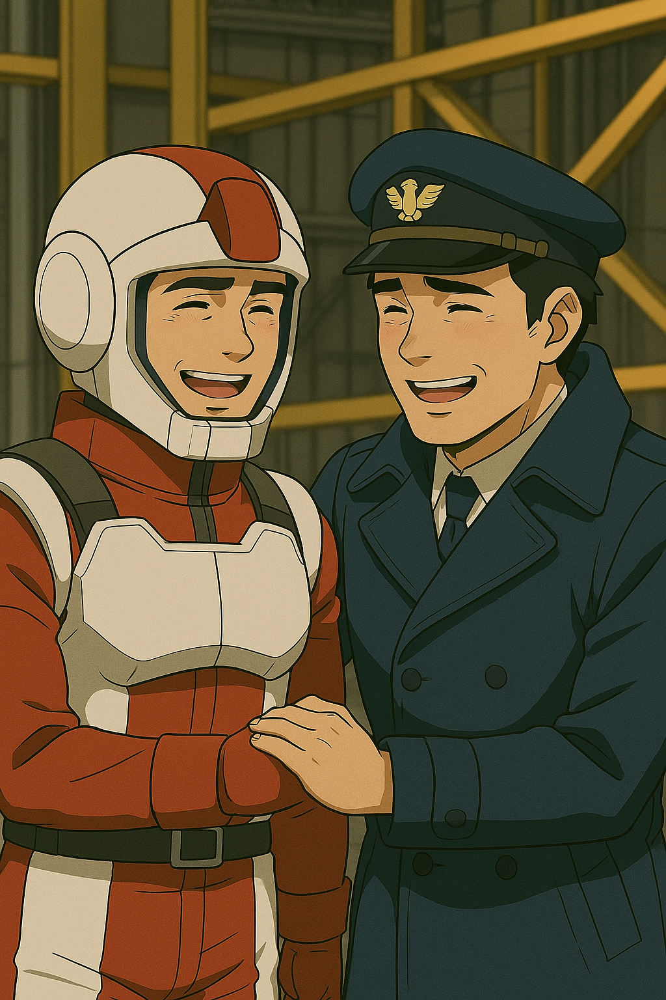

## 第九章：知己
第二天，唐海一早就来到了格纳库。他上午依旧帮助协调和安装能源模块，而他发现这台机体的设计师似乎特别懂他心中的战斗美学，为了把盘古II式的机动性提高到极限，在四肢，两腰和主推进器这里都留下了大小不一的能源包嵌入口。而核动力反应堆一旦装载了核燃料，全功率燃烧的周期是一周年，几乎可以被视作是永久动力。同时，设计那么多能源口的另一个原因是，如果一个发动机过载，那即使能源本身没有用尽，能源包也无法继续给发动机功能，不然有爆炸的危险。而有整整七个核能源包备用的前提下，盘古II式可以说是当前战场上最优秀的侦察机，可以以超高速和高度灵活的姿势在战场上进出自如；也可以是永不停歇的恐怖杀器，人肉战术和拖延战术在它的面前犹如儿戏，成为敌人心中挥之不去的，最可怕的那个噩梦。

随着安装进度的不断推进，盘古II式也愈加完整地出现在了唐海的面前，整体基调从试验机的蓝紫色改为了象征着中国的红色，而由于精神力感应装置的加入，左手臂也在原来单纯的剑盾组合的基础上，增加了一只机械手，防止右手出于种种原因无法动作。许多笨重的大型电信号传感器被拆除，整台机体的外观被进一步改进为流线型机身，如烈焰中锻造的雕塑，锋芒内敛却蕴藏着爆发的力量，仿佛一道凝固的风，在沉默中孕育着破晓的疾速。武器系统基本直接继承自盘古，而唯一的变化，是按照唐海的要求，背上的两门加特林炮被移除了，而脖颈处新安装了一支用陶瓷复合体为主的超硬材料打造的回旋镖，以备不时之需。在减轻机体重量的同时，回旋镖还能做出更灵活的打击，并且也因为是绝缘体，能几乎无视电磁盾的防御。看着这台和自己有千丝万缕的机体，唐海被勾起一种复杂的情感。"好久不见了，老朋友......"他自言自语道。下午之前安装就彻底完成了，而唐海决定在立刻试驾一下。随着控制台的倒计时结束，格纳库顶上的暗门缓缓打开。唐海戴上连满导线的头盔，一脚踩下引擎连接器，盘古II式犹如史前那开天劈地的巨人，直往天空插去。机体的机动性和速度都比想象中还要好，在唐海义肢上的感应器的加持下，操作起来感觉像是操作自己的手脚那样自如。唐海往深山里飞去，正好路过一大片樟树，机体的翅膀擦过树顶，刮下不少树叶，犹如十五年前他从柳京饭店楼顶，一跃而下跳上盘古时，卧倒飞行着的机体主喷射器刮过平壤的柳树那样。深山里的试验进行了40多分钟，唐海试验过了各种姿势，预想了无数种遇敌的可能性，都被盘古II式绝对的机动性给压制住了。为了不轻易打草惊蛇，他没有试验火力，但他实在没理由相信，火控系统会运作得不好。把机体交还给整备班的工程师时，唐海坐着升降梯从驾驶舱下来。他抬头看了看盘古II式的头部，一如一尊面无表情的杀神。"真的要用这么恐怖的东西去杀人吗......？"唐海不由自主地想着这个问题。

从格纳库出来时很早，才下午3点半，唐海决定回实验室看看沈柏言怎么样了。回到实验室时，唐海大吃一惊。实验室里的景象和他几天前看到的一模一样，散乱的泡面盒和能量饮料罐，永远都运行不完的高能计算机似乎在发出无声的抗议。桌上的泡面盒子里还有些汤，表面上浮着一层蛆。唐海心里顿感不妙，几乎是一路狂奔地冲向高能物理实验室。到了三楼，他除了听到和上次一样的电流和爆炸的声音外，还听到几声断断续续的嘶哑的哀嚎，"为什么！为什么就是打不准！！！卧槽尼玛勒戈壁啊，到底问题出在哪儿啊！！！！"门口还聚集着几个保安，其中一个还拿着一瓶压缩空气枪。唐海冲了过去，"怎么回事！"保安转过头来说，"你是老师吗？赶紧来劝劝这里面的学生吧，他整整三天没出来了，没日没夜地在搞实验，还锁门不让人进！""是啊，"另一个保安接上说，"听这里工作的老师说，这个实验室的装置非常危险，在里面呆那么久，别说这个人，一不小心整栋楼都会被扬了！"唐海赶紧抢过拿瓶压缩空气，把喷嘴对着门锁。一个小保安赶紧想上前阻拦，"卧槽你谁啊？你真把这儿强行破坏了，谁负责啊？！"唐海猛地把他往后推倒，"你们都离得远点！这里很危险！以及老子是环境学院唐海！"砰的一声，门锁被炸开了，唐海一脚踹开实验室大门，就看到了已经狼狈得不成人样的沈柏言。"你给我出来！"唐海大吼一声，一个箭步冲过去，像拎着小鸡一样地把沈柏言往门口拎去，同时不忘通过电门切断了实验室的电源，整个实验室这才安静了下来。没有了电火花四溅的实验室，看起来就像一地狼藉的废墟，犹如台清那个被轰倒的宿舍楼。

唐海拎着沈柏言往他的宿舍楼走，一路上沈柏言像疯了一样地吼着，"你给我放手！让我回实验室！！"唐海则更是带着怒火吼道，"你他妈的不是想尽快把你的技术搞出来，守护我们国家吗！你现在疯了一样的状态还能做什么？毁掉自己，毁掉整栋物理楼，你他妈还想守护什么？？"沈柏言几乎是带着唐海平生听过的最绝望的哭腔吼道，"我什么都守护不了！我连我哥哥都守不住，我就是个垃圾！！！呜呜呜，哥哥......"他一遍遍地喊着哥哥，嘶吼的声音越来越轻，头也垂了下去。唐海把沈柏言拖到了他的宿舍床上，沈柏言一睡不起。唐海轻轻地叹了口气，给他脱了鞋，盖上被子，在他旁边在军科院内部查阅了一些光学相关的最新科研进展。过了三个多小时，沈柏言突然在梦里大喊一声"哥哥快逃！"后，突然从床上坐了起来，转头看到了坐在他旁边被他吓了一跳的唐海，迷迷糊糊地说道，"唐老师，这是......？"唐海无奈地叹了口气，"我的宿舍，你去洗个澡吧，换洗衣物就委屈你穿我的了。"，又顺便叫了点吃的。

晚上7点，师徒二人在唐海这件小小的单人宿舍的小桌上，摊开了一些饭菜。唐海有些心疼他消瘦的学生，"赶快吃吧。你三天没好好吃东西了吧？"见沈柏言迟迟不肯动筷子，也不肯说话，他只能换个话题，"跟我说说吧，你是打什么打不准？"沈柏言抬起头，"老师，你知道我哥哥的事情了吗？"唐海点点头，沈柏言继续说，"我看了他遗留下的战斗录像，那个恐怖的MB能全方位发射出浮游磁轨炮，哪怕目标拉开很远的距离也能追上并做出精准攻击，太可怕了。我哥就是这么被......"他的声音有些发抖，唐海拍了拍他的肩。过了一会儿，沈柏言继续说，"我虽然不知道那个浮游炮的运动原理，但我估计它再怎么牛逼也不可能直接飞过台湾海峡打入我国本土吧，不然他们早这么干了。因此，我就想试试运用我的课题，从超远距离用高能粒子武器进攻。你知道，我们目前高能粒子武器的基本单位是高能带电粒子，如果直接和空气分子接触，是不可能不扩散的，这也是为何高能粒子武器迟迟无法落地。所以我尝试过使用物理学院的那台直线加速器，将粒子加速至等效温度上亿开尔文的动能区间，从而电离空气中的氮气和氧气分子。理论上，这个温度远远高于空气分子所需的电离能，但一旦稍微拉开几米的距离，带电粒子就会立刻作散射......"唐海点点头，打断他说，"因此你想找个好办法，让带电粒子能聚成一束，几乎不扩散地击中目标，是吧？高能粒子，说到底还是一种带电粒子束。只要粒子带电，就能用电磁场控制方向。而你是光学出身，应该知道目前NASA已经掌握了高功率激光技术，用以测量地球到月球之间的距离吧？从地球到月球38.4万公里的距离，光斑直径只有约384米。而光虽然是电磁波，本身不能直接拖着粒子走，但高功率激光能在空气中电离出一条等离子通道，粒子就可以借助这条导电通道，再由电场引导，像闪电那样定向推进。所以只要想办法用激光诱导，通过激光电离空气形成等离子通道，这样带电粒子就只能沿着激光的路径做定向运动，就很有机会打得中。"沈柏言点了点头，"这个方法我确实也想到了，但是我尝试过用激光，且不论物理学院那边最先进的激光发生器的聚焦强度也不够，而且粒子完全没有按照轨道飞行的迹象......"唐海打断了他："那是因为实验室常用的普通的粒子发生器，在结构设计上通常只能产生单一极性的带电粒子，也就是只有带正电荷离子或者带负电荷的电子。而一旦单极带电粒子束的密度高于库仑爆炸阈值，粒子就会不可避免地发散。因此，你需要的是两台不同的粒子发生器，产生'准中性'的粒子束——即正电荷与负电荷通过一定比例调配的粒子束，或许就可以降低粒子间的排斥力。"沈柏言抬起了头，但目光很快又黯淡了："唐老师，你说的这个理论确实我没有考虑到。但是，问题还是在于诱导用的激光。我们哪儿来的资金和厂商搞这么精密的仪器啊，更何况即使有了这样的激光发生器，你说的也只是理论，距离工程应用......"唐海摇了摇头，"你应该知道我们国家搞自研光刻机很多年了，现在已经有了很多成果，精密光学仪器制造技术其实我们应该已经掌握了。虽然和NASA可能比不了，但小小的台湾海峡，跨过去我估计是没问题的。这项研究中，其中一位核心科学家是我们机械学院的泰斗级教授，我和他颇有些私交，到时候我请他来指导你一下。"沈柏言眼里突然闪出了光，唐海则指着电脑继续道，"以及我刚才搜了，这位教授恰好在研究激光诱导带电粒子的装置，已有些小型装置验证成功，发表在我们军部的《工程学报》上了。我没理解错的话，这套系统的核心是一个高功率飞秒激光阵列，用来在空气中形成稳定的电离通道结构。系统会在微秒级时间内周期性刷新通道，利用脉冲磁场维持导电状态。这样高能带电粒子就能被压入通道，沿着通道飞行，并进一步撕裂空气分子了。这方面，你肯定比我懂——我已经把论文发你邮箱了，到时候你也可以向他请教。"最后，唐海轻轻地拍了拍沈柏言的肩膀："事实上，我觉得你的思路已经非常接近了。空气分子在大约一万开尔文左右就开始显著电离，而我所研究的大型核聚变装置，可以轻易产生等效于百万开尔文级别的强度的能量。也就是说，只要粒子发生器直接与核电厂相连，超远距离打击，是完全有机会实现的。"沈柏言激动得双手发抖，不知道说什么好，最后流着眼泪用颤抖的声音说道，"唐，唐老师，你真的不知道你的帮助对我有多重要，我实在不知道怎么做些什么来感谢你......要不，我把光电学院最漂亮的单身女老师介绍给你当老婆？我在她的课上成绩很好，她可喜欢我了！"唐海看他又有心情开玩笑了，也就跟着笑了。他摆摆手，装作不经意但带了点严肃地问道，"我只要你回答我一个问题，你就这么渴望祖国统一？这次我们去台湾，看到我们的人都是客气中带着疏离。你有没有想过，或许他们内心并不想回归我们口中的祖国？"沈柏言抬起头，用唐海不曾听过的，冷静但坚定的口吻说道，"跟你说句实话，我根本不在乎这件事，大家爱呆哪儿呆哪儿。但是，我一定要替我的哥哥，不，是替所有死得不明不白的人，找一个答案！"唐海看着他，没有说话。他顿了顿，似乎是为了让唐海安心似的，又补充了一句，"我讨厌战争，打从心底里讨厌。不论是因为我哥，致远，还是因为你的教导，我不希望再有人死了。因此我认为，只有用绝对压制的力量速战速决，才能真正减少无谓的伤亡。"唐海一时语塞，不知从何劝起，只能默默给沈柏言的碗里添了口菜，"快吃吧，菜都快冷了。"

晚饭过后，沈柏言辞别了唐海，而唐海则忙不迭地给机械学院打电话，"你好，我找精密仪器实验室的顾崇渊院士......诶顾院士您好！我是环境学院唐海啊，哈哈哈哈是我，那时候听了您的课，平时作业做得都不错，但最后期末考试没来导致挂科的那个，您有印象吗？啊哈哈哈哈您想起来啦？不是，当年我是怕学分修得太多超限，才不得不出此下策。您听我说，这次来打扰您是为了......"唐海一五一十地把沈柏言的事告诉了顾崇渊，而顾崇渊确实是一个拥有热烈的爱国主义情怀的老一辈无产阶级革命家，一听说是烈士的弟弟需要帮忙，义不容辞地答应了下来。此后，唐海又动用了他在早年参与核反应研究时积累下的人脉，成功联系上福清核电站的科研负责人。对方在得知这是面向对台作战的战略级部署后，当即拍板支持，并连夜调配技术团队，开辟出一条独立的供能线路。这条线路集成了高压脉冲供能装置、超导传输电缆以及多级中继转换系统，具备高速充电与瞬时放电能力，能够在需要时将整个核电站的输出功率精准地远距离输送至粒子束武器系统本体，实现低损耗、高响应、战术级别的远程供能保障。做完这一切后，唐海悬着的心稍稍放下来了一些，但又突然提了起来。明天，就是他出击的日子。

晚上，他睡得不太踏实，好不容易迷迷糊糊睡着了，却做了一个梦。他梦到他回到了平壤的街道，昏暗的路灯下似乎站着一个女孩，一头明媚的金发，背对着他。"Звезда！"他叫出了这个魂牵梦萦的名字。苏贞花转过来看着他，莞尔一笑，"你似乎来到了不该来的地方呢！"唐海一脸愧疚地看着她，"对不起Звезда，我没能救下你，倒是害的你为了我牺牲了你自己，而最后我什么都没改变......"苏贞花摇了摇头，"不哦，唐海。你是那个给了我真正自由的人，你让我第一次拥有了为自己选择的意识，让我知道了，原来我们有选择怎么活的权利！"唐海刚想说什么，却听到女孩换了一副冰冷的口吻，"所以，你又要来干涉我们了吗？"唐海大吃一惊，不知何时，苏贞花的脸变成了宫知遥，背景也瞬间转换成了台清宿舍的天文台，她正愤怒地盯着唐海，"再这样战斗下去，对你我到底有什么好处？""我不知道，我真的不知道！"唐海有些失控地喊道，"但是我的朋友们，包括被你杀死的程致远，真的就白死了吗？""唐海，衡量生命价值的尺度，从不该只是生与死的结果。"这次声音换成了赵以宁，恬静地坐在伊卡斯特门口的咖啡馆的椅子上，而唐海正对着她温柔而坚定的眼神。她接着说，"但我知道一件事，从仇恨的土壤里结出来的花朵，一定不是美丽的。"唐海失语，只能像着了魔一样地嘟囔着，"不，不是的，不是这样的，不应该是这样的，不，不！"他从梦里惊醒了，摸了摸发晕的脑袋，窗外天色还灰蒙蒙，风吹着窗帘，像梦境的残响还在耳边摇曳。他一看桌上的时钟，早上7点30，是时候出发了。

而另一边，时间回到前一夜晚上，橘子悠坐在格纳库里的一间驾驶员休息室内，也在经历着不安。虽然几天前的战斗姐妹俩所驾驶的援星II式，也就是大家口中的刺猬MB，在第一次出战就大获全胜，但橘子悠知道，这架机体对自己的精神力的消耗非比寻常，只是做了四次全浮游炮释放，自己就一度有种前所未有的晕厥感。她从一开始就感觉到，如果是在很强的电磁场里活动，那她就可以轻松不少，而反之，她就要去花额外的精力去感知可用的路径。而出于能源续航和机体本身的热负载的限制，援星不可能一直展开电磁防护罩，绝大多数时候，她得顶着弱电磁场作战。因此，她从上次的战斗回来后就不停联系军方高层，希望他们可以在台湾多个城市安装电磁场生成器，能保证援星的作战可以持久一些。但她一直收到的回复是，"往城市里安装这种大型装置属于公共事业管理相关的城建项目，需要当地居民同意才行。"又有哪里的民众会希望花自己交的税，自己家门口装个巨大的有辐射的铁疙瘩？为了这件事，她两天没好好休息了，"这就是所谓民主吗，为了维护表面上多数人的便利，就可以毫不犹豫让渡自己作为少数人的权益，哪怕是自己的性命？"橘子悠有些伤心地想到。她没有把自己的情况告诉白绪寒，但白绪寒一直对她无条件信任，现在还在本地市政府那里和他们争论，要求装发生器呢。

一想到白绪寒，橘子悠的内心就又开始有些悸动。从青春期开始，她就察觉到，自己对白绪寒的情感和别人不太一样。每次在她难过，遇到困难或者在训练中遇到危险时，白绪寒就总是会出现在她身边，帮她化险为夷，就连上次在台清的舞台上也是。不过，她一直劝自己，这不过是长期以来的姐妹之情。"已经失去小遥姐了，我绝对不能再让小寒受伤......"橘子悠这么想着，实在顶不住自己的疲惫，坐在沙发上睡了过去。不知过了多久，睡梦中的橘子悠忽觉唇畔传来微妙的触感。她睁开眼，白绪寒的面容映入眼帘，手正温柔地抚在她的脸上。橘子悠吃惊地说了句，"小寒......？"白绪寒吓了一跳，连忙往后一退，只听见"哐当"一声，她手里的便当盒也掉了下来。她结结巴巴地说，"小......小悠姐，我给你带了点吃的。我，那啥，是来叫你吃饭的......"橘子悠刚想起身，白绪寒像是下了很大的决心那样，又冲过来抱住她，有些失控地说道，"小悠姐，我喜欢你！"她不等橘子悠回应，急急忙忙地、带着点委屈地说道，"我其实，我从十几岁开始就对你有好感了！但是，但是我们都是女孩子，所以不可以......而且，你明明是感应者，应该早就读出了我的心思，可你......从来都没有任何回应。所以，我想你应该没有这种想法！"这时，她才像想到什么似的，慌乱地往后退去，"小悠姐，对不起，我，我失态了。但我真的不希望你讨厌我，也不希望失去......"她话没说完，看向了橘子悠的眼睛。橘子悠泪眼朦胧，眼底却闪烁着难以掩饰的欣喜和幸福。"小悠姐？"话没说完，橘子悠就把白绪寒拥入怀里，吻向白绪寒的嘴唇。两人躺倒在了沙发上，手指扣紧彼此的背脊，唇齿之间的距离在颤动中消失。像是年少所有未说出口的心事，此刻都化作彼此间的温度。昏暗的灯光下，沙发靠背发出轻微的声响。门外的格纳库里，到处都是机器作业和人员来往的嘈杂，但房间里的时间像被封住了一样。所有的紧张、不安、想念、羞涩，在这一刻都得到了彻底的释放......事后，橘子悠看着怀里的白绪寒，深情地说，"我确实是感应者，但我从未试图感应小寒的想法。因为我觉得我不配......"说到这里，橘子悠有些难过地哽了一下，"自从我发现我能读取别人的记忆以来，所有人都怕我，远离我，说我是怪物。甚至有时候小遥姐看我的眼神，也有一丝畏惧......只有小寒你，一直、一直地陪在我身边，无条件地接纳着我的一切。"然后，她眼里又有些泛红，"因此，你对我好，我已知足。我真的不敢想太多......我真的怕，这只是我的一厢情愿，更怕你知道我对你有想法后，觉得我恶心。但现在这样，真是太好了......"两人又拥吻在了一起。那天晚上，她们在橘子悠的寝室里，相拥而眠。有心爱的人在身边，她俩感到无比安心。星光透过窗，静静洒在床上，映出两个人交叠的影子——温暖而坚定，如同风暴来临前，彼此给予的那一份永恒。

吃过早饭，当唐海马不停蹄地赶到格纳库时，盘古II式团队的整备班的所有人都已经齐齐整整等地在那里，准备迎接他的出击了。他压制住了心中的不安，微笑着对大家招手。这时候，他看到了正在忙碌的林砚，正准备打招呼，林砚就抓着他的衣领发起了飙，"你这家伙，一到没钱了要找人擦屁股就他妈来找我！"怎么回事呢？原来是昨天晚上，唐海接到了物理学院负责人的电话，斥责他和他的学生毁了高能物理实验室价值2000万的设备，让他赔偿。唐海赶着答应下来，转手给林砚打了个电话，请军部负责这笔开销。"他妈的2000万就算了，你还要我在这儿给你学生搭个实验室搞设备中试？真当我提款机呐！"唐海则嬉皮笑脸地说，"哎呀，沈柏言已经找到思路了，我还请了强力外援，保证这一波能研制成功，给咱们行动奠定胜利的基础！好不好嘛，林砚葛格，欧巴～"林砚做出要吐的动作，"恶心死了恶心死了！你还能请到啥外援？还有哪个外援能比你本人还强？""顾崇渊，机械学院的那个中工院院士，你还记得吗？""卧槽？顾头儿也是你能请得动的？？行吧行吧，你跟我来。"林砚无奈又有点佩服地摆摆手，招呼唐海走向格纳库的一边。在往那里走去的时候，唐海注意到，除了整装待发的盘古II式，在它的旁边，整备班正在紧锣密鼓地建造另一台MB。这台机体的框架已经建造完毕，和盘古II式本体有着类似的外观，腰部也收纳着两门盘古系列的招牌武器，折叠式鱼雷发射器。但是，和盘古II式代表中国红的主色调不同，这台机体浑身涂满了迷彩为基底的黄绿色。如果说盘古II式看起来像一个飞扬跋扈的刀剑客，那这台机体就是个深藏不露的狙击手。

林砚指着一间巨大的空房间说道，"呐，实验室就在这里，设备一会儿都会送来。至于中试之后的放大试验，"他又指向格纳库，"我们就没时间做了。你已经看到了，我们的整备班在按照盘古II式的骨架，搭出最终的试作机。是骡子是马，直接到战场上遛遛，机师就是沈柏言本人了。怎么样，还有什么问题吗？""没了没了，林砚葛格最好惹～"唐海开着玩笑，却发现林砚怔怔地看着自己，眼眶泛红。唐海意识到了什么，也看着他。两人相顾无言，最后还是林砚开口了，"你，可得给老子活着回来啊......"唐海故作轻松地拍了拍自己的胸脯，"你看不起谁呢？在很多历史教科书里，我可是能单刷整个朝鲜军队的存在！"林砚苦笑一声，"瞧把你能的......"不久后，唐海就坐上了盘古II式的驾驶舱。通讯机里又传来林砚的声音，"我再说一次，你只负责侦查！侦查！侦查！得到想要的数据后立马返航！""知道啦，少将，啊不是上将大人！"之后他定了定神，等待控制台倒数完毕后，对着控制台念出了，"中国人民解放军特别机动部队，唐海，盘古II式，出击！"

同时在对岸，格纳库旁的待机室里，空气安静得只剩下仪器低沉的嗡鸣。白绪寒坐立不安，反复检查着自己飞行服的接口，指尖冰凉。橘子悠则靠在沙发上，闭着眼，脸色因为精神力的过度消耗，而显得有些苍白。虽然不知道对面什么时候会再次攻过来，但她们这两天一直在警惕地等待着。突然，刺耳的警报声划破了这份宁静，红色的警示灯在房间里疯狂闪烁。系统广播里，传来了她们等待已久，却又最不愿听到的、冰冷的指令："共军那边行动了！援星II式，请准备好随时出击！"两人几乎是同时站起。白绪寒下意识地，紧紧抓住了橘子悠的手，掌心冰冷，微微发颤，千言万语，最终只化为一句："小悠姐......"橘子悠没有说话。她反手，用一种超乎寻常的、近乎用尽全身力气的拥抱，将白绪寒，紧紧地，揉进了自己的怀里。仿佛，是想用自己那同样在颤抖的、瘦弱的身体，为心爱的人，挡住整个世界即将到来的、冰冷的炮火。她将唇，印在白绪寒的额头上，声音，是前所未有的、混合了温柔与决绝的坚定："小寒，别怕。这一次......换姐姐来，保护你。"然后，她才轻轻地，吻上了她的唇。那是一个很轻，却又很重的吻。没有情欲，只有在奔赴共同的、也可能是最后的战场前，最纯粹的、相互的托付与诀别。两人分开时，额头相抵，眼中，只有彼此。再无其他。

