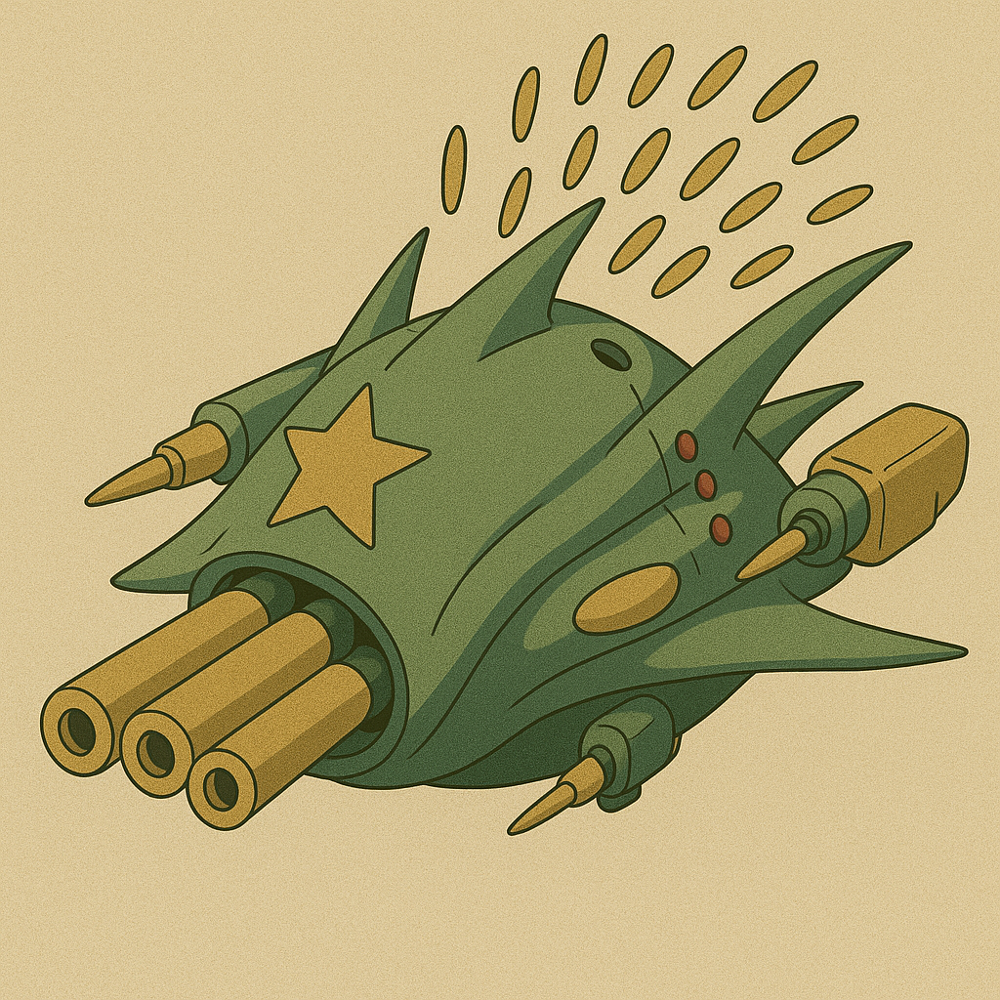
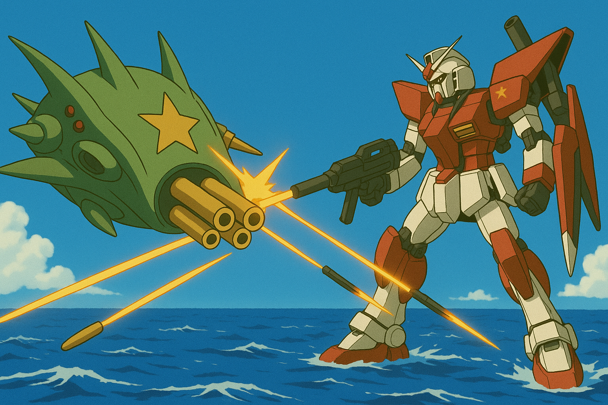
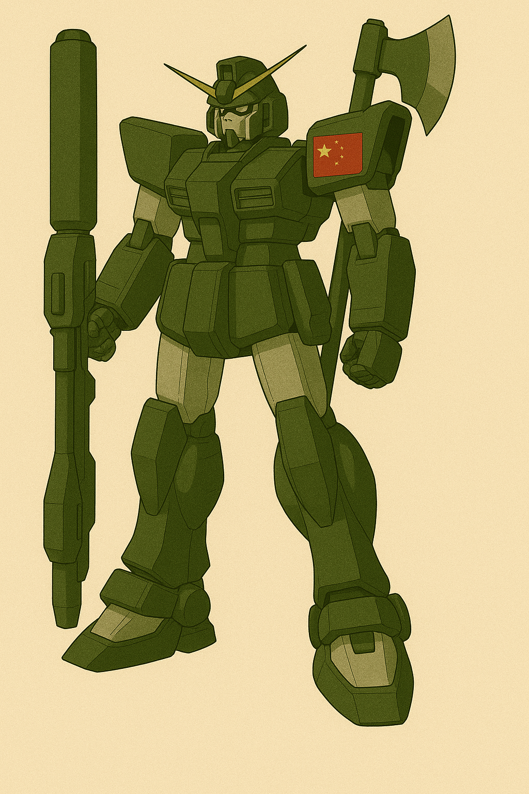
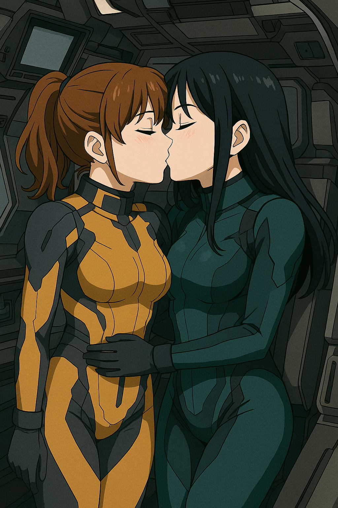
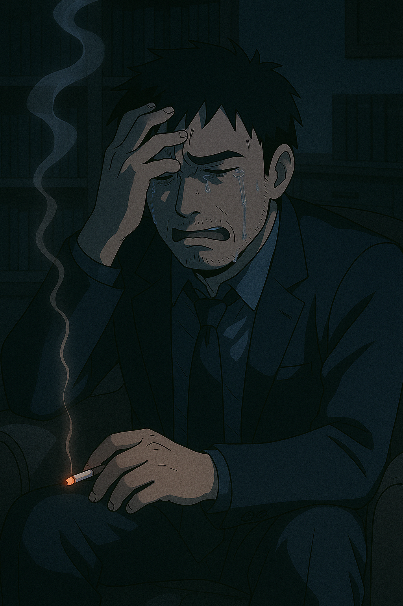

## 第十章：碰撞
盘古II式翱翔在蓝天之上。不久以后，他就看到了第一波拦截战机出现在了屏幕上。这次由于任务的性质是技术特别侦查，因此唐海要求兵部节省兵力，只让他一个人出击，全体空军海军在后面待命，因为他不希望再有人无谓地牺牲了，即使有，那也不能是自己人。"可是，谁又是自己人呢？"他在心里自问道，"我们一直说着台湾同胞，台湾同胞，那台湾人就不是自己人了吗？和台湾打岂不是成了笑话？"唐海找不到答案，但敌机确实逼近了。他打开头部机关炮的保险栓，射出了几发子弹。对面是一个三架战机组成的机群，正准备散开，却见盘古II式突然加速，霎时间就来到了机群跟前，并且机身以难以置信的身法沿着水平线旋转。只听见哐哐哐几声，几架战机的翅膀就被齐刷刷地削了下来。机上的台湾士兵不敢怠慢，齐刷刷地弹出了座椅跳伞。望着远去的盘古II式的背影，不可思议地摇了摇头，"这......什么跟什么啊......"而唐海则是看着自己仪表盘上，显示头部机关炮弹药数的120/120变成了113/120而心疼，因为他这次是单兵作战，敌人数量未知，一定要节省弹药，在遇到刺猬MB前，他发誓要省着用。不过经过几波拦截反击战后，他感觉到不太对劲。"新闻里明明说还有欧美同盟军的参与，都快到新竹了，到现在为止咋只碰上这么几十架战机呢，怎么回事......"突然，唐海从海平线那里看到了一整片黑绿色在慢慢出现，"到台湾本土了？！"他正诧异着，而他也看到了那抹让他不安的紫光，是援星II式。"来吧，是时候决一死战了，为了遥遥姐！"机舱里的白绪寒大吼着，给主炮上了膛，另一只手则放在了电磁盾展开的按钮上。"也为了我们台湾人的未来！"橘子悠则展开了精神力场。

唐海不敢怠慢，上来就发射了一颗左翼上的巡航弹，直指援星II式。不出意料地，援星II式展开了电磁盾挡下这一击，并且切换到了浮游炮全开模式，二十多门炮像刺猬毛一样唰唰唰地直指盘古II式冲来。盘古II式仰头飞去，试图拉开一定的距离，而浮游炮群在距离机身快10米的地方展开了成了一堵火幕墙，磁轨炮弹袭来。唐海一边用身法躲过，一边用头部机关炮牵制，打掉一些炮弹。接着，他又如法炮制地进行了几次佯攻，不停地微调自己和援星II式之间的距离。有一次他故意靠的很近，浮游炮就都纷纷在他身边形成一个球状包围圈，无死角地攻击它每一个角落，唐海只能操着盘古II式左手的盾牌，往一个方向强顶过去，用盾牌换来了一条命。又有一次他故意绕开很远，浮游炮就干脆不过来了，静静地等待他下一波攻击。"明白了，所以浮游炮的运动轨迹半径大概200米。"唐海默默估算着，"虽然不能确定一定以及肯定对方是不是在故意隐藏实力，但如果驾驶员还是那两个小女孩的话，她们的手段我估计不至于......"并反手把这个结论发还给了控制台。而援星II式的机舱里，两个女孩子确实在焦灼地攻击着，已经进行了好几次攻击，这一轮的电磁盾也差不多要到了冷却的时间，对面的人型MB却毫发无损。"解放军的MB是怪物吗？？"白绪寒忍不住骂道，而橘子悠发现不太对劲，"小悠，我觉得他不是在想办法攻击我们，而是在做什么实验。看起来像是，测试我们的攻击半径......？"话音未落，橘子悠忍不住头晕带来的恶心，喷出了一口血痰。"小悠姐！"白绪寒撕心裂肺地喊道。橘子悠则用尽力气喊道，"不用担心我，只是这几轮精神力攻击的消耗确实有点大，我稍微调整一下就好。接下去就拜托你顶一下，我尽可能支援你......"接着，她用小到自己都听不见的声音说，"对不起小寒，又要麻烦你保护我了......"而白绪寒已经听不见了，她被悲伤和愤怒冲昏了头脑，用主炮不停地对着盘古II式扫射。她的泪水模糊了视野，按下发射键的手已经在颤抖："不准你伤害小悠姐！！"这时候，电磁盾终于过载，刺耳的电流声慢慢地消失了，而唐海也从探测器里读到了电磁场的减弱。"等的就是这一刻！"他一脚踏下能源载入踏板，盘古II式如闪电般冲了过去。橘子悠本想再做一次全浮游炮展开，但体力和磁场强度都已经不允许了。她咬着牙，放出了3门浮游炮冲向唐海。唐海立刻注意到了，这次炮管的飞行轨迹非常机械，动作也慢了不少，"你完了！"他再度展开盘古II式左臂的剑，对着其中一门炮就砍了下去。浮游炮身应声被拦腰斩断，直直地往海面坠去。"呀！！！！"橘子悠用尽全身力气，但那门炮失去了响应。"直接打掉浮游炮有效！我们这把能赢！"唐海激动地对着控制台喊道，但骤然注意到白绪寒的主炮已经对准了他。"操！"他赶紧拉升机体，但还是晚了一步，盘古II式的左腿被炸断了。

战斗依然在胶着中进行。除了援星，台湾方面陆陆续续地派出了几波后续的空军支援，但都被唐海一一击退。而台军显然也不是指望这十几架战斗机能阻止盘古II式神挡杀神般的攻击，只是在援星II式撑不住返航时出来顶一顶。但唐海这边也不轻松，虽然盘古II式拥有近乎永久的动力，但少了一条腿的它少了一个能源包，全机的供能压力大了不少，仪表盘上红色警告灯频闪，能量输出曲线剧烈波动。更何况少了一条腿的盘古II式不再像一开始那样灵动，有几次自动操控系统无法纠正姿势，唐海只能切回手动来勉强控制住姿势。耳机里不停传来林砚在后面焦急的吼声，"唐海，你个混蛋快回来！数据搜集已经可以了，沈柏言那边进展十分顺利，你没出击多久中试成功完成了，现在实战试验装置也快搭完了，你赶紧滚回来！！！"唐海也不是不想回，但7个多小时的高度紧张的连续作战也消耗了他大部分精力，已经很难支持他再次进行长距离飞行了，何况战场上来自援军密集的火力网也无法轻易逃脱，战争的天平似乎正在慢慢向台湾那里倾斜。唐海想办法集中精神，举起右手的加农炮对准下面的一艘巡航，准备射击，却不料被橘子悠的浮游炮又轰掉了右手。"册那！"唐海不由得开了句家乡话。而这时，橘子悠感受到了盘古II式那边传来的精神力，试图通过脑电波直接和她通话。橘子悠有点吃惊，但撑着自己的身体，也回应地展开了精神力场。"橘子悠是你吧？你们快点住手！"唐海大声劝着，"我们这边的终极武器已经准备完毕了，你们刺猬MB的原理我们也已经基本摸清了！你们没有胜算，快投降！我不想伤害你们，更不想伤害所有台湾同胞！"橘子悠一听是杀了宫知遥的凶手的声音，愤怒不已，"谁是你们的同胞？？还什么终极武器？？笑死，你们还是没搞清楚自己的定位啊！"顺势和白悠寒展开一轮联合攻击。唐海躲得有些狼狈，只能用盘古II式右腿上的鱼雷炮还击，并继续试图劝降："真的！不用多久我们就会大军压境。而且我看你们也混的不咋样啊，欧美同盟军咋不来帮你们？"橘子悠看了眼在前面奋战的白绪寒，心里下定决心，"你住嘴！我要为了保护我一生所爱而战斗！小寒也好，台湾民主的未来也好！""爱？白绪寒吗？"唐海有些吃惊，但旋即反唇相讥，"你们所谓民主制度就一定是好的？你以为你们俩有被当成人来看待？看起来你还是只能用刺猬上孤零零的装置展开电磁盾，你们政府也只不过把你们当成可以随时丢弃的牺牲品！"橘子悠笑了，\"我可从来没有说哪边更好，但是我们，也包括你们，应该有的选。而且，你知道全身心爱一个人是什么感觉吗？是啊，你这种威权体制下出来的狗，懂什么！"又一轮火炮攻击过来，"啊......"唐海有些撑不住地，操控着盘古II式四处乱飞。而且，更绝望的一幕出现了，新竹港那边的海上有什么启动了，慢慢向战场靠过来。唐海定睛一看，暗呼不好，"航空母舰！"是的，那是台湾花重金打造的驱逐舰"新竹号"，几十架战机整装待发。唐海知道，可能这波他真的顶不住了。此时此刻，海面突然出现一道蓝紫色的折射光痕，像雷电在黑夜划破寂静。新竹指挥部里，一个技术员惊恐喊道："检测到超高能粒子束接近！方向......来自对岸！！"一霎时，一道粗壮的光束穿过台湾海峡，直指新竹号而来。新竹号来不及躲避，随着同一直线上的小军舰们一起，顿时化成了灰烬！

福建平潭，沈柏言正操作着刚刚搭建完的机体【刑天】，手里举着早上和顾崇渊一起设计组装完毕的超远距离精准高能粒子制导炮，【赤烬】，炮管正冒着烟。"实测有效距离，约68海里"，沈柏言想起了哥哥生前和自己一起打篮球、一起成长、一起欢笑的日子，默默对自己说道，"哥哥，这只是开始，我要为了你把台湾岛扫射三遍......"突然，赤烬本身承受不住如此高能的光束流，砰地一声巨响，平地炸开。还好沈柏言早就感觉到了不对劲，在爆炸前就把炮管抛下往回飞，才得以没有受伤。指挥室的顾崇渊很高兴，"咱们成功了！接下去只要调整炮身的结构和炮管材料就行。两天左右能成，我有把握！""现在试验完成，全军撤退！"林砚发布了命令，沈柏言则一言不发地随着护航舰队，往格纳库飞去。回到台海战场前线，唐海瞬间一激灵，"沈柏言他们，成功了？"而台军那边自然也是乱作一团，不知道这神兵天降般的一击从何而来，军舰、坦克、战机纷纷往回撤，而白绪寒则已经有些失控地狂按电磁盾发生器，"这家伙在哪里？这家伙在哪里？已经又要来了吗？？"橘子悠则强行让自己冷静下来，"小悠别怕！我们刚展开过电磁盾，现在在冷却！我估计他们短时间内不会再进攻，不然早就来了！"而正在两姐妹对话时，全然忘记了虎视眈眈的唐海。"糟了！"看到盘古II式向自己冲来，白绪寒慌不择路下打开了导弹舱，做了全弹射击，八十多枚天弓导弹鱼贯射去。而唐海同样用尽了主武器的火药，做了一次全弹齐发，拦截住了所有的天弓导弹，并在火幕的掩护下，冲到了援星II式面前。他展开了左臂上的剑和右腿上的腿刀，用难以置信的速度砍掉了援星的五门主炮，又用头部机关炮仅剩的几发子弹，精准地打掉了天弓导弹的弹舱。在姐妹俩还没反应过来的时候，并瞬间飞到援星II式的背上。"呀！！！"他用尽全机的力气破坏了所有的浮游炮管，还掀开了驾驶舱的一角，两姐妹暴露了出来。现在，整台援星II式就像一只孤零零的，悬浮在天上的大铁球。唐海飞到援星II式之上，在白绪寒和橘子悠看来，犹如神明般地俯视着她们。"现在，你们快投降吧！我不想杀人！"唐海最后一次发出撕心裂肺的警告。而两姐妹则是冷冷地看着他，齐齐对着他竖起了中指。

唐海有些怒不可遏，举起左臂上的刀。他努力了，他真的努力了。本来就不想上战场，本来就不想蹚这滩浑水的他，一路上忍让、克制，甚至到了和敌人拔刀相向的时候，也尽可能地能不杀就不杀，能劝降就劝降。他甚至把对体制的不信任、对战争的厌恶，统统压在心底，只为了保住一点人样。可是，这一切都被姐妹俩的一个中指给彻底否定了。那一刻，唐海心里真的炸了。他差点喊出来："我他妈到底图啥？？图救你们？图做一个不那么坏的人？图留一条你们活路？可是你们从来没把我当人！那就别怪我也不做人了！"他清晰地感觉到，这是他十五年来，第一次理智不再受到自己的支配。他，终于觉得自己有些累了。因此，他举起了刀。

唐海正准备做最后的俯冲，但这一刻，他却突然发现机体动不了了！他大惊失色，试图通过加大精神力调整盘古的姿势，没什么用，机体纹丝不动。"动啊，盘古！为什么不动？"唐海罕见地惊慌地怒吼道。这时候，他猛然想起了季思澜警告，用于制造神经网络的仿生丝线和金属之间排异性很大。"难道，因为机体长期作战，热量过载，导致保护仿生丝线的保护膜熔掉了？"还来不及多想，似乎整台机体的操作系统崩溃，盘古II式开始下坠。而此时此刻，姐妹俩下了决心，她们要用整台援星本身，冲向唐海，同归于尽！如命运般的，电磁盾冷却完毕。白绪寒最后一次展开电磁盾，加足马力，配合着橘子悠的精神力，一起冲向盘古II式。就在两机快相撞时，两姐妹放弃了控制台，冲出来紧紧地拥住了对方，深情地吻在了一起。"这样，我们终于能永远属于彼此了......"而唐海保持了最后一丝理智，他按下了弹出全部模块化核能包的按钮，还好，还可以作用。这是他为了防止可能的物理冲击而导致的核爆所留下的后手，没想到用上了。同时，他按下了弹射椅的按钮，跳伞逃生。"砰！！！"两台MB在空中撞到了一起，发出巨响。虽然核爆成功避免，但爆炸的冲击波还是把唐海冲晕了过去。他随着降落伞，跌跌撞撞地砸向海面。

林砚是亲眼在控制室的屏幕上，看着刺猬MB活生生地撞向盘古II式的，而之后就再无唐海的任何回音。按照惯例，系统对唐海判定了MIA（Missing in Action）。但是，林砚出人意料的，什么都没说。正如每一个普通士兵被认定牺牲的时候那样，林砚只是对着屏幕敬了一个军礼，然后继续指挥其他事宜，包括赤烬II式的开发，下一步空军的调度，确认下一次决战的日期，等等。在一天结束时的例行工作报告会议里，他在视频里向战区主官柳怀真简要地说明了两点，敌方刺猬MB被歼灭，盘古II式与之相撞后下落不明；盘古II式的战士MIA，请求对其追认烈士。柳怀真原本是华北战区的政委兼战区党委书记，此次特别将他调任至解放军特别机动部队，担任特机部党支部书记兼管理主任，专责政治与人事工作，长期分管MB开发计划与人才选拔，被任命为此次台海战争的战区主官。柳怀真同意了追认烈士的请求，鼓励林砚趁着军队士气高涨，乘胜追击，尽快拿下台湾，为即将到来的党的生日献礼。"你今晚再辛苦一下，出个报告，简述作战过程以及结果，发到我邮箱。在明天的例行军部高层会议里，我会在替你美言几句的。"柳怀真眉飞色舞地说道。"知道了。"林砚面无表情地说道。写完报告已经是深夜了，林砚拖着麻木的身躯回到了家。季思澜一直没睡着，看到林砚回来了，她赶忙给他倒了一杯水："亲爱的，你怎么了？怎么脸色这么可怕？"林砚没有接过杯子，他一言不发地从季思澜身边走过，径直抹黑走入了父亲曾经的书房。他摸了摸父亲书桌右手的抽屉，摸出了一包烟和一只打火机。季思澜担心地递过来一只烟灰缸，"亲爱的，你好像从来都不抽烟啊，怎么......"她伸手想要帮他打开台灯，却被他的手用力地拦住了。季思澜从没见过这样的林砚，正有点生气，但又透过月光，看到林砚悲戚的眼神，心领神会地说，"我回房了，你早点睡。"林砚一支接着一支地抽着烟，不习惯烟味的他终于忍不住喉咙里的刺激，咳嗽了起来，咳出了眼泪。他掐灭了烟，眼泪却再也止不住了，"你个混蛋，说好要回来的。你个混蛋，说好要回来的！你回来啊！唐海你个混蛋回来啊！从我认识你的第一天开始，你一直说话算话，现在咋他妈还学会骗哥们儿了呢！！你没骗我对不对，你在路上对不对！！！"他忍不住放声大哭，却又想到了已经入睡的季思澜，强行捂住了自己的嘴。季思澜当然没有睡，她坐在客厅里，听到林砚的哭声，心里明白了七八分，也忍不住轻轻地呜咽了起来。夫妻俩一夜没睡。

第二天，林砚破天荒地请了半天病假，下午出现在办公室时已经恢复如初。他打开电脑，正好看到柳怀真打来的视频请求。他对林砚在这种节骨眼上请假很不满，但他主要是为他带来好消息的，"上面研究决定了，破例升你为四级上将，正式接任我的位置，成为东部军区战区主官。而你继续向我汇报一段时间，直到台海战争结束，我就正式退居二线，去国防理工教书了。"柳怀真满眼掩饰不住的赞赏，"林砚，我带了你这么多年了，说句真心话。你这么年轻有为，组织上一直很看好你，要好好干啊！"林砚直起身子，严肃地敬了个军礼，"感谢组织信任，保证完成任务！"

很快，随着新的一周到来，最终决战的日子定好了，就在4天后的星期五，官方根据台湾的青天白日旗，将此次行动起名为"坠日星期五"。而周二早上，是林砚作为新任上将的发言，以及战前动员。当他在台上整理着发言稿时，听到下面议论纷纷，"这小子，不就是踩着兄弟的血往上爬么，有什么了不起的。""是啊，他上次被表扬还是因为举报了他爸贪污！真是个冷血的家伙。"他看了看手上，官方为他准备的三页充斥着套话发言稿，用力往桌上一扣。在众人惊讶之际，林砚拿过话筒，清了清嗓子说道："同志们，早上好。了解我的同志都知道，我这个人一向不爱讲场面话，今天也不例外。但在这决定命运的一刻，我必须站出来，把心里最真实的话说给大家听。为了这场台海战争，我们已经失去了太多。从间谍战、侦查战，到正面交锋，我们失去了最优秀的战士，最优秀的科学家，最前沿的科研成果......还有，我在这个世界上最好的朋友。"他顿了顿，忍住了眼角的泪意，抬起头继续说道："这场战争的本质，从来都不只是台海一个局部冲突。它是我们作为世界第二大国，向西方旧有秩序发出的正面挑战。它是一场决定谁能在这个星球上定义'正义'、'发展'、'主权'的决战！帝国主义亡我之心不死，这是历史早已写明的事实。而台湾同胞，大多数心系祖国、渴望统一，这是我们无数次努力、无数次牺牲换来的信任。但正因为我们触碰到了西方最核心的利益，他们才会如野兽般扑来，不计代价，不择手段。可我们不怕！我们，是铁骨铮铮的中华儿女！我们，是经历过血与火、苦与难，依然屹立不倒的人民军队！我们，已经击破了敌人最恐怖的大杀器之一，巨型精神力MB的神话已被粉碎，援军舰队化为灰烬。接下来，我们要用最强的反击，彻底撕掉他们最后的幻觉！同志们，我们不再是任人操纵的木偶，而是要亲手夺回命运的主人！我们这场战斗，是一场正义之战，是为历史正名、为未来铺路之战。我相信，正义的天平，终将向我们倾斜！我在此，代表共和国，向你们致以最崇高的敬意。愿你们武运昌隆，愿你们凯旋而归！中华人民共和国万岁！世界人民大团结万岁！"
他讲完了。全场一片肃静，继而爆发出热烈的掌声。

