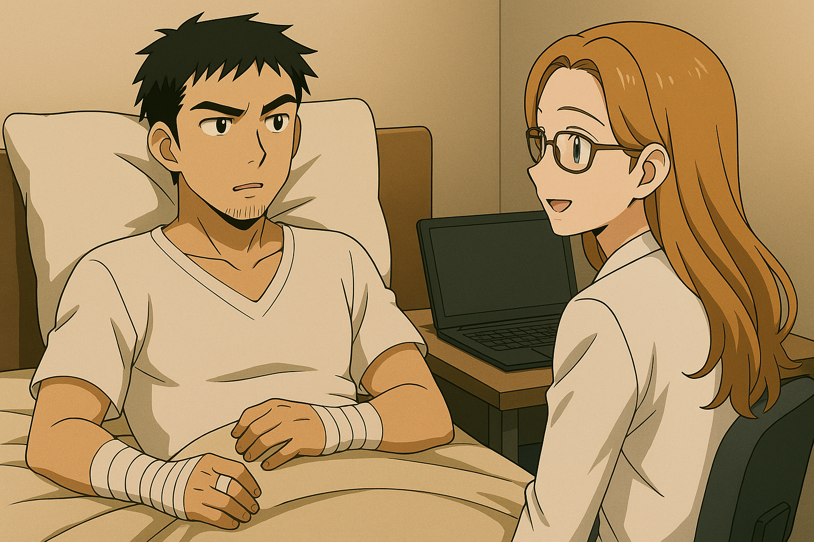
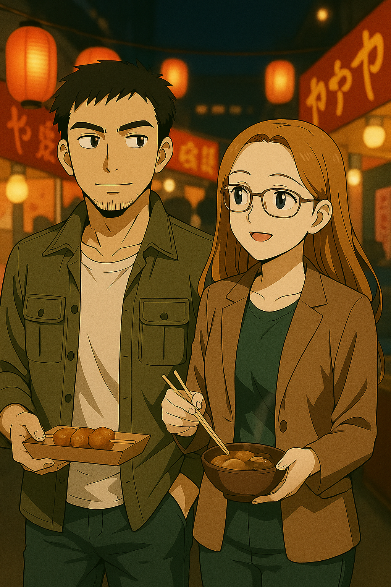
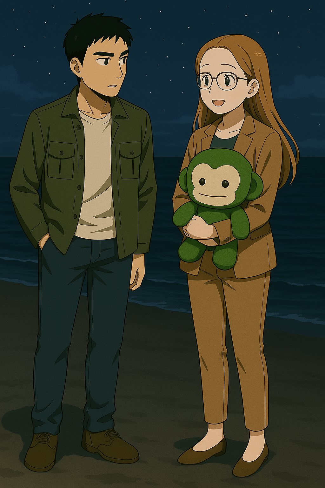

## 第十一章：新生
自从那天坠海后，唐海的记忆就断断续续的。在昏迷中，他感觉自己身体很轻，又好像被人捞了起来，又隐约听到，"就是他，杀了橘子悠女神！""白绪寒小姐，我们想你！"他感觉自己被挪来挪去，最后被放在了一个柔软的地方。恍惚间，他又看到了橘子悠和白绪寒站在白光里，牵着手在嬉戏，而她们发现了他。橘子悠笑盈盈地看着他说，"怎么了皮卡丘男，你又想电我一次？"而旁边的白绪寒则伸出手，"唐教授，要不要再一起跳一支舞？"唐海正准备伸出手去抓，却抓了个空。他一激灵，坐了起来。

那是一个昏暗的房间，不大，却大大小小放满了仪器。他看了看自己的身上，插着几根管子，一摸鼻子，有一根饲管正在往自己喉咙里送着米黄色的糊糊。唐海终于忍不住，打了个大大的喷嚏。不一会儿，门打开了，进来了一位穿着白大褂，看起来比自己年轻很多的女士，有着一头金褐色的长发和忽闪忽闪的大眼睛。"你醒了？"她用英语问道。唐海还是有些晕晕乎乎地说道，"我有头否？这是天堂吗？白绪寒呢，不还想和我跳舞吗？"女士摇了摇头，"对不起，我从小在美国长大，中文很不流利。你会说英语吗？"唐海托了下自己的前额，用英语说了句没关系，并开始观察眼前的女人，"你是？"女人笑了，"叫我瑟琳娜吧，我是一名医学科学家。这里是新竹军区的一间战时医院，为了躲避战争，我们把它建在了地下，要委屈你住两天了。"唐海点点头，"谢谢你，瑟琳娜。多么讽刺，我和台湾人打仗，结果被一个美国人救了。"瑟琳娜笑了，"我现在是台湾人哦，也在努力学习中文。而且，被什么人救下，很重要吗？我们不都是人类吗？"听到这话，唐海打量起了眼前的女士，虽然她看起来还很年轻，但他在她身上似乎看到了赵以宁的影子。

\"虽然很不好意思，但在你昏迷的这一天多时间里，我对你的身体结构做了些扫描分析。这也是我们接收俘虏的常规步骤，请你理解。\"瑟琳娜转过头去，敲击着键盘，从系统中一点点调取着关于唐海的分析资料。\"我注意到你的右手似乎是义肢，但不仔细看的话完全看不出来。看来你们那边有一位非常优秀的外科大夫呢！\"唐海想起来季思澜人前的高冷沉着，以及在林砚面前不加掩饰的火爆脾气，忍不住笑道，\"是的，她大概是全世界最优秀的医生。只不过你可能最好不要和她太熟悉。\"瑟琳娜也笑了笑，接着看向了另一个屏幕，\"你的大脑似乎很有趣。CT图显示，你的大脑结构和我们普通人不太一样。而进一步的脑电图表明，你的突触间的生物电强度异常活跃，脑电波强度远超我们普通人。这种现象我在我们这边的Yau和Yuu身上也看到过，你认识她们吗？\"唐海知道她说的是宫知遥和橘子悠，点了点头。瑟琳娜来了兴致，\"那，你也拥有读取他人思想的能力？你能读读看我的吗？\"唐海犹豫了一下，对着瑟琳娜试着感应她的大脑。他看到了她在实验室里工作，以及在写着台清大学字样的讲台上教书的样子，\"你是台清的教授？\"瑟琳娜点点头，\"是的，我是医学院的教授。这个能力太神奇了！\"意识到什么的唐海，很严肃地说道:\"刚才我和你提到的那位大夫曾和我说过，随便闯入他人的记忆是不礼貌的事情。所以你放心，我不会随便这么做的。\"瑟琳娜笑了，\"我相信你。我在你昏迷的时候擅自对你做检查，所以我们扯平了。而且你很幸运，被一群善良的人包围着，实话说这有点出乎我的意料。\"他们又过了一下其他结果，一切指标正常。唐海正在庆幸自己命大，瑟琳娜看了下手上的手表，正值上午11点。\"今天是周日呢，好不容易有个休息日，要不要一起出去走走？\"唐海刚想说些什么，突然意识到，这里是敌方阵营。他半开玩笑地说，\"话是这么说，不会我一走出这扇门，门背后就会有人出来把我突突了吧？\"瑟琳娜哈哈大笑，\"你这人真有意思。走吧！我还想带你看看今晚的慈云夜市呢！\"

他们一起走出了那个小房间，在昏暗的楼梯间里不知道爬了几层楼后，瑟琳娜推开了眼前的一扇门。一霎那，唐海觉得被阳光刺得有些睁不开眼。蓝天，白云，明明只昏迷一天多，唐海却觉得上次看到这样的景象是很久前的事了。"哎呀，"瑟琳娜小小地惊呼一声，然后对着身边的唐海双手合十道，"不好意思，能请你陪我回一趟办公室换一身衣服吗？"唐海看着她身上的白大褂，觉得那确实不适合作为女生逛街穿的衣服，"当然。"瑟琳娜开心地笑了，在前面开路，而唐海跟着她，两眼瞟向周围。那是一个军营，吉普车和卡车来来往往，穿着军服的人从他们身边走过，眼神里满是紧张和疲惫，不过似乎并没有人注意到他俩。"看来我并没有被监视？"唐海悬着的心稍稍放了下来。出了军营，又穿过几条小路，映入眼帘的是台清的校园。医学院在学校的最深处，他们穿越了一整个校区。校园里学生人来人往的，除了路过的天文台还是一片废墟，周围被拉上了警戒线外，其他的一切看起来和战前并没有什么不同。唐海忍不住问了一句，"话说，你们都不疏散民众的吗？战争还没结束诶！"瑟琳娜摇了摇头，"疏散？台湾本来就是一个岛，现在海平面上升，又不能大规模挖地下掩体，能疏散去哪里？日子还得过的嘛！"唐海一时不知说什么。来到了瑟琳娜的办公室，她进去换衣服，而唐海在门口等她。他注意到了办公室门口的名牌，\"Selina
Chiu\...\"他默念道。不一会儿，瑟琳娜换好衣服出来了，她穿着一套卡其色的休闲西装，看起来知性又干练，"抱歉久等了，我们走吧！"一边走，唐海一边说道，"原来你姓赵啊。"他在手上比划着赵的繁体字，"我有一个很好的朋友也姓赵。因为她，我一直觉得赵是所有的中文姓氏里最美丽的那个。"瑟琳娜轻笑道，"朋友？按照你的描述，我看是女朋友吧？"唐海嘿嘿一笑，不置可否。不一会儿，他们就来到了熙熙攘攘的花园街。"这是什么？"唐海指着街对面的LED大屏幕。屏幕上，一群西装革履的人在一个像是法庭的地方打了起来，有人拼命抓着身边的秃顶老头头上那为数不多的几根青丝，有人脱下鞋子拿在手里准备往对面的人身上抽去，还有人互相扯着对面的领带不放，显得荒谬又滑稽。瑟琳娜有些无奈，"啊，这是我们立法院的日常了。估计又是因为什么新的立法吵得不可开交吧？"唐海忍不住笑了，"在你们这里，立法就是这么儿戏的？和幼儿园的小孩为了一个玩具打架有什么区别？"瑟琳娜倒也不掩饰，"这确实看起来有些蠢，但是，"她突然正色道，"总比对岸的，'没有！没有！没有！好，通过'，要来得更加公正一些吧？"她说这话的时候甚至特意切换回了中文，模仿得惟妙惟肖，唐海被问得哑口无言。

他们走着走着，又到了新竹最大的新竹大城购物中心，两人决定下午就在这里打发时间。整个下午，他们聊了很多很多。瑟琳娜下个月就要和她相恋多年的未婚夫结婚了，请唐海帮忙参考度蜜月时穿什么衣服比较好。而唐海这个大龄光棍自然是提不出什么像样的见解的，有些哭笑不得地说："你说你的未婚夫是个国际人权组织的外交官？他去过的地方比我多多了，见识也比我广，还比我年轻那么多。你来问我这个，不是故意难为我吗？"。看着他一副窘迫的样子，瑟琳娜忍不住哈哈大笑："看来你也有不擅长的事呢"。不过唐海也根据他参加的几次朋友的婚礼，向她描述了在中国结婚的各种流程和习俗。瑟琳娜听得津津有味，尤其是当唐海说道男方可能要给女方18.8万人民币的彩礼时，不由得惊呼起来，"啊呀，作为女生，我觉得这个习俗真是太好了！"他们还说到了自己的求学经历，瑟琳娜追忆了她在加州读大学，以及去日内瓦交流时遇上了未婚夫的趣闻，而唐海也有点骄傲地提到了他学了整整18个学科的课，以及为了不超修学分而故意不去考期末考的轶事。当然，他没有提到顾崇渊的名字，毕竟那是中工院院士以及军方顶级科学家，而他很清楚，无论瑟琳娜如何友好，这里都是敌营。

时间很快就到了晚上7点，他们又来到了慈云夜市。夜市玲琅满目的小摊，熙熙攘攘的人群和此起彼伏的叫卖声，让唐海有些恍惚，感觉之前的战斗似乎只是一场梦。正在他晃神之际，"喂，那边的小哥，来一串烤鱿鱼不？"旁边烤鱿鱼摊老板递出来一串烤鱿鱼。唐海转过头问瑟琳娜想不想试试，得到了肯定的答复后，他转向小摊，"好啊，怎么卖啊老板？"听到他说话，老板的眼神有一些复杂，"小哥，听口音，你是对岸来的？这个点也敢过来，胆子不小啊！"这一下子让唐海尴尬万分，不知怎么回答。"何止是对岸来的，我还是坐着MB，挥着刀开着炮来的呢。"他心里默默想着。不过老板也看出了他的困窘，又立马换了个笑脸说，"哎呀哎呀，两岸一家亲嘛。我们打归打，该吃串的时候就吃串。呐，这串送给你了，再送一串给你身边的漂亮小姐。祝你们玩得开心啊！"唐海忙不迭地接过烤串，一边说着谢谢，一边快步流星地离开了。整个晚上，两人吃了不少台湾特色小吃，玩了很多游园会上的小游戏。唐海还意外发掘了他夹娃娃的天赋，在一个娃娃机前夹了十把，把把命中，夹得老板直冒冷汗。不过他们带着这么多娃娃也不方便，就把大部分娃娃还给了老板，只留下一只瑟琳娜喜欢的绿猴子娃娃。瑟琳娜特别开心，全程抱着这只猴子不肯撒手。

最后，他们漫步到了台清校园对面的沙滩上。一个多星期前正是这里，唐海被援星打得满地乱窜，被林砚的直升机救走。身边的瑟琳娜面对着海面上徐徐的海风，捋了捋头发，问道，"今天和我也逛了一天了。现在你觉得，你喜欢你所看到的台湾吗？打台湾是一个错误吗？"唐海无奈笑道，"实话说，我根本就不喜欢战争。我是对各种奇奇怪怪的工程技术感兴趣，也曾经一心想把我能源方面的研究推广到全世界，让人们不再因为缺电而困苦。但不知何时起，我被卷入越陷越深的战争中，而在那样的体制下，我根本没有说不的权利。"他回过头，对着瑟琳娜说道，"我那位姓赵的朋友曾经说过，我有信念，我有枪，我可以反抗自己的命运。但事实是，我就这样被命运推动着，驾驶着我的MB，手里沾满了鲜血。这甚至都不是无力反抗，是我根本来不及反应，就已经一发不可收拾了。十五年前她就说过，技术不是中立的，人也不是。体制引导人性的走向，技术只是随波逐流。我那时只觉得震撼，但其实并不懂，觉得哪有这么复杂。可现在……我终于明白，那不是理想主义的夸张，而是对现实最赤裸的注解。"瑟琳娜认真地听着，唐海继续说，"台湾很美丽，我可以说，我非常喜欢这里。而讽刺的是，保卫着这么美丽的土地的人们被我杀了，而我这个杀人犯，却能站在这片美丽的土地上，吹着惬意的海风，和一位美丽的女士说着话。"瑟琳娜也有些语塞，不知道该说些什么。

两人沉默了一会儿，唐海又对着瑟琳娜开口道，"十五年前，她问我，技术的发展，究竟是服务于人，还是替人决定命运？我无法回答。而不久前，我和她见面，她又问了我同样的问题，我似乎还是无法给出满意的答案。瑟琳娜，你有什么看法吗？"瑟琳娜看着唐海认真的眼神，虽然他没有明说这个"她"是谁，但她也猜到了，应该是他口里那位"姓赵的朋友"。于是她想了想，给出了自己的答案，"这让我想起我们医学院常说的一句话：'每一项新疗法诞生的背后，都埋着一个过去无法治愈的人。'从这个角度来说，技术的诞生是为了服务更多的人。但是毫无疑问，让一种技术真正服务于多数人，需要的不只是实验室的研究，还要制度、教育，还有你我这样的人去一点点把它拉回来，但用来做恶却很容易。所以我不敢说技术一定是为了人。甚至，如果没有人一直努力，它一定不会是为了更多人。这些，我相信你早就已经感受到了。"然后，她挺起了身子，用一种坚定而又有力的口吻说道，"但是，如果从历史的角度来看，从一万七千年前，第一批人类出现在地球上开始，我们经历了一轮又一轮的技术更迭，也经历了数不胜数的战争。到今天为止，我们的文明可能算不上高度发达，但和之前的人类比早已不可同日而语。现在我们普通人能享受到的物质和精神条件，可能比古代的皇帝能享受到的还要好。这说明，历史上总是会出现你我这样的人在默默地为全人类努力。所以我有充分的理由相信，虽然我们的进步是螺旋状的，但技术总的来说是服务我们，带领我们越变越好的。这是一场慢得几乎看不到终点的赛跑。但正因为如此，它需要你。也需要我。"

唐海静静地看着她，思考着她说的话，心里泛起了一阵又一阵的涟漪。过了许久，他带着些复杂的感情说道，"瑟琳娜——啊不，赵教授。说说吧，你们这边要我帮什么忙？"瑟琳娜被他突如其来的一问搞得有些不知所措，惊讶地看着他。唐海笑了，"是的，我还是忍不住读取了你的脑电波，看到了你们的军部司令在你接触我之前和你的密谈，似乎有什么忙是我非帮不可，要你适时地来劝降我？对不起赵教授，我确实食言了。但是，谢谢你给我解开了我困惑了十五年的问题，而现在，我觉得我是时候报答你了。以及我保证，这是我最后一次擅自闯入你的记忆。"瑟琳娜也被他的实诚给逗笑了，"行啊。那就明天吧，麻烦你跟我去个地方。"

