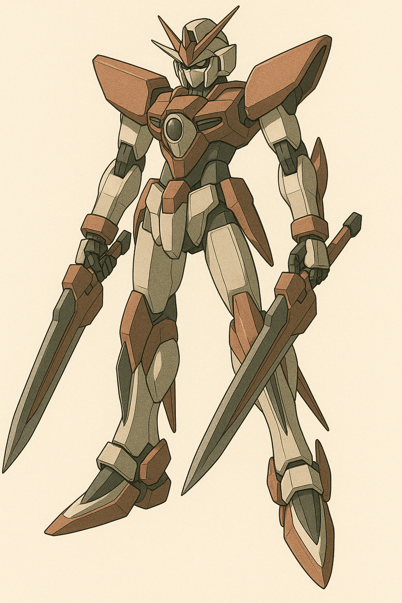

## 第十二章：倒戈
瑟琳娜把唐海送回了他的小房间，准备和他道别。唐海调侃道，"瑟琳娜，那你记得叫醒我，别让我赖床。"瑟琳娜的表情有些复杂，但还是露出一丝微笑，"好的，我答应你。换洗衣物在床底下，我们明天见。"第二天一早，唐海刚洗漱完毕，瑟琳娜就来敲门了。唐海打开门，看到她手上拿了一个透明的盒子，里面是一块手表状的东西。"这么客气吗，还送我一块表？"唐海笑着说道，但看到瑟琳娜表情有些严肃，便也大概明白了，伸出自己的左手："戴在我的左手上吧，这玩意毕竟有磁场，可能会影响我义肢的功能。"瑟琳娜有些惊讶："你知道这是什么？""电子手铐嘛，监视犯人用的。"唐海很坦然地说道，"我在对岸曾经被软禁了十年，对这再熟悉不过了。倒是我应该谢谢你们的体贴，特地为我准备了不起眼的手铐，而不是显眼的脚镣。"瑟琳娜不再说什么，默默为他戴上手铐，引领着他走出了地下医院。门口已经停着一辆黑色的轿车了，两个士兵持枪在车前把守着。看到他们来了，其中一个为唐海打开了车门。"上车吧，唐教授。我就送你到这里了。"瑟琳娜微笑着说。唐海并不感到意外，点了点头："他们这是要带我去哪里呀？""到了你就知道啦。那就......祝你一路顺风！"

上车后，那两名士兵夹着唐海坐在中间，其中一个递过来一条黑布，"把这个绑在眼睛上。"唐海没有反抗地照做了，顿时眼前一片漆黑。也是因此，他无法准确地定位身边人的位置，来读取他们的脑电波去感知要去哪里。不过，他心里倒是格外平静。他并不担心他会被杀，自说自话地轻轻说道："死这种事情，这么多人都做过了，我没理由做不好的。"而且他也明白，如果真的为了杀他，根本不必如此大费周章。不知道穿越了多少条街道，车停了下来。"到了，你下来吧。"唐海刚一脚踏出汽车，眼睛上的黑布就被扯了下来。他定了定神，感觉这里应该是一个巨大工业园区，工人和工程师样的人在来回穿梭忙碌着。而通过无处不在的安全须知，他看到了三个字：台积电。

正当唐海在东张西望时，不知什么时候，身边走来了一个穿着西服的人。不等唐海反应过来，身边的两名押送他士兵就立正敬礼，"项将军！人我们已经平安送达了，就在这里！"唐海转过头去看他，他花白的头发预示着有些年纪了，但他高大的身材，明亮的眼神和虎虎生风的脚步，衬得他依然神采奕奕。他用他洪亮的声音说："好的，辛苦你们了。你们回去吧！"接着，他又向唐海伸出手介绍自己："你好，唐海教授。久仰大名，没想到你不仅学术能力非凡，连打仗也是一把好手，还这么年轻！我叫项澹儒，是台湾军方的首席科学家，也是这场抗中反击战的技术负责人。"唐海伸出手握了握，没有多说什么。"请跟我来。"押送唐海的汽车开走后，项澹儒做了个请的手势，把唐海引向一处。两人并排走着，唐海忍不住问道："我能好奇一下，为什么是台积电吗？这里不是搞半导体的吗，我还以为我应该去什么军工厂呢？"听到这个问题，项澹儒露出一丝神秘的微笑："不愧是唐教授，感觉异常灵敏。你知道，台积电为什么叫台积电吗？"唐海想了想说："我猜和半导体工艺有关？半导体是通过光刻技术，一层一层地蚀刻堆积而成，起这个名字再贴切不过了。"项澹儒点了点头："你说的没错，我们对外确实是这么宣传的。但台积电本身的名字其实是台机电，机械的机，全称台湾机械电子一体化工程公司。而我们的前身，正是帮台湾军部负责制造兵器的兵工厂。后来为了掩人耳目，才特地改的名。""那就说得通了。"唐海也跟着点了点头。不一会儿，他们来到一扇不起眼的小门前，项澹儒刷过虹膜，一阵"叮"的声音后，门滑开，露出一座银灰色电梯。"下去至少十层，别走路了，锻炼身体也不差这一回！"唐海轻笑着跟上，两人走进电梯。随着一声沉闷的震动，电梯缓缓下降。四周静得只有仪器运行的低频嗡鸣。电梯门开了，是一条很长很深的走道。"这里很黑，麻烦你跟着我走，小心地下的路。"他们走了很久，这里的环境却给唐海一种非常熟悉的感觉，无论是布局还是气味。果然，走廊的尽头是一扇巨大无比的铁门，再次验证项澹儒的虹膜后，门缓缓打开，里面赫然立着三个庞然大物。其中两个是唐海再熟悉不过的，盘古II式和刺猬MB的残骸，以及另一个，是一台全新的机体。

唐海观察着那架素未谋面的机体。它的完成度非常高，或者说，那就是一台成品。甚至从它身上似有若无的擦痕和污渍上，看得出它曾经出击过，而现在只是在那里等待着它的主人回归。它左右手各拿着一把细长头尖的东西，很难说这是两把枪还是剑，腿上则和盘古一样，小腿处有两把腿刀，只是脚后跟上还有另外两把。而最为引人注目的是，它的背上背着一个由八把长短不一的，像尖刀刀鞘一样的金属。这些金属两把一组，分上下左右排列成一个巨大的长下影十字星。看得出，它还没彻底完工，有些地方还有裸露的电缆和框架。远远望去，整台机体就像是一个背着十字架赎罪的信徒。项澹儒走上来说道："最左边的这台是唐教授你的座驾，我们不知道它的型号，但我们已经对它分析完毕，有一些问题还等你解惑，这我们一会儿聊。中间这台像刺猬一样的机体就是由橘子悠和白绪寒两姐妹共同驾驶的，我们内部称它为援星II式。而这台，"他指向那架背着十字架的机体，"是援星的姐妹机，我们称它为栞星。"唐海想了想，反应了过来："所以，这台栞星原定的驾驶员，我没猜错的话是宫知遥？"项澹儒点点头："确切地说，不只是原定，之前她已经乘坐这台机体经历过几次模拟战了，机体里所自带的AI所记下的也是她的战斗习惯。之所以把援星和栞星叫作姐妹机，不仅因为这是她们姐妹三人乘坐的机体，而且她们之间的战斗风格也格外互补。你应该能看出，援星是一台注重远距离进攻，自带高火力的机体，而栞星则是擅长近身战斗，手上的武器是枪刀一体的，而背上的精神利刃则更是强力的中近距离武器。"唐海想起宫知遥那干净利落的刀法和确实有些不敢恭维的枪法，说了句，"确实是很符合她的风格。"然后，唐海对着项澹儒说，"那么，把这些透露给我的意义是什么？你们到底要我做什么呢？""两件事。第一，需要你向我们解释一下你的机体背后的技术，尤其是你的便携式能源包，对我们颇为重要。而这第二件事，"项澹儒眯起眼睛，"是希望你能接替宫知遥，成为栞星的驾驶员，协助我们保护台湾岛。"虽然并不是那么得出乎意料，但唐海还是被这种异想天开的想法给惊到了。他看着项澹儒的眼睛，一字一顿地说道，"你知道你在说什么吗？让一个刚刚打败你们的中国人，反过来帮助你们，用你们的武器，去打中国人，我的战友们？""是前战友哦，唐教授。我们建议你认真考虑这个提议，尽快给我们答复。"项澹儒还没说完，就听见周围响起一片咔嗒声，唐海定睛一看，这才发现周围早就站了近十个士兵，他们纷纷拿着枪指着唐海。"放下枪！不许对唐教授无礼！"项澹儒一声令下，士兵们纷纷放下了枪。唐海冷笑一声，"你是想说，我的命就掌握在你的手里是吗？我当然怕死——不然我也不会上这战场了，但我要我拔枪指向我的战友们，无论如何我都做不到。所以我已经考虑好了，我拒绝这个提议，你们想开枪就开吧，只是你们永远都别想知道我们便携式能源包的秘密了。"项澹儒赶忙解释说，"你误会了唐教授。你当然可以拒绝这个提议，而即使如此，我以我个人的名义向你保证，我们会尽力避免杀了你这个选项。当然，我们是不可能放你走的，为了防止你乱来，我们也确实在你的手铐里安装了小型炸弹。这样吧，请你跟我来。"

唐海被项澹儒带到了战术分析室的一堆屏幕前，而里面正播放着上一场战斗中，台湾空军的战斗机们所拍下的录像。录像里，基本都是盘古II式用一种不可思议的姿势和速度突然间冲到摄像机前，然后就是机头向海里俯冲以及弹射椅被弹出的声音了。"不同于我们所记载的任何一场战争，这次我们空军的生还率高达83%。看起来你是有意在想办法破坏飞机的机动性而尽可能不伤及战士的性命。而且请看这一段，"项澹儒又指向了另一个屏幕，"这是援星II式最后一击前的画面。我们注意到，你的机体下落的轨迹很奇怪，不像是在做最后的俯冲，更像是机体突然断电了，在做自由落体。虽然突然断电这件事太过于匪夷所思，这无论如何都讲不通，但结合之前的录像，我隐隐觉得，你在最后关头都在避免杀戮。因此我们确信，你是真心在尽可能避免双方有任何人员伤亡的前提下，结束这场战争。关键是，你通过你难以置信的驾驶技术，几乎真的做到了。"唐海沉默不语，只是心里暗暗地想道，"但是，那一刻我对她们的杀意，是真实存在的......""因此，我们并不是希望你和你的前战友们拔刀相向。相反，我们感觉你或许有能力在帮助我们守住台湾岛的同时，也最大幅度地减轻人员伤亡，包括中国那边。"见唐海还是没什么表示，项澹儒又非常真诚地向唐海，"唐教授，我老实和你说，选你来做栞星的驾驶员也是迫不得已。作为援星的姐妹机，这也是一台精神力感应驱动的机体，除了已经死去的宫知遥和橘子悠，全天下可能只有你能开动起来了。我们知道解放军那边兵力数倍于我们，加上也已经有新的MB部署好了。如果我们没有栞星的参与，那台湾只剩下单方面被屠戮的命运。我知道我们是你们的敌人，但从你之前的表现来看，这不是你想要的结果。"接下来，两个人沉默了半晌。唐海在犹豫，而项澹儒则是在等待。终于，唐海抬起头说，"带我看看栞星吧。"

