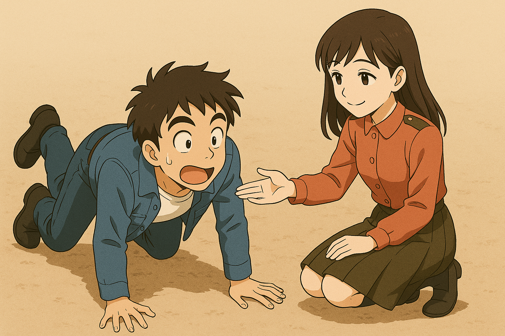
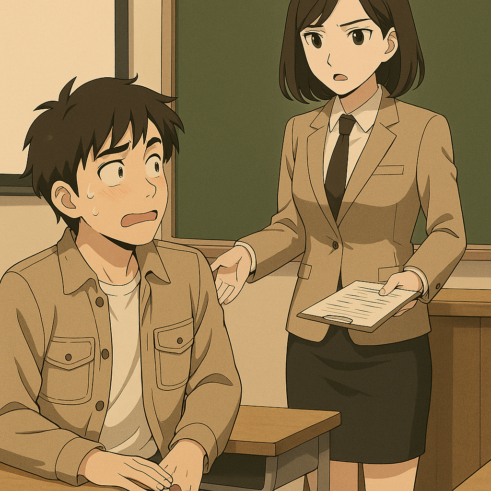
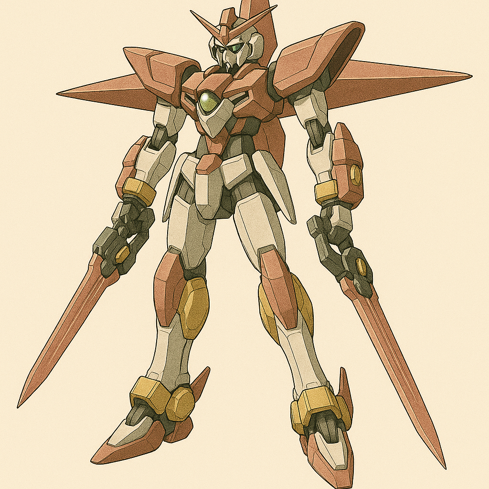

## 第十三章：临行
带着唐海上去调试栞星的是一个年轻的整备机械师，是台湾的阿美族原住民，看起来只有十六七岁的样子。他对唐海这个中国来的看起来有些拘谨木讷的中年人不屑一顾。"靠北咧，竟然叫我来帮这个二六仔？臭脸臭得跟海边的虾酱一样，还是杀害知遥姐的凶手！"他毫不顾忌唐海能听到这些话，自言自语道。唐海自然没有理会这个愣头青，当然也确实有些听不懂他带有口音的国语。他打开了栞星的操作系统，分析起了机体的整体架构和系统构成，"嗯，全身布满了精神力框架，但喷口数量不比普通的MB要少，而且和同高度的MB相比要偏轻一些，看来和盘古II式一样，同样是关注高机动性的机体。武器，名为村正和正宗的刀状电磁炮，各只有三发？怎么看都不够吧，哎，那谁，"他招呼着起落机上正在碎碎念的这个愣头青，"帮我记一下，增加手持武器弹夹容量。"

小年轻暴怒，"你说谁呢二六仔？本大爷不叫那谁，我叫阿路·卡威！我可不是普通的修理工，我家在我们那儿可是出租农业洒药飞机的大户，可有钱了！谁都不敢叫我'那谁'！""好好好......"唐海头也不抬地继续调试机器。阿路看他无动于衷的样子更生气了，"别以为你们机师有啥了不起的！老子也是帮家里开了好几年飞机了！"唐海还是不理他，自顾自道，"既然这是台精神力驱动的机体，那我猜我应该戴上这个头盔？"唐海从头顶上拉下一顶插满导线的头盔，试着戴在自己头上，并按了启动键，但机体毫无反应，屏幕显示【未感应到脑电波】。阿路正因为唐海不理他在生闷气，此时他注意到了唐海吃瘪，哈哈笑道，"大叔，你得了吧。就你这实力，还想开启知遥姐的......诶你盯着我干嘛？？？"他吃惊地发现，唐海正眉头紧锁地盯着自己。而几秒之后，他又用同样的表情看向不远处。阿路·卡威转头看去，一个亚麻色长发的女孩儿从他们身后的舰桥路过，眼睛也看向了他们。这正是他暗恋了一年多的，隔壁通讯班的一个女兵。"死阿陆，没看出来你还是个色狼......"他正要发飙，只见唐海突然把手放在嘴边呈喇叭状，对着舰桥大喊："喂——！那边那个亚麻头发的漂亮妹子！别犹豫了，我身边的这小子也喜欢你，他暗恋你一年多了！你也关注他好几个月了吧？既然你俩都喜欢六福村，下次放假你们就出去那里约会吧！"通讯女兵脸一红，一溜烟跑了。阿路·卡威吃惊地转过头，"大叔你......"唐海又恢复了他冷淡的表情，"嗯......系统不是没有反应，我的感应能力也没有明显下降，看来只是没达到触发阈值。帮我再记一笔，头盔尺寸稍稍做大点，以及加一个和右手臂相连的感应回路。"他抬起头，微微一笑，"阿路·卡威。"

在阿路的协助下，唐海一上午的调试终于告一段落。他理清了栞星的整体战斗机制，也迅速盘点出几个急需改进的点。随着各项数据落定，他不禁倒吸一口凉气。"这机体......潜力远比我预想得大。"他盯着屏幕上那一串串参数：高机动骨架、双持刀式电磁炮、双侧腿刀，八重精神力导刃......虽然武器不多，但哪一样不是压线级别的配置？他沉思着："如果我的核能包技术，加上沈柏言的光束制导系统，一起落入这边......这家伙根本不是一台MB，是近战版歼星舰。而如果宫知遥当时不是死了......那疯娘们，怕是把我军突突了八百回了吧。"

他苦笑了一声。"唉......我军......到底哪边是我军？"这个念头像一道突兀的裂痕，突然划过心口。他明白自己早就站在一条模糊不清的界线边缘，而线的另一端，连方向都越来越模糊。"喂，大叔，别发呆了，吃饭啦！"阿路的声音从维修舱门外传来，带着掩饰不住的雀跃。唐海从座椅上起身，笑着摇了摇头。

食堂依旧和他熟悉的那一套一模一样：铁盘子，两菜一汤，熟悉的白瓷蒸饭味混着浓油赤酱的土豆烧牛肉，在蒸汽中弥漫着中国式的标准化食堂气息。"切，又是这样的菜，真难吃啊～"阿路一边戳牛肉，一边抱怨。唐海瞥他一眼："你退伍后就知道了，在社会上花钱吃饭，大多数时候还不如这。""呃，中年人怎么总爱说这种话啊，烦死了......"阿路翻了个白眼，正要吐槽到底，却猛地住了口。他目光直勾勾地盯着对面食堂角落——亚麻色长发的通讯女兵，正一边低头吃饭，一边又悄悄瞟了这边一眼。唐海跟着看过去，瞬间了然："行了，别在我这儿装陪老干部，过去吧。"阿路脸上飞红，一边抱着饭盘小跑过去，一边嘴里嘟囔着什么。刚跑到人家跟前，他脚下一绊，"啪叽"一声，土豆烧牛肉直接糊脸。女孩本来还有点紧张，看到这一幕却忍不住笑出声，从制服口袋里抽出一张手帕纸，一边温柔地替他擦着脸，一边小声说："牛肉大概也没想到，这辈子还能吃上一口小帅哥呀～"阿路脑子彻底宕机，脸红到了耳根。

唐海坐在原位，也笑了。他忽然想起那节让他"春心初动"的国际法课。那时候的赵以宁站在讲台上，西装外套下是白色衬衫和窄裙，一头温婉的齐肩短发配着柔和的嗓音，他哪还听得进去课？正当唐海在那儿想入非非的时候，赵以宁突然点他回答问题，他吓得赶紧把手放到桌子底下——不是为了藏手机，而是为了挡住那不听话的生理反应。赵以宁看他遮遮掩掩、又不站起来，只当他在玩电动机，气得让他下午去办公室找她。结果一来二去，他们就熟了。唐海低头，看着自己铁盘里的青菜豆腐汤，心里泛起些苦涩："那时候我以为，她是我生命里的意外。后来才知道，她是我生命的锚。"

"唐教授，我可以坐这里吗？"熟悉的洪亮男声响起，是项澹儒端着盘子，笑容儒雅地站在对面。"啊当然当然，项将军请，我正想和你聊聊。"唐海赶紧起身招呼。两人坐下，铁盘碰撞的声音中，唐海放下筷子，语气诚恳："我对这台栞星，有些想法。您要愿意听，我想谈谈我对它的理解——以及我们必须怎么改。"项澹儒看着他，眸中波澜微动，轻轻点头："好，我正等你这句话。"唐海跟项澹儒解释了为何他暂时还不能启动栞星，以及他所提供的整修方案。他也同时解释了盘古II式突然无法动作的可能原因，也得到了项澹儒的确认："是的，我们确实发现了机体残骸内部有几处不自然的烧焦痕迹，可能连接恰好就在那个时候断开了。"接着，唐海问起了一些他不理解的地方，"首先，栞星背后的那个十字架刀刃，应该也是精神力武器吧，但我没有看到它与任何导线相连。我没猜错的话，你们应该是得到了我们这边对于脑机接口以及精神感应装置的研究资料后，才快速研制出基于精神力的无线火控系统，而在那之前，宫知遥就死了。你们是后面才加上的？为什么呢？"项澹儒点点头，"你的推理能力真是让我刮目相看。是的，我们是在和你决战前的三天才把这个八重精神力导刃系统加上去的，但暂时还没来得及加入电磁场发生装置。虽然宫知遥不在了，我们本来是想着作为橘子悠的备用机以防万一，但很遗憾，她们三人都不在了。现在看来，你的出现或许真是某种命运的安排。"

唐海点点头，接着提问，"作为一台近战机，我似乎没有找到栞星有任何防御装置，是因为栞星被定位为超高机动性兵器而只专精速度吗？"项澹儒似乎有些无奈，叹了口气说，"这是宫知遥这小妮子要求的。她对机体速度的追求似乎到了一种病态的地步，永远在喊着快点，再快一点，就连我极力劝她装哪怕一个电磁盾她也不同意。你大概已经注意到村正和正宗各只有三发炮弹了吧？也是她出于机体减重的考虑，就想靠着手里两把刀做出晴天霹雳般的攻击。""完全理解。将军，这也是我要求改进的地方之一，左右手装两个电磁盾，不仅是防御，也可以顺利释放精神力导刃。以及，"唐海在手上比划着，"我也要和你们工程师谈一谈，把我的模块化核能技术嵌入进去，这样不仅能解决你们电磁盾冷却时间过长的问题，也可以增强机体续航能力。如果有可能的话，我还想看看我们能否把我们的粒子束武器技术也加上，替代现有的电磁炮，可以不牺牲栞星现有的高机动性。"项澹儒暗暗佩服唐海分析问题的能力，说道，"好的，唐教授。如果你感兴趣，我们也可以向你解释一下电磁盾的技术原理，这是我们台积电的得意之作。""那真是再好不过。"唐海突然想到了什么，"项将军，容我问一下，贵军还剩多少可用兵力？"项澹儒大约算了算，很坦白地说，"海军那边我们有一艘基隆级驱逐舰，其他我可能还需要向军部调拨。至于空军，恐怕我们只剩下四十架不到的经国号战斗机，以及几十架剑翔无人机，侦查用为主。""只剩......四十架不到了？"唐海感觉脑袋有些爆炸。项澹儒无奈笑笑，"谁叫唐教授你英勇神武，连斩我们七十多架战斗机呢？以及美国人这次是一点力都不想出，这是我们能提供的所有了。"唐海也不知道该道歉还是苦笑，只能沉默了一会儿说，"恐怕，我们的战斗机上也得装上电磁盾了。"

饭后，唐海又和项澹儒手下的工程师开了个长会。当两边分别谈到电磁盾和光束武器时，他们惊讶地发现，其背后的原理居然是一模一样的，都是基于对带电粒子的控制。唯一不同的是，作为盾牌，带电粒子发生器需要把装置内部的磁场调节到一个很巧妙的强度区间，形成一个近乎静态的磁场，这样带电粒子的活动半径就可以被控制在一定范围内，不会发散也不会坍缩。而光束武器则是相反的思路，它需要将磁场的强度做出快速的变化，给带电粒子提供加速度，这样能把带电粒子用强劲的电场力射出去，形成一道高能带电粒子束。之所以沈柏言的研究还需要将其和制导技术联合，是因为高能带电粒子很容易发散，而现在有了顾崇渊的激光诱导技术后，才有了成型的粒子束，也就是赤烬。当然，唐海是不知道这个名字的。台积电虽然贵为全球最强芯片制造商，但光刻机技术都来自荷兰，是来不及复刻顾崇渊的技术的。不过，有了电磁盾的原理，唐海提出了静-动磁场结合的概念模型，让由静磁场产生的带电粒子定型，而由动磁场产生的带电粒子提供动能，这样就能在没有激光诱导的前提下，依然产生定型的高能带电粒子束。虽然脱离了磁场一定距离后的光束不可能继续保持形状，因此不可能像赤烬那样穿越68海里，但打击肉眼可见的目标应该还是没问题的。这样，把栞星手上的电磁炮换成高能粒子束步枪，配合唐海的半永久式的核动力能源包，不仅可以达到理论上的无限弹药，还能极大减轻机体的重量，从而保持宫知遥心心念念的高速。而唐海也知道，不仅仅是致敬宫知遥对这片土地的感情，在军力极其有限的情况下，无论是突击还是脱出，这种高速也是必不可少的。

台湾军队这边的科研团队立马跟进试验，而第二天一早开始，唐海就同时开展了好几个项目，加紧模块化核能包的研制以及在机体各个部位的部署，电磁盾的安装，以及为了应付潜在的潜艇，他不得不要求在机体腰部增加两门轻量级鱼雷炮管。当然，最要紧的还是精神感应装置改进，不然机体都发动不起来。他特地向工程团队请教了盘古II式仿生丝线的问题，并且了解到台湾这边选用的是完全不同的无机合成材料，在确保功能性的前提下不会有和金属的排异性的问题时，唐海松了一口气。虽然台积电的工程团队在全球出了名的高效，但随时可能到来的战争的压迫下，唐海不敢指望这些要求能被全部达成。唐海一边计算这些技术的参数，一边让阿路给他记下结果。但当他看到阿路一脸花痴样，还在鸡贼偷笑时，心里顿时有种不详的预感。\"拿来，你的记录给我看下！\"他不由分说夺过阿路的记录，看了几眼后顿时火冒三丈，\"三处！这里，这里还有这里，这么重要的三个参数你给我记错了！你是不舒服吗？"然后他想到了什么，扶起了额头："得得得，别说了。你是昨天告白成功了是吧？\"阿路嘿嘿一笑，\"师父，你又读我记忆！\"唐海扶着额头叹气，\"这点破事儿都写你脸上了，还需要我读？苍天啊，是不是在这个世界上，凡是技术男碰到心上人，都得输错三次参数啊？\"\"你说什么师父？\"\"没什么。还有，谁是你师父了？\"\"其实吧，昨天晚上我俩在一起啦！过俩星期我们正好都轮到休息，打算一起去六福村。多亏了你啊师父！\"\"少废话，赶紧把这些数据给项将军那里送过去。还有，别叫我师父！当我徒弟的没一个有好下场的！\"\"嘿嘿，好的师父！\"

下午，项澹儒拿到了唐海的设计图纸，翻了翻，有点皱起了眉头："浮游刃牙上的电磁发生器，额定功率这么高？"旁边的技术员看了看，也觉得有些不可思议，"这看起来不只只是为了刃牙的移动，更像是......打算展开电磁盾？"项澹儒抬起头，看了看远方："不理解啊，这个中国人在想什么。"

几天下来，栞星，确切地说，栞星II式，已基本完成。唐海见到它的时候，只见全新的八重精神导刃全面搭建完毕，在模块化核能包的帮助下，每一把刀刃都有独立能源，可以持续更长的作战时间而无需回母机充电。两把全新的刃式光束步枪也已就位，并且把名字由日式的村正和正宗改为了台湾的国兽【黑熊】。小腿上，前后两侧保留了本身的腿部铡刀，而精神力感应系统自然是准备就绪，左右两臂的电磁场发生器也在格纳库灯光的照耀下闪闪发亮。\"所以鱼雷管呢？\"唐海转头向工程师问道，工程师如实回答，\"多装两根鱼雷管要改变机体的操作系统和火控通道，工程量实在太大。而且实话说，作为飞行器的MB上的投掷式鱼雷在现代战争中很少能有作用，一般只是装饰而已，上面的大人物不会懂的。\"唐海皱了皱眉头，他当然知道后半句话是工程团队的借口，但确实时间紧迫，他们实在是来不及重新改进火控系统了。他坐进驾驶舱，按下了开启键。果然，这次栞星II式成功启动。他做了几个简单的动作，完成度极高，比盘古II式感觉更灵敏，他稍稍舒了口气。当天下午，唐海进行了栞星II式的试飞。从格纳库冲出来的时候，他觉得自己再一次久违地看见了蓝天。他操作着机体，低空飞行着。\"速度确实超出盘古II式至少8%，因为喷嘴多的缘故，在精神力骨架的帮助下，走位也可以更灵活。即使如此，考虑到八重精神导刃，整机还是比原本的栞星重20%。可见原本的栞星，理论速度可以到达一个多恐怖的数值......不愧是为那个疯女人量身定做的机体......\"他又测试了光束步枪，射程令人满意，一枪射进海里，立刻升起一大片水蒸气。最后他测试了八重精神导刃，这是他第一次使用精神力武器。他感受到了如何在适度展开电磁盾的前提下，控制着精神导刃的飞行轨迹。他测试了好几次，射出和回收问题不大，但同时控制八支刃，唐海感觉力不从心，心里也暗暗佩服橘子悠能控制二十多支浮游炮的能力。为了持久作战，他决定减少全刃放出攻击，尽量同时只用一两支。不过，他还是有些难以接受，自己小心翼翼地飞行，居然是为了躲开解放军的侦查。\"这次，枪口对准了自己人了......\"不论如何大义，唐海的内心深处，终究还是一个中国人。

而中方这边，他们这一个星期显然已经做好了全面准备。顾崇渊和沈柏言联手改进了赤烬的材料，这是顾崇渊团队的一种全新研发的合金温变材料，当温度恒定时，材料内部的原子簇结构比较松散，而温度变化时，原子簇会骤然紧密排列。这种理化性质对于赤烬这样不停变换温度的武器，再适合不过了。林砚作为总指挥，也安排好了200架战斗机，10艘不同级别的航空母舰，15艘军舰和8艘潜艇，形成强力的立体打击。军方给的最后期限已到，这次是破釜沉舟了。

决战前夜，他破天荒地回了家吃晚饭，\"澜澜老婆我回来啦！我想你炖的冬瓜排骨汤了！\"那天，两人聊了很多很多，从校园恋爱开始，到刚结婚时的天天吵架，都默契地不提第二天的战争。晚上在床上，季思澜倚偎在林砚怀里，手指在他胸口轻轻划着圈，而林砚的手顺着她的背慢慢抚着，像是在记住她的形状。过了许久，季思澜终于忍不住开口问道，\"我这个问题可能比较小白，但你们军部为什么不直接出动更大的兵力，同时从多个城市进攻台湾呢？你们前两次，也都是从新竹打的，不是吗？\"林砚笑了一下，没立刻回答，像是在斟酌措辞。他温柔地摸了摸她的发顶，低声道：\"新竹是离我们最近的主要城市，又是台湾的科技核心，一旦拿下，对全局都有利。而且……\"他顿了顿，目光越过天花板，落在无形的夜色深处：\"我们的敌人可不止台湾，有时候所谓盟友也随时准备捅你一刀。比如北边那头毛熊，觊觎我们的稀土矿很久了。如果我们拿出全部家底打台湾，谁知道他们会不会再搞一个乌克兰那样的局部军事冲突？\"季思澜似懂非懂地点点头，却没有再追问。她只是抱紧了林砚一些，像是要把他牢牢藏在这个夜里，不让他被明天夺走。

而沈柏言，则是一遍又一遍地轻轻抚摸着跟哥哥的合照。他摸着合照的动作越来越轻，仿佛怕吵醒那些已经远去的人。一会儿，他又瞟了一眼桌上，和唐海以及程致远的实验室成员合照，沉默不语。

