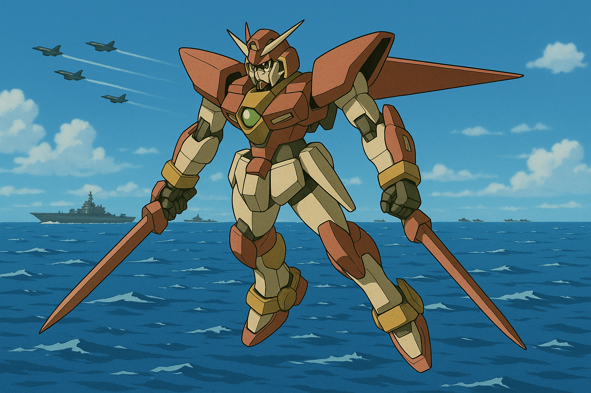
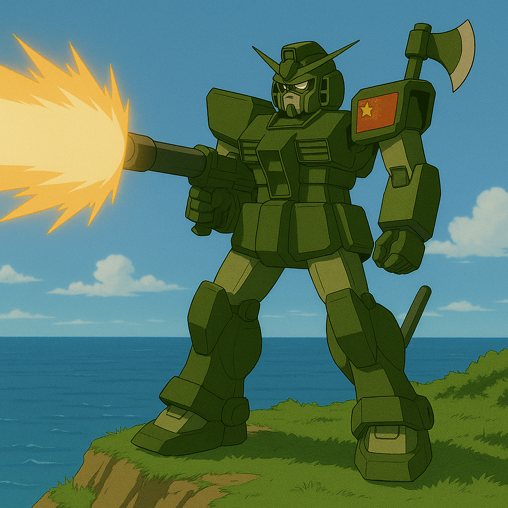

## 第十四章：决战I
第二天正值星期五，唐海不知何故醒得很早，他决定稍微出去走走。园区里有一片人工湖，他昨天试驾的时候在栞星II式的监视器内隐约看到过，还挺大，所以他决定去找一找。唐海走得很慢很慢，一路上想了很多。他想起自己从部队退伍后进入大学开始，就是一个理想主义者，想学遍全天下最难的知识，去创造出所有人都赖以生存，但并不是唾手可得的东西，让人们可以活得更幸福。他思来想去，似乎有三样东西是这样的，医疗，能源和农业。因此，他在伊卡斯特的入学志愿表上，毫不犹豫地将临床医学，环境科学与农业工程作为自己的前三大志愿。后来，由于高考化学一道大题失手，他以一分之差与医学院失之交臂，录取了二志愿的环境科学。

唐海记得，那时候的他还郁闷了好一阵，整个暑假都提不起劲。但自从他开始接触专业课后，他意识到，这或许是个来自命运的，完美的安排。医疗行业很好，但当医疗工作者的话，终其一生只能救下寥寥数百人。农业影响力最巨大，但也最复杂，因为现在全球食品产量平均下来，理论上够所有人活下去，因此依然吃不饱饭的问题并非农业可以解决。所以他逐渐喜欢上了环境科学，专攻能源方向。这确实是一门极度复杂，需要融会贯通很多领域的知识的学科，因此很符合他内心工程美学，驱使着他更深入地钻研了下去。他永远不会忘记，当自己第一次做出那颗只有半个房间那么大的，可以被轻易部署在各种自然条件下的小型核能球的时候，心里是多么得自豪和激动，他第一次觉得，人类的未来是光明的。也是这份执念，加上环境科学的综合性，让他不得不探索其他领域的知识。也是因此，激发了他对更广泛的知识的兴趣，指引着他选修了包括法学院在内的课，最后阴差阳错地认识了赵以宁。

黎明前的天空呈现出模糊的灰蓝色，像一块未干透的水洗布。空气带着微凉的湿意，拂在脸上像一层细纱。园区里格外安静，只有偶尔传来一两声鸟鸣，远远近近，一片迷离。唐海的鞋底踩在湿润的石板路上，发出轻微的"嗒嗒"声，仿佛整个世界都在屏息。"但是，我是从什么哪一步开始走到这里的呢？"唐海变得有些痛苦，"我只想做好我眼前的事。可似乎从某个时刻起，只要每一步走得更好，就会错得更深。"是因为那次同意去朝鲜吗？或许是，但唐海觉得，也有可能无论选哪条路，最后都会带着满手的鲜血和满心的遗憾，走在现在这条小道上，"而且，就算不是我，也会有另一个倒霉蛋走上这条路。那么，我被选中，又有什么不对呢......"

不一会儿，那一大片湖出现在了他的面前。此刻，湖面在灰蓝天光下泛着一点冷光，像一面巨大的深色镜子。嗖嗖的冷风拂过湖面，带起细小的涟漪，唐海不自觉停下脚步，望着水面微微发怔。这时，湖中央有什么引起了他的注意。"莲花？"他仔细地看了看。真的是一朵莲花，确切地说是一朵巨大的，雪白的莲花，在黑暗中显得如此格格不入。他想起来赵以宁曾经和他说过，佛陀，也就是释迦牟尼，在菩提树下静坐七天七夜，最终于寂静中彻悟宇宙真理，证得无上正等正觉。从此，他踏上弘法之路，行遍古印度的城邦与乡村，不辞辛劳地传播佛法，致力于解救众生于生死烦恼之苦。他常静坐于莲花座上，无论王公贵族还是贩夫走卒，皆一视同仁，平等开示。面对来自各阶层的听众，他所讲述的不仅是如何远离痛苦，更是关于如何在纷扰的尘世中寻得内心的安宁、如何以慈悲与智慧共处于世。"最重要的一点，和很多人的误解不同，释迦牟尼，他不是神，他只是一个人，是一位真实存在过的历史人物。"赵以宁在他的脑海里说着。这时，朝阳初升，光洒大地，眼前的一切从黑暗变成了彩色。

唐海意识到时间不那么早了，正准备往回走。突然，整个园区警铃大作。不止，似乎整个台湾岛的防空警报响了起来。唐海急匆匆地赶到格纳库的时候，正好看到项澹儒。还没等他开口问，项澹儒就告诉他，"根据我们的谍报人员来信，以及卫星图分析，解放军那边行动了！"格纳库里人来人往，但唐海没有看到整备班的人，当然也没看到阿路。"阿路·卡威呢？"他转头问项澹儒。项澹儒有些一头雾水，随机恍然大悟，"阿路·卡威？哦你是说那个和你混在一起的毛头小子啊，整个整备班都已经出发了。为了保持我们的续航，整备班将坐上承德舰，作为我们的整修部队，在前线为你们修整作业。至于和你在一起的那位小兄弟，"项澹儒的声音多了一丝敬意，"昨天我们编排飞行员的时候，发现备用飞行员不太够，他自告奋勇地报名了，说是要向他的师父学习，保卫国土。""什么？"唐海猛地心一沉，不知为何有种不好的预感，"不行，我的机体只有阿路知道如何调整，你赶紧下令把他调回承德舰上！"项澹儒按住唐海的肩膀，"唐教授！我知道你很担心这位小兄弟的性命。昨天我们测试过他的飞行实力，实话说实力远超普通人，接近于我们训练过两年的飞行员。他的家乡是在一片农耕区里，似乎他家拥有一家当地有名的农用飞机租赁公司，他从小就帮他爸爸开飞机撒农药，十几岁就独立飞行了。"唐海摇摇头想说什么，项澹儒按住了他的话头，"现在我们只能依赖他了，上其他人就是直接送人头，你明白吗？"唐海眼神黯淡了下去，默默地走向了自己的机体。

唐海在驾驶舱里没坐多久，就收到了通讯员传来的出动许可。听着耳机里传来的清脆的女声，唐海觉得有些莫名熟悉："对不起小姐，你是阿路·卡威的女朋友？"对面似乎一愣，轻轻地说了句，"是的，您是？"唐海顿了一顿，说道："我是他师父。希望你们下次去六福村玩得愉快！台湾自由防卫军，唐海，栞星II式，出击！"随机他踩下了动力踏板，栞星II式加速冲向了天空。他按照情报，往新竹西南边的海岸线飞去。这时，他身边出现了几架台军的战机和他同路。他注意到，那些战机的头上拆掉了机炮，被转移到了机翼上，而机头这里换成了电磁盾发生器，看来他们采取了唐海的建议。这样不仅可以提高防御能力，同时和战机并肩作战也能提高他浮游飞刃的攻击范围，这让他心里也更有底气了。到达目指定坐标后，战机散开在附近低空盘旋，而唐海则悬浮空中，严阵以待。过了半个多小时，对面的海岸线处，黑压压的一片战机和军舰们朝这里压了过来。"来吧！！"唐海难得一见地嘶吼了一声。

第一批攻击悄然到来。印着五星红旗的战机们以5架为单位，齐刷刷地一边保持着队形拉升，一边向对手放出两枚跟踪导弹，总计十枚形成一股强大的火力，直指唐海所在的位置。唐海放出三枚浮游刃牙，但并未攻击。只见浮游刃牙相互飞向三个方向后停住，似乎组成了三角形的三个顶点。突然，随着一阵劈啪作响，刃牙上竟也展开了电磁盾，而且由于三个点距离不算太远，电磁盾相互覆盖，形成了一张电磁网，迎接着导弹的到来。"砰！啪！"几声巨响过后，几枚飞弹有去无回，都在撞上这张网后原地爆炸。"成功了！我就知道能行！"唐海难得地兴奋极了。"多亏了唐海的核能模块，八重精神力导刃系统上的每一片刃牙都带有独立供能的作用，因此不必再依赖母机充电。"看着实时画面的项澹儒分析道，"但我不知道他后来为何又要求在刃牙上加上独立的电磁发生装置，现在看来，他不仅想让这些刃牙能脱离母机的电磁发生器飞得更远，还想让它展开浮游盾牌去拦截各式各样的攻击！这个想法真是太大胆了，但也只有他这样的人能做到。"而唐海则一个闪现冲到了机群面前，让人熟悉的手起刀落，五架飞机要么断了翅膀，要么没了引擎，战士们纷纷跳伞逃生。就这样，唐海拦截了第一波大概二十多架飞机的进攻。看到监视器的林砚怒不可遏，"这他妈又是什么怪物？？台湾那边居然有这么牛逼的机体？？？上次怎么不拿出来？？？留着过年啊？！？！"此时，他的脑子里一片混乱，不停地分析着，这是不是又是所谓的精神力感应武器？它的运作原理是什么？又怎么办？突然，他想到了什么。"传我的命令，快让沈柏言和【刑天II式】准备出击！优先把敌方那台奇怪的MB干掉！"

而唐海依然在继续。随着解放军的战线不断推进，不只是更多战斗机，军舰也来开始加入战局。这时，国军的战斗机和无人机也越来越多地前来帮忙，在高空和敌机撕咬着。拥有了电磁盾的战斗机实力也是剧增，不再会轻易被击落。加上栞星II式自带根据宫知遥生前的习惯所训练好的战斗AI，可以自动帮助唐海高速避开炮弹的追击，帮助唐海分担了不少压力，让他开始有余力考虑对付军舰。这时，他注意到离他最近的军舰上，十门加农炮的炮口齐刷刷地对准了他，对他送来了一阵炮弹雨。他尽可能地躲开一部分，又用头部机关炮和两把光束刃枪解决掉剩余部分。之后，栞星II式转向军舰，对着军舰连开数枪。军舰躲避不及，正在绝望，突然发现光束的目标并非船体本身，而是面前的海面。高能粒子束的热量掀起了大量水蒸气，不仅阻挡了军舰的视线，也让整个艘舰艇剧烈颠簸起来。正当船员们晕头转向的时候，栞星II式不知何时出现在了他们身后，操着刃枪，以极快的速度切除了船尾带发动机的部分，扬长而去。船员们只能纷纷坐上救生艇弃船逃跑。

此时，海面上，四艘以“品”字形编队、作为标准突击单元的解放军驱逐舰，同时调转炮口，黑洞洞的巨炮，在火控雷达的引导下，死死锁定了悬停于半空的栞星II式。唐海没有后退。他冷静地从栞星II式背后，释放出四枚浮游刃牙。这四枚刃牙并未升空，而是如贴着海面滑行的幽灵，在雷达的盲区中，悄无声息地，各自绕到了四艘驱逐舰的外侧，在浪涌中静静蛰伏。"开火！"随着解放军指挥官一声令下，四门主炮同时发出了怒吼。而就在炮弹即将脱离炮口的一瞬间，那四枚幽灵般的刃牙，如同瞬移一般，陡然出现在了距离炮口不足半米的地方！正在解放军指挥官惊惧之际，四枚刃牙各自撑开了闪烁着刺目电弧的盾。炮弹出膛的巨大动能与爆炸能量，被这面近在咫尺的盾，毫无保留地、尽数反射回了炮膛之内！只听"轰——！"的几声，沉闷的、如同在铁罐内引爆炸药的巨响传来。四艘驱逐舰的主炮炮管，就像被巨大的压力从内部撕开的金属罐头，瞬间炸裂、变形，无数暗红色的火花与零件向外喷溅。炮塔本身，彻底成了一团废铁。趁着剧烈的爆炸让驱逐舰阵脚大乱，栞星II式的引擎发出一声低吼，巨大的身影如鬼魅般贴近。唐海没有丝毫犹豫，机体小腿外侧的铡刀弹出，在海面上划出四道精准的、冰冷的弧线，依次切断了四艘驱逐舰的船舵与动力螺旋桨。四具动弹不得的钢铁棺材，在海面上无助地打着转。

看着栞星II式遇神杀神的威势，后方的解放军舰队与战机群像是终于找到了破解之法，不再试探，而是瞬间达成了某种共识——饱和式攻击。顷刻间，天与海的界限被彻底模糊，上百枚各式炮弹与导弹，从四面八方，汇成一股钢铁的风暴，朝着那台孤独的红色机体，席卷而来。唐海见状，将八支浮游刃牙瞬间召回，以前后左右上下六个方位，撑开了一个绝对防御的、闪烁着蓝紫色电弧的立方体屏障，将自己死死地护在中央。汗水顺着他的太阳穴，不受控制地滑落。他几乎听不到耳机里林砚传来的、焦急的嘶吼了，整个世界，只剩下他自己的、如同战鼓般轰鸣的心跳，和义肢内精神力增幅器，因超负荷运转而发出的、尖锐的嗡鸣。战术奏效了。绝大多数的炮火，都被这面，由纯粹精神力与核能构筑的叹息之墙，给无情地弹开或吞噬。可是，那终究不是全部。唐海的眼角余光，瞥见了监视屏的一角——几枚漏网的炮弹，越过了他，落在了他身后，那片他刚刚才用双脚丈量过的、美丽的海岸线上。金色的沙滩被撕开丑陋的豁口，翠绿的防风林燃起黑烟。那一刻，他脑海里，响起了赵以宁和瑟琳娜的声音，响起了那个关于"守护"和"慈悲"的、却只属于理想主义的答案。他不再犹豫了，不顾八重精神力导刃系统给自己带来的负荷，立方体屏障骤然撤去，八枚浮游刃牙，不再是庇护的盾，而是化作了八道收割生命的、金色的闪电！它们不再是精准地去切削机翼或者斩断船舵。而是以一种充满了愤怒和绝望的、最冷酷的效率，贯穿了驾驶舱，引爆了弹药库！爆炸的火光，一瞬间染红了唐海的监视屏。公共频道里，那些曾经熟悉的、属于自己人的惨叫与呼号，像一根根烧红的钢针，狠狠地扎进了他的大脑。他听到了爆炸，心里痛得像被活生生撕开了一个大洞。可他却只能无可奈何地，顶着那阵几乎要将他头颅都撑裂开的剧痛，强行将所有的注意力，重新按回到那片由他亲手制造出的、人间地狱般的战场之上。

正当唐海的注意力还没有从眼前的战场上转过来时，突然耳机里传来了一声，"师父小心！"他还没反应过来，一枚鱼雷擦着他的监视器，落在了他面前的海面上。他定睛一看，原来是一艘中型的"宋"级潜艇。从海面伸出的炮管本直勾勾地指向栞星II式，却也结结实实地吃了一发鱼雷。"砰"的一声，潜艇直接在海面上炸开了，扬起巨大水柱。唐海转头看向后面的屏幕，只见一架经国号战斗机从他身后一闪而过。他惊喜地叫了出来，"阿路？阿路是你吗？！""废话，不是本大爷还能是谁！"阿路也回以兴奋的大喊，"战斗真是太刺激了！师父你只管打军舰和战机，水下有我们帮你盯着呢！"然后他有些忘乎所以地喊道，"阿路·卡威小队！跟我来！"唐海的通讯器里传来了其他两人不满的声音，"什么时候有什么阿路·卡威小队！""你别太得意了！"，同时他看到三架战斗机朝前方飞去。唐海顿时鼓足了干劲，对着通讯器喊道，"阿路·卡威小队队长，好好干，别给师父丢脸啊！"突然，热能警报器里传来一阵急促的声音，然后就看到一阵巨大亮光从对岸传来。唐海刚刚本能地极速拉升，就看到一道巨大光束从自己身下穿过，炸在了身后的海岸线。顿时，整个新竹大地都抖动了起来，距离海岸线近的一些建筑物轰然倒塌，海啸和飓风卷到了岸上，形成一个人间炼狱，恐怖如斯。刚才跟着阿路的两架战机也一并化作灰烬，消失在风里，而阿路也凭借着高超的技术和好运向左一偏，躲过了攻击。他看着两架好友的战机灰飞烟灭，一瞬间，庆幸、紧张、恐惧、愧疚混作一团，他没时间分辨。毫无疑问，这是沈柏言的攻击。多么讽刺，上次的唐海看到这样的攻击，感觉是救星来了。而这一次却让唐海意识到，这可能是路西法的微微一笑。而在对岸，沈柏言只是看着屏幕，向控制台汇报了一句，"未能命中目标。"

