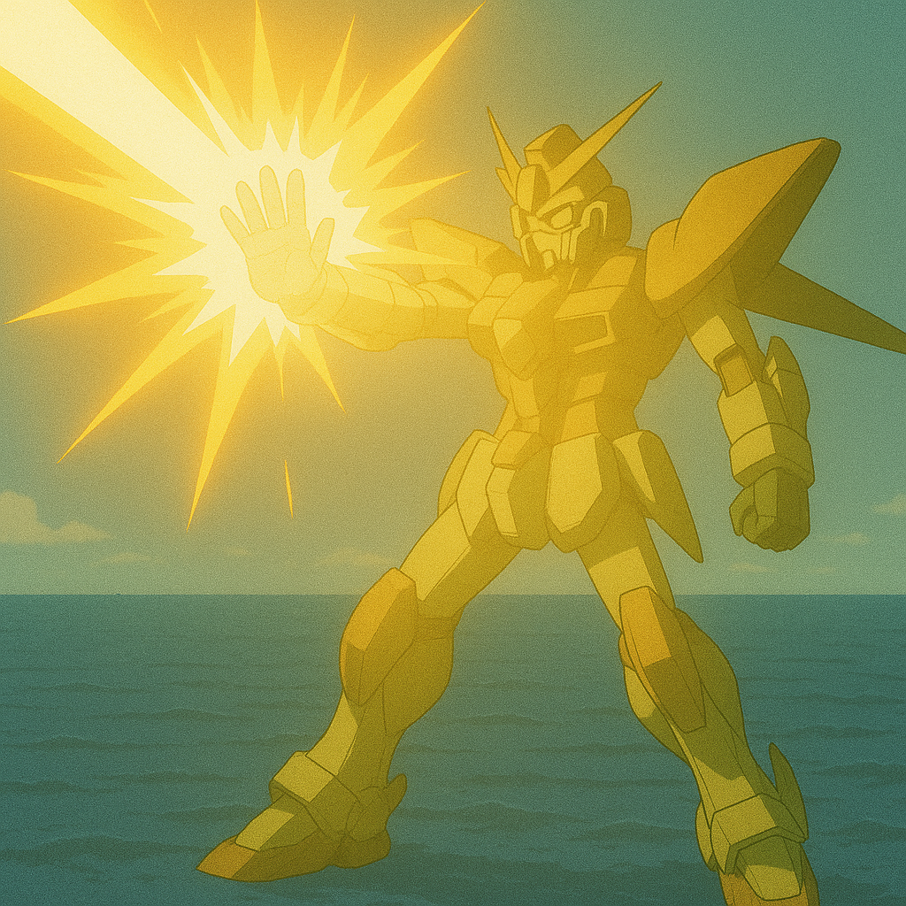
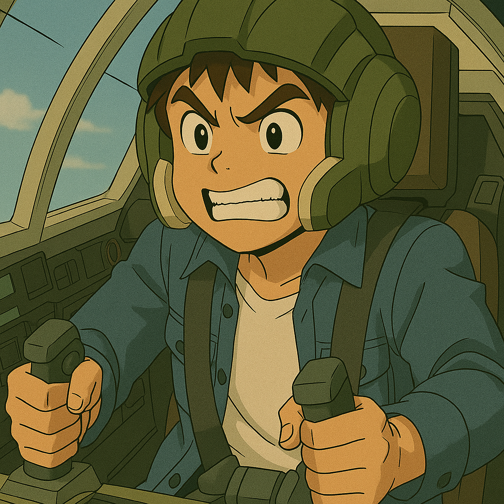
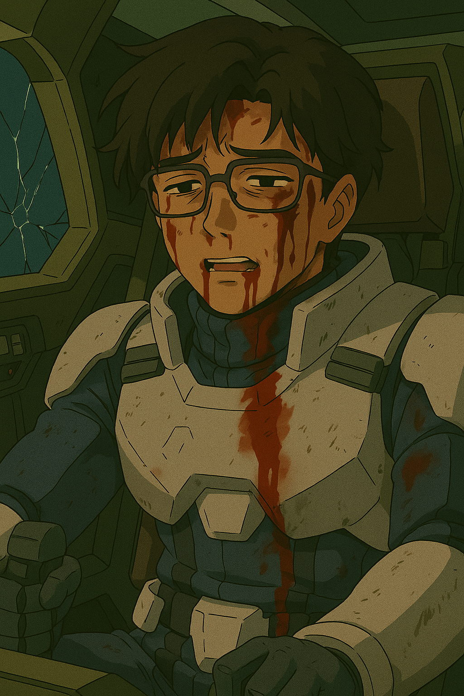

## 第十五章：决战II
整个国军被这一击打得有些懵。虽然之前的战斗中见过这种攻击，但这一次精准地打中了台湾岛的本土边缘并引起如此强烈的震荡，不仅进一步说明了这个武器的恐怖威力，更是说明了对手的进攻并不仅仅是针对军队而已。唯一值得庆幸的是，国军虽然恐慌，军力和解放军比也极其有限，经不住这样折腾，但军事素养依然在线。短短十分钟内，剩余部队只是尽可能地分散开，保持不在同一直线上，以躲避下一轮可能的攻击。唐海也不敢松懈，和阿路一起击退剩余的解放军部队，并死死盯着热源传感器，以防下一炮的到来。阿路一个盘旋飞回了唐海附近，"奸！师父，解放军这到底是什么东西啊？？太可怕了！"唐海不知道应该用怎样的情绪来回答这个问题，"我......我其实对这个技术还是知道的，现在最大的问题是，不知道下一击什么时候要来，你自己千万小心！"不过唐海心里默默计算着，这架武器应该是部署在平潭的最前沿，坛前岛。根据上一战的测量以及刚才那炮的估算，射程大约就是到新竹港边缘，约68海里，再进一步突破本土估计有难度，但引发的地震和海啸已经非常恐怖了。以及大概可以确定的是，这么高的能量，炮管单用电池肯定撑不住，应该是直接连接着发电厂级别的电源，这也是之前唐海在实验室的时候和沈柏言一起建模计算时得出的结论。"而最关键的是，炮管材料即使能耐住高温，冷却也需要很长一段时间才行。我估计几个小时内恐怕......"唐海正自言自语道，突然热源警报再次响起，通讯器内再次传来了"回避"的警告声。唐海大惊，栞星II式急忙往左边快速闪去。果然，又一道光束袭来，这次一举打中了国军的一艘驱逐舰以及两架不幸在同一直线上的战斗机，但是由于这次偏转了一个角度，台湾岛本土没有再次被击中。"15分钟？？15分钟就能射出下一发了？？？他们难道造了好几门这个炮？？？不可能啊！"唐海愣在了原地，有些绝望地喊着，全然没注意到解放军来自海军和空军的攻击依然在继续。"砰"的一声，又一艘潜艇在栞星II式脚下爆炸了，把唐海的注意力从惊恐中拉回了战场。"师父你怎么在发呆啊！！"阿路的战机从空中俯冲下来，"你快想想办法啊，不然我们早晚被这炮干掉！""......对，现在确实不是发愣的时候。我来想办法，谢谢你又救我一命啊！"唐海强打起精神，抬起头决定再仔细想想，同时他一抬手，光束步枪稳稳命中一架战机的右翼。

唐海一边战斗，一边回想起见过的几炮。虽然现在冷却时间被大大缩短，但高能光束的本质不会变，依然是带电粒子束，能被电磁场引导。"那想必也能被电磁场化解，所以如果施加足够强的电磁场的话......有了，我试试！"唐海打开前线公用频道，对着国军部队大喊，"各位！刚才的高能光束的轨迹和攻击范围大概率是定住的，只能在很小的范围里微调。空军朋友们尽可能往高空飞去，海军兄弟们尽可能从左右两边散开。中间会留下直接面对本土的地带，而我会在中间想想办法。诸位，请相信我，任何人都不能轻易丢掉性命，台湾的明天还在诸位手里！"过了一会儿，又差不多到了15分钟左右，而唐海也已经切换到了他认为正确的位置。"来了！"当热能感应器报警的一刹那，栞星II式就全方位展开浮游刃牙，排列在一个平面的八个点上，以最大功率展开电磁盾。并且栞星II式也展开了自己手臂上的一双电磁盾，插入到电磁盾形成的巨大电磁场里。"啪！"高能光束袭来，正面撞上了这面巨大的电磁盾，火光四溅，噼啪作响，栞星II式的机舱内，能响起的警报声都响起了。是的，唐海尝试的正是以他的性命为赌注，挡下这一击！半分钟过去了，高能光束退散，而栞星II式虽然热量过载，但并没有大碍！"我......我成功了？"唐海依然处于极度紧张中，不敢相信自己的眼睛。而对岸的沈柏言同样大吃一惊。他亲眼看到自己击中了敌方的MB，炮火散去，对方依然岿然不动！"这......这怎么可能？！"

\"哇奸，师父你太牛逼了！！！这你也能挡下来！\"阿路兴奋地驾着战机绕着栞星II式打转。"哈，大概吧......"唐海眼前一片白光，强撑着头晕目眩的感觉，勉强挤出一句话，然后止不住地咳嗽了起来，然后咳出一口血。他赶忙回撤到一个不容易被击中的区域，强压住自己的心跳，深呼吸几次，才慢慢平静下来，能看见东西了。"这样的防御即使奏效，对身体的负荷太大了。果然还是要想想办法，把沈柏言的机体给打下来吗？"他心里想着，突然觉得这是个很可怕的念头，"果然当我的徒弟的，真是个顶个的倒霉，没一个有好下场呢。"于是，他的目标就变成了，如何让沈柏言的机体不能运作。但说来容易做来难，如果让唐海单兵突击跨越海峡和沈柏言单挑，且不论他内心能不能过这一关，就说面前还剩一半的解放军陆空部队，以及中国大陆本土的数百倍于此甚至更多的兵力，他绝无可能一人应对。看起来，这似乎是一个死局。

更糟糕的事情还在后面。"咻咻咻！"三枚巡航导弹朝着栞星II式飞来，唐海迅速地展开电磁盾挡了下来并且斩翼反杀，但他意识到，在这么不起眼的位置还能招来攻击，看来解放军是打算针对他了。确实，监视器里的林砚发现了这台未知MB的神勇表现，没有被吓退，反而进一步发号施令，"全军注意！不惜一切代价，突破这台未知MB。至少，把它背后的那几根毛给拔掉！"解放军战士们也确实训练有素且不畏牺牲，虽然一次次地被唐海及其带领的国军部队，整队整队地给击落，他们依然勇敢地继续推进自己的战线。这次，自知敌不过栞星II式的超高机动性，解放军联合所有兵力，战斗机，军舰和潜艇，对着以栞星II式为首的国军部队展开了猛烈的炮火攻击。而国军则也是结合了残存的以阿路·卡威为首的十架战机，释放机关枪的同时齐齐展开电磁盾，掩护栞星II式。而唐海则是不顾自己刚刚恢复，栞星II式一边对着前线开炮，一边再次展开自己的全部浮游刃牙，朝着解放军砍去。一时间，解放军这边的军舰和战机群大破，爆炸声和火光层出不穷，宛如人间炼狱。而唐海并不知道这一切攻击其实是一种掩护，这时，一支解放军空军的飞行飞行小队，大约20架飞机，则纷纷往正在肆虐的浮游刃牙一边开火一边冲了过去，作自杀式俯冲状！只听见几声巨响，5支刃牙被成功引爆，但由于其动力能源是核能，这5场爆炸引起了一场小型的核爆，对解放军的前线部队又是一次致命打击！一阵硝烟弥漫过后，唐海调动自己的精神力，这才惊恐地发现，自己只能收回三把浮游刃牙，其余五支彻底失去响应。当然，为了这一击，解放军确实也付出了血的代价，所剩的残余部队已经和台军相差不多，之前的人数优势荡然无存。

而好死不死，当栞星II式的系统刚刚冷却完毕，热源警报器再一次响起了。唐海本能地冲了过去，但这次，他只能展开三枚浮游刃牙，以及栞星II式手上的两面电磁盾，加上刚刚战斗过的整体损耗也到了不可忽视的地步，他不再确定自己还能否还能挡下沈柏言这一击。果然，这次磁场强度比刚才低上至少一半以上，整台栞星II式的温度上升也远比刚才快，瞬间就到了唐海的肉体快支持不住的地步。"要死在这儿了吗，终于......？"唐海的意识已经有点模糊了，原来临近死亡是这个感觉吗，感觉不到痛，感觉不到热，但还能听到有人说话，说着什么，"阿路·卡威小队，跟我来！支援栞星！"之类的蠢话......突然，他一激灵，瞬间清醒了过来。机舱的温度并没有继续提升，他定睛一看，左上方——也就是他电磁场最薄弱的部分，三台经国战斗机正展开着电磁盾，拼死顶着高能光束的攻击。"阿路？？别，你们别管我快跑！！！你们的机身材料和MB不一样，无论如何都顶不住的！快点滚回去啊！！！求求你们了......"唐海忍不住呜咽了起来，而阿路则可能已经听不见了，他拼尽了他最后的力气，对着中控台吐出了几个字，"对不起......六......福村......去......去不了......"伴随着不间断的爆炸和电火花，高能光束逐渐褪去，也三架战斗机彻底化为灰烬消散而去。三支仅剩的浮游刃牙中的两支也由于负载过限，虽然没有爆炸，但再也无法响应，直直地坠向海面。

唐海呼吸沉重，沉默良久。终于，他抬起头，不知是愤恨还是无力，低沉着怒吼了一声，"沈柏言......！"然后驾驶着栞星II式像流星一般地冲向了解放军的阵队。解放军指挥官也看出了他想强行突破队伍，拼死抵抗，而林砚也及时发布命令，"调动陆军进入平潭！保护刑天II式，以防敌人潜在的抢滩登陆战！"唐海和解放军的战斗进入了胶着状态，虽然他依然能砍下不少军舰，甚至还贴着海面斩开了三艘潜水艇，但他知道，想要彻底突破阵线飞往大陆还是很难。而且，由于长时间高强度作战，栞星II式的温控系统也在一直发出警报，移动式核能包随时也可能熄火甚至炸开，无法支持如此长距离飞行。唐海强忍着自己内心的悲痛和冲动，想着能不能有什么办法，通过如此超远距离击中沈柏言。他脑子里不断回想光束炮的运作原理和超远距离制导原理，飞快地推演着各种可能性。最后，他把目光落在了最后一枚刃牙上，从系统监控里看，目前损耗还不大。"既然超远距离制导是通过激光作为引导加提供电磁场，那在激光指着我的前提下，我也可以反过来，利用激光的路径，让浮游刃牙反过来沿着这条路径快速飞行。"他计算着，声音有些微微颤抖，"浮游刃牙的最高速度可以达到3马赫，也就是2分钟就可以......当然，这么远的距离我是不可能纯粹通过电磁场和精神力控制其飞行了，只能依靠自动飞行......对，听起来如痴人说梦，以及......我必须确定射击路径后......才开始......但我必须试试。"这一刻，他似乎终于彻底明白了十五年前，苏贞花为什么会毫不犹豫地舍身撞向核弹。

然后，唐海咬了咬牙，栞星II式就如同挑衅般的，往前飞了一段，然后升到一定的高度，展开了最后一枚浮游刃牙，漂浮在机体身边游走，像是等待着什么。沈柏言也在远处的监视器里看到了，不由得怒火中烧，"这是想死吗，单机等在空旷的半空中？那好，我成全你！"正好，系统显示赤烬充电完毕。他调高角度，把炮口对准了栞星II式，按下了发射键，"这次我就打你一个！"当栞星II式舱内的热能警报器再次响起的一瞬间，已经被设定为自动巡航模式的浮游刃牙"嗖——"地一声冲了出去，沿着它下面的光束流，向着对岸笔直逆向而行。而这次，唐海本人完全没有抵抗，连手上的电磁盾都没展开。一分钟过后，光束流逐渐消失，而沈柏言发现监视器里的栞星II式不见了，取而代之的是有几片带着火的残骸落下。"什么情况？我......成功了？那台奇怪的MB被干掉了？它怎么不躲开，驾驶员是想自杀？为什么？？"他还没搞清楚状况，突然机舱里的探测器警报大响。一直在后方作战的沈柏言对此并不算太熟悉，被这突如其来的声音吓了一跳，东张西望之际，从前方的监视器里看到一道阴影正在疾速向自己飞来。他正准备抽出背上那柄名为【干戚】的战斧格挡时，"砰"的一声，一支巨大的菱形飞刃拦腰斩断刑天II式，穿透了驾驶舱，以及沈柏言的身体。"怎么......可......"沈柏言弥留之际，突然回想起刚看到的前线的作战影像资料，那架奇怪MB利落的砍人动作，让他想起了一个不应该还存在的人。"难道是......？哈......哈哈......不......会......的......"沈柏言闭上了眼睛。

