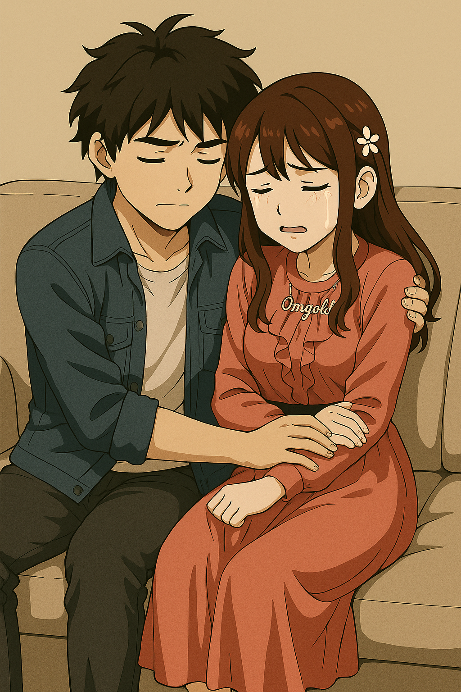
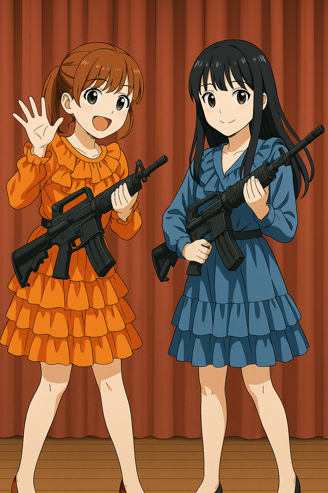
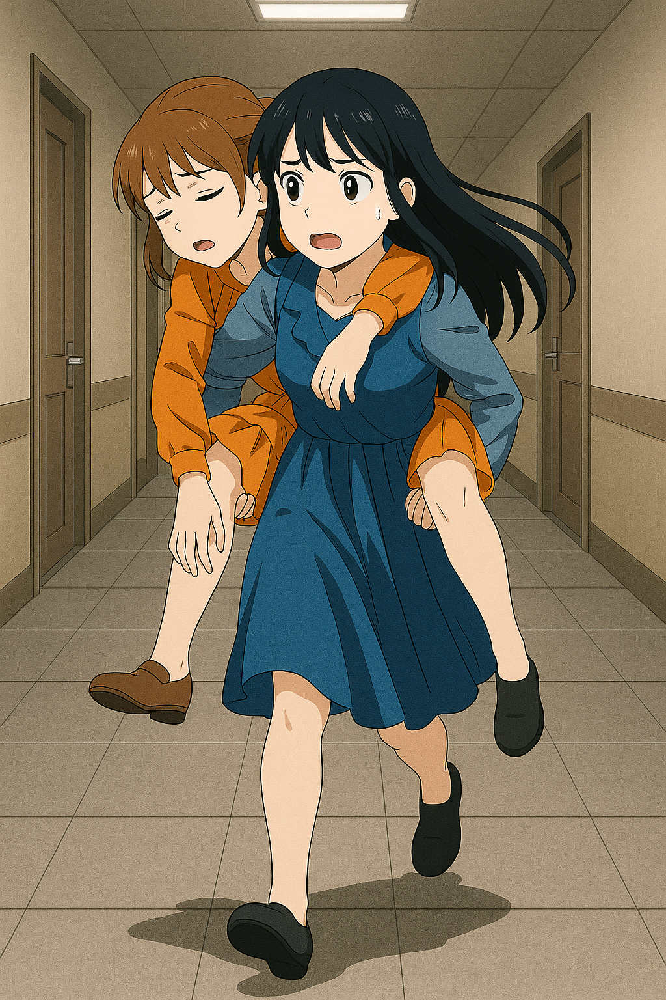
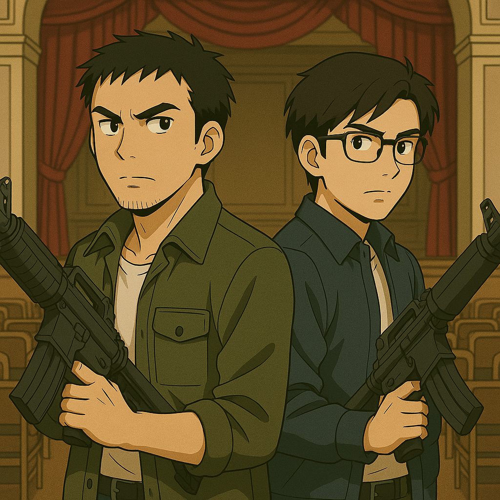

## 第三章：鲜血
为期一周的访学过去了一半，唐海对台清的调查还是没有丝毫头绪。而演唱会的日子倒是来了，定在了傍晚六点，台清大礼堂举行。环能院院长早上送来了三张第一排的VVIP票，并说是宫知遥小姐亲手送的，盛情邀请他们过去。唐海本对年轻人的东西没有兴趣，但想着程致远会喜欢便收下了。谁知道这小子竟装起了逼，下午开始就把自己关在房间里不出来，说是要改进一个算法，到了傍晚则干脆称肚子不舒服，演唱会就不去了。唐海也没多想，就带着沈柏言去了。礼堂很大，来的人却不多，第一排更是只有他俩。正觉得奇怪的时候，演唱会开始了。三位女孩分别穿着粉紫色，薄荷绿和琥珀金的表演服亮相，热辣性感地出现在舞台上。宫知遥对着麦克风喊道，"谢谢校友们能在期末考试期间依然来支持我们，祝在场和不在场的大家学业都顺利！！"唐海这才想到现在是六月考试季，难怪人这么少。加上女孩们用了一首她们的成名作lively引爆全场，气场全开，歌词里满是"缤纷色彩"，"活力满满"这样的字眼，让唐海也放松了下来。"毕竟她们也是台湾的年轻人嘛，对我们有点敌意也很正常。可能确实是我想多了吧！"。唱完后就来到了短暂的休息，再开始时，橘子悠和白緒寒回来继续演出，但宫知遥却不知踪影。

而程致远，当然既不在写算法，也没有肚子疼，而是在等着一场约会。六点二十左右，房间的门被敲响了，他急忙去开门，而门口正是他朝思暮想的宫知遥。房门关上的一刻，程致远几乎不敢相信眼前的真实。她来了——还穿着台上那套粉紫色的造型裙，连灯光的余温都没散尽。他刚要开口，却被宫知遥紧紧拥住，说，"我想和你聊聊我的故事。"程致远有些吃惊。两人坐在沙发上，月光透过百叶窗映在她光裸的背上，她的声音轻缓，带着一种决堤前的克制颤抖，"其实，我是个朝鲜人，十二岁之前一直在平壤长大。十五年前，战争毁了我的一切。一个机动兵器毁了我的家......我失去了父母和弟弟，只剩我一个人，被人从瓦砾堆里拖出来。我还记得那时我看到的天空——是紫色的，像死神在笑。"她看着程致远的眼睛："而我的家成了一片废墟，我自己虽然侥幸逃脱，但也受到核辐射影响，头时不时隐隐作痛。之后我的世界一片灰暗，哪怕后来辗转到了台湾被收养，哪怕进入了台清，遇到了我的姐妹们出道，我也从来没有真正地开心过，直到遇到了你，你明媚的笑容从那天起就感染了我，我不由自主被你吸引......你能接受这样残缺的我吗？"

程致远几乎没有犹豫，一把抱住眼前楚楚动人的宫知遥："当然，小遥姐，我愿意永远保护你。我希望......以后你悲伤的时候，我能陪着你，一起替你承担那份痛苦。""谢谢......"宫知遥低声回应，眼里泛着雾气，正准备吻上去。却被程致远那格外认真、格外温柔的眼神拦住了。他像是想了很久，又像只是顺着心意轻声补了一句："如果，哪天你真的痛了，想要放手也没关系，我会等你先放手。"宫知遥怔了一下，眼神轻微震动，仿佛这一刻真的犹豫了什么。然后，她慢慢伸出手，扶住他的脸，缓缓贴上他的唇。唇齿间有苦涩，也有一种像是命运弥散的味道。他们沉默地靠在一起，一切静得诡异而温柔。时间似乎失去了刻度。

忽然，她俯身贴近他的耳边，语气温柔得像在哄孩子入眠："你愿意信任我吗？完全的那种。"林致远轻轻点头，闭上眼睛。他没看见，她已将手悄然搭上自己脖子上的月牙吊坠，轻轻旋转了一下。吊坠滑开，露出银白的锋刃。她低头吻在他颈边，唇停顿了两秒，随即动作如风，左手封住他口鼻，右手一线而过。没有多余力道，没有重复动作。利刃割破了动脉，也割断了他满怀憧憬的一生。血顺着宫知遥的指尖流下，她抱着他的身体轻声说："谢谢你，让我知道，我不是完全无法被爱。"然后，她起身，神色平静，取走了沙发旁的那台手提电脑。

演唱会的灯光晃动着，电子节拍一浪接一浪地砸在礼堂的墙面。唐海靠在椅背上，本来只是出于礼节陪同，渐渐却有些走神。这几天的调查无果，他一度怀疑自己是不是老了，反应慢了。而台上的音乐似乎让他回到了学生时代，那个看着赵以宁脸红、与林砚斗嘴的年纪。可已经过去了五六首歌，主唱宫知遥却依旧没有回到舞台。这两天他被迫听着程致远的叨叨，不得不对这支女团以及背后的历史有所了解。这个组合的成员来来去去，最终才好不容易成型，而这多亏了宫知遥的坚守，说是整支乐队的灵魂也不为过，当然也拥有最多的粉丝。因此，最受欢迎的主唱只唱了一首就连续缺席那么久，这种情况实在不寻常。他眉头微皱，习惯性地启动脑机接口，调动轻微的心电波探测——空白。舞台周围的同步波静得异常，反而让他更加不安。"沈柏言。"他低声唤。年轻的研究生坐在旁边，神情也有些迷惑，"老师，她们主唱是不是出事了？"唐海没有回答，只是顺手理了理袖口。那是他下意识的信号——准备行动。就在下一首曲目结束，灯光渐暗的瞬间，橘子悠和白绪寒动作一致，从舞台一侧的放水台与化妆品工具箱下，抽出了两把机枪。动作干净利落，显然不是临时起意。空气仿佛在那一刻凝固了。学生席上爆发出低声惊呼，逐渐汇成一片骚动。橘子悠依旧挂着偶像标准的微笑，声音甜美却冷冽："各位同学不要慌，我们学校正被间谍入侵，已经锁定目标，请无关人士立即有序撤离。"广播同时响起，机械的女声反复播放："校园已进入应急疏散程序，请全体师生立即离开学校。"学生们开始朝出口奔去，脚步声、椅子碰撞声混杂。人潮混乱，却又在广播的"安抚"下不至于失控。这是经过心理战术设计的驱散——避免不必要的媒体曝光与恐慌。唐海刚要站起，脑海里一阵刺痛。同步波！比白天晚宴时那次更强，带着精准的定位意图。"咔哒。"他侧头，四名学生模样的青年，臂膀已被黑布缠住，枪口稳稳指向他的腰侧。他们的步伐、武器握持、视觉锁定——不是新手，是专业的近战围控队形。沈柏言手下意识地探向外套下摆——空的。他低声苦笑："老师，我们为了坐飞机，这次没有带武器。"唐海不说话。他缓缓举起双手，冷静地扫视四名武装者。心电探针捕捉到他们的脑波——训练过的抑制模式，信息屏蔽，无法读取。而台上的橘子悠，仍带着那个甜美的、训练出来的、伪装的笑容。只不过，她嘴角抿得更深了。

舞台上灯光冷冷地扫过。橘子悠与白绪寒缓缓端着枪，从台阶一步步走下，动作优雅得几乎像彩排好的舞蹈。可黑色枪口的寒光提醒着每个人——这不是舞台剧。后排，黑衣人们早已堵死了出口。他们的身影隐藏在人群散去的阴影里，像噩梦中无声的狩猎者。唐海目光扫过四周，心电同步的探针轻轻启动。一片混沌的心理噪音——压抑、恐惧、屈服的情绪覆盖了整个礼堂。这是对方有意制造的心理压迫场。而橘子悠走到他面前，笑容完美，嘴角却在微微发颤。那不是因为紧张。是激动，是仇恨。这时，环能学院院长步履从后台走出，脸上带着和煦的笑容。"怎么样，唐教授。"他的声音低沉且愉快，仿佛只是学术交流的延续。"在台清，找到你想要的东西了吗？"唐海一时语塞，但他知道，拖延时间，比一切更重要。院长自顾自地说下去："你们难道不奇怪，这种局势下，你们的访学申请为什么会被批准？还是你亲自带队，唐海——朝鲜战争的元凶，MB领域的元老。"他的话像刀锋，试图刺破唐海的心理防线。听到"元凶"两个字，沈柏言不由自主地瞪大了眼睛，难以置信地看向老师。但唐海的表情冷得像钢铁。"信息。"院长伸出一根手指，点在空气中。"我们的优势，从来不是技术，不是系统，不是偶像——而是信息。"
唐海轻轻开口，声音稳如山岳："现在还不开枪，说明我们手里有你们想要的东西。说说吧，是什么？"
院长大笑："不愧是你！"他目光扫过唐海和沈柏言，继续说道："你是你们小组负责模块化便携式核能的专家，你身边的年轻人是超远距离精准光束武器制导的核心。至于你们团队的另一位......"白绪寒抢着说道，"遥遥姐应该已经搞定他啦，从他那天看着姐姐的眼神，我们就知道，我们吃定他了！"橘子悠说道，"虽然同样的诱敌战术对你们无效，但现在你们已经在我们的控制之下了，现在请你们跟我们回房间，把你们笔记本电脑里的内容交出来吧！"

而这时候，宫知遥也不轻松。她来不及擦掉身上的血迹，打开程致远的手提。不出所料，指纹解锁，她抓着程致远的手，解开了电脑，费了一些功夫，找到了他的感应式脑机接口的全部资料。她从随身带着的包里找出发信器，把资料往台军资料中心。但这台电脑显然有些极高的自我保护意识，一旦发现有资料往不明终端传送，就每十秒要求一次指纹解锁。她把程致远的指尖按在解锁器上，随着电脑"滴"的一声再度亮起屏幕，她抬头看了一眼时间——还有11分钟。每十秒一次验证，这意味着她还要......至少面对六十七次尸体的残温。她本该麻木。但不知为何，每一次触碰，那只手就越来越像真的握住她的手，像在说："没关系，我会等你先放手。"她咬了咬牙，没有哭。事到如今，带着尸体跑已经来不及了，脖子上的月牙小刀也不可能快速切割手指，宫知遥只能守在原地，静静等待资料传送，并祈祷妹妹们可以拖住唐海二人久一点。

白绪寒半开玩笑地举起枪，轻轻顶了顶沈柏言："工程师大人，我们走吧。"她的语气里混杂着调皮与命令，像是在邀请舞会，而不是押送人质。第一次面对真实的武力威胁，他的手指微微颤抖，但努力装出冷静。"老师......"他低声唤道。唐海用余光制止了他，只是微微点头。沈柏言的手下意识收紧，虽然心跳在加速，但脑海里已经开始计算对方的行动路线和可能的反制方案——这正是唐海多年训练的成果。橘子悠笑了笑，笑容逐渐收敛，手微微发抖，枪口直指唐海的义肢："十五年前，就是你破坏了我们的家园，杀害了我们的家人！拜你所赐，我也成了核辐射的受害人，而每当想到你还活着，我的头就不由自主地痛了起来！"
那一刻，橘子悠的心理屏蔽失效。从汹涌的脑电波中，唐海的脑电同步感知读取到一连串混乱的情绪：恐惧、仇恨、悲伤、以及深埋的——对"活着的渴望"。唐海深吸一口气，冷冷回应："如果痛觉还在，你至少还是个会思考的人。可惜，你把思考让给了仇恨。"
橘子悠瞳孔一缩，正要反击，突然，啪！枪柄下的金属片触发，唐海义肢释放出强电流。电光划破空气，击中橘子悠的手臂和神经枢纽。她发出一声短促的惊呼，整个人瘫软下去，枪掉在地上。唐海的义肢包裹着残余的电流，而五根手指的指尖，各有一个无法轻易看到的金属片，一旦接触，电流就可以从那里迅速释放出来。唐海趁机从瘫软的橘子悠那里夺过枪，反手一枪托，打掉了旁边分神的白绪寒的枪，以及一枪撂倒了台上的院长。沈柏言几乎在唐海动手的瞬间理解了信号，他扑向地上的枪，出枪的速度比十五年前的唐海更快。几乎是条件反射般，扫射门口的黑衣人，四人同时中弹倒地！唐海缓缓呼了口气。"干得不错，沈柏言。"但下一刻，他脸色一变。两个女孩的身影已经消失了。幕后的通道里，白绪寒正背着半昏迷的橘子悠向楼外跑着，橘子悠迷迷糊糊地说道，"真是，每次都给你添麻烦......"
她的手虚虚地捂住腹部，刚才的电击让神经系统紊乱，但她强忍着剧痛。白绪寒则边跑边说，"姐姐你在说什么呀！我们三姐妹本来就是一家人，什么麻不麻烦的。倒是你现在这样，还能启动那个吗？"橘子悠点了点头。

回到剧场，沈柏言一边从地上的黑衣人身上收集子弹，一边头也不抬地说："老师你属皮卡丘？还能电得人神志不清。"唐海翻了个白眼："怎么，你还想死在这儿？"沈柏言耸耸肩："倒不如说，至少不是被唱跳俱佳的偶像干掉，算我死得体面点。"
唐海叹了一口气：唐海叹了口气，声音里透出一种疲惫："她们不是偶像。只是......被政府逼着拿枪的孩子。"他俩望着这里一地狼藉，忽然发现，台上的院长还在动——他挣扎着想要站起，却只是微微抽搐，喉咙发出低哑的喘息声。唐海几步冲上去，一把揪住他的衣领，把他从地板上拎了半坐起来，他张了张嘴，却忽然发现，自己不知道该说什么。只吐出一句："新朝鲜战争......你们就是这么告诉学生的？一个来自中国的'不明机体'摧毁了整个北韩？"
院长咳出一口血，嘴角泛着铁锈味的笑意，声音断断续续，气若游丝："你......你觉得......兵......器......有......必要......知......道......"他还没说完最后一个词，瞳孔已经开始扩散，整个人像被系统强制关机了一样，一秒内，彻底失去意识。唐海怔怔看着他倒下，那只义肢微微收紧，指节在无声中颤抖。

