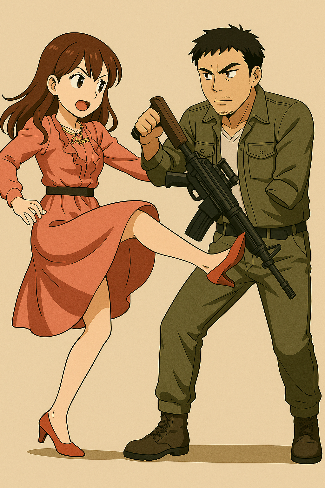
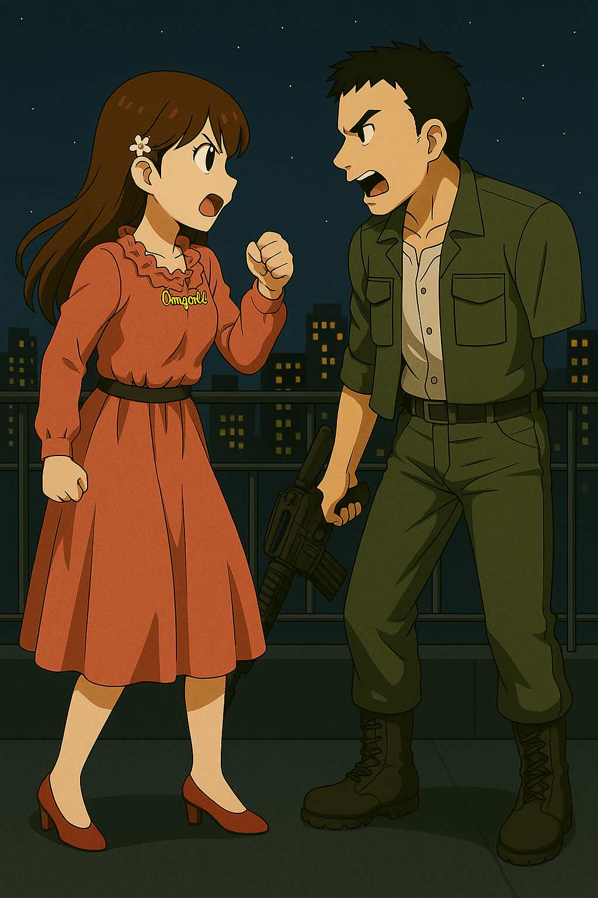
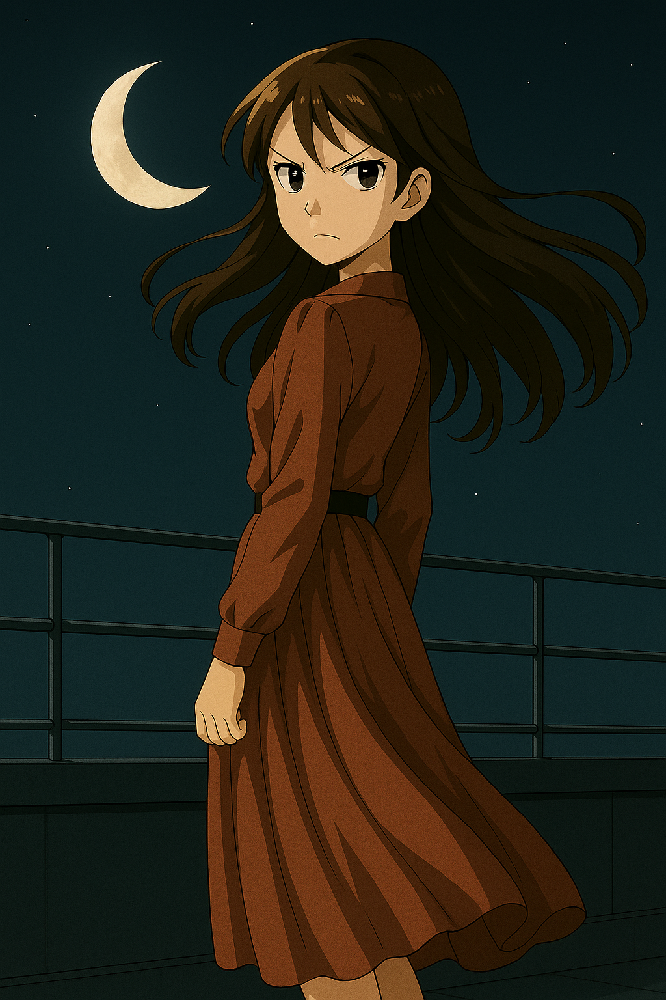
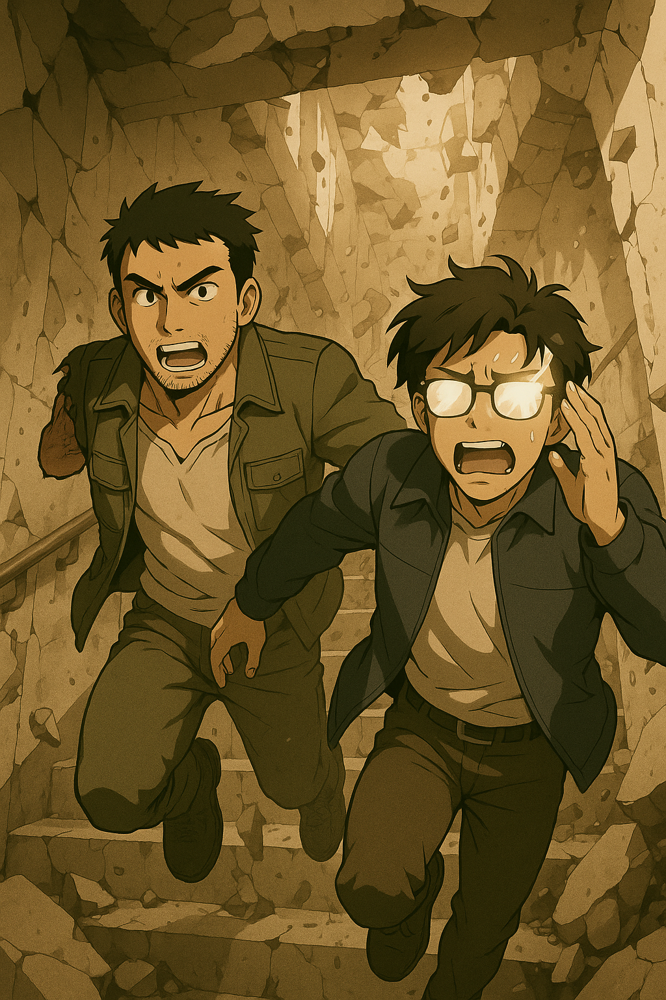
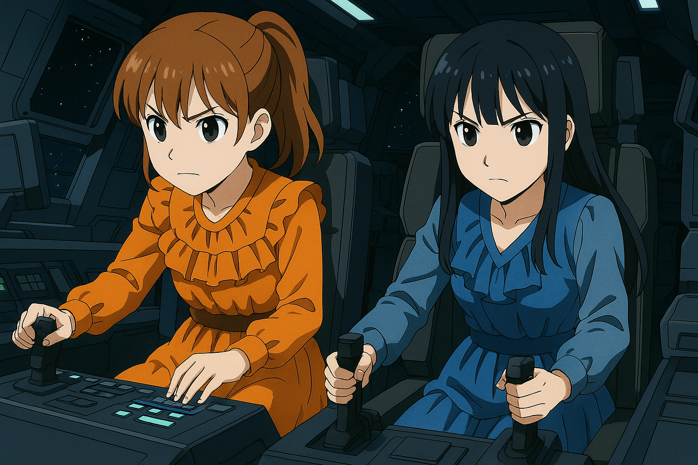
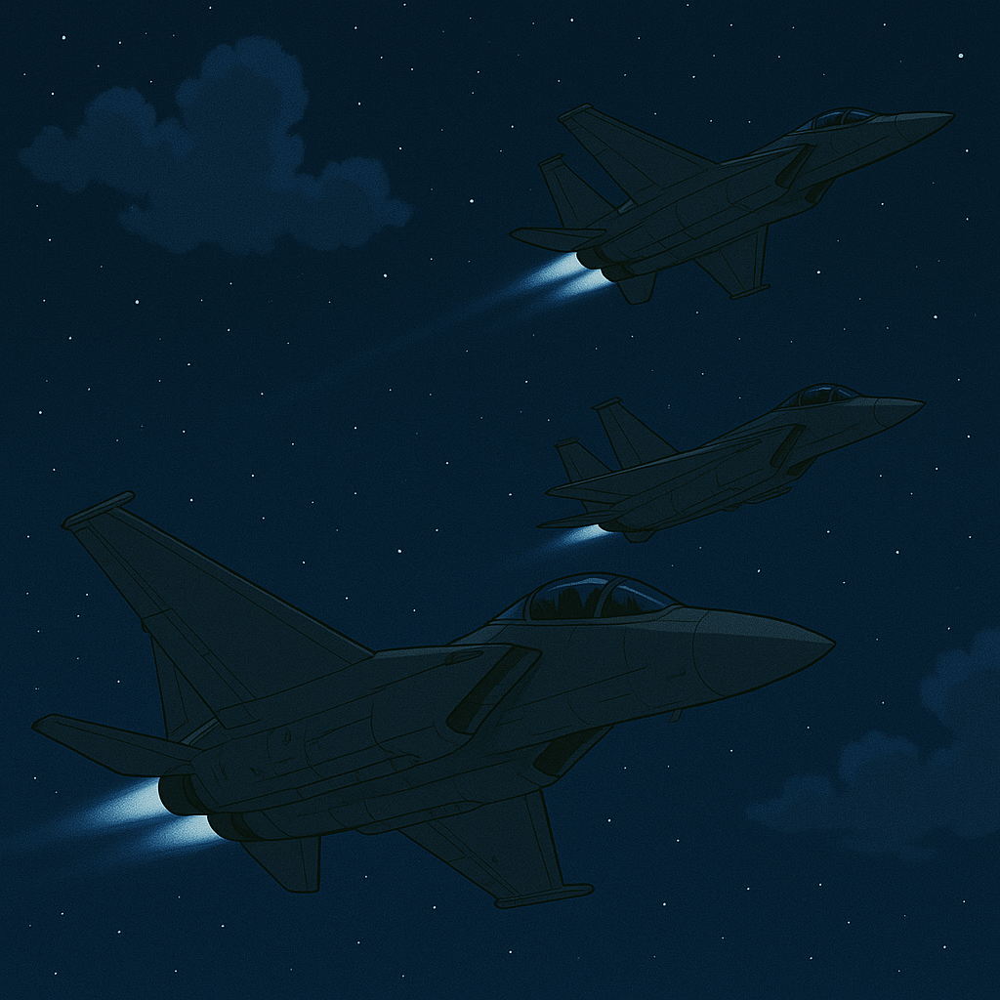

## 第四章：月光
这时候，唐海低呼一声不好，意识到程致远估计出事了！他赶紧提着枪，带着沈柏言往宿舍赶。两人沿着夜幕下的校道狂奔，脚步在空旷水泥路上回响。沈柏言抢在唐海身侧，一边提枪一边问："老师，我们小时候历史课学朝鲜战争，那就一页，说南韩吞了北韩，连我们国家都没怎么提过。可她们刚才骂你是元凶......什么意思？"唐海无法短时间里解释清楚，只能模糊地低声道："那年我们送了一批新武器给朝鲜......结果被误用，最后演变成核冲突。出事那天，我的试作机正好在现场，是我启动了它......拦不住。"他顿了顿，苦笑："我是背锅侠。"沈柏言沉默片刻，忽然轻轻一笑："怪不得。我前两天去他们图书馆闲逛，看了本他们的中学历史课本。上面写得挺详细——说是一架来自我国的'不明机体'冲进北韩军总部，血洗了整个北韩军队，导致南韩趁虚而入。我还在想哪个猛人能干这种事......搞了半天，是您呐？"唐海轻叹一声，眼里却没怒火，只有更沉的疲惫："看来他们不只是对所谓的兵器隐瞒了真相，是对下一代都封锁了历史。不管是哪种政府，都一样。不管披着怎样的外衣，操控的，始终是人。"
沈柏言虽然在笑，但手握枪托的手指，不自觉地收紧了。他明白，这不是玩笑，是战争的影子终于走到自己脚下。

唐海二人不动声色地抵达了宿舍六楼。六楼安静得诡异，像是空气本身都被抽走了一样。唐海尽可能沉下心去感受，他的耳朵听不见脚步声，但神经里却响起了脉搏的回响——不是他的，是另一个人的，是宫知遥的。而在房间另一边，宫知遥跪在地板上，一手压着程致远的手指，另一手已将那把袖珍手枪上膛。她不动，但瞳孔收缩，心跳陡然下沉。她听到了一阵不像声音的东西穿透过来，像某种频率下人类本能的共鸣——那是唐海。"来了。"她在心里默念。她知道，这不是他靠近了她的房间，而是他们的神经频段终于又重叠了。唐海让沈柏言在楼梯和电梯口附近断后，自己往他们的房间慢慢摸过去。

唐海一脚踹开了程致远的房门，看到了让他痛心疾首的一幕，房间里到处是喷溅的血液，而自己的爱徒就躺在血泊中不省人事。但他不敢轻举妄动，因为他感知到宫知遥就在这里。突然冷不丁的砰的一声，子弹从右上角向唐海射来，唐海来不及躲闪，举起义肢格挡。好消息是人没事，坏消息是义肢碎了。随着枪声，宫知遥一个翻滚从衣橱上下来，一手月牙刃刺下去，同时高抬腿露出了高跟鞋后的刺刀向唐海划过来。唐海用枪托格挡住了，但因为只有一只手能拿枪，连挡两刀的他没站稳往后一倒。但宫知遥没有恋战，急忙往外面跑去。唐海注意到了刚才宫知遥枪里掉下的弹壳，刚拿起来琢磨了一下，却猛地一回头，看见血泊中的程致远，心如刀割，几乎要跪下。此时，他又立刻注意到桌上的电脑屏幕还在闪动，红色进度条跳到——98%。"不......不行！"他几乎是撕吼着砸下去，抡起手枪砸碎了键盘、显示器，硬生生切断传输通路。电子火花在空气中爆裂。唐海捂着额头，几乎站不稳。他不知道毁得够不够，只知道已经晚了。这时，他又听到了几声枪响，以及"啊"的一声，急忙追了出去。到了电梯口，他找到了痛苦地捂着眼睛躲避的沈柏言。沈柏言刚准备摸枪，唐海急忙低声说道，"是我！你怎么了？"沈柏言放心下来，说道，"那个该死的女人本来想往这里跑，看到我在这里，扔了一颗闪光弹，我现在看不见。"唐海问，"那你最后看到她去哪里了吗？"沈柏言指了指走廊的另一端说，"似乎往天台去了。"唐海说，"知道了，我一只手现在不方便，你帮我这把枪子弹填满。"沈柏言摸索着帮忙填完子弹后，整个人软了下去。唐海把他安顿好说，
"你休息会儿，我去追她。她杀了致远，但天台那里只能上不能下，她跑不掉了。"

唐海单手提枪往天台追去，并试图通过感应来寻找宫知遥。宫知遥似乎也没有试图掩藏自己，一边往上跑，一边时不时地对着楼梯下放冷枪。唐海单手扶住墙体，感知的过度使用让他太阳穴一跳一跳，但程致远倒下的画面仍在脑中震荡。他不能倒下——不是为了赢，而是为了问清楚。他大喊道，"宫知遥，你就带着一把有六发子弹的小手枪，现在已经射了三枪了吧？你没有带包，身上应该只剩下一些近战武器，你逃不掉的，投降吧！"前方楼道突然回响一声短促的枪响，子弹打在扶手旁，激起一串火星。紧接着，她的声音从楼梯口幽幽飘下："你上来吧......你一定有很多问题想问我。"唐海咬了咬牙，继续迈步而上。一霎时，唐海觉得自己回到了柳京塔。只不过那时候他在前面逃，这次他在后面追。每一步，都是一场过去与现在的交汇。唐海终于还是追到了天台。他一脚出踹开天台的门，弓着腰往前赶，又躲掉了一颗子弹。为了安全，他尽量让脑子留白，不思考任何东西，让对方感知不到他，但他也感知不到对方了。这时，他躲在一个天文观测镜后，悄悄脱下自己的上衣，往左边扔去，同时人往反方向跑。砰的一声，风衣被击穿了，而他也果断跳出去对着子弹过来的方向开了一枪，不偏不倚，打掉了宫知遥手里的枪。

唐海站在屋顶中央，单手举枪，微微喘息。宫知遥的手枪已经飞出屋檐，她却没有看那边一眼，只是缓缓站直了身，抬头看着夜空那轮下弦月，然后再低头，看着唐海。她微笑，语调柔和，像是给出谜底："你是想问我......是不是恨你？因为你破坏了平壤？"唐海心头一震。同样作为感知者，唐海只能大概感知到被感应者的方位以及一些模糊的情绪，她却能精准地说出他脑海中的念头。他忽然意识到：宫知遥的感知能力在他之上数倍！宫知遥继续说道，像是在做最终告别："首先我佩服你。能在我能几乎感知你的所有想法时，单靠身法把我逼退，还能精确算出我的弹量，更别说你那么了解枪械......我确实只有六发子弹，你看得出来。毕竟偶像随身背的小包包，放不了太多东西。"
然后，宫知遥又一笑，"大博士，你把枪放下吧，一只手端着也够累的吧？"

宫知遥看着唐海慢慢放下枪，声音低沉却清晰："我比其他两个妹妹大六岁。那场战斗......我记得的，不是火光、不是哭声，是你那台机体——它没有对准民居。我看过我们军方的机密档案......我知道，那颗核弹的发射按钮，是我们政府按下的。"唐海手一抖，枪身划过一条弧线，落在脚边。"那你......你为什么还......"宫知遥脸上的笑容散去，眼神骤然凝重："因为你们又来了。"她一步步走向唐海，不再防备，也没有敌意，只是那种深沉的质问："你、你们，或者说你们国家，为什么又一次把我们拉到了战火之中？"

唐海想辩解，想反驳，但最后只能低声说出一句："你知道......我也是被软禁的......由不得我......"宫知遥原本淡然的神情骤然冷却，眼神如夜风般锋利："所以你就选择听命于你们政府？让他们把你当兵器一样用，再一次去侵略别人的国家？"唐海感觉头隐隐作痛，不知是残留的感应副作用，还是话本身太刺耳。他挣扎着说道："从法理上说......台湾确实是......"话还没说完，就被宫知遥冷冷打断："什么法理？中华人民共和国宪法吗？"她一步一步逼近，语气越来越锋利："一个地方的归属，不是那里的人民决定的吗？你觉得今天有哪个台湾人，会愿意说自己是中国人？你们和我们早就不一样了，文化不一样，制度不一样，我们是民主政体——而你们政府，是彻头彻尾的威权体制。"她望着他，一字一顿："你们天朝上国的美梦，该醒了。"

唐海抬起头，眼神终于带了点怒意："你以为你们的政府是好东西？你看你们历史书——对于新朝鲜战争，写得我像什么？一机端掉整个北韩军队，把我写成超人？你们就不是在用谎言教育你们的孩子？你们这么写我，不就是因为我是个中国人吗？不就是为了把我们塑造成一个好斗的国家，给你们反对我们提供合理性吗？"宫知遥轻轻摇头，声音却没有动摇："我从来不相信政府。"唐海愣了一下，不解地问："那你和你妹妹们......还不是在替你们的政府卖命？"宫知遥露出一个释然的笑容。那一刻，她像是把什么重担从心里卸下："你错了。我一直只为了台湾人民的幸福奔波，因为这里，是我的家。"

唐海终于忍不住了，他咬紧牙关，声音甚至带着一丝失控的愤怒："你太天真了！即使台湾彻底独立，一个这么小的岛国......你们能干什么？你们就是美国的第一岛链，中美一打仗，第一个被推上火线的就是你们！被美国佬按在地上操，就那么爽？！"宫知遥却一如既往地冷静，她没有退，也没有急，只是望着漫天的繁星点点，说道："我们会选择继续战斗。属于我们国家的战斗。"
唐海没有说话，语气中那一点点积压的愤怒仍在空气里震荡。他不是嘲讽，她也不是逃避，但两人之间的立场，宛如铁轨，已注定不能交汇。宫知遥望着他，眼神没有敌意，只有那种踏实而坚定的悲悯："我知道，你一个大国来的博士，会觉得我们天真。"她稍作停顿，仿佛在确认唐海是否听得进去，然后才平静地、认真地说："但我们有选择怎么活的权利。"

唐海咬着牙，心里翻涌着无数情绪，但他已别无选择。他举起枪，声音低沉得像金属落地："宫知遥......这一次是你们输了。我不想杀你，我劝你，和我一起回中国。"宫知遥轻轻笑了一下，却不是嘲讽。她的声音淡得像风，又重得像铁："不好意思，赢的人......是我。你大概看到了，程致远电脑里的资料我已经基本传输完毕。"她转身，走向天台边缘。脚步很轻，但每一步都像穿透唐海的心脏。她停下脚步，头也不回地说："还有，程致远......他其实很可爱。我承认，我有一瞬间......对他动了心。"唐海瞳孔一震，刚想喊什么，却已经来不及了。她轻轻一跃，像落入黑夜的羽毛。唐海惊呼着跑到天台边缘看下去，只看到一朵血红色的大丽花。

唐海正觉得一阵失神，忽然，一阵撕裂灵魂般的压力从远处袭来。他抬头望去，瞳孔一阵收缩——一台高达二十多米的巨型MB，缓缓踏入视野。它通体泛着紫光，炮口遍布全身，活像一只来自深渊的钢铁刺猬。五门巨型主炮直指宿舍楼，弹仓震颤，那种精神撕裂力让唐海几乎窒息。那熟悉的精神压力——是橘子悠！他脱口而出："卧槽！！"转身狂奔往楼下跑去。与此同时，这台叫做援星的MB内部的橘子悠紧盯着远程感应显示，神色一变，声音颤抖："姐姐......她......她不在了......"白绪寒低头看向前方监视器，只见楼下的台阶旁，宫知遥那早已血肉模糊的身体，像一朵断裂的大丽花，枯萎在黎明前的风里。橘子悠轻声说不出话，白绪寒握紧操作杆，指令信号闪红。两人同时失控地喊道："杀了他们！！！"下一秒，五门炮口和无数飞弹同时对准宿舍楼，一阵疯狂的轰鸣撕裂天际。唐海几乎是卯足了平生最大的力气狂跑，因为稍有不慎，身边的墙，地上的路就会塌陷。他赶回六楼，看到稍稍恢复了一点的沈柏言，就搀扶着他一起跑。子弹和导弹犹如无尽的怒火宣泄在宿舍楼上，一切都在崩塌。"操操操操操——！""卧槽——快点快点！楼要塌了！！"两人一边跌撞一边狂骂，一边从断壁残垣中穿行而出。唐海搀扶着沈柏言，狂奔到楼外，宿舍楼在他们身后彻底崩解，尘灰遮天。他停下脚步，抬头望向那台高空漂浮的刺猬MB，炮管冒烟、弹夹滴油，像是在哭、在咬、在怒吼。他用尽全身感知力，对准橘子悠喊道："橘子悠！！这不是你姐姐希望守护的未来啊！！！"风将话卷走，精神回路却一片死寂。下一秒，主炮再度亮起——回应他们的，是一轮火雨。但这时空中划过一阵尖锐音爆，三架喷气式战斗机自东南方向快速逼近，其后，紧紧跟着一架黑甲涂装的重型武装直升机。唐海擦去脸上的血污，看清了涂装上的国旗，瞳孔一缩："......是中俄联合演习的军队！"

三架喷气战机高速掠过，火舌划破夜空，精准命中援星正面。"轰——！"一阵烟尘掀起热浪，宿舍废墟再次震动。"打中了！"唐海屏息凝视，但烟雾散尽的瞬间，他的心，沉了下去。那台巨大的MB，依旧挺立。它周身浮现出一层扭曲闪烁的紫色电弧，如同高压水银流动，将全部攻击吞噬于无形。"这是......电磁场？？"唐海喃喃。此时，轰鸣声中，直升机悬停在地面十米处，绳梯刷地一声垂落。紧接着，一个破锣嗓子怒吼道："操你妈你们命还真大！快上来啊！！！"唐海猛一抬头，脸上第一次出现了笑意："林砚！！！"

三架战斗机配合非常默契，看到巨型感应MB毫发无伤后立刻改变作战队形，分开冲上高空，再分别俯冲下来打骚扰战+车轮战。这种战斗似乎起到了效果，电磁防护罩有一定的冷却时间，巨型感应MB的机动力似乎也十分有限。虽然这台机体坚实的外体也不至于被轻易打穿，但确实实实在在地承受了子弹的进攻，三人的队长的一发炮火还导致了刺猬炮管被击中。而唐海也说时迟那时快，拖着沈柏言向绳梯跑去。沈柏言差点因为看不见而走错方向，唐海猛地用他仅剩的左手狠狠拉了他一把，抓上了绳梯，而自己也用尽最后的力气扑了上去，一只手两条腿勾住了绳梯。"哟呵！牛逼！"林砚不由得大吼一声。唐海则也回应道，"怎么样，老子不减当年吧！"直升机救到人后便赶紧脱离作战区域，并快速收起绳梯，而毕竟在敌人的地盘，三架战机也并未恋战，掩护着直升机撤离。巨型感应MB也没有追上来，而是退守海岸线，同时，整个台湾岛拉起了防空警报。

