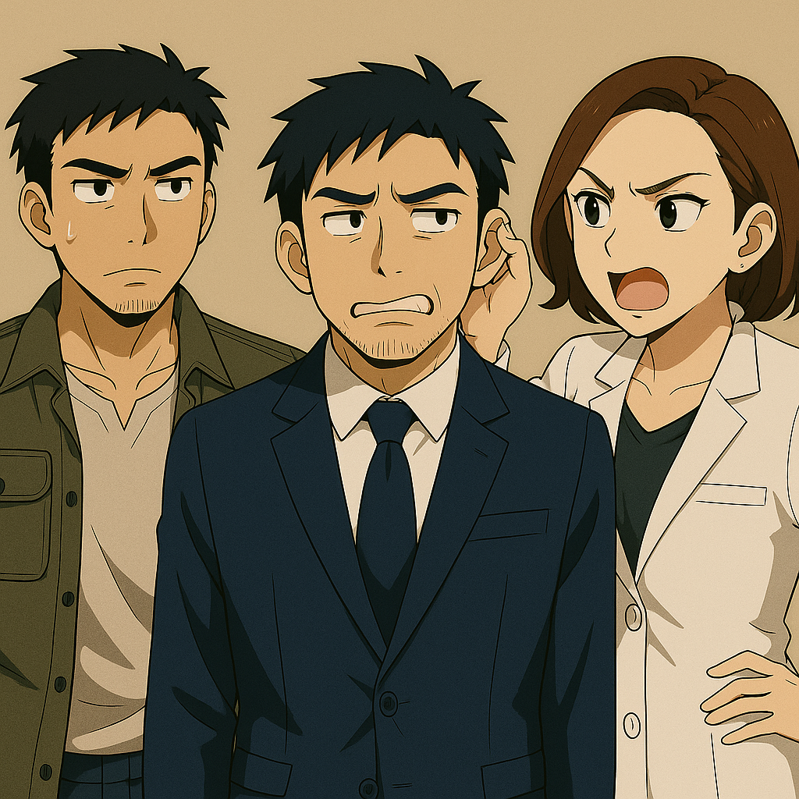
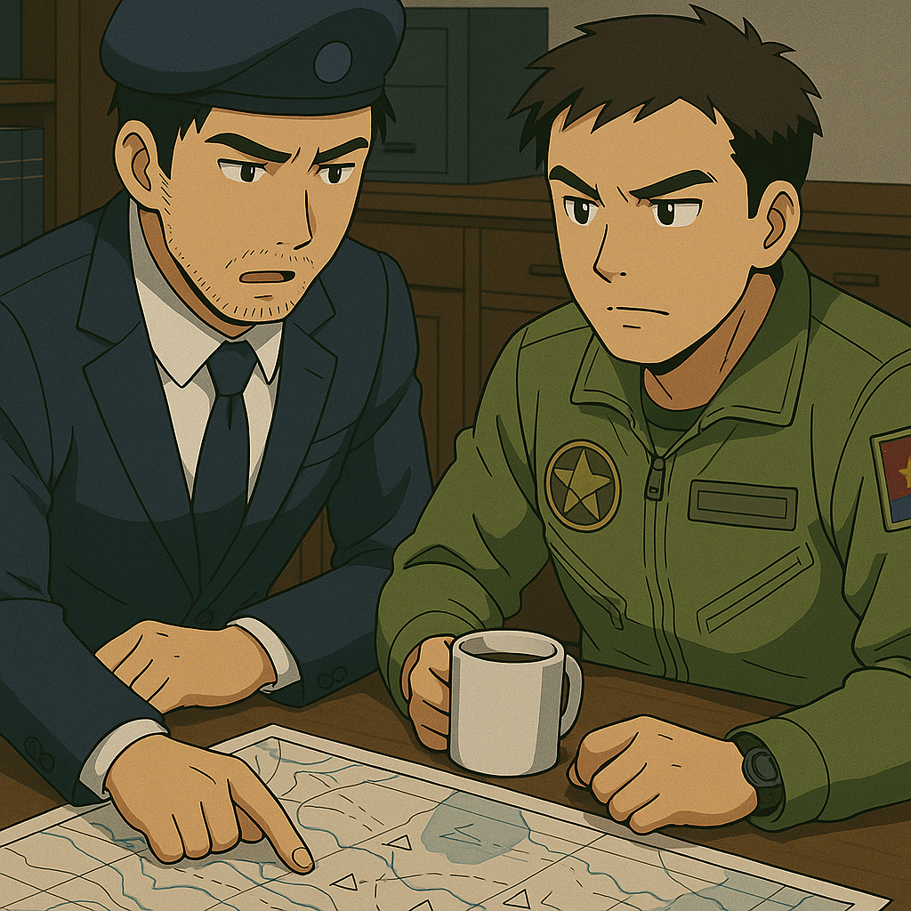
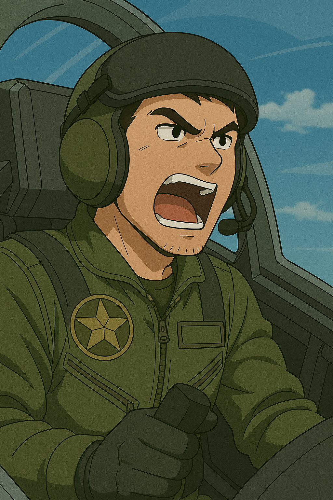

## 第五章：初征
"您要求我们军费抬高到GDP的5%，以及要对我们的产品征收32%的关税是什么意思？？"台湾总统府内，总统正对着电话那头的美国总统咆哮，"而且您还以刚上任为由，近一个月内不打算积极协助我们军方？我们和对岸的战争根本不用一个月，一个星期内必然就开打了！"电话那头，美国总统则懒洋洋地回应道，"总统先生，5%并不是很高的数额，我们国家在贵国的驻军也是要吃饭的。关税也是我竞选初期就给选民的承诺，当然你们是我们的盟友，我们可以再谈。但我军这一个月内，不可能协助你们任何军事行动，不然我的选民怎么想？对手也会趁机把我抹黑成好战分子～"气得台湾总统骂了一句甘霖娘后撂下电话。虽然无可奈何，但即将开始的台湾面对中国的遭遇战，台湾恐怕只能依靠自己现有的兵力了。

而台清大学地下的技术研究室内，则是另一幅光景。昏暗的灯光下，橘子悠和实验人员正在围绕主控台，反复调试、解析程致远留下的那份精神感应式脑机接口资料。大屏幕上，代码流滚动得像潮水，每隔几秒，右上角都会跳出一个提示："同步失败。逻辑缺口：2%。"白绪寒站在橘子悠身后，手指紧扣着记录板，指关节发白。"还有两百毫秒的延迟，"实验员低声汇报，"不稳定区可能在......感应信号的情绪阈值调整部分。""再降低0.1赫兹。"橘子悠声音冷静，但每一个音节都透着疲惫。这是第十二次尝试。连续几天的测试，让每个人的神经都如弦般紧绷。白绪寒低声道："姐姐，也许......这份资料缺失的部分，真的只能靠我们推测。"橘子悠摇了摇头，额角贴着冷冷的神经接口，她低声说："不是推测。"她感觉得到，这不是算法的问题，是⼈的意志。这时，白绪寒突然轻轻地牵起了她的手，似乎是鼓励，似乎是担心，但又似乎包含着更深沉的情感。橘子悠闭上眼，脑内呼吸与心跳同步。她想起了十五年前的废墟，想起了宫知遥蹲在瓦砾旁，牵起她满是血污的手。她想起了宫知遥说过的那句话："橘子悠，让你活下去的不是脑袋，是心。"想到这里，她又看向旁边白绪寒的眼神。数据流在下降，但她的精神波反而稳定下来。主控台上的实验炮，忽然传出"咔"的一声。操控台亮起绿色灯光。磁轨线圈开始启动。不是工程师下的指令——而是她的意志驱动。橘子悠睁开眼，低声道："锁定目标。"炮身随着她的意念，腾空而起，缓缓移动。目标靶标——300米外，模拟远程战场障碍物。白绪寒猛地抬头："小悠姐......""发射。"橘子悠轻声。磁轨炮炮弹撕裂空气，精准命中目标中央。爆破声在实验室外的走廊都能听见。空气中带着金属与电弧的气味。白绪寒一把扑过去，紧紧抱住橘子悠，声音里带着压抑不住的颤音："小悠姐，你成功了！"橘子悠也激动地拥住白绪寒，一种奇妙的情绪似乎在空气中发酵。她的眼神越过测试台，望向实验室尽头的玻璃窗。外面，夜色浓黑如墨，唯有繁星点点，照亮沉寂的长夜。她仿佛看见宫知遥站在那里，安静地、骄傲地向她微笑。她转向白绪寒，心里轻声回答："......多亏了你，小寒。"

而唐海一行人终于回到了中国。在伊卡斯特的宿舍里快速安顿好沈柏言之后，林砚要做的第一件事，是带着唐海去见季思澜，此时全国最优秀的外科医生之一。季思澜听了他们的描述后，愤怒地拎住了林砚的耳朵，"在义肢里装高压电发生器？你们疯了？万一这玩意漏电甚至不受控制地释放，唐海不就完了？还他妈是你带着他背着我去你们下面的军医大学附属医学院搞的？我告诉你，我作为他的主治医师，没我的允许谁都不准乱动！"林砚一边躲一边说，"澜澜老婆大人息怒啊，这不是迫不得已嘛。这次要不是这个改动，我哥们儿就回不来了！"唐海赶忙补充说，"是啊嫂子，而且这个发生器是我亲自设计的，出了问题也算我自己的嘛......"话没说完，季思澜就瞪了他一眼，"那也不行！"说归说，季思澜的手也忙着调取系统内唐海之前的资料，安排下一轮义肢移植手术。唐海趁势说，"嫂子，其实这次是想要你和我合作，一起再在义肢里装个东西......""什么？！"季思澜终于忍不住发飙了，"还来？？你疯了？不怕排异反应？这次你想放个啥？？"唐海顿了一下，"精神感应放大装置，我发明的。"看着林砚和季思澜疑惑的眼神，唐海只好一五一十地把他特有的精神感应能力，可能的病因，这次台湾之行中遇到的Stella9也确定有同样的能力，以及具体的感受告诉了他们。季思澜听完后沉默许久，说，"核辐射导致的脑细胞基因突变，以至于可以感应到其他人的脑电波？科幻小说都不敢写的现象居然真的存在......"唐海趁机告诉她，"这次的敌人不仅拥有这个能力，还比我强得多，并且在我的疏忽下，可能已经把这项技术应用到杀伤性武器的开发中了。因此，我必须拥有足够的精神力才能与之抗衡。拜托你了！"又是一阵沉默，季思澜说，"好吧，不过临床期间，我需要生物医学工程学院的程致远同学在场。他是目前我知道的脑机接口最权威的专家，如果没有他的话......"话没说完，唐海眼前腾起一层雾，"而这次他的牺牲就是我本次台湾行最大的疏忽。你放心，我的精神增幅装置完全是在致远的设计上改进完成，技术上应该是可靠的。"季思澜愣在了原地，也瞬间意识到这场战争的残酷性。三人不再说话了。然后，季思澜转向了电子病历系统："三天后安排手术......不过这次我要盯全程。你要是敢背着我装个核弹，我就把你整只胳膊拆了。"唐海谄媚道："明白明白嫂子我错了嫂子你最棒了嫂子我以后给你修花园通风管道啥都行！"全然不顾季思澜甩过来的白眼。

而林砚这边也遇到的问题。作为本次对台战争的实际指挥人，他请求刚刚和他们结束了联合演习的俄方在战场上提供支援，而俄罗斯人傲慢地回绝了，"我们一贯主张尊重各国主权，认为对话谈判才是唯一的出路。中俄联合演习是两国一贯以来的军事传统，但不代表我们支持贵国带有侵略性质的意图。"林砚克制住了，但一挂电话就忍不住骂起来，"他妈的毛子，自己打乌克兰不叫侵略战争，打着正义的旗号搞所谓的局部军事冲突，到我们这儿就摆份儿，装起和平爱好者了？什么东西，中俄两国我看真是，别说友谊，能不互坑就不错了！""哎呀呀，总指挥官大人，何必这么生气呢？"说话的人正是他手下的王牌空军部队队长，沈柏骁上校，他也是上次参与掩护拯救唐海师徒行动的，击中了敌方精神型MB的那位总队长。他端着咖啡，继续说道，"不就是老毛子不帮我们么，他们连打个二毛都那么吃力，也别勉强他们了。老毛子这种国家，一直只信实力不信感情。他们怕美国抽他们的能源管道，怕得要死。咱们不用指望外交，靠拳头解决问题最实在。而且我认为，靠我们自己足够了！台湾空军实力我们也不是没见过，至于上次对面那个大刺猬的弱点，我们不是已经发现了么，它笨重，防御又无法持续，我们上次三架战机所用的战术已然奏效。这次我带一个特种飞行师的兵力，整整20架全新战机，轮番轰他娘的，根本不足为惧！"林砚没有说话，只是隐隐有种不祥的预感。他盯着作战态势图，敌我双方的兵力用红蓝光点标示得一清二楚。可他知道，战争里从来没有哪一方，真正能预料另一方的底牌。特别是，当敌人，掌握了一种超出传统战术理解的武器。但是，现在他们确实只能靠自己，所以不得不选择了暂时放宽了心。

台湾总统的担心不无道理。中国政府高层这两天通过了紧张地研究后决定，明天，也就是唐海他们回来的第四天，全面进攻台湾岛！而那天正是唐海的手术日，作为MB战争老将，他无缘这第一轮进攻，让林砚感到大惑不解，愤而向他的上司，也就是他的老爸林伯源发问，为什么不能再等等？林伯源冷冷地说，"十五年前，他无故入侵其他国家，要不是我国尽全力保他，他早就尸骨无存了。而这次台湾行失败至极，不仅没有得到任何有用的情报，还害得我方损失一名优秀的神经科学家，还差点把你卷了进去，我为什么还要把他考虑进来？"别当我不知道！你十几年没升官，这次机会终于来了，急着借这场战争邀功。我妈去世那会儿你也是这样，忙着工作，连火化单上的签字都是我签的！我告诉你，敌人远比你想得恐怖，我们必须小心......"话还没说完，林伯源就恼羞成怒地一个耳光扇了过来，"你他妈什么话！我看你小子是活腻了，十五年前擅自动用我的名字，利用近地轨道发射了盘古给唐海，最终导致了新朝鲜战争。唐海唐海，又是他妈的这个唐海，你交的什么朋友？？而且没老子保你，你还想当什么中将？擅动机密军事资源，能活下来都算你中奖了！"林砚不服，说了一句，"别当我是傻子，明明这是你们默许的......"林伯源又一个耳光扇向了另一边脸，"再叫你乱说话！你疯了！"不等林砚回话，林伯源就愤怒地走出了办公室，撂下一句狠话，"一个星期，要么台湾成为我国地图上的一个点儿，要么你给我滚远点儿，永远别被我看到！"他想起了十五年前和唐海之间的那份"人情"，但那其实是他的错觉。如今的林伯源，早学会了感情不能抵挡风险，历史不会记得谁曾握过谁的手。

许久之后，林砚捂着泛红的脸，召见了沈柏骁，向他传达了心里酝酿已久的王牌部队突击的计划，还再三叮嘱他不要恋战，能摸清敌人阵营的实力就跑。沈柏骁哈哈一笑，"当然没问题我的中将大人，你就等着兄弟们的顺利战果吧！"走出房门前，他还头也不回地说道，"我那个蠢弟弟昨天和我说他眼睛终于恢复了，这两天还在捣鼓他那个什么超远距离高精度热能光束打击装置，说是要放在那什么MB上面？你跟他说一下，别白费力气了，等他鼓捣出来，他哥都沿着台湾岛炸了三圈了！"很快，王牌部队部署完毕，从福建军区鱼贯出击。沈柏骁的机体当然义不容辞地飞在第一架，而这次他空间本就有限的操作台上，硬是放了一张一个男人的黑白照。那是他曾经的挚友，也是一名优秀的空军飞行员，但不幸一次执行任务的途中，不慎飞进了台湾海峡空域，为了躲避台军的驱赶，由于操作失误，最终坠机。"这一次，一定要让那群台巴子血债血还！"他咬牙切齿道。

很快，沈柏骁的军队遭遇了第一线的两架台湾空军巡逻机的阻拦。不像平时的演习，还需要互相喊喊话，装模作样地嘴炮一下对方，这次双方已经撕破脸了，见面即开火。沈柏骁愤怒异常，以高超的技术从两架巡逻机中穿梭过去，并垂直360度一边开火一边打转，两架巡逻机连盘旋的余地都没有就被悉数击落。沈柏骁在通讯频道里大吼，"兄弟们给我杀！是时候让出走的孩子回到母亲的怀抱了！"有了沈柏骁的激励，全队都像打了鸡血一样。不愧是中国人民解放军空军下最王牌的部队，加上平时严苛的训练，每一位战士都早已模拟过各种战斗场景，打得好几波台湾空军的战斗机都有来无回。很快，整个机群在一架飞机都没有损失的前提下逼近了台湾岛，全台防空警报响起。很快，沈柏骁就看见了那台刺猬一样的MB迎面飞了过来。和上次看起来差不多，但不知为何，它飞行的轨迹看起来顺滑灵动了许多，而不像上次那样笨重感满满了。他试着发射了一枚巡航弹，对面展开了他熟悉的电磁盾格挡。他哈哈一笑，果然还是花架子。他轻松闪过了对面主炮射出来的炮弹，指挥全队，"按照计划一一散开，以轮番俯冲的队形，给敌方MB致命一击！"他的部队立刻按照计划，飞升一段距离后，以45度斜角加速向MB俯冲而去。但奇怪的事情发生了，这次当他们接近时，刺猬毛状的磁轨炮突然朝各个方向弹射而出，精准定位到每一架战斗机上方，发射了炮弹。王牌部队瞬间损失惨重，20架飞机有17架直接坠落，耳机频道里，战友的呼号一个接一个断掉，像一根根断裂的钢索。沈柏骁第一次在空中感到了孤独，那是一种死亡的特有的味道。有两架飞机试图改变路径逃脱，但那些刺猬毛像阴魂不散似的跟上了飞机的轨迹，集火灭了这两架飞机。沈柏骁虽然侥幸躲过，但他看呆了，这绝对是他见过最恐怖的画面，而且和笨重的跟踪导弹不一样，这些刺猬毛就像粘住了似的跟了上来，"卧，卧槽槽槽槽槽槽槽？这什么东西啊操？？？"来不及等他多想，刺猬毛都一一被收回了母机，但很快又鱼贯弹出，二十几门炮很明显都是冲着沈柏骁的飞机来的。

