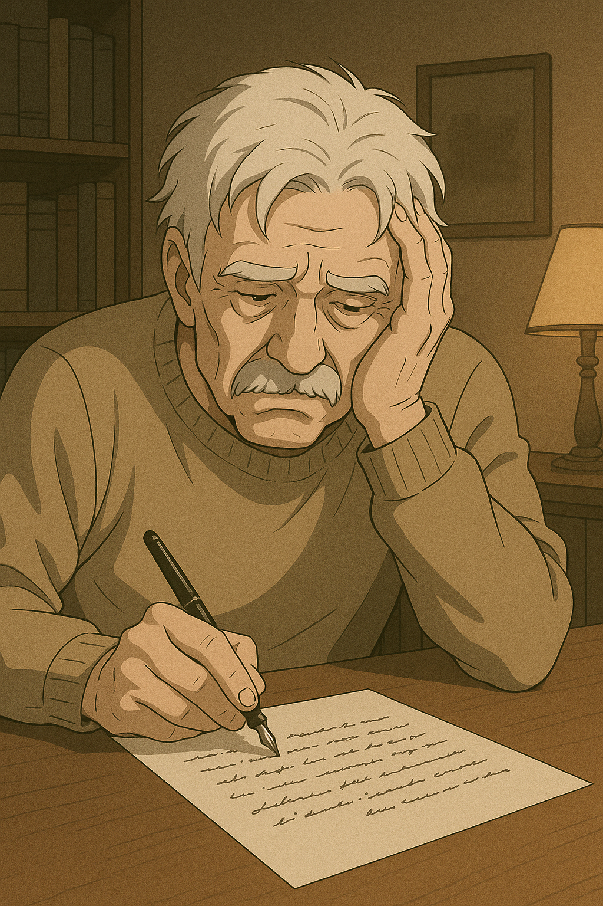
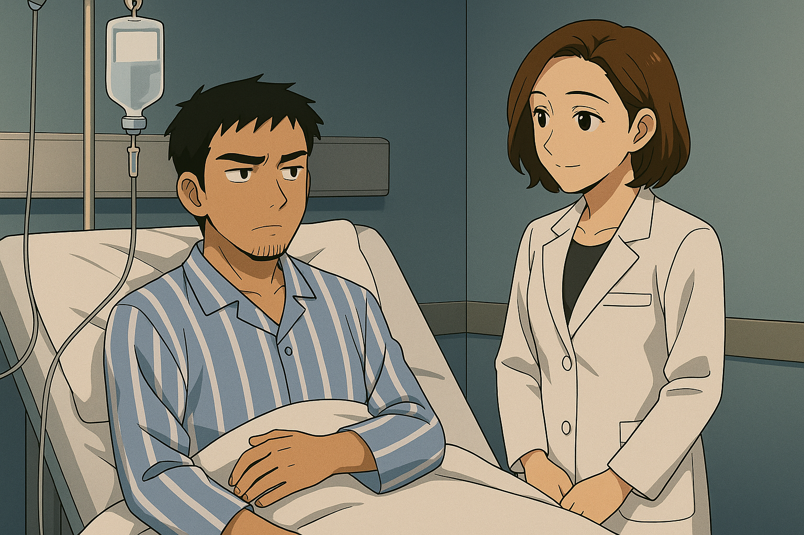
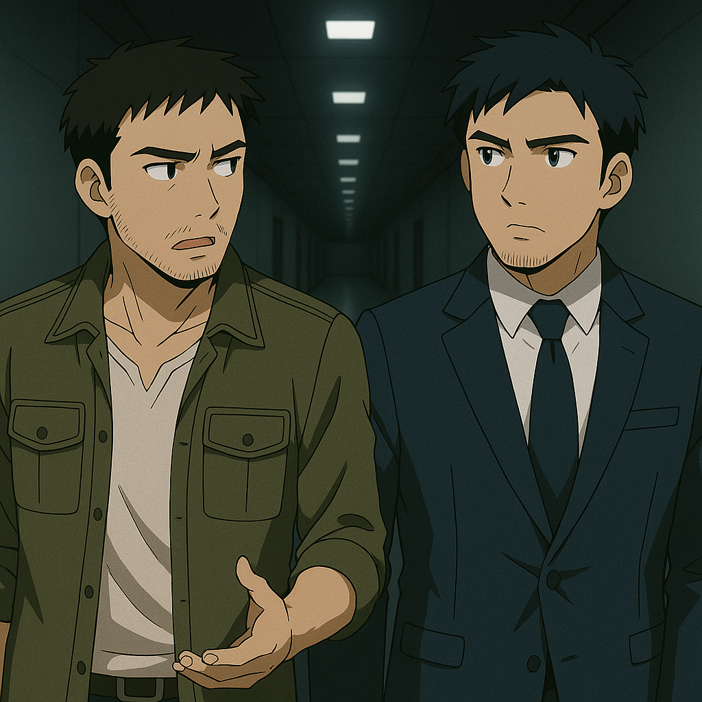

## 第六章：牺牲
沈柏骁眼睁睁地看着那二十几门炮接近，突然一个激灵，不行不行，不能就这么死了！他马上转入反向加速，并用尽自己的全部实力异轨蛇形脱离，同时关闭了自动导航系统，完全切换成手工操作。"他妈的，对面一定是黑进我们的导航系统了！这群王八蛋！"他骂道。但事与愿违，从母机充电完成的刺猬毛磁轨炮们再次精准地锁定了沈柏骁的位置，向他冲过来射击。这一次，沈柏骁做了一个惊人的动作。他没有浪费力气逃跑，而是把机头调转过来，正对着所有炮管的火光。是的，空战的常识之一就是，现代战斗机上基本都有录像设备，用于记录飞行过程中的各种数据和画面，并时时发布给控制台。而最主要的摄像机都被安装在机炮附近，座舱顶上，以及飞行员的头盔显示，均为机头方向。他高声快速地说道，"这机体简直是鬼魅附体，他的刺猬毛上次没有丝毫作用，这次竟能精准切入我们的位置并实施打击！我根本看不懂这是什么操作，但我很确定和导航无关，我已经切断了自己的导航系统但无济于事。小言，或许你们的研究方向才是......"话还没说完，飞机已经被流星般散落的炮弹击穿，当场炸成一个火球。等林砚闻讯赶来时，中心控制台的屏幕上只留下一片雪花。

林伯源第一次听到"全军覆没"这四个字时，手里的水杯稳稳地滑落到地上，摔得粉碎。他瘫坐在办公椅上，喉结滚动几次，却连一句话都说不出来。他知道，指令虽然是林砚下的，但作为总指挥，这一锅，没人能替他背。更糟糕的是，他压下多年的担忧也终于逼近了现实——若真有人挖到底，那年星轨发射的黑历史也会一并揭开，连带着他儿子都会一起完蛋。林伯源沉默地盯着桌面，良久，终于提起笔，摊开信纸。他一边打着腹稿，一边抖着手，竭力模仿儿子公文中一贯的简洁措辞，假装儿子的口吻，写下几个字："本人林砚，特此举报......"空军党委例会，全场肃然。党委书记宣读通告时，语气平稳无波："第一，经林砚同志实名举报，前我军上将林伯源十年来收受贿赂共计五百零一万元，情节特别严重，现已由军纪委带走调查处理。""第二，林砚同志以国家利益为重，在亲情与法纪之间作出艰难抉择，主动提交举报材料，体现了我军一名高级将领的责任与操守，记大功一次。""第三，经中央军委批准，自即日起，林砚同志担任本次对台作战行动总指挥。"宣读结束，全场一片寂静。林砚缓缓起身，面色铁青，像一尊雕像。他什么都没说，只是缓缓抬手，对全场敬了一个标准到不能再标准的军礼。军帽压得极低，眼神沉进阴影，像是藏住了一整个沉默的葬礼。

而此刻，唐海对台湾那边的一切仍浑然不知。对中方来说，这两天唯一的好消息，恐怕就是——唐海的手术，非常成功。在季思澜团队与唐海的共同努力下，一套基于程致远设计的脑电波感应放大器改进而来的精神感应增幅装置，被成功植入他的新义肢之中。在唐海的建议下，团队还改用了伊卡斯特最新研发的高适应性仿生神经丝线，替代了传统合金导线——导通性能更好、排异反应更低。手术之后的数小时内，唐海就惊喜地发现：这只义肢的响应速度、精细度几乎媲美原生右臂，而感应装置也大幅提升了他读取他人脑电波的覆盖范围与清晰度。季思澜查房时，还半开玩笑地警告他："不过你记住了，这种仿生丝对金属材料会有极强的排斥性。你小子再敢往里面塞个什么高压电模块，我亲自剁了你。"她嘴角带笑，眼底却是藏不住的疲惫。唐海正想笑着接话，突然意识到有什么不对——那不是她说出来的情绪，而是他感应到的情绪。他清楚地"听"到了她心里隐隐的担忧：担忧林砚——担忧他这几日的情绪骤变，冷静得太反常，像极了压不住的深水。林砚从不让人看到他崩溃，只会在夜深时回家抱住妻子，笑着说："澜澜老婆，今晚想吃点什么？"唐海脱口而出："嫂子你放心，我出院后就去找他聊聊。"季思澜一愣，接着整个人爆发了出来："你他妈的，随便闯进别人的心声，是很不礼貌的事情！"她转身就走，语气冷得像医生手里的手术刀："以后谁还敢和你接触啊。"唐海吓了一跳，赶紧尝试控制感应力——还好，像以前一样，只要不主动探查，周围的心声就会安静下来。他正准备追上去道歉，却看见季思澜在门口停住了脚步。她没有回头，只是低低地说了一句："......林砚，就拜托你了。"她的肩膀微微颤抖了一下，然后快步离开。唐海看着那道瘦削又挺直的背影，脑子里一片混乱。

下午，唐海刚刚出院，第一件事不是回家，而是直奔伊卡斯特实验楼。比起林砚，他此刻更担心的，是沈柏言。"他还好吗？眼睛恢复了没有？有没有什么后遗症？"那是他的学生，更像是他的责任。一进实验室，映入眼帘的就是一地泡面盒、能量饮料罐、散乱的笔记和正在高速运行的高性能计算专机。屏幕上，全是密密麻麻的建模进度条与演算参数。而沈柏言，不在。唐海愣了几秒，立刻调头，开始在熟悉的几个角落寻找：湖边的小长椅、自习室里最偏的靠窗座、小树林里那块铺满落叶的石凳......全都没有。"他还能在哪儿......" 忽然，他灵光一闪——沈柏言在前阵子组会上提过，理论建模基本完成，下一阶段准备在物理学院的高能实验室搭建原型机试验。"难道他已经开始了？" 唐海几乎是小跑着冲向物理学院。到了三楼实验区，还没走近，就听见剧烈的电流轰鸣和金属爆响从走廊尽头传来。门口亮着鲜红的"实验进行中 禁止入内"的警示灯。

他没有丝毫犹豫，推门而入。宽阔明亮的实验大厅里，一座三米长的光束发射装置架在轨道平台上，火花四溅，红蓝警示灯交错闪烁。沈柏言正站在操作台后，身穿灰色防爆服，专注地调控着仿真靶标的旋转与锁定。"沈柏言！"唐海隔着半个大厅高喊。沈柏言像是从梦中惊醒一般一震，缓缓地转过身。"唐教授？您......出院了？"他的声音低沉干涩。唐海下意识举起了自己恢复后的义肢，正要打趣，却在看清他脸的那一刻愣住了。沈柏言面如死灰，黑眼圈像是化不开的墨，眼角红肿，目光涣散。他的双眼虽然恢复了视觉，但却透着一种熟悉的麻木——那种刚刚经历过巨大创伤却强忍不让自己崩溃的麻木。唐海心一紧，他知道一定发生了什么。他没能克制自己，轻轻打开了精神感应通道。几个片段像撕裂的胶片飞快闪过——一台电脑上播放着视频的片段，台海前线全线溃败。特种空军王牌部队覆灭。沈柏骁，战死，尸骨无存。那是他哥哥，那是他曾说"从小最崇拜的人"。唐海刚想开口，却猛然想起季思澜说的话——"随便闯入别人的心声，是很不礼貌的。"他把所有的话压了下去，咬了咬牙，换上一个尽力温和的笑容："你......眼睛恢复得不错嘛。课题已经做到实验阶段了？"沈柏言没有表情，只是平静地说："嗯。我们已经开始打台湾了，军方急着要，我必须尽快把系统做完。这两天......得通宵。"他转身，又重新对准了操作台。"您手术刚做好，就别在这里乱跑了。回去休息吧。"唐海站在原地半晌，最终只挤出了一句："......那你记得戴好护目镜和防噪耳机，我在外面都听见爆炸声了。"沈柏言没回头，只是挥了挥手，算是回应。唐海站了一会儿，看着那个背影，像是突然变小了，也变孤单了。他说不出那是什么感觉——大概，是他第一次意识到，他们这一代，已经不是那个还能被保护的孩子了。他们都在一个个走上战场，只不过战场的模样，千奇百怪。

唐海刚走出物理学院的大楼，就收到了林砚发来的短信。短短四个字："格纳库见。"没有标点，没有解释。但唐海立刻察觉到，那熟悉的名字背后，是林砚罕见的、冰冷到极点的情绪波动。他不敢耽搁，快步奔向实验楼外的停车场。一辆灰黑涂装、配备EMP防护屏障的军用越野车就停在那里，车门识别到他的虹膜后自动打开。车子启动的瞬间，他顺手打开了电台。沙沙的干扰声后，是连续不断的战时广播："......上周，我军在执行例行海峡巡航任务时，遭到台空军伏击，欧美同盟部队亦参与其中。我军虽英勇奋战，但遭受重大损失。帝国主义亡我之心不死，我国人民必将予以严厉回击！""......前空军上将林某，因长期收受巨额贿赂、滥用职权、严重失职，已于上周由军纪委控制。林某原任台海特别行动总指挥，其战略失误致前线全军覆灭，严重损害党和军队声誉，现正接受军事法庭审讯。"唐海脸色沉了下去。"林某"是林伯源他当然清楚，但"实名举报"的人......在这个关头，能实名举报处于最高光时刻的空军上将贪污受贿，上面还能有这么快的反应的，不考虑是来自党中央级别的冤枉迫害，也不考虑林伯源自己良心发现举报自己，那只能是作为亲儿子的林砚了。"可是，为什么呢......？"

翻越山口的时候，夕阳斜照，树林尽头隐约可见一片低矮山脉后的金属构造。唐海将车隐蔽停好，徒步顺着一条早已记不清踏过多少次的山径走去。这是一条属于他们旧日的密道，通向隐藏在军区深山中的格纳库。走了二十多分钟，当他拨开最后一片树叶，视野豁然开朗：那熟悉的、宏伟的、曾经点燃无数少年热血的庞然大物——军用MB格纳库，静静伫立在山谷之中，像沉睡中的钢铁神明。而站在巨门前的那个人，穿着常服，军帽低垂，背对着他，望着西边天际火烧云，一动不动。是林砚。那一刻，唐海仿佛看到了一幅画：一个沉默的战士，面对废墟后的夕阳，手里似乎还握着尚未签发的下一轮命令。唐海没有立刻上前。他知道，此刻的林砚，已非那个和他打打闹闹、操场上互换饭盒的旧友。他失去了父亲，失去了部队，失去了公开的身份，却获得了一个更重的名字：国家机器的最后扳机。唐海一时间不知道说什么好。他张了张嘴，最后只蹦出一个字："哟。"林砚闻声回头。他看了唐海一眼，面无表情，口吻却仿佛在和陌生人说话："你来了？我们进去吧。"

格纳库的钢铁大门缓缓开启，机械臂发出低沉的咔咔声。内部是一条长长的、幽深的通道，像一座沉默的地下审判所，通向未知。两人并肩而行，走在这片冰冷的金属通道里。唐海看着脚下的投影灯一点一点向后流逝，几次张嘴想说话，终究没能发出声音。还是林砚打破了沉默。"我爸的事，你知道了吗？"唐海点点头，语气里带着一丝不敢置信："这个节骨眼上，你......举报了你爸？"林砚苦笑着摇了摇头，那笑容几乎比哭还难看。"当然不是。我也不知道是哪个逼干的，直接用了我的名字，还写得活灵活现，添油加醋，条理清晰，连金额都卡得正正好好。五百零一万，说我爸二十年前受贿五百零一万。哥们儿，我当时真想笑出声。二十年前我要真有这钱，我还能在军队混到今天？早特么海南岛养老了。不过说真的，我看过那封信，那口吻，真怀疑是我自己梦游的时候写的了。"唐海不知道怎么接，想到另外两种可能，只能陪着干笑一声，声音有些苦涩。"我确实厌恶他求胜心切、眼里只有升迁，但说到底......那也是我爸啊。就算反目成仇，也不能真下这种死手。"林砚摆了摆手，像是不愿再提。"不说了。反正他已经不是这个剧本里的人了。"

