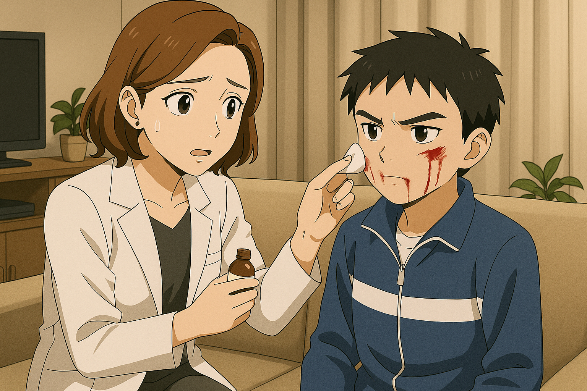
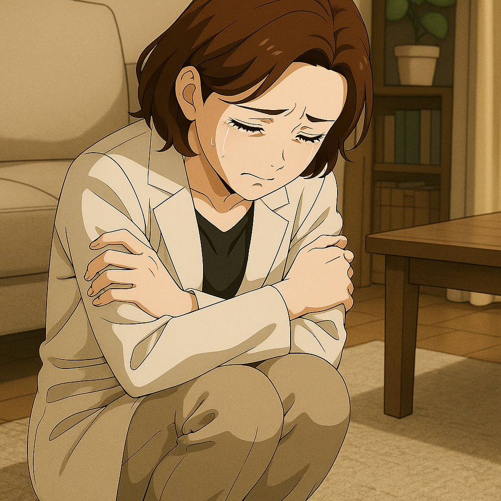
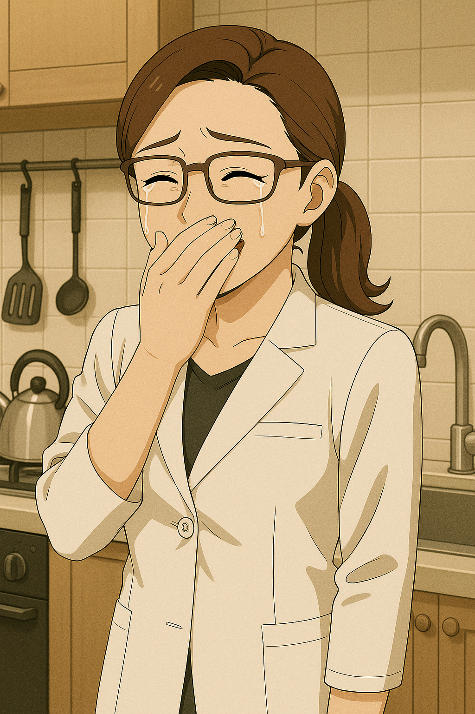
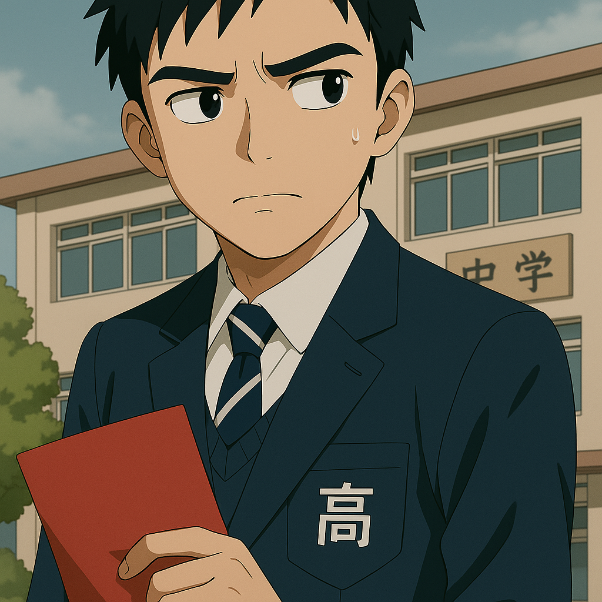

## 第一章：伤痕
林奕又带着伤回家。季思澜听到开门声时，手上的水还在滴。她第一眼看到的，是儿子嘴角未干的血迹，第二眼，是他满脸"别碰我"的眼神。"怎么又——"她下意识拿毛巾，语气还来不及严厉，就变成了小心。"来，坐下，脸给我看。"林奕沉默地把书包扔在一边，坐在凳子上，低着头。他知道程序：她擦药，他不吭声，然后她会一边碎碎念，一边小心翼翼地绕开那个词——打架。

"奕奕，你已经初一了，能不能别总这样？老师刚才打电话来，说你又动手……"她话没说完，林奕一把甩开她的手，力气不大，却足够让棉签飞出老远。他低着头，声音却像硬石子砸进水面："妈，我们能不能别和那些叔叔来往了？"季思澜愣了一下，愣得像被人往胸口扎了一针。她的声音很轻："那些叔叔……他们是你爸的战友。他们是来接济我们的——要不是他们，咱们早就……""我知道。"林奕打断她，语气低得几乎听不清，"我知道他们对我们好，我也打从心底感激他们。可我同学说……"他没有说出口，但午休时的记忆不停地刺痛着他。那是平时就和他不对付的一群同班男生，领头的不怀好意地对他笑着说道："哎呀，林大公子，不要老板着个脸嘛。我知道你爸没了你一直耿耿于怀，但我们可是知道的，经常有陌生的叔叔们来你们家串门，看来，你妈很能干嘛！"他特地把"干"字咬得很重。林奕没有忍住，一拳就招呼了上去。他不愿把这件事说出口，只是甩出了一句"没什么"，扭头就走回了房间。他砰的一声关门，像把整间屋子封进一口沉默的铁箱。客厅里的空气顿时像酒精落入伤口，噗一声沉默燃烧。

季思澜怔在原地，眼神像被掀开了旧伤那样得疼。虽然儿子没有明说，但她已经猜到了儿子大概听到了什么。作为瑞华医院整形外科首屈一指的主任医生，那种话，当然没人敢当面和她说过，但同时作为一位单身母亲，她知道世上从来不缺那种流言蜚语。她想起儿子两岁那年半夜突然发烧，林砚还在部队里时的一个多年来的老部下带着他的夫人来帮忙。男人抱着孩子哄小林奕睡觉，而女人则是和季思澜坐在沙发上，照顾着已经累坏了季思澜。她心疼地看着季思澜："嫂子，要不你也别一个人撑了？"当时的她没有接话，现在的她依然觉得自己多年来的选择没有错，只是这次，她有些疲惫地蹲在了地上，抱紧了自己一些，心里想到林砚被执行死刑那天，自己没有流一滴泪，但心像被撕开了一道口子，火辣辣的疼着。

几年后，林奕高三毕业，经历了漫长却又短暂的高考。没过多久，就迎来了放榜的日子。他坐在书桌前，看着电脑屏幕上的高考成绩单，盯得眼睛发涩。理综 A，数学 A，语文C，英语 B-，政治没及格。一本线——差了十九分。他把成绩单的窗口关掉，一声不吭，把脸埋进手臂里，像是想睡一场彻底看不到未来的觉。窗外蝉叫得像在嘲笑失败者的命运重复播放，桌上的钟滴答响，他一动不动，像是在等待世界宣布一场注定不会发生的逆转。过了两天的下午，有人敲门。门外站着一个戴墨镜的男人，来人是林砚生前的一位老战友，现任国防理工大学的副政治委员，军姿站得笔直，身后车还没熄火，像是还没从部队气场里走出来。"嫂子！"他笑着拎出一封录取通知书的复印件，口气像是带来一张彩票："我给奕奕办下来了——国防理工，空天科学学院，九月报到。"季思澜接过那封信，手指微微颤了一下，用一种复杂的表情，说出一句"谢谢"。林奕走出房门，看到那张信封时没说话，眉头紧得像在压着整整一段过去。季思澜把老战友送出门的时候，顺手塞了一张本地民营医院主任的私人名片，对方沉默地笑了一下，收下了。这就是季思澜，从不明说，但永远知道该怎么"提醒"人。十几年来，她深刻地理解了"救人"并不总在手术台上。之后，季思澜拿着那封信进厨房，看了又看。明明刚才在客厅还那么克制，可此刻，她把水龙头哗地一开，背过身，手一撑水池边沿，突然间弯下腰，大口喘气，像是刚从水里被救起来，手一直在颤抖着。她想起这些年来自己开过多少例"不该插的台"、签过多少份"医生不该签的字"。那是她能还回这个世界留给林砚的少数东西，也是她默默给儿子铺的最后一条路。十几秒后，她把通知书擦干了放进抽屉，重新露出那个"主任医生式"的镇静神情，眼角却悄悄松了一点，像是藏不住一分她等了十八年的安心与高兴。

回学校领通知书那天，天很热，老师很多。班主任笑着握住他的手："林奕，真不简单啊！本来还以为你没希望，结果突然成了我们班上第一个进985的！我们学校好久没出985的苗子了！"教导主任拍拍他肩："别谦虚啊，以后为国家争光！"然后，他悄悄地在他耳边说道，"听说是副政委亲自批的？你可得争气啊！"班上几个平时爱打嘴炮的男生也来凑热闹："哟，林哥，升天了啊？"林奕一言不发，手里攥着录取通知书，红皮封面被他汗水染得发湿。他笑了一下，礼貌、简短、空洞。直到他走出校门。他背着书包，从校门口经过保安亭，准备下台阶。身后传来几个男生压低嗓音的交谈声——他听得清清楚楚："听说了吗，那个林奕，高考连一本线都不到，谁知道他什么背景能那么牛，居然能被送进985！好像还是副政委特批的！""真是会做人呐，这么牛都没声儿！早知道他这么有背景，当初就不跟他犟了。""妈的，只听说他妈能干，没想到连国防理工的副政委都被睡服了。"

林奕停住脚步，站了三秒。没有回头，也没有挥拳。他铁青着脸，转身走进人流，像一块从不属于这个庆祝现场的石头，沉进某条无人知晓的河流。录取通知书被他攥在掌心，像一块烧红的铁片。

