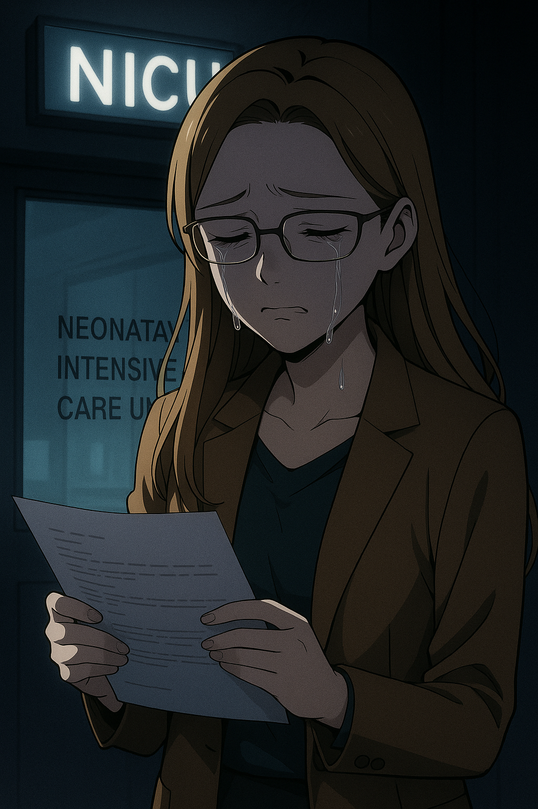
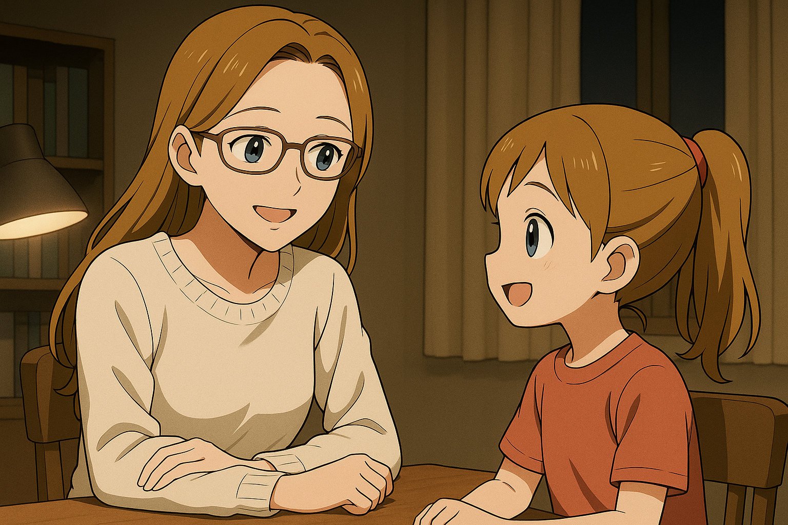
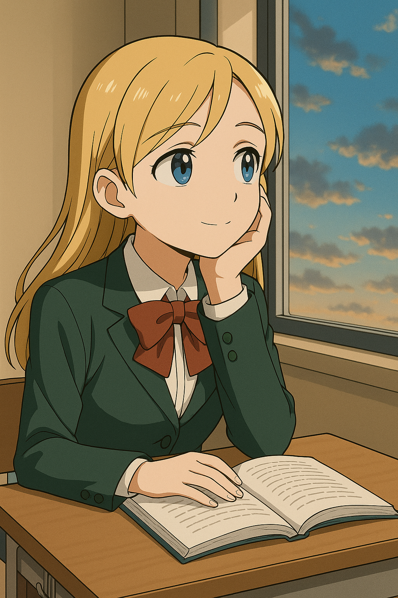
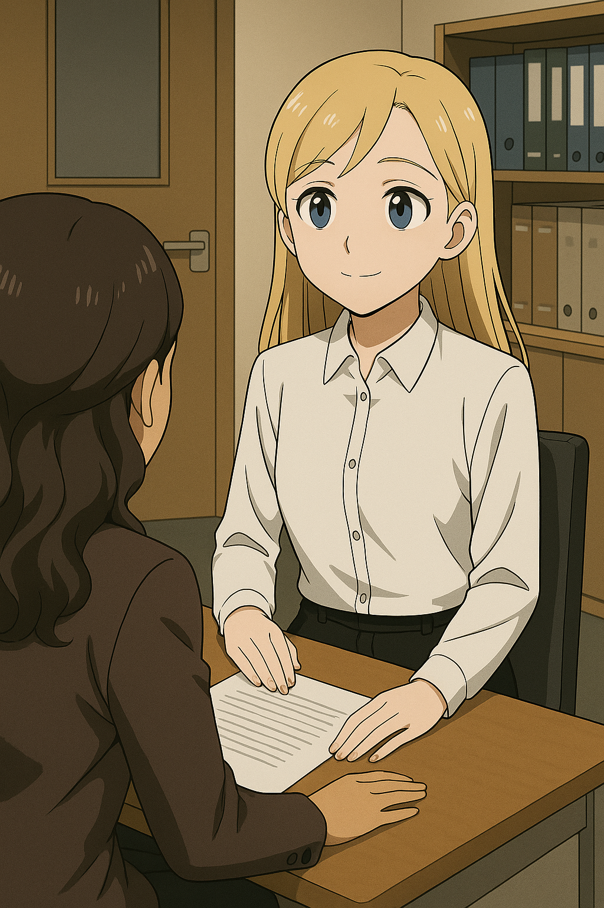

## 第二章：秘密
唐以晴的生命，从一开始，就不是由自己掌控的。台海战争结束后的第三个月，瑟琳娜在旧金山市政厅，与她的未婚夫麦普正式结婚。那天阳光明媚。来宾都说，新娘是台裔美籍华人，是一个罕见的大美人，科学家出身，气质温婉。而新郎来自瑞士伯尔尼，精通德法英三语，金发碧眼、高大帅气的他，是出身联合国系统下，国际人权组织的外交官，曾就读于日内瓦学院，学术、谈吐、身份全优，典型的国际菁英。两人在台海战争后正式走到一起，定居美国，仿佛是命运赐予的平静余生。很快，他们有了孩子。一个漂亮、沉静的小女孩。麦普极其尊重妻子的血统背景，并执拗地崇拜他在日内瓦读书时的导师赵以宁，于是为女儿取了个中文名：YIQING，中文字为"以晴"。至于她之后的姓氏"唐"，当时只是感激——"让她活下来的那个人，我们不必知道他是谁，但她要记得他做了什么。"可后来他们才发现，这个姓氏本身，就变成了来自命运的诅咒。

女儿出生三个月那晚，以晴开始发热。高烧、哭闹、手脚肿胀。作为医学科学家的瑟琳娜，在那一刻已经意识到：这不是黄疸。她亲手做了血涂片，明知不该带冷静进家庭，但她别无选择。她在显微镜下看到那枚红细胞时，手停住了。那不是正常的椭圆细胞，而是一把蜷缩的镰刀。钩着氧气，钩着命运。医院确认了她的预判：先天性镰状细胞贫血，HbSS型。"频繁危象、器官梗死、慢性贫血、免疫缺陷。这样的话，您的女儿......"医生念着诊断内容，声音小心翼翼。瑟琳娜打断了他，语气平稳，补上结论："......在缺乏干预的情况下，预期寿命不超过30岁。"医生沉默，低声回应："您知道这些。""知道。"她点头，"但我需要您说出来。" 瑟琳娜低头亲了亲女儿冰凉的小手，仿佛那是她握住自己的心跳。 

骨髓配型几乎不可能。以晴是亚裔与高加索混血，位于6号染色体短臂上的HLA全合配型几乎等于中彩票。包括美国在内的大部分主流国际骨髓库全部配型失败，只剩中华骨髓库。她没抱希望，但深夜的邮件还是来了："完全匹配。"她控制着自己颤抖的手，打开报告，看见了那一行："供者代号：TANG37462318"。没有名字，没有其他任何信息。但她盯着那串代号看了很久，她这是第一次如此深刻地感觉道，有一个人，在完全不知道她是谁的情况下，把"自我"从身体里抽出，输进了她女儿的血液系统。随着女儿一天天的病情好转，也如奇迹般的，没有明显的免疫排斥反应，夫妇俩知道，这次不是一次普通的输血，是一次生命的重启。夫妻商量后，决定让以晴从原来麦普的姓"POKE"，改为姓"TANG"，中文字为"唐"，是一个合理的中文的姓，当然也是瑟琳娜熟悉的一个姓。她在论文手稿旁写下："她不会知道他是谁，但她要记得，有人帮她活下来了。"

以晴长大得很快，但也很不对劲。她时常头疼，一到月底就要卧床，像身体比她自己更早地意识到了什么不对劲的地方。她对陌生人极度敏感，笑脸一靠近，她就哭。三岁还不说话。所有心理干预无效。医生说，"所有体检都表明，以晴的生理机能一切正常。或许，她真的只是不愿开口说话。"从四岁开始，她终于慢慢地开始愿意说话了，但大部分时候依然沉默。直到那一天，瑟琳娜藏着一篇被拒的论文在书房里叹气，以晴走过来，声音轻轻的："妈妈，你今天为什么这么伤心？""没有啊。"瑟琳娜笑着反问，"你看妈妈笑得多开心。"以晴摇头："不哦，我听见你在轻轻地哭。"她那一瞬间手僵了。她盯着女儿——突然意识到，女儿的头疼，很可能是来自她曾经最熟悉的感知力。她猛然想起了几年前那一张张熟悉的面孔，宫知遥，橘子悠，以及——曾经和她有一面之缘的唐海，也想到了以晴那份骨髓移植的来源上，那个开头为TANG的代号。"难道......难道......不......这不可能......"她喃喃道。

不知不觉间，唐以晴长大了。她长得漂亮，太漂亮。可能因为曾经得过先天性贫血的缘故，她身材娇小，看起来像一只精致的陶瓷娃娃。但是，她却从不笑。她沉默，冷静，也不会主动讲话。她成绩总是第一，但美国中学不是比谁成绩更好的地方，而是比谁更"合群"。唐以晴成了空气，也成了靶子。她被叫"中国娃娃"，被问："你是不是来监视我们的？"午餐没人和她坐一桌，社交媒体里有她的剪影和加滤镜的表情包。而老师们也往往选择沉默，除了每个月一次的例行一对一谈话外，也没有其他动作。一开始唐以晴还试图请求老师们的帮助，但老师的回答往往是："亲爱的，我非常同情你。但你是一个独立的个体，我相信你，可以通过自己的手段去解决。"他们说这句话的时候，眼神里会带着一丝徒劳的同情。久而久之，唐以晴变得越来越沉默。她忍着头痛，忍着孤独。直到那一天。一个由五个男生、三个女生组成的小团体围住她。"你是不是喜欢我们班的谁？""她一直盯着我，我真的快被吓死。""她是不是自闭？听说自闭症的小孩会杀人哦~"她站在走廊尽头，背对阳光。没有表情。她的眼神扫过他们。最后，落在那个为首的女生脸上。她感知到了，那个女生对两个男生的不同脉冲；同时，当他俩同时在场的时候，她的内心充斥着心虚，惊惧，欲望，羞耻。唐以晴知道，她在隐藏关系——但不是一段，是两段。于是，她平静地开口："你要不要告诉他们，你跟他们都睡过？"空气炸了。两个男生先是对视——一愣，然后愤怒，互相揪住衣领，"卧槽尼玛，我就知道！"五分钟后，他们从震怒中反应过来，一个拎起那个女生，另一个扇着她的耳光，骂她："敢耍我们，你这个婊子！"女生哭了，嘴唇颤抖，最后只能对着以晴吼："滚回中国，你这个亚裔怪胎！！"以晴站在那里。没动，没哭，也没解释。她只是站在原地，像一面镜子，照出他们脸上最不愿意看见的那部分。从那天起，没人再靠近她。老师也不再主动提问。唐以晴独自坐在角落，读书、写作、看天。她的头痛仍然周期性来访，像命运对她设的生理闹钟。她知道，自己不会被理解。于是她选择，不再解释。因为她知道，真正属于她的舞台，在更远的地方。

高三那年春天，唐以晴收到了加州布莱克大学的面试邀请。面试那天，她穿着朴素的白色衬衫和西服裤，恬淡地坐在面试官面前。面试官是一个40多岁的西裔女性，她看了看唐以晴的简历，这已经是她今天看到的不知道第几份写了4.0/4.0的完美履历了。她叹了口气，笑中带有些疲惫地问道："唐小姐，从你的个人陈述里，你说你能听到别人没说出口的东西？你愿意让我感受一下吗？"唐以晴微微一笑，"我知道，您已经看腻了亚裔精英的完美背景。但我也能感受到，您真心希望少数族裔可以在现今的社会里能得到认同和健康成长，这也是为什么我能看出您的不耐烦，怜悯和期望。正是因为有您这样的老师，我相信，布莱克是我作为少数族裔女性，能自由探索自己，找到自己出路的不二选择。"她顿了一顿，继续道，"另外，您不用担心，可能您的孩子在叛逆期，但作为一个不久前刚刚结束叛逆期的人，我可以向您保证，您的孩子是爱您的。"招生官面色一变，大惊："等等，你是怎么看出来的？" 唐以晴的眼光沉了下去，"那个时候，在我父母的大脑中，我也读到过和您几乎一模一样的情绪波动组合。"面试很快就结束了，看着唐以晴远去的背影，招生官毫不犹豫地写下了自己的推荐理由，"这个孩子，不是'可以教的好学生'，而是'未来会让我们学习的存在'，我们不可以失去她。"

很快，布莱克寄来录取通知书，她低头看着邮件，叹了口气，仿佛终于抵达了剧本里安排好的一站，"可以继续了。"

