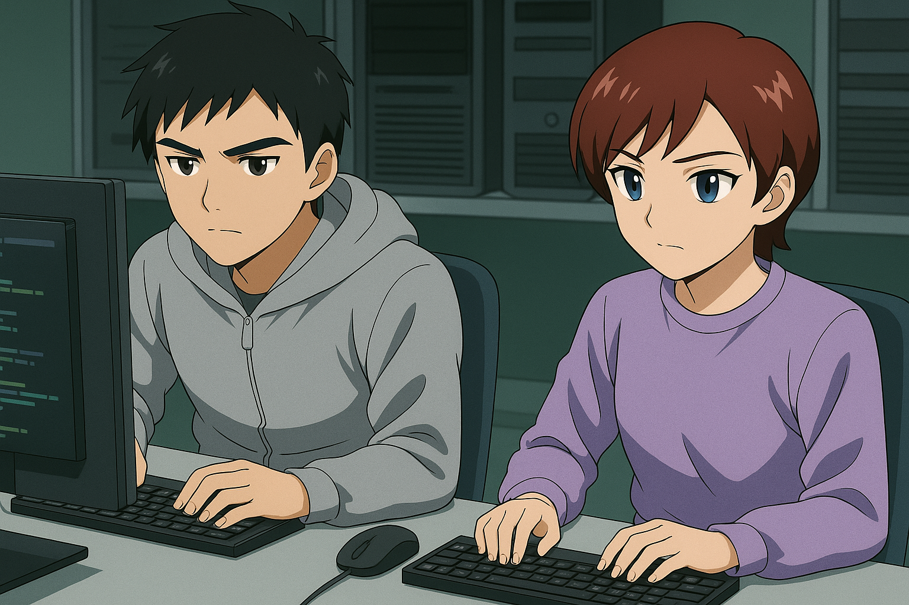
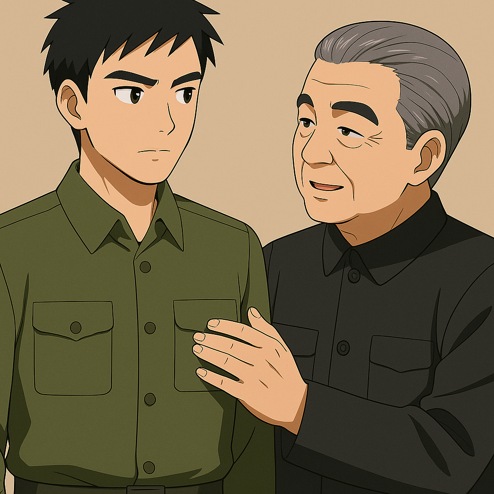
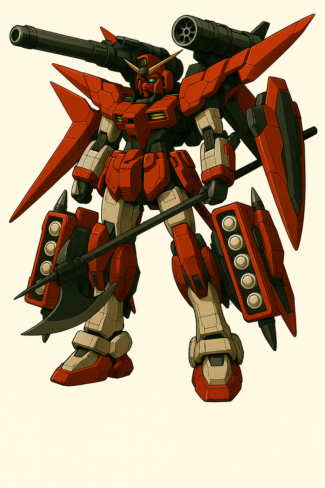

## 第三章：逆袭
过了一个暑假，国防理工的校园迎来了新一届的学生。林奕背着行李走进校门时，心里其实有些忐忑。他一直觉得，像他这样高考没过线，通过特殊关照进来的"关系户"，在高手云集的985大学里，大概只能做个默默无闻的背景板。所以他早就下定决心：既然天赋不如人，那就靠努力补回来。开学头几天，宿舍里气氛挺热闹。几个室友凑在一块打手游，玩得正嗨，见他正在理书包，便招呼道："林奕，一起来啊，四缺一！"林奕抬起头，笑了笑："你们打吧，我今天课上有些内容没听懂，想趁还有印象，赶紧去刷两道题复习一下。""我去，这才开学几天，你就开始卷了？"有人打趣。他无奈地耸耸肩："因为笨啊，学不会就得卷，不然很快就得被拍在沙滩上了。"于是，别人打游戏、追剧、恋爱，他每天雷打不动地拎着书包去自习室，左手一本《大学英语六级阅读》，右手一本《吉米多维奇数学分析》，硬是把日子过成了备战高考第二轮。起初林奕也怀疑过，这样拼命有没有意义——毕竟周围都是竞赛省一、保送生、军训时能一口气跑完三公里还不喘的人。但没想到，他逐渐追了上来。

空天科学并不像他想象中那样遥不可及。没有了语文政治的死记硬背，他终于可以沉下心来钻研那些他真正热爱的东西——模型推导、数据分析、飞行器轨迹模拟。他喜欢数字，更喜欢逻辑严密的世界，而这种喜欢，开始在成绩单上慢慢显现出来。更出乎他意料的，是他在军事训练上的表现。别人还在适应早起跑五公里的节奏时，他已经可以稳稳端枪、百发百中。他从父亲那里继承了健壮的体格，从母亲那里继承了沉静的心性，在一次次体能测试、战术演练中都表现得异常出色。慢慢地，有人开始叫他"林神"。起初他听着还有些不好意思，但渐渐地，他习惯了。他知道，那个初来乍到时心里忐忑的自己，正在一点点变得强大。

同时，林奕的优秀也受到了老师们的欣赏和关注。大二刚开学的第一个星期，就碰上了一年一度的全国大学生数模竞赛。辅导员单独找林奕，话语里透着几分意味深长："林奕啊，今年数模竞赛你报了吗？有老师点名推荐你参加。"林奕微微一愣，还没来得及答话，对方便递来了一份报名表格："不用紧张，凭借你大一一整年的成绩，我们相信你是合适的人选。"然后，辅导员顿了顿，继续说道，"和你搭档的，是计算机学院大一的陈旭怡。别看人家只有大一，那可是拿着全国高中生数学竞赛二等奖，保送到我们学校的。你作为学长，不能丢脸，得好好和人家合作啊！""陈旭怡......"林奕轻声念出了这个名字。两天后，他收到了一封私人邮件，发件人正是陈旭怡。言语不多，却干净利落，附带一个手机号，还有一句话："我觉得面对面聊效率更高，方便的话，学校大操场东侧篮球馆见。明天下午四点。"篮球馆？林奕挑了挑眉，有些松了口气，不由自主地在心中勾勒起一个形象：也许是那种典型的，数学很强的理工男？何况，他也爱打球，隐隐觉得也许这次合作会比想象中轻松。他心里甚至开始对这位素未谋面的"哥们"产生一点好感——技术宅里能运动的，不多，何况还能主动沟通。

第二天下午，高数课结束后，林奕因为参加了课后答疑，被几个问题拖住了，等他看表时，才发现时间已经到了四点十五分。他急匆匆地奔向篮球馆，心里默默祈祷对方还没走。还没走进馆门，他就听见"噌——"一声利落的入筐声。他抬头一看，只见半个场地的灯光斜洒下来，一个身影干净利落地跃起、出手、落地。对方收球的一瞬间，蓝色的马甲随着动作翻飞，头发短而清爽，脸上挂着细密汗珠，眉眼间带着一种从容的英气。林奕怔了一下：她——不是个男生。她似乎也听到了动静，转头朝他走来，擦了擦脸上的汗，说："你就是林奕吧？我还以为你不来了。"林奕有些不好意思，挠了挠头："啊，不好意思，刚才在问老师问题，耽误了点时间。你就是......陈旭怡？"陈旭怡点了点头："没事，我热个身而已。"她的语气不冷也不热，却不失礼貌，"坐那边聊吧。"他们并肩坐在篮球馆侧边的长椅上，身后是空旷回响的场地，篮球馆吊顶的灯光投地板上，反得人有些晃眼。陈旭怡从背包里抽出一本笔记本和一份打印好的文件，"这是我拟的训练计划，还有过去五年数模竞赛的真题，比赛只剩三周了，时间紧，我们得尽快熟悉彼此的节奏。"林奕接过资料，随手翻了几页，排版清晰，批注密密麻麻，显然不是临时做出来应付的。他忍不住抬头看了她一眼："你准备得挺早的。""暑假就开始整理了。"陈旭怡淡淡说着，低头捋了捋额前的碎发："我习惯提前做规划，不喜欢临时抱佛脚。""那我们风格可能差挺多的。"林奕苦笑了一下，"我虽然也挺卷，但很多时候都是被ddl逼出来的。"她看了他一眼，嘴角微微扬起："所以你需要我。"林奕愣了愣，半秒后笑出了声："好吧，那我就躺平了，让学妹你带飞？"陈旭怡淡淡笑了一下："那行，明天开始，每天下午四点，机械楼304，我们再详细计划一下分工，然后过一下之前的真题。""好。"林奕望着她重新走回球场，又开始投篮练习，那种沉稳又带着倔强的气质，和他印象中大多数女生确实不同。他忽然有种预感——这次的合作，恐怕没他最初想的那么简单。但也许正因如此，才更有趣。

比赛的日子很快到来了。他们一眼相中了那道最复杂、也最具挑战性的题目：《城市应急响应中的无人机集群协同调度与路径规划》。林奕盯着题面，一字一句地读着背景内容。他的眼神随着"灾情侦察""自组织网络""路径规划"等关键词逐渐亮起来。"这题挺烧脑的。"他喃喃道。"你怕了吗？"陈旭怡一边喝水，一边翻开电脑，语气平静得像是在聊今天晚饭吃什么。林奕笑了一下，把打印出来的任务书拍在桌上："怕？不，我们选这题，正合我意。"他们很快分工明确。这是一道很经典的控制系统和最优路径的组合题，两人也根据自己的背景，很快敲定了基本的解题框架：林奕主攻分布式控制模型的系统搭建，包括无人机本体的运动控制和通信逻辑，重点实现基于PID控制的飞行姿态调整；而陈旭怡，则专注于任务分配算法和路径优化，采用Dijkstra算法为核心，结合优先队列结构对路径成本进行动态更新。两人每天泡在机械楼304实验室，夜以继日。"你这边PID调好了没？频率更新太慢的话，路径就全乱了。"陈旭怡盯着仿真界面，手指在键盘上飞快地敲打。"还没完全好，"林奕一边看着MathematicLab绘出来的飞行轨迹图，一边回她，"不过我在尝试把微分项增加了点，响应会更平稳。"陈旭怡把头凑过来，看着他的源代码。看了十几秒，她忽然轻声说了一句："......你写代码的感觉，比我想象中细腻。命名明确，注释清晰，设计规范也很好。"林奕被她这句话逗笑了："怎么，之前是看不起我？""也没有。"她笑得很淡，"我只是没想到你这么粗心的人，代码风格还挺......讲究的。毕竟，连我们约定好的时间都能错过。"林奕挑了挑眉，"好家伙，还记仇啊。那你路径规划那个Dijkstra优化得咋样了？""原始的算法不够灵活，我加了一个自定义的权重函数，根据区域优先级和动态障碍变化实时调整路径图。你待会儿把电量约束接口暴露给我，我顺便挂上去。""知道了。"两人就这样你一言我一语，把任务一点点推向前。两天时间里，他们把自己锁在机房，从白天到深夜，仿佛整个世界只剩下无人机航线和控制方程。吃饭的时候，常常是林奕去楼下的台湾小吃店买的盒饭，两份一模一样的卤肉饭，一份盐酥鸡，有时候还会多加两罐提神饮料。"你是机器人吗？怎么除了吃饭就是码代码？都不站起来活动一下的啊！"他忍不住问。"一段时间内就能专心只做同一件事，这样最高效。"陈旭怡头也没抬，照旧一边吃饭一边调路径参数。"......好吧。"林奕一边说着，一边往嘴里塞了一口盐酥鸡，立马吐了出来："巴子啊，哪能尬烫！"听到林奕忍不住开了家乡话，陈旭怡眼睛一亮："你是上海人？我也是！"林奕还在"尬烫"的余热中哈着气，听她这么一说，愣了愣："你是上海人？真的假的，我怎么听你口音不像？""我爸妈南汇出身的，但因为在南京做生意的缘故，我小学开始就一直在南京念书，口音早丢光了。"她夹了一口饭塞进嘴里，"你呢？""浦东土著，读大学前没出过上海，张江长大的。"他说着，有点得意地挺了挺胸。"张江？怪不得你这么理工。""你这算表扬还是损人？""都有一点。"陈旭怡咬着筷子，眉眼间浮现出一丝笑意。林奕忽然觉得，这一刻的她，好像和之前那个写代码时冷静得像算法本人的陈旭怡，不太一样。

过了两天，比赛已经进入了后半段。窗外的阳光变得有些刺眼，但房间里的空气，却因为那个始终无法收敛的仿真曲线，而显得有些凝重。"不行，"陈旭怡皱着眉，指着屏幕上一条几乎要冲破坐标轴的蓝色线条，"你这边积分项的增益，还是太大了。无人机群的数量一旦超过50，整个系统的累计误差，就会像滚雪球一样，被无限放大。传统的卡尔曼滤波，根本跟不上这种级别的噪声污染。"屏幕上，仿真的无人机群，像一群喝醉了的蜜蜂，飞得摇摇晃晃，随时都有失控的危险。林奕没有说话。他靠在椅背上，双手交叉在胸前，眼睛死死地盯着那段关于PID控制的核心代码。他知道陈旭怡说得对。他们现在面对的，不是一个简单的参数调整问题，而是一个算法模型本身的局限性。"我们尝试降低积分增益，"他终于开口，声音有些沙哑，"但代价是，系统的静态误差会变大，无人机无法精准地悬停在目标位置。""所以，这就是死胡同。"陈旭怡的语气里，透出一丝不甘。她是为了这个全国冠军而来的。房间里陷入了沉默。只有电脑风扇的嗡嗡声，和窗外隐约传来的蝉鸣。林奕闭上了眼睛。他的大脑，像一台超级计算机，正在飞速地回溯他学过的所有数学工具——傅里叶变换、拉普拉斯变换、Z变换......这些工具，都太"线性"了，它们擅长处理平稳的信号，却无法应对这种充满了突变和毛刺的、非线性的"噪声"。"噪声......"他喃喃自语。他想起了什么。他猛地睁开眼睛，转头对陈旭怡说："如果，我们不'过滤'噪声呢？"陈旭怡一愣："什么意思？不滤掉噪声，系统会直接崩溃。""我的意思是，"林奕的眼睛里，开始闪烁着一种她从未见过的、属于天才的光芒，"我们不去'压制'它，我们去'分解'它。"他迅速地，在草稿纸上，画下了一个函数的图像。"你看，传统的滤波，就像试图用一张大网，去捞水里所有的垃圾。但如果垃圾太小、太多，网，就没用了。"他接着说："但如果我们，能找到一种方法，像用不同尺寸的筛子一样，把信号，按照不同的'频率'和'尺度'，一层一层地，给筛开呢？"陈旭怡看着他画的图，眼神也亮了起来："你是说......像把一段音乐，分解成高音、中音和低音一样？""对！"林奕的声音，因为兴奋而提高了一个调，"我们可以试试用小波变换，把那些高频的、突发的噪声，从中低频的、有用的机体姿态信号中，给精准地'剥离'出来！"他不再多说，手指开始在键盘上飞舞。他没有去修改之前的PID控制器，而是在它的前端，加入了一个全新的模块——一个基于离散小波变换的信号预处理层。陈旭怡也立刻明白了过来，她开始同步地，调整后端滤波器的参数，去配合这个全新的算法架构。当他们最终，将优化后的代码，重新载入仿真系统时，房间里，只剩下清脆的键盘敲击声。当最后一行代码被敲完时，二人对视了一下，然后林奕按下了回车键，运行程序。屏幕上，那条蓝色的曲线，在短暂地抖动了几下之后，迅速地、不可思议地，收敛成了一条完美的直线。那一百架无人机，如同一支纪律严明的空中仪仗队，稳稳地，悬停在了预设的每一个坐标点上。夕阳的余晖，透过窗户，洒在两人因为熬夜而略显疲惫，却又因为巨大的喜悦而闪闪发光的脸上。陈旭怡看着屏幕上那条完美的直线，又转头看了看身旁这个，刚刚用一个她从未想过的思路，解决了所有问题的男孩。那一刻，她觉得自己的心跳，是有生以来的第一次，比屏幕上的仿真曲线，还要不讲道理地，漏了一拍。

数模竞赛就这样结束了。而不负众望地，林奕和陈旭怡代表国防理工，获得了当年全国大学生数学建模竞赛的一等奖，辅导员通知林奕来去他的办公室领奖。周三的早晨，林奕走进空天学院办公大楼二楼的尽头，在那间窗帘半拉、静得出奇的辅导员办公室里，他没看到辅导员，却看到了一个头发花白的老人，正背对着他，手背在后面，看向窗外。听到动静，老人回头，微笑着说："你就是林奕林同志吧？你好，我叫做柳怀真，是空天学院的党支部书记。"他一边说，一边把手伸了过来。林奕有些不知所措，也伸出了手握了握，手心很温暖，而林奕也忍不住打量起眼前的老人来。柳怀真个子不高，约莫一米七出头。他身形清瘦，年过七旬却依然精神矍铄，眉眼沉静而锋利，像一把久未出鞘却仍寒光四射的老刀。他穿着一件剪裁得体的藏青色中山装，衣角笔挺，袖口干净，仿佛岁月在他身上凝固。他的头发向后梳得整整齐齐，花白中透着老干部特有的克制；鬓角稍显稀疏，却更添几分沉稳与威严。鼻梁上架着一副老式银边眼镜，镜片后的眼神清澈而有分寸，仿佛能一眼看穿你心里有没有鬼。林奕定了定神，问道："柳书记，您来找我，是有什么事吗？"柳怀真微微一笑："是这样的。我曾经在中国人民解放军特别机动部队工作过——是的，就是你父亲林砚，曾经工作的地方。"他的话让林奕心里一惊。还没等林奕反应过来，他继续说道，"确切地说，从二十年前，我国第二代的人形堡垒——也就是MB——被投入应用开始，我便驻扎在特机部，负责思想政治以及人事相关的工作，了解大陆所有MB试验体系，还掌握一些国外的MB技术相关人员的信息。而最近，我也在代表党组织，为我国最新研发的MB，【司命】，选择合适的驾驶员。"最后，他把目光停留在林奕脸上，"林奕同志，经过多方考量，我们决定选你作为司命的机师。"

当林奕听到最后一句话时，震惊得几乎说不出话来。他很清楚，像他这样的出身——无论是被视为"政治问题"的家庭背景，还是靠着走后门进国防理工的事实——在体制里都称不上光彩。若贸然接触MB，尤其是司命这种级别的绝密机体，一旦哪天背景被人翻出来，别说前途，小命都未必保得住。他不由得站得笔直，紧张得连手心都出了汗。然后，他定了定神，尽量坦率地讲了录取时托关系的安排，也提到了他那位早年在台海战役后被执行死刑的父亲——林砚。他语速不快，却很认真："我知道我家的背景......不太体面。我很感谢组织的信任，但我清楚，我在组织眼里，可能算是那种......不安定分子吧。让我这样的人去开司命，怕是不太合适吧？"柳怀真没有立马回答。他摘下老花镜，细细打量着面前这个局促不安的年轻人，有些慈祥地笑了笑："这倒也并非如此。林奕同志，我们在选中你之前，已经对你做了非常详细的背景调查。不敢说我们什么都懂，但至少和你有关的档案，我们全看过了......包括你父亲林砚当年的调令签批、台海战役后内部处理的全过程，当然也包括你入学前的那份政治保留意见。"他挺直了身子，得像是钉在地上一样，叫人移不开眼。他缓步走到林奕面前，语气更轻了些："不过你放心，组织从来不怕过去有争议的人，我们怕的是，那些人看不清现在的路。"他拍了拍林奕的肩膀，眼神复杂，语气像一个温厚的长辈："人形堡垒这种东西，虽然历来归属军队，服务国家。但不管在哪里，真正能驾驭它们的，从来都是那些......不那么循规蹈矩的人。被选中的，往往是那些脑子转得快，心里扛得住压力的人。虽然它们的命运也从来不算好——不是被打残，就是炸毁，或者再也启动不了，有的甚至连残骸都难留下。可即使如此，一代代的机师还是义无反顾地坐进去，像是某种精神，一直在被继承。这也是为什么，我们把这代最精锐的机体，命名为【司命】。"最后，柳怀真意味深长地看了林奕一眼，"因此你要相信我们，林奕，我们比谁都懂得怎么用好一个真正有价值的人。你是我们信任的同志。所以请你放心上阵，别背太多心理负担。"林奕低下头："是这样吗......"可他脑海里浮现的，却是儿时那一次去墓园祭拜父亲的画面。母亲轻轻按住他头顶磕头时，那只手在微微发抖。过了一会儿，林奕告别了柳怀真，向宿舍走去。而柳怀真站在窗边，看着楼下林奕逐渐远去的背影，手指轻敲窗缘，轻叹一句："这个眼神......真像他啊......"

几天后，林奕被专车接走，送到了长沙郊外的一个部队大本营。在那里的格纳库里，他看到了柳怀真口中的，那台代表共和国最高水平的MB，司命。司命背着一门轻量版【赤烬III式】光束炮以及一门榴弹炮，射击时从背后翻到肩部，对前方进行射击。双手常持一柄改进后的【干戚II式】双面斧，柄头处伸出长枪，刺砍皆可。手臂上各搭载一面盾牌，左边的盾牌是继承自盘古的，带有立方氮化硼超晶薄层外壳的多层复合材料的实体盾，下面藏着一把由赤烬的原理简化而来的【赤烬改】光束枪，兼具威力和射速。而右边的盾牌体积更小，是由碳化硼烧结而成，盾牌表面则安装着电磁盾发生器，而这个技术正是来自于二十年前的台海战争中，击败刑天II式的那支浮游刃牙，抗击高能武器效果奇佳。盾牌下则是一把加特林，一抬手就能发射。之所以这样设计，是为了机体两边的重量可以平衡。而两腰上，再各挂载一把【干将】【莫邪】剑，和干戚比，可以用于快速展开近身战。并且两剑的剑柄尾部可以相连，形成双头剑，做出更大范围的攻击。和传统的MB架构不同，该MB是可变式人型堡垒TMB，可以在飞行时从人型切换到战机形态，两根炮管自然地笔直向前，大大提高了飞行速度。配合之前唐海研究的模块化能源包，加上最新型的，脱胎于唐海团队的，改良版的脑机接口技术，可以使得普通机师也能让机体随着自己的思想，做出精细的动作。司命可以用不可思议的速度切入战场，利用极灵活的动作在敌人尚未反应过来时就用头部机关炮，背部的两门大炮或者腿部的导弹进行打击，无论是追求一击毙命的刺杀还是需要长时间运转的持久战，都可以胜任。解放军参考了几十年前朝鲜战场上猎鹰的设计思路，并改良了变形时的控制系统，不再做大幅度变形，仅调整驾驶舱位置，使得机体不再会在变形时有来自操作系统的限制，更加灵活。并且，司命配备了利用两名解放军特别机动部队的前辈的战斗数据，所训练的最先进的AI大模型。

从格纳库出来后，林奕依然不敢相信这是真的。但不久后，他就不得不相信了——他被编入解放军特别机动部队下面的一个临时行动小队下，一边上课，一边服从部队需要，四处征战。

