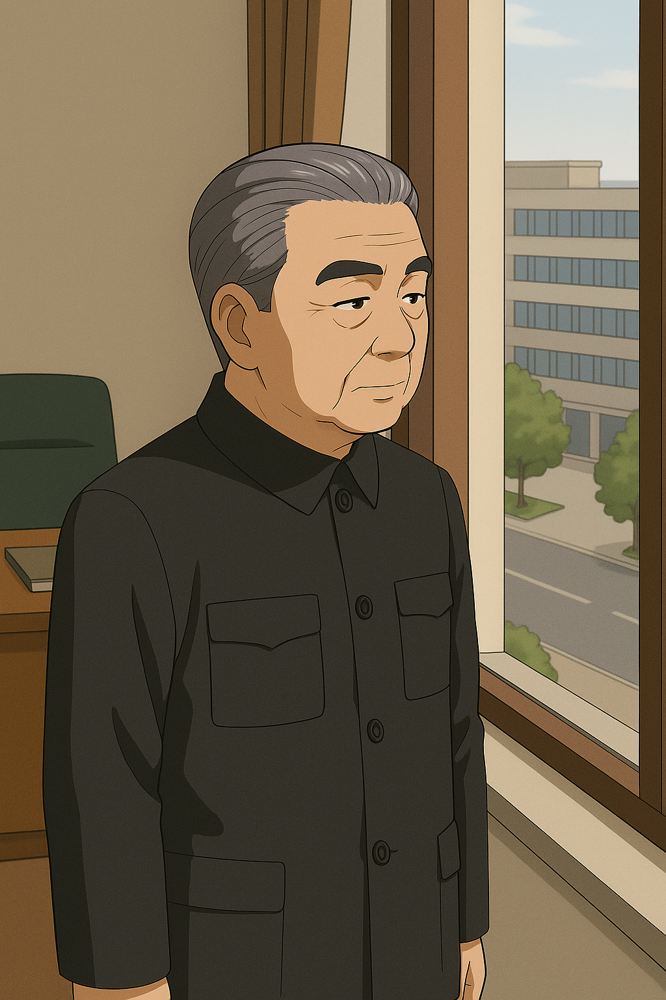

## 第三章：逆袭
上了大学的林奕本以为会很快在高手如林的985中沦为背景板，但事实大大出乎了他的意料。他大学主修空天科学，无需再在语文和政治课无尽的背诵和重复里抓耳挠腮，而集中于计算和建模。他喜欢用逻辑和数字打交道，成绩开始变得名列前茅，成了大家口中的"林神"。更让他意外的是，从父亲这里继承的强大体魄和母亲这里继承的冷静隐忍，让他在各类军事任务中也能出类拔萃。最后他被选中开上最先进的MB，【司命】，被编入解放军特别机动部队下面的一个临时行动小队下四处征战。

司命背着一门轻量版【赤烬III式】光束炮以及一门榴弹炮，射击时从背后翻到肩部，对前方进行射击。双手常持一柄改进后的【干戚II式】双面斧，柄头处伸出长枪，刺砍皆可。手臂上各搭载一面盾牌，左边的盾牌是继承自盘古的，带有立方氮化硼超晶薄层外壳的多层复合材料的实体盾，下面藏着一把由赤烬的原理简化而来的【赤烬改】光束枪，兼具威力和射速。而右边的盾牌体积更小，是由碳化硼烧结而成，盾牌表面则安装着电磁盾发生器，而这个技术正是来自于二十年前的台海战争中，击败刑天II式的那支浮游刃牙，抗击高能武器效果奇佳。盾牌下则是一把加特林，一抬手就能发射。之所以这样设计，是为了机体两边的重量可以平衡。而两腰上，再各挂载一把【干将】【莫邪】剑，和干戚比，可以用于快速展开近身战。并且两剑的剑柄尾部可以相连，形成双头剑，做出更大范围的攻击。和传统的MB架构不同，该MB是可变式人型堡垒TMB，可以在飞行时从人型切换到战机形态，两根炮管自然地笔直向前，大大提高了飞行速度。配合之前唐海研究的模块化能源包，加上最新型的，脱胎于唐海团队的，改良版的脑机接口技术，可以使得普通机师也能让机体随着自己的思想，做出精细的动作。司命可以用不可思议的速度切入战场，利用极灵活的动作在敌人尚未反应过来时就用头部机关炮，背部的两门大炮或者腿部的导弹进行打击，无论是追求一击毙命的刺杀还是需要长时间运转的持久战，都可以胜任。解放军参考了几十年前朝鲜战场上猎鹰的设计思路，并改良了变形时的控制系统，不再做大幅度变形，仅调整驾驶舱位置，使得机体不再会在变形时有来自操作系统的限制，更加灵活。并且，司命配备了利用两名解放军特别机动部队的前辈的战斗数据，所训练的最先进的AI大模型。

当林奕得知自己被选中成为司命的驾驶员时，震惊得几乎说不出话来。他很清楚，像他这样的出身——无论是被视为"政治问题"的家庭背景，还是靠着走后门进国防理工的事实——在体制里都称不上光彩。若贸然接触MB，尤其是"司命"这种级别的绝密机体，一旦哪天背景被人翻出来，别说前途，小命都未必保得住。他通过母亲季思澜，辗转联系上了父亲林砚的老部下——正是当年帮他"点进"国防理工的那位副政委。听完他的顾虑，副政委只说了一句："要想心里踏实点，你可以去找特机部的柳怀真书记谈谈。"就这样，林奕决定去见一个真正能拍板、也能听完他说话的人——那位长期坐镇解放军特别机动部、掌握MB系统全局的政工中枢人物，柳怀真。

那是一个周三的早晨，林奕走进特机部大楼的尽头，在那间窗帘半拉、静得出奇的办公室里第一次见到柳书记。柳怀真个子不高，约莫一米七出头。他身形清瘦，年过七旬却依然精神矍铄，眉眼沉静而锋利，像一把久未出鞘却仍寒光四射的老刀。他穿着一件剪裁得体的藏青色中山装，衣角笔挺，袖口干净，仿佛岁月在他身上凝固。他的头发向后梳得整整齐齐，花白中透着克制的力感；鬓角稍显稀疏，却更添几分沉稳与威严。鼻梁上架着一副老式银边眼镜，镜片后的眼神清澈而有分寸，仿佛能一眼看穿你心里有没有鬼。尽管身居高位，柳怀真却是圈内出了名的"开明人"。从第一代盘古开始，他便驻扎在特机部，专责思想政治工作。他不仅了解大陆所有MB试验体系，还掌握不少涉外的高保密级别信息，包括朝鲜、台湾的一些MB的信息。毫无疑问地，他对司命的人选安排有极高的话语权。

林奕在办公室里站得笔直，紧张得连手心都出了汗。他尽量平稳地说出了自己的来意，坦率讲了录取时的安排，也提到了那位早年在台海战役后被执行死刑的父亲——林砚。他语速不快，却很认真："我知道我家的背景……不太体面。我很感谢组织的信任，但我清楚，我在组织眼里，可能算是那种……不安定分子吧。让我这样的人去开司命，怕是不太合适吧？"柳怀真没有立马回答。他摘下老花镜，细细打量着面前这个局促不安的年轻人，有些慈祥地笑了笑："这倒也并非如此。林奕同志，我们在选中你之前，已经对你做了非常详细的背景调查。不敢说我们什么都懂，但至少和你有关的档案，我们全看过了……包括你父亲林砚当年的调令签批、台海战役后内部处理的全过程，当然也包括你入学前的那份政治保留意见。"他站起身，身板挺直得像是钉在地上一样，叫人移不开眼。他缓步走到林奕面前，语气更轻了些："不过你放心，组织从来不怕过去有争议的人，我们怕的是，那些人看不清现在的路。"他拍了拍林奕的肩膀，眼神复杂，语气像一个温厚的长辈："人形堡垒这种东西，虽然历来归属军队，服务国家。但不管在哪里，真正能驾驭它们的，从来都是那些......不那么循规蹈矩的人。被选中的，往往是那些脑子转得快，心里扛得住压力的人。虽然它们的命运也从来不算好——不是被打残，就是炸毁，或者再也启动不了，有的甚至连残骸都难留下。可即使如此，一代代的机师还是义无反顾地坐进去，像是某种精神，一直在被继承。这也是为什么，我们把这代最精锐的机体，命名为【司命】。"最后，柳怀真意味深长地看了林奕一眼，"因此你要相信我们，林奕，我们比谁都懂得怎么用好一个真正有价值的人。你是我们信任的同志。所以请你放心上阵，别背太多心理负担。"林奕低下头："是这样吗......"可他脑海里浮现的，却是儿时那一次去墓园祭拜父亲的画面。母亲轻轻按住他头顶磕头时，那只手在微微发抖。

过了一会儿，林奕告别了柳怀真，向宿舍走去。而柳怀真站在窗边，看着楼下林奕逐渐远去的背影，手指轻敲窗缘，轻叹一句："这个眼神......真像他啊......"

