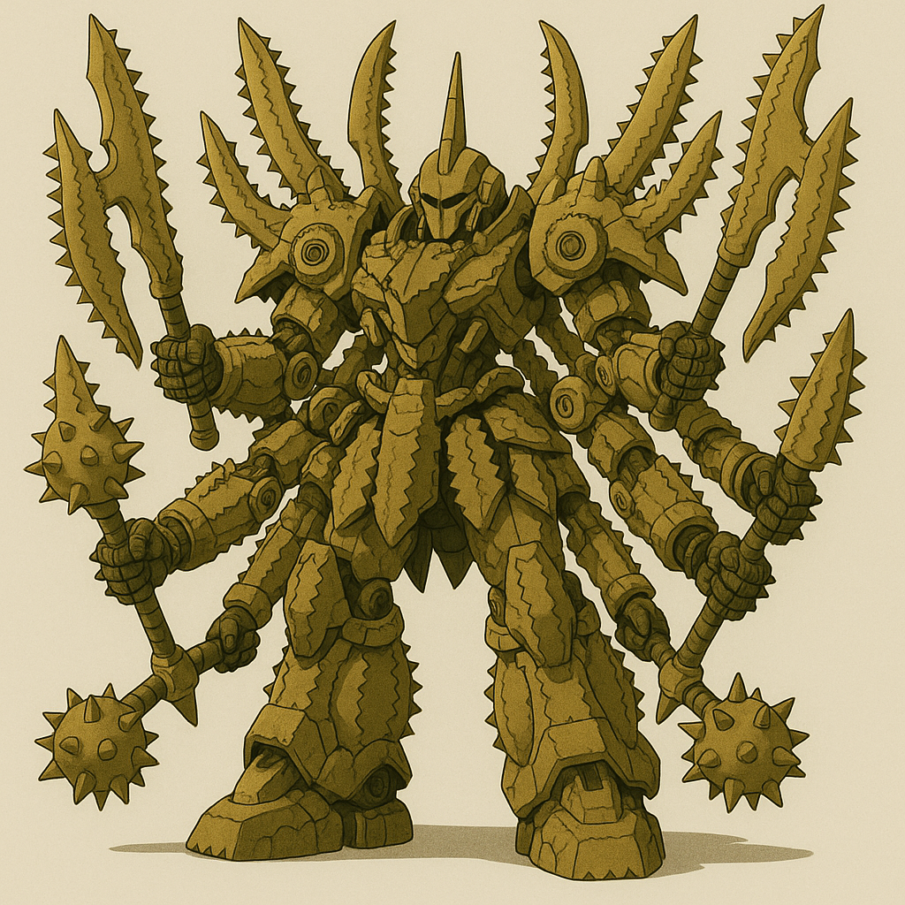
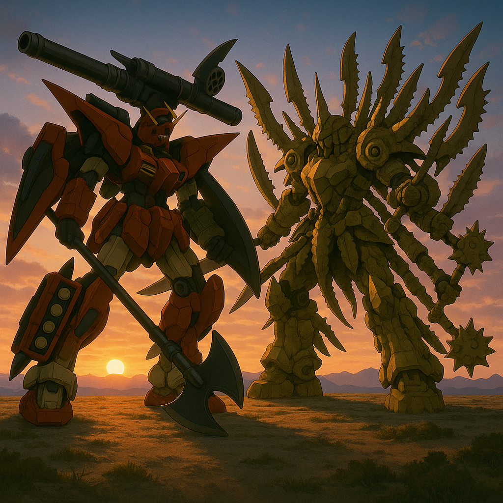

## 第四章：告捷
从大三开始，林奕就在平时上课，寒暑假随着机动部队出任务。大三暑假那次，他的部队临危受命，被要求远赴西藏的中印实际控制线附近，去处理一起突发的两军对峙事件。在出发前，部队的领导就有交代过这场战役背后的复杂性：《中印边境地区军事领域信任措施协定》中明确规定，实际控制线附近不携带枪支和爆炸物，因此只能用冷兵器进行肉搏战，"印军越过争议线，占领我方无人预警台并建立临时通信干扰网，试图破坏高原战场信息控制力。但是，前线情报显示，印方有部署机动部队，因此我方命令特别机动部队，如有需要，利用MB进行清场。并且，为了不打草惊蛇，决定只派司命一机前行。林奕同志，请务必小心，随机应变。"

当天晚上，林奕驾驶司命奔赴加勒万河谷，黎明时分到达了目的地。在氧气稀薄的高原边境，一切都仿佛缓慢了半拍。透过厚厚的云层，林奕远远地就看见高原上矗立着一尊庞然大物，定睛一看，不由得倒吸一口凉气。那是印度国防军部署的MB，如一尊重甲战神，四刃交错，配以两柄重型钝器，浑身旋转的锯齿，不携带任何远程武装，宛如神话中专门下凡来搏杀的巨像。它压根不怕司命身上那点微弱的热能波动——毕竟按照协定，谁也不能动用远程火力。林奕低头看了一眼情报："对手的这台机体......是印度国防军的【湿婆】吗......"

他从空中俯冲而下，变身成MB形态，取出莫邪，很快就和湿婆战在了一起。虽然之前经过了好几次模拟战，但这是林奕第一次投入实战，有些力不从心。湿婆是一台重型近战特格机，看似笨重，机动性也确实不高，但六根手臂异常灵活。司命用莫邪往对手身上砍过去，试图用这把以陶瓷复合体为主的，超硬材料所锻造的莫邪直接劈开对手。但事与愿违，莫邪被湿婆的两把钝器防住了，撞击发出巨响，火星四溅。只听到"哗啦"一声，莫邪整个剑刃就这样碎了。"册那，我忘了，陶瓷刀虽然硬，但延展性不行！"林奕懊恼地想着，而湿婆没有停手，立刻剩下四刃以还击，若不是林奕反应足够快，早已被劈成两半。林奕让司命变回了战斗机形态，试图通过速度拉开距离后再思考下一步，没想到湿婆腹部正在旋转的两组圆锯一前一后弹出，如飞盘一样，直指林奕。林奕大惊，急忙调整司命的姿势，惊险躲过第一盘。当他变回MB，悬空准备应付第二盘时，却惊觉刚才的飞盘回旋了，一前一后对他形成了夹击！"卧槽，死定了！"林奕有些失控地喊道。这时，机体AI系统意外被切换成"深度联动模式"——屏幕上，一个名为【AIv2910.1058】的进程悄然启动。林奕还在惊讶之际，司命的操作系统几乎没有犹豫，操作着机体，找准时机往后一退。两盘圆锯重重地撞在了一起，轰然坠地。还没等湿婆的驾驶员反应过来，就看到一个巨大的回旋镖向自己飞来，定睛一看，是司命将干戚斧当成了回旋镖抛出。湿婆试图举起钝器格挡，但挡不住同为钝器且带有加速度的干戚，相撞之际，湿婆几乎失去了平衡。只见司命手持干将从天而降，哐哐两声，湿婆的持剑的其中一臂应声而下。很快，两台MB混战在了一起，司命单凭干将，勉强应付湿婆的三剑夹击，但渐渐有些落了下风。此时，司命的引擎突然加速，同时举起了右臂上的盾牌，正欲展开电磁盾。林奕一惊，知道AI打算使用电磁盾展开时产生的电弧，用高温撞击一口气让对手动弹不得，但根据《措施协定》中规定的，双方只能用冷兵器，而AI显然无法把这个计算在内。林奕立马将控制权切换到自己手里，但已经来不及停止司命的动作了。只见司命扛着盾牌，就这样硬生生地冲了上去，对手湿婆一愣，也赶紧拿出钝器格挡。两机进入了一场纯粹的力量比拼，在司命的高出力引擎面前，湿婆的重量似乎不再占优，也只能开足马力应付。正当胶着之时，这时，林奕灵机一动。他立马关闭主引擎，相反打开了前方的喷气口。在喷气口和湿婆推力的作用下，司命快速地向后退去，脱离了战斗。湿婆由于惯性，来不及收住速度，往前一个踉跄，有些失去了平衡。而司命抓住这一时机，捡起了刚才被抛出的干戚，反手狠狠地砍在了湿婆身上。借助湿婆本身的惯性，干戚一下子砍掉了湿婆的双腿，湿婆倒在了地上，再也动弹不得。似乎一瞬间，司命终于完成了对湿婆的绝对压制！

就在林奕按着自己狂跳的心，准备打开公频劝对手投降时，对面基地的一台火箭车，不知是不小心还是故意地，向着司命的方向发射了20多枚火箭弹。 "卧槽？对方开火了？"还没等林奕还没反应过来，AI进程因为检测到了驾驶员对热感应没有及时动作，再次自动启动，司命突然凌空跃起，背上的双炮和手上的双枪直指着火箭弹幕，配合着腿部打开的导弹舱，切换到了全火力射击的模式。在一阵爆炸声中，所有的火箭弹都被成功拦截。而司命没有停下动作，把手上的光束枪指向了印军的基地。正当有火光从枪管冒出时，整台司命突然哑了火。"停！！！！"林奕咬牙，强行切断系统联动。机体在前倾姿态中僵硬停下，重重跪地，溅起尘土。无线频道中一片死寂。最终，印方传来一句冷冰冰的声明："此次误发，系技术操作问题。愿就损害情况进行调查协调。"林奕没有回应，他只是坐在驾驶舱里，任由心跳与风声一起，撞击着舱壁。对于对面误发的说辞，他没再追问；他知道，这不仅是对方的台阶，也是给自己系统暴走的掩护。哪怕是这场最漂亮的胜利，双方也必须装作"从未发生"。

但是，当林奕回到学校时，他的英勇事迹早已传遍整个学校。他自己学院就不说了，开学第一天，他刚踏进一场必修课的教室，整个班的同学都在为他欢呼，老师们自然也是为他骄傲，拼命鼓掌。就连隔壁外语学院的几个漂亮学妹，都找借口接近他们俗称和尚庙的空天学院，只为一睹传说中的"林神"的风采。林奕当然很高兴，觉得自己没有辜负妈妈的期待。但很快，他从一开始的兴奋中冷却了下来，他逐渐意识到，自己似乎有点太过于依赖AI了。他很清楚，这场战斗，自己只是打了辅助，而主要是通过AI的及时反应和攻击才能最终战胜敌人。所以当他再次听到部队里的战友和领导夸奖他时，他都有些心虚。他知道，当时要不是AI的及时启动，自己早就一命呜呼了。尤其是想到在AI启动前和启动后，机体的动作判若两人时，他心里更是沮丧："也许，只是我成为了那个AI的躯壳。"

一段时间下来，经历了几场小规模的战斗，由于司命出色的性能，加上他本人出色的军事素养，让他的MB能在战场上大杀四方。几场战役下来，无论是正面肉搏，远距离支援，还是速攻，都无可指摘。一开始林奕喜欢远程打击的高效，但随着见过的死人越来越多，他开始不禁怀疑自己的做法是不是正确，因此慢慢偏向了近战，即使远程也越来越少接受AI的指令。渐渐地，林奕对司命的操作越加熟练，但与此同时，他也对这台机体所搭载的AI有些分裂的战斗哲学感到愈加疑惑。他一直在复盘之前的战斗，试图找出那种奇怪的感觉。当他回看第一场他在加勒万河谷的这场战斗，他终于意识到了什么，不由得思考："那一刻，为什么它选择了卸掉湿婆的武装而非彻底压制？而之后为什么它最后准备连人带基地一起毁掉？"他发现，AI在用枪炮远程攻击时自动追求高效、精确的打击，而使用剑和斧近战时，往往倾向于避开敌方载具驾驶舱，试图以机动性的破坏作为压制。这种矛盾的行为所引出的一个个"为什么"，死死缠绕着林奕的心。

终于有一天，林奕趁着回校上课的时候，开始探究这AI背后的训练逻辑。他在图书馆的电脑上泡了一天，试图在内网的数据库里找到一些相关的资料。但是，无论他怎么搜寻，都一无所获。他像一头困在浅水里的鲸鱼，无力地翻搅着那些公开的、毫无价值的论文和档案。他重重地叹了口气，将脸埋进了手掌里。"哟，这不是我们的'林神'吗？怎么，拯救世界累了，跑来图书馆思考人生了？"一个清脆又带着几分戏谑的声音，从他身后传来。林奕不用回头，就知道是陈旭怡。他抬起头，正好对上她那双带着笑意的、亮晶晶的眼睛。"嘿，好......好久不见！你还好吗？"他有些尴尬地问道。"我？"陈旭怡拉开他旁边的椅子坐下，单手托着下巴，歪着头看他，"我再好也没你好啊，林神！我们计算机学院都传遍了，说你开着MB，在中印边界上演了一出'单刀赴会'的好戏。怎么样，感觉如何？"不知为何，面对她这种不带任何敬畏的、朋友式的调侃，林奕反而感觉一直紧绷的神经，松了下来。他苦笑了一下，向她讲述了自己作战的过程，也没有遮掩地提到了司命的名字，同时又道出了对于自己的认同感的困惑，"我感觉，我反而司命搭载的AI大模型的助手。为了更好地驾驭它，我想搞清楚背后驱动它的逻辑，但我找不到任何线索。"陈旭怡很认真地听着，脸上的笑意慢慢收敛。她沉默了几秒，然后眼睛转了一下，"大模型......如果是我们学校开发的话，或许我能帮上点什么。"不等林奕反应，像是下定了什么决心似的，她站起身，对他勾了勾手指，语气神秘又带着一丝不容置疑的命令："走，带你去看点好东西。"

他们来到信息楼，七拐八绕，最终停在了一间挂着"信息安全与攻防演练实验室"牌子的、需要三重验证才能进入的房间前。"这是我们学院的【禁地】，"陈旭怡神秘兮兮地对林奕说，"我现在在这里，帮导师打打下手。"进到实验室后，陈旭怡将他带到自己的工位。她打开一个内部网站，界面和那个著名的开源模型托管网站"哭哭脸"高度相似。"我们学校内部的【模型仓库】，"她言简意赅地介绍道，"所有校内开发的AI模型，都会在这里有一个镜像备份。" 林奕的心跳漏了一拍。他在搜索栏里，用颤抖的手指，敲下了【司命】和那个进程号【AIv2910.1058】。搜索结果跳出——一个孤零零的、被锁定的模型文件。陈旭怡尝试下载，屏幕上立刻弹出了红色的"权限不足"错误提示。"我就知道......"林奕的肩膀垮了下来，满心的希望瞬间被浇灭。"别急，" 陈旭怡的声音却异常冷静，她嘴角甚至还勾起了一丝难以察觉的微笑，"从这里开始，才是我的专长。"她把这个大模型托管网站的域名，在加上mysql后，粘贴在终端里，熟练地在后面加上了一个3306作为端口，并且分别设下了root和空值作为用户名和密码，按下了回车。林奕看呆了，他当然知道这意味着什么——她在赌，赌管理这个价值连城的模型数据库的IT部门，犯下了最低级、但也最常见的错误。几秒钟后，终端上，代表着"连接成功"的绿色光标，静静地闪烁着。陈旭怡得意地吹了声口哨："搞定。我就知道，我们学校IT部那帮懒虫，绝对用的是初始密码。"林奕还是有些不敢相信："这......这么机密的数据库，这么儿戏真的没问题？？"陈旭怡耸耸肩，语气里却满是得意："毕竟部署这个数据库的服务器，只有我们信息安全相关的几个实验室，通过内网才能访问，我见多了。小林啊，你还是要多提高自己的姿势水平啊！"她拍了拍林奕的肩。林奕看着她那副神采飞扬的样子，也忍不住笑了。他觉得自己第一次，对一个人的技术，感到了纯粹的、发自内心的敬佩。很快，在陈旭怡的帮助下，林奕从那个名为【tokens】的表里，读取了司命大模型的访问令牌。这次，当下载指令被敲下时，屏幕上的进度条，开始坚定地、一格一格地向前滚动。一个巨大的压缩包，正被缓缓地，下载到她的电脑里。

林奕打开了压缩包，虽然没能找到具体的数据，但通过了和模型一起下载下来的训练日志，林奕才知道近战和远程攻击的数据来自于不同驾驶员，唐海和沈柏言。根据战斗数据，他了解到驾驶盘古系列的唐海倾向于近战，尤其是盘古II式在台海战争前期的记录，基本都是手起刀落地攻击敌机的引擎、翅膀、武器等位置，使其在短时间内战斗不能而非彻底击毁。而沈柏言则是另一个极端，他的刑天II式操着赤烬II式这门威力巨大的高能粒子炮大杀四方，他的攻击曾多次从福建平潭穿越台湾海峡，精准打中68海里外的敌人，追求字面意义上的一击毙命。对于这场战争，日志里虽然语焉不详，但从两段日志同时出现的台湾二字中，林奕隐隐地感觉到了，这和他初中同学口中，那段未被记载于历史书的台海战争有关，或许那段历史，真的存在。只是他不理解，尽管两人的战斗日志都提及了对台战争，但好像完全没有二人协力攻击的记录。加上他通过搜索各种档案，无意间发现了二人的师徒关系，这就更奇怪了，"即使一个前线作战，一个后方支援，两人也不应该完全各打各的，简直像是在打两场无关的战争啊？"他确信，这场被历史所遗忘的战争背后，一定有什么更复杂的秘密存在。不过比起历史，更让林奕感到好奇的是二人本身，以及他们完全分裂的作战风格。作为一个战士，林奕很快就理解沈柏言高效的打击方法，但他对唐海的行为感到困惑又认同。这虽然完美解释了司命AI背后的成因，但它毫无疑问带来了更多未解之谜。在沈柏言的音频资料中，林奕听到了沈柏言的遗言，"难道是......？哈......哈哈......不......会......的......"虽然他不认识沈柏言，但他清楚，这种追求高效且精准的攻击风格，绝对不可能来自于一个多愁善感的普通人，只可能是一个冷静理性到极点的战士。因此林奕觉得很奇怪，为什么如此冷静的沈柏言会在临终时这么激动。同时，他也注意到了，这份训练日志中，记载了唐海在解放军服役时的所有出战记录。在出战记录的最后，也就是唐海在被判定为MIA之前，他所驾驶的最后的座驾，盘古II式的操作记录中，多次提及了他使用了一种特殊的脑机接口，似乎可以和他所拥有的一种特殊的感应能力结合，使得机体可以做出高度拟人的动作。但对于这份能力的具体原理，资料里只有一两句语焉不详的描述。"这是什么......超能力吗？"林奕眉头紧锁，所有的资料，都让他的心里对这个"唐海"这个名字的好奇，达到了无以复加的地步。

陈旭怡静静地坐在一旁，目光描摹着林奕专注的侧脸。他眉头微锁，手指无意识地敲击着桌面，完全沉浸在自己的世界里，仿佛周围所有的嘈杂都与他无关。她没有打扰他，只是下意识地，将自己的下巴，轻轻地搁在了交叠的手臂上。看着看着，她嘴角便不自觉地，一点点地，向上弯起了一道极浅的弧度。那不是一个平日里自信爽朗的笑，而是一种更柔软、更私密的、仿佛在欣赏一件只属于自己的珍宝时，才会有的微笑。她忽然意识到，自己似乎从来都没有这样安静地、毫无防备地看着一个人。那种专注的神情，让她生出一种莫名的笃定，好像只要坐在他身边，就不会迷路。

