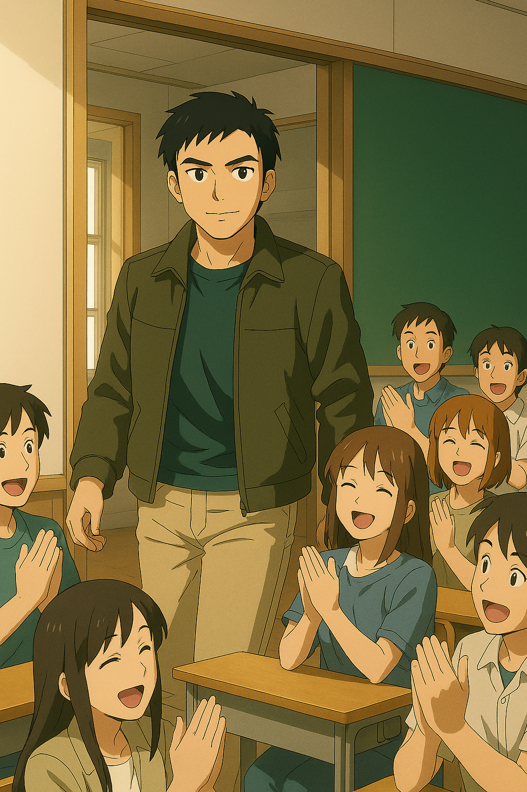
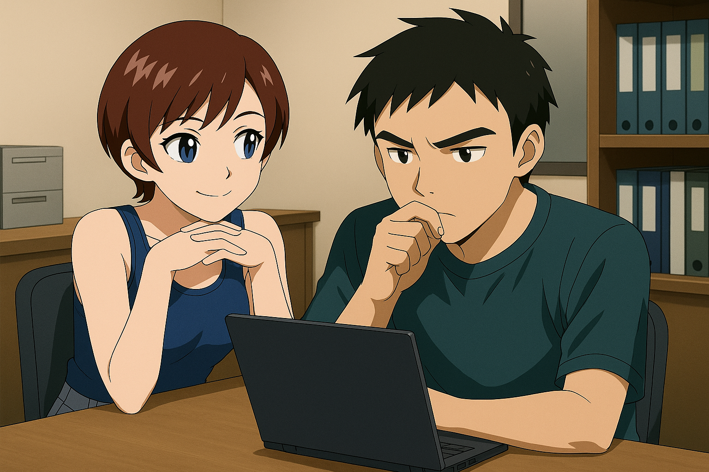

## 第四章：告捷
从大二开始，他就在平时上课，寒暑假随着机动部队出任务。大二暑假那次，林奕的部队临危受命，被要求远赴西藏的中印实际控制线附近，去处理一起突发的两军对峙事件。在出发前，部队的领导就有交代过这场战役背后的复杂性：《中印边境地区军事领域信任措施协定》中明确规定，实际控制线附近不携带枪支和爆炸物，因此只能用冷兵器进行肉搏战，"印军越过争议线，占领我方无人预警台并建立临时通信干扰网，试图破坏高原战场信息控制力。但是，前线情报显示，印方有部署机动部队，因此我方命令特别机动部队，如有需要，利用MB进行清场。并且，为了不打草惊蛇，决定只派司命一机前行。林奕同志，请务必小心，随机应变。"

当天晚上，林奕驾驶司命奔赴加勒万河谷，黎明时分到达了目的地。在氧气稀薄的高原边境，一切都仿佛缓慢了半拍。透过厚厚的云层，林奕远远地就看见高原上矗立着一尊庞然大物，定睛一看，不由得倒吸一口凉气。那是印度部署的MB，如一尊重甲战神，四刃交错，配以两柄重型钝器，浑身旋转的锯齿，不携带任何远程武装，宛如神话中专门下凡来搏杀的巨像。它压根不怕司命身上那点微弱的热能波动——毕竟按照协定，谁也不能动用远程火力。林奕低头看了一眼情报："对手的这台机体......是【湿婆】吗......"

他从空中俯冲而下，变身成MB形态，取出干戚，很快就和湿婆战在了一起。虽然之前经过了好几次模拟战，但这是林奕第一次投入实战，有些力不从心。司命一阵乱砍，湿婆看似魁梧，机动性也确实不高，但六根手臂异常灵活。两把钝器防住了干戚的劈砍，金属撞击发出巨响，火星四溅。而剩下四刃以还击，若不是林奕反应足够快，早已被劈成两半。林奕让司命变回了战斗机形态，试图通过速度拉开距离后再思考下一步，没想到湿婆腹部正在旋转的两组圆锯一前一后弹出，如飞盘一样，直指林奕。林奕大惊，急忙调整司命的姿势，惊险躲过第一盘。当他变回MB，悬空准备应付第二盘时，却惊觉刚才的飞盘回旋了，一前一后对他形成了夹击！"卧槽，死定了！"林奕有些失控地喊道。这时，机体AI系统意外被切换成"深度联动模式"——屏幕上，一个名为AIv2910.1058的进程悄然启动。林奕还在惊讶之际，司命的操作系统几乎没有犹豫，操作着机体，找准时机往后一退。两盘圆锯重重地撞在了一起，轰然坠地。还没等湿婆的驾驶员反应过来，就看到一个巨大的回旋镖向自己飞来，定睛一看，是司命将干戚斧当成了回旋镖抛出。湿婆试图举起钝器格挡，但挡不住同为钝器且带有加速度的干戚，相撞之际，湿婆几乎失去了平衡。只见司命手持干将莫邪从天而降，哐哐两声，湿婆的其他四臂应声而下。一瞬间，司命完成了对湿婆的绝对压制！

就在林奕按着自己狂跳的心，准备打开公频劝对手投降时，对面基地的一台火箭车，不知是不小心还是故意地，向着司命的方向发射了20多枚火箭弹。 "卧槽？对方开火了？"还没等林奕还没反应过来，司命突然凌空跃起，背上的双炮和手上的双枪直指着火箭弹幕，配合着腿部打开的导弹舱，切换到了全火力射击的模式。在一阵爆炸声中，所有的火箭弹都被成功拦截。而司命没有停下动作，把手上的光束枪指向了印军的基地。正当有火光从枪管冒出时，整台司命突然哑了火。"停！！！！"林奕咬牙，强行切断系统联动。机体在前倾姿态中僵硬停下，重重跪地，溅起尘土。无线频道中一片死寂。最终，印方传来一句冷冰冰的声明："此次误发，系技术操作问题。愿就损害情况进行调查协调。"林奕没有回应，他只是坐在驾驶舱里，任由心跳与风声一起，撞击着舱壁。对于对面误发的说辞，他没再追问；他知道，这不仅是对方的台阶，也是给自己系统暴走的掩护。哪怕是这场最漂亮的胜利，双方也必须装作"从未发生"。

当林奕回到学校时，他的英勇事迹早已传遍整个年级。他自己学院就不说了，开学第一天，他刚踏进一场必修课的教室，整个班的同学都在为他欢呼，老师们自然也是为他骄傲，拼命鼓掌。就连隔壁外语学院的几个漂亮学妹，都找借口接近他们俗称和尚庙的空天学院，只为一睹传说中的"林神"的风采。林奕当然很高兴，觉得自己没有辜负妈妈的期待。但很快，他从一开始的兴奋中冷却了下来，他逐渐意识到，自己似乎有点太过于依赖AI了。他很清楚，他没能决定自己用哪一招，完全是司命本身在战斗。所以当他再次听到部队里的战友和领导夸奖他时，他都有些心虚。他知道，炮不是他瞄准的，剑也不是他亲自砍下去的。尤其是想到在AI启动前和启动后，机体的动作判若两人时，他心里更是沮丧："也许，只是我成为了那个AI的躯壳。"

两年下来，经历了几场小规模的战斗，由于司命出色的性能，加上他本人出色的军师素养，让他的MB能在战场上大杀四方。几场战役下来，无论是正面肉搏，远距离支援，还是速攻，都无可指摘。随着自己对司命的操作越加熟练，林奕对这台机体所搭载的AI有些分裂的战斗哲学感到愈加疑惑。他一直在复盘之前的战斗，试图找出那种奇怪的感觉。当他回看第一场他在加勒万河谷的这场战斗，他终于意识到了什么，不由得思考："那一刻，为什么它选择了卸掉湿婆的武装而非彻底压制？而之后为什么它最后准备连人带基地一起毁掉？"他发现，AI在用枪炮远程攻击时自动追求高效、精确的打击，而使用剑和斧近战时，往往倾向于避开敌方载具驾驶舱，试图以机动性的破坏作为压制。一开始林奕喜欢远程打击的高效，但随着见过的死人越来越多，他开始不禁怀疑自己的做法是不是正确，因此慢慢偏向了近战，即使远程也越来越少接受AI的指令。终于有一天，林奕趁着回校上课的时候，开始探究这AI背后的训练逻辑。他在模拟战实验室的电脑上泡了一天，试图从内网上找出些蛛丝马迹。虽然没能找到具体的数据，但通过在一个不起眼的文件夹里看到的模型训练日志，他才知道近战和远程攻击的数据来自于不同驾驶员，唐海和沈柏言。根据战斗数据，他了解到驾驶盘古系列的唐海倾向于近战，尤其是盘古II式在台海战争前期的记录，基本都是手起刀落地攻击敌机的引擎、翅膀、武器等位置，使其在短时间内战斗不能而非彻底击毁。而沈柏言则是另一个极端，他的刑天II式操着赤烬II式这门威力巨大的高能粒子炮大杀四方，他的攻击曾多次从福建平潭穿越台湾海峡，精准打中68海里外的敌人，追求字面意义上的一击毙命。作为一个战士，林奕很快就理解沈柏言高效的打击方法，但他对唐海的行为感到困惑又认同，加上他通过搜索各种档案，无意间发现了二人的师徒关系，就对唐海更加好奇。并且在沈柏言的音频资料中，他听到了沈柏言的遗言，"难道是......？哈......哈哈......不......会......的......"虽然他不认识沈柏言，但他清楚，这种追求高效且精准的攻击风格，绝对不可能来自于一个多愁善感的普通人，只可能是一个冷静理性到极点的战士。因此林奕觉得很奇怪，为什么如此冷静的沈柏言会在临终时这么激动。

