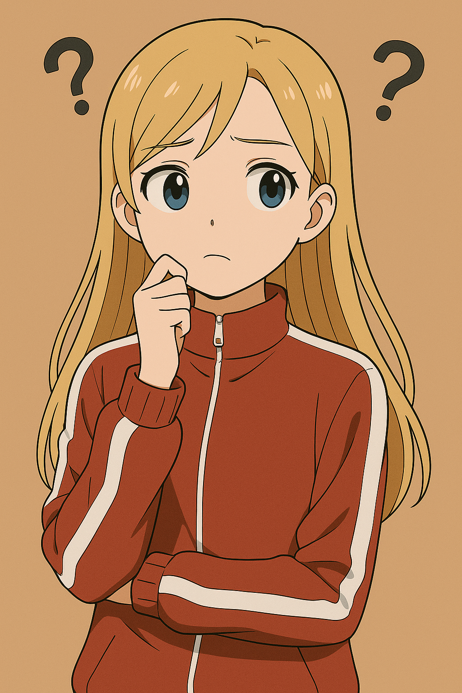
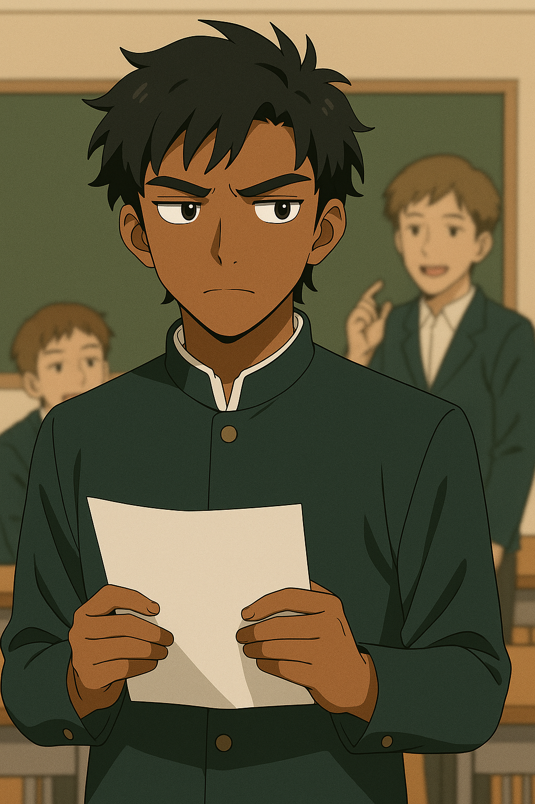
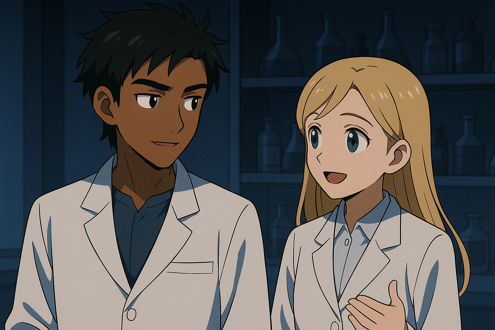
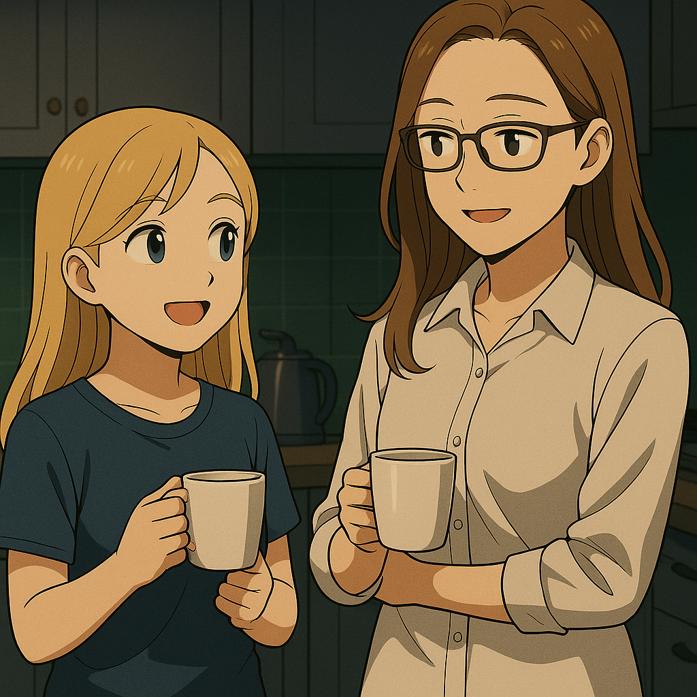

## 第五章：求索
与此同时，唐以晴上了大学后，第一次有了自己的选择——专业。从小到大，正如湾区常规的精英家庭一样，她的人生都像是被一种无形的轨道牵引着向前：身为医生的母亲与外交官的父亲为她制定了近乎完美的成长模板，从语言、礼仪、课程到心理建设处处精确，到音乐、体育、数学样样精通，却唯独没有问过她："你想成为谁？" 直到大学的第一年，她第一次被允许选择自己想听的课。布莱克不要求大一新生立刻决定专业，而是给了学生极大的自由度，可以从任何学院选课。唐以晴看着堪称浩瀚的选课表，近乎贪婪地从哲学、神经科学、心理学、甚至人工智能中逐门试探，仿佛在黑暗中摸索自己能听懂的语言。经过一段时间的学习，她发现，无论讲授形式多么不同，有一个词汇始终在她脑中回响——"意识"。"为什么我能感知他人的情绪？""为什么我能分辨出'言语与情绪的错位'？""为什么人说'没事'时，我却能听见他们心底在哭？"对于这些从小就缠绕着她的问题，她太想要一个答案了。她从小就读过诸多文学作品，也试图和为数不多的朋友们聊过，似乎无论是作品中的描写还是朋友的叙述，"情绪"这个词在他们这里似乎是一种朦朦胧胧的直觉，一种无法用言语描述的第六感。但对于唐以晴来说，这不是直觉，她太清楚了。那是一种像疼痛一样真实的知觉。经过一年，她选修了各种课程，最终认定了【认知科学】作为自己的主修专业。因为她实在太好奇了，为什么自己可以感知到其他人的情绪和思想片段。而认知科学，这门涉及到心理学、神经生物学、计算机科学的综合学科，或许可以成为她唯一能试图靠近答案的钥匙。她提交申请表的那天，外面是细雨绵绵的黄昏。她没有对谁讲起，但心里却第一次有了一个微小的想法："如果我必须一辈子背负这份感知......那么至少，我要知道它是什么。"她不再希望成为一个"被人理解"的人。她希望成为那个能解释这种能力、也能正确运用这种能力的人。

唐以晴从大二开始就申请进了认知科学系的脑科学小组开展科研工作，也就是在那里，她认识了帝奥斯。帝奥斯·迪亚哥，墨西哥裔美国人第二代。不同于加州街头那些敦实爽朗的西裔青年，帝奥斯的身材修长纤瘦，气质沉稳，不爱说话，一对乌黑闪亮的眼睛里似乎一直在观察着周围。和唐以晴一样，帝奥斯的童年并不愉快。他出生于加州湾区，父母是典型的墨西哥非法移民过来的一代，在这个全世界消费水平最高的地方，硬生生地靠打黑工维持着这个家，自然对他疏于管教。他家住在东奥克兰治安最差的街区，从小就受尽邻居们大孩子们的欺负，暴力、毒品、犯罪对他而言就是家常便饭。

但是，天资聪颖的帝尔斯不甘堕落，从中学起就发奋图强，考进了当地最好的公立中学的天才班。可惜的是，他再怎么努力，永远学不完别人从小耳濡目染的基础——他永远的落后班上的华裔以及白人同学们一截。而且，从青春期起，他就有了一个心照不宣的秘密：在这个荷尔蒙爆棚的年纪里，和那些满眼都是女孩的男同学们不同，他的目光和心动，始终停留在隔壁班那个皮肤黝黑、满脸自信的校男篮队长。他在球场上的一举一动，一颦一笑，都无一不牵动帝奥斯那颗躁动的心。有一天，他鼓足全部的勇气，打听到了男篮队长的手机号，把自己的爱慕写成一封短信，发了过去。他惴惴不安地等了一个晚上，没有等来任何回音，但第二天，他刚踏进教学楼，就发现自己的短信被截图印成传单，贴满了整个走廊。所有同学都知道了，他帝奥斯的心动对象，是另一个男人。"恶心""娘娘腔""软炮"等谩骂铺天盖地地席卷而来。帝奥斯不知道自己做错了什么，也不知道该和谁道歉，只能默默承受着来自四面八方的恶意。从那之后，他的生活里只剩下了孤独和抑郁，只能把自己的全部精力投入到学术里。好在，帝奥斯持之以恒的努力有了回报，他的成绩慢慢追上了自己的学霸同学们，进入高中后依然名列前茅。在高三那年早早就被布莱克生物系录取。拿到录取信的那天，是他中学时代最辉煌的那天。但他记得的不是看到邮件上"恭喜"的字样，而是当他班里的两位华裔同学知道他拿了录取信后的反应。"政治正确真好用啊。"他们笑着说，声音不高，却足够让帝奥斯听见。

这也是为什么在唐以晴刚进组的时候，帝奥斯对她全无好感，他早就认定了亚裔都是些自以为是的家伙——他们不是仗着成绩好、家庭富裕、关系硬，就是在冷漠地评价他人的努力。但眼前这个漂亮的女孩似乎不同。帝奥斯发现，她虽然一直以冷静示人，但帝奥斯看得出，她的眼睛里也时常流露出一种难以言喻的悲伤。真正让他俩熟悉起来的是在唐以晴加入课题组不久，导师安排生物出身的帝奥斯带她熟悉DNA纯化的实验步骤，为她接下来的研究打下必要的实验基础。虽然帝奥斯对华裔出身的她没有好感，一开始他只是尽责地照本宣科，语气生硬，但很快他发现，这个女孩不会在他讲解时抢答，也从不插话打断——她只是认真听，然后努力准确地复现所有操作，甚至比很多研究生还要熟练。慢慢地，他也放下了自己的偏见，开始很耐心地指导她使用DNA纯化需要的数十种仪器。一天晚上，唐以晴在操作移液枪来吸取刚提纯的酶，而帝奥斯在准备下一步要用的分光光度仪。"DD，"唐以晴开口了，"请问我可以这么叫你吗？"帝奥斯有些吃惊，放下手中正在清洗的比色皿，看着她的眼睛，"你说什么？"唐以晴声音不高，但有些坚定地说："我注意到，每次我叫你帝奥斯的时候，你总会泛起一种厌恶情绪，似乎你不喜欢你的名字。帝奥斯在西语里是【神】的意思，我猜你小时候可能因为你的名字，会有些不愉快的记忆。因此，我想直接用你的首字母称呼你，希望你会更喜欢一些。"帝奥斯看着她，心里微微有些泛酸，他当然不会忘记，小时候的他还很瘦弱，在西裔社区里，他的小伙伴是怎么一边嘲笑着叫他"神"，一边欺辱他的样子。他定了定神，有些感激又有些好奇地问道，"是的，我很喜欢你叫我DD。可是，为什么你会感觉到？"唐以晴轻轻垂下了头："说起来有些奇幻，但我有一种特殊的能力......一种感知他人情绪的能力。因为这种能力，我的童年并不愉快，但也正是因此，我选择了现在的专业，希望彻底搞清楚自己身上的秘密。"一瞬间，帝奥斯觉得和面前这个亚裔女孩产生了某种惺惺相惜般的共鸣，他甚至觉得，自己这些年来孤身一人的坚壳，被面前这个女孩轻轻地叩开了一道缝。他第一次意识到，也许这个世界上，真的还有另一个人，能够听见自己未曾说出口的疼痛。

唐以晴向导师详述了自己的病例，并表明了希望和帝奥斯进一步合作，搞明白这背后的机理的愿望。导师一开始沉默了很久。他不是第一次听说"过度共情"或"镜像共振"之类的案例，但这是第一次，有学生将这些现象精准描述为"可测量、可建模的感知异常"，并拿出长期记录的生理与心理数据。他隐约意识到，这也许不仅仅是一个心理学课题，而是一次可能撬动神经科学、基因表达与信息学交汇点的大突破。他相信，这是一种发生在人类身上极为罕见的生化现象，若是能有所突破，那成果绝对是诺奖级别的，他同意了唐以晴的请求。在接下来的两年里，唐以晴与帝奥斯一起，踏上了这条"破解自身之谜"的科研之路。起初，一切都困难重重。她的感知能力难以标准化，他们尝试过fMRI、脑电图、情绪刺激测试、肾上腺素水平对比，但结果常常毫无规律。直到有一次，在分析她儿时骨髓移植的记录时，帝奥斯提出："也许，你的感知能力不是训练出来的反应，而是免疫系统和神经系统协同后，根植于细胞层面的某种表达。" 这句话像钥匙一样打开了一道门。两人开始对她的T细胞和神经嵴衍生细胞进行长期追踪测序，并建立高通量模拟模型。他们试图在海量数据中提取"神经—免疫—共情反应"的异常路径。她甚至抽取自己血液样本，每月采集一次，分析周期性与共情阈值变化。直到有一天凌晨，在连续对比了第48组样本后，唐以晴在一段基因表达热图中发现了惊人的模式：一组稀有突变片段，恰好存在于她移植后新生的免疫系统中，但在原始家族样本中完全找不到。那是一个全新的候选区域，极可能是她"高感知能力"的起源。

这项研究震动了实验室。她与帝奥斯在《The Lancet》率先发表了首篇综述文章，随后又在《NEJM》《Nature Neuroscience》等权威期刊上陆续发表多篇论文，提出了一个全新概念：情绪感知型免疫神经互构机制（EPNI）。她原本只想弄清"自己为何与众不同"，却一步步走进了生命科学最前沿的战场。 然而，真正让她震撼的，并不是论文发表的那天，而是她在回看数据模型时，第一次意识到了一件事： 这项能力，不是神迹，不是诅咒，也不是拯救者的恩赐—— 它只是一种信息处理的极端偏态。 就像有的人能听见更高频率的声音，有的人对颜色更敏感，有的人记忆力极强。而她，不过是情绪频率的捕手罢了，就像一个特别会察言观色的人，仅此而已。她曾以为，自己注定要背负这份能力，要么用它去治愈别人，要么因此被误解孤立。但现在她明白了："感知，并不神圣。回应，才是选择。" 感知别人痛苦并不会自动带来善良，正如拥有锋利的刀刃并不意味着你必须伤人。人之为人，不在于你能"听见多少"，而在于你如何使用这些声音。那一刻，唐以晴终于不再抗拒，也不再依赖。她不再把自己当成"异类"，而是一个研究者——正在认真对待自己的过去，也准备迎接未知的未来。

虽然实验进展很顺利，但唐以晴始终希望进一步弄明白：到底是什么因素导致了这种带有特殊感知能力的DNA表达？这不仅是科学的问题，更是身份的问题。她想知道，自己身上的这一切，到底意味着什么。帝奥斯也在拼命地推进研究。如果说唐以晴是为了搞清自己是谁而选择这个课题，那帝奥斯就是为了证明自己——他太想证明自己，对过去所有鄙视他、欺负他的人做出有力的还击了。他尝试从多个角度进行分析：从表观遗传、神经网络可塑性，到多次基因突变模型，他几乎查遍了所有可能的机制。为了检测一组罕见的碱基异常，他连续在实验室里泡了五天，眼睛布满血丝。可当结果一次次归零，他第一次在实验台前颓然坐下。那一刻，他有点明白了什么叫"命运的壁垒"——如果不从源头查起，他们永远只能在巨大的黑幕前反复叩问。"解铃还须系铃人，"帝奥斯叹道，"你必须去查一查......那个供者是谁。"唐以晴沉默了一会，轻轻点头。她知道，是时候了。当晚，她回到家中，约母亲瑟琳娜开一个母女茶话会。夜深灯暗，厨房里只亮着一盏暖黄色的台灯。茶冒着热气，她却迟迟没有开口。"妈妈，"她终于轻声问道，"你还记得我小时候做过一次骨髓移植，对吗？"瑟琳娜神情微滞，点点头："当然记得。那是你差点失去生命的一年。""你还记得那位捐献者吗？他的代号是......TANG，也是我的姓氏的来源。"沉默落在空气中。几秒后，瑟琳娜轻轻放下茶杯，眼神掠过一丝复杂，"我记得。但那是匿名系统，医务人员确实无权索取供者身份，作为病患家属的我......也没有权利知道更多。"她顿了顿，又低声补了一句，"但我怀疑我知道是谁。" "谁？""......在台海战争时期，一场战后的医疗基地，我作为医师救治了一位俘虏，是敌方MB的王牌机师，叫做唐海，一个沉默但眼神清明的人。那时我只知道他是机师，但并不知道他在战争中具体扮演什么角色，只觉得他和普通的机师不一样。他的脑波和台方的感应者类似，也确实在我面前展示过他的感应力。但他的情绪稳定得惊人，哪怕在重伤状态下，依然能维持高度冷静。""你是说，他是我的......供者？" "我无法证明，"瑟琳娜摇头，"我和他只接触过一天，他并未明确说过他在大陆有捐献过骨髓，并且不久后他就战死了。但是，从我和他的对话中，我能感受到，他是一个温暖善良的人，有一种浑然天成的悲天悯人的情怀。如果他曾经捐献过骨髓，我一点都不会觉得意外。" 听到这里，唐以晴的心猛然一沉。她忽然意识到，自己身体中流淌的，也许不仅是"幸存"的血液，更是一种未竟之志，一种来自废墟中的承诺。瑟琳娜轻声补充道："他不是一个普通的人。他的眼神太像你了，像是能看透一切的眼神。"那一夜，唐以晴默默回到房间，独自坐在书桌前，看着窗外细雨敲打着玻璃。她第一次在心中轻轻地念出那个名字——"唐海。"两个字带着奇异的重量，从心底泛起。像是某种回声，在岁月中沉睡已久，如今终于苏醒。她不知道这个人是否就是自己的供者，也清楚自己这辈子或许都无法证明这点。但她知道，那个名字会陪着她走下去。像是一场漫长旅程的起点，像是回应一种命运的召唤，又像是向某种未曾谋面的父系意志，致以沉默的敬礼。

