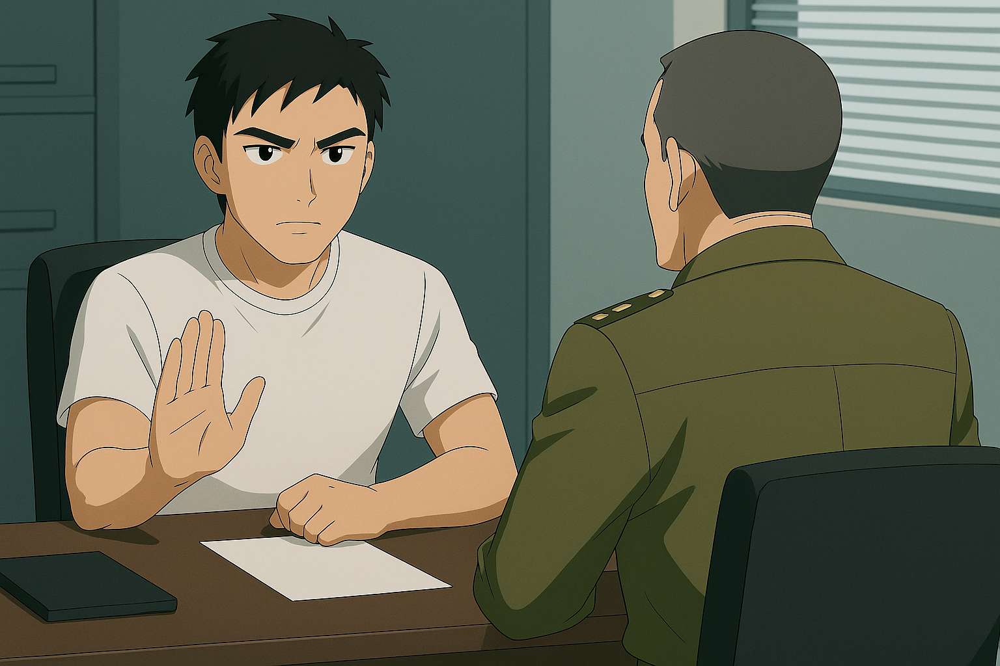
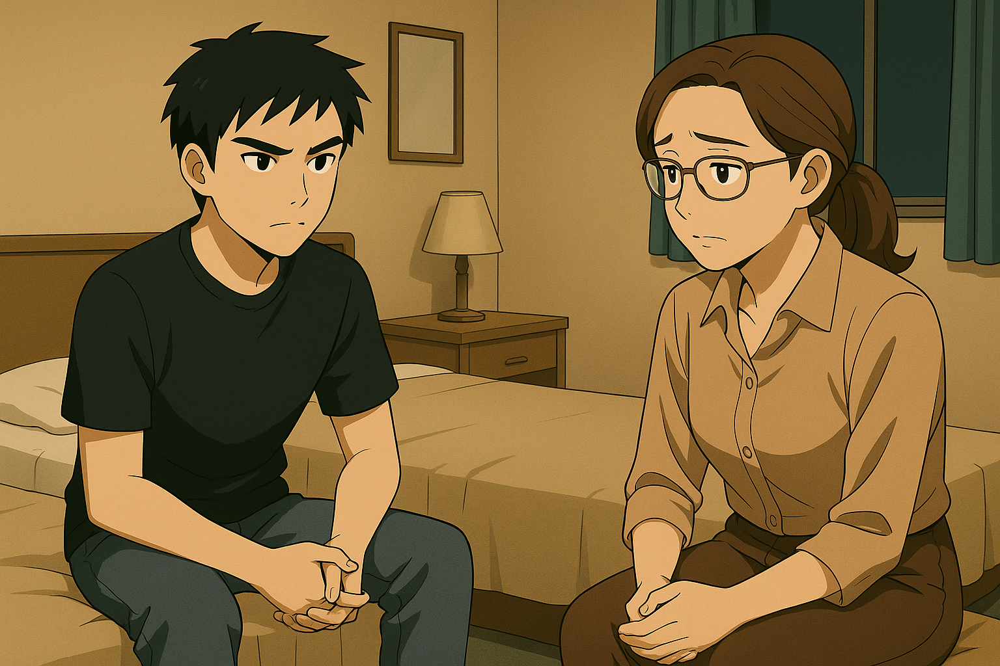
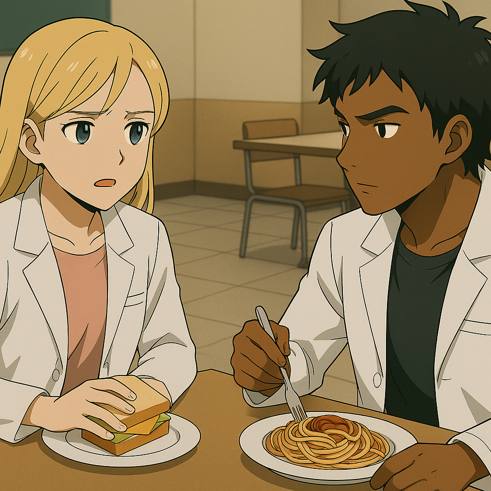

## 第六章：毕业
大学四年飞快地流逝。那段日子里，林奕既在学术上继续深耕AI战术系统优化，也在每一个假期都参与MB模拟演习和高原机动实战演练，也参与过一些局部战争。他非常清楚，自己被选中绝不是因为什么来自体制的信任，而是自己在学术、军事素养和对组织忠诚度上的优异表现。他愈发觉得，自己像是一个被困在体制安排中的试验品——他需要不断用实战证明自己，才能维系自己在组织中的某种微妙的定位。

然而，体制似乎并不这么觉得。在他们看来，林奕比他自己想得要更有价值。临近毕业时，除了长沙市优秀毕业生的称号，解放军更高层给他开出了一份极具诱惑力的委任书。他将被直接任命为特机部下的某连队指导员，入驻国家级MB战术调度核心系统，并在国防理工兼职读博，未来大概率可以一步步地升级，最终目指军队系统中的政委一职，仕途一片光明。那位给他开绿灯的副政委特意找他谈了一次话，说这是对他这几年的军旅生涯，尤其是中印边境战绩的褒奖，也说得很明白："你这样的青年，有责任留在体系里，带领下一代。"林奕认真听完，沉默许久，最终只说了一句："非常感谢组织的信任，但是如果可以的话......我想继续上前线。"对方沉了脸，没再说什么。林奕知道，他拒绝的不是一次机会，而是整个体制对"规训精英"的期待。他不想成为系统的说客，他想知道，在没有人指挥、只有自己一人独立判断的战场上——他是否还配得上那个"司命"的称号。上面最终点了头，但很快安排他进入联合国维和部队。这是那个特殊年代下的产物——台海战争失败后，中国为了挽回国际形象，主动接受联合国安理会的"区域和平责任划分"，向多个战乱地区派遣MB与高级作战人员，以此表明和平诚意，缓和西方国家的谴责浪潮。柳怀真负责人事安排，而当他知道林奕有意时，就直接把他安排成了那批先遣人员之一。他的身份是维和小组指挥官，中国方面也特地批准派出最先进的司命机体作为旗舰之一，既是对联合国维和体系的高度配合，也被视为一次隐晦但精致的"技术性展示"——以人道主义之名，展示国产MB的顶级性能与全球投送能力。自此，林奕需要驾驶一架承担着各式各样使命的司命，承担跨国人道支援、边境战火制止、MB技术展示等任务。而林奕明白，这看似是"光荣职责"，其实不过是一次将他"体面地转移出国内政治焦点"的软处理——维和战线漫长而模糊，是系统不想让他"惹麻烦"的最好安排。台海战争失败后，他们需要一个能上战场的英雄，也需要一个不问政治的士兵。林奕，恰好两者都是。可林奕并不在意。他只在意，在远离祖国旗帜、没有党旗召唤的土地上，是否还有自己值得战斗的理由。他想，或许，只有在那里，他才真的能弄清楚自己是谁。

季思澜知道了林奕拒绝担任连队指导员、坚持要去前线的决定后，沉默了整整一天。那天晚上，她在书房坐了很久，一杯茶从温热变凉，仍未喝一口。第二天一早，她临时取消了所有手术安排，从上海飞往长沙，连夜赶到林奕的寝室。当林奕在宿舍门口看到母亲时，愣了一下。她依旧是那副干练的模样，微微卷起的深棕发束整齐地挽在脑后，露出一截优雅修长的颈项，风衣笔挺，眼神坚定——可在那背后，林奕还是第一次读出了"慌张"。那晚，他们坐在一间临时借来的军区招待所里，一盏昏黄的壁灯照着母子二人。"这份连队指导员的工作，不仅仅是一种光荣，更是一种稳定的保证呀，奕奕！"季思澜的语气一反常态，有些压抑不住地激动，"你知道这个时代多不稳定，更别说瞬息万变的战场了。妈妈已经失去了爸爸，不能再......"她的声音哽住了。林奕一怔。他很少看到母亲情绪失控。那个曾在战地医院连开七台手术、咬着牙接回无数断肢的女人，此刻却因为他的一个决定而落泪。"你是不是还在怪我？"她突然带着哽咽，低声问道，"怪我这些年把你送进体制，怪我......没能保护好你爸爸。"林奕摇摇头，轻声说："不怪你。真的。""可你为什么一定要去前线？"季思澜声音颤抖，"你可以做得更好，过得更稳妥，为什么要选一条最危险的路？"林奕沉默了好一会，才抬起头看着母亲的眼睛。"因为我想知道，我是谁。尤其是这几年战斗下来，我越来越确定——我有力量。既然如此，我不该只是活着，我应该用它，去做点真正有意义的事。"这句话像一记温柔的锤子，砸在季思澜心上。她终于明白了，他不是在反叛，也不是在逃避，而是在寻求那份在父亲倒下之后就一直未能填补的答案。林奕用一种坚定的口吻说道："我不想一辈子只是‘合格的部下’，我想成为能独立决定的人。哪怕错了，那也是我自己的错。"季思澜轻轻闭上眼，仿佛在努力抑制某种翻涌的情绪，低声说："你和你爸......越来越像了。" 过了一会儿，季思澜睁开眼，那双一直透着凌厉光芒的眼睛，此刻满是母亲的柔软："你至少，能不能答应我——好好活着？不管你战斗到哪一步，记得......留一条退路给自己。"林奕点了点头，认真地应了："我答应你，妈。"这场谈话，没有赢家，也没有改变什么决定。但林奕知道，母亲终究理解了他。而他也明白，自己身后，不止有一个国家，还有一个始终等待他平安归来的家。

博士申请季结束的那个夏天，唐以晴收到了斯坦奇大学【人类与AI实验室】的全额博士奖学金录取信。她的研究课题"核辐射相关基因表达与精神感知能力的潜在联系"引起了实验室主任的高度兴趣。这位主任是业界权威，曾两度被提名诺贝尔奖，是当今认知与神经科学结合AI研究的领军人物。他在邮件中写道："你的论文让我联想到二十年前的'隐态感知者'项目，那个被一度封锁的研究方向，而这也是吸引我进行人类与AI研究的起点。如果你愿意来斯坦奇，我们愿意尽最大的诚意，调动我们可用的一切资源与你合作，把你现在的假说推进到一个全新的层次。"更重要的是——这位PI正是瑟琳娜当年在博士阶段的合作导师，后者得知消息后第一时间鼓励她："以晴，你已经超越我当年的水准了。去吧，去把你该触碰的天花板碰一碰。"但唐以晴却犹豫了。不是因为这份录取信不够好，而是因为太好了。好到不像是单纯的学术研究，而像是某种等待她入局的计划。她想起瑟琳娜曾提起的那些人——台海冲突中被秘密调用的"感应者"们。他们的能力是科学的奇迹，也是军火商的猎物。她知道，像斯坦奇这样顶级的学术机构，背后早已与国家情报体系、军方紧密捆绑。如果她继续研究这项技术，并将之开发完善，不可避免地会引来"有组织"的关注。而一旦技术落入那些人手中——她脑中浮现出的是台海战争中无线脑控系统大规模杀伤力的新闻标题，是记忆中从未谋面的"感应者之死"。她不想让这种能力再次成为杀人的武器。她想起了自己最初的动机：我是谁？不是"我可以干什么"。因此，在深思熟虑后，她写了一封措辞温和但态度坚定的拒信，向斯坦奇表达了感激，并说明自己希望在读博前进行一段实地的人文干预实践。随后，她凭借父亲外交系统的人脉推荐信，拿到了联合国纽约总部的战争文化心理研究所的实习录取信，成为一名研究助理，专门研究战争区域居民的神经异常反应、创伤机制和集体心理变化。她从不认为这比斯坦奇的录取信更高贵或更低微，但她知道，这是自己的选择。

几天后，帝奥斯也收到了斯坦奇的邮件。他原本只是备选名单中的一员，但随着唐以晴的拒绝，名额顺延到了他。他盯着屏幕上的"恭喜"看了很久，心中五味杂陈。他当然高兴。这是全世界最好的学术机构之一，这是他梦想中的舞台。但很快，他就得知了另一件事——这份录取信的时间线紧随唐以晴的拒绝之后。他不是首选。那种仿佛被"递补"、被"怜悯"的感觉令他无法释怀。他不愿成为任何人的替代品。于是午饭时间，他不请自来地坐在唐以晴的对面，言辞直白，语气里带着压抑不住的不满："以晴，斯坦奇的录取，为你量身定做的机会，你居然说拒就拒。你到底是怎么想的？难道......你是在可怜我吗？" 唐以晴放下手中的三明治，神色坦然地望着他："不是的，DD。我确实有自己更想做的事。以及，我不认为这份录取信只是学术研究那么简单。我和我母亲深入聊过——我们聊到了很多被毁掉的生命。我母亲是亲历者，她亲眼看见他们因为能力而被系统裹挟，在台海战争中成了战争机器——一场我们在中学世界史的课上都学过的战争，仅仅过去了二十多年而已。我不想那样，我也不希望你那样。我真心希望你考虑清楚，这项研究背后潜在的危险。" 帝奥斯沉默了。他知道她不是在危言耸听。唐以晴很诚恳地望着他："DD，你比我聪明，也比我坚定。你一定会在那边做出突破。但我希望你永远记得，你在研究的不是'武器'，不是'超能力'，而是人的极限，是人类之为人的秘密。" 帝奥斯完全理解，唐以晴是认真的，但他更清楚，这是他活了22年，第一次有了真正出人头地的机会，第一次站在"被命运承认"的门槛上。他思考了好一会儿，最后认真地对唐以晴说："我会去。"他顿了顿，又说，"我会继承你的脚步，继续解开这项能力背后的真相。也许有一天，我会真正配得上‘帝奥斯’这个名字。""你从来不需要成为神，"唐以晴轻轻地说："你只需要，成为你自己。"帝奥斯轻轻点了点头，眼神里有一丝疲惫，也有一丝复杂的敬意。

