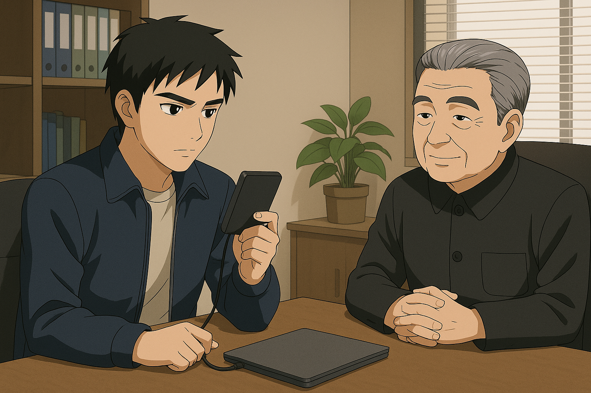

## 第六章：毕业
大学四年飞快地流逝。对大多数人来说，这是青春与求知的黄金时代。但对林奕而言，他的人生，被一条秘密的轨道，劈成了截然不同的两半。学期中的校园里，他是空天科学学院的优等生，是那个会在自习室里，为分析一种复合脆性材料的临界断裂应力而通宵推演格里菲斯模型的"林神"；而在那些被标记为“特殊实践项目”、从不对外公开的假期里，他则会穿上另一身制服，进入另一个世界。作为军方与国防理工大学联合培养的、【司命】项目的首位测试驾驶员与战术数据采集员，他所面对的，不再是常规的战场，而是最尖端的"非对称冲突"。在长达两年的时间里，他驾驶着尚未完全定型的司命，以"技术验证"和"高精度打击"为主要任务，数次被部署在中国最复杂的边境地带。他如一把锋利的手术刀，挫败了由国际武装组织所主导的跨境走私，摧毁过深山中毒品交易的秘密据点，也曾以"不存在的红色幻影"之名，瓦解过数次分裂国家的阴谋。这些功勋，从未出现在任何公开的嘉奖令上，而是化为一行行加密的数据，记录在他那份绝密的档案之中。随着司命AI被最新战斗数据的持续优化，加上林奕之前在坚持不懈的模拟战练习和几场实战中锻炼出来的驾驶能力，他的实力已今非昔比。他非常清楚，自己被选中绝不是因为什么来自体制的信任，而是自己在学术成果、军事实践和对组织忠诚度上的优异表现。他愈发觉得，自己像是一个被困在体制安排中的试验品——他需要不断用实战证明自己，才能维系自己在组织中的某种微妙的定位。

然而，体制似乎并不这么觉得。在他们看来，林奕比他自己想得要更有价值。临近毕业时，除了长沙市优秀毕业生的称号，解放军更高层给他开出了一份极具诱惑力的委任书。他将被直接任命为特机部下的某连队指导员，入驻国家级MB战术调度核心系统，并在国防理工兼职读博，未来大概率可以一步步地升级，最终目指军队系统中的政委一职，仕途一片光明。那位给他开绿灯的副政委特意找他谈了一次话，说这是对他这几年的军旅生涯，尤其是中印边境战绩的褒奖，也说得很明白："这个职位，是柳书记亲自推荐你去的。你这样的青年，有责任留在体系里，带领下一代。"林奕认真听完，沉默许久，最终只说了一句："非常感谢组织的信任，但是如果可以的话......我想继续上前线。"对方沉了脸，没再说什么。林奕知道，他拒绝的不是一次机会，而是整个体制对"规训精英"的期待。他不想成为系统的说客，他想知道，在没有人指挥、只有自己一人独立判断的战场上——他是否还配得上那个"司命"的称号。上面最终点了头，但很快安排他进入联合国维和部队。这是那个特殊年代下的产物——台海战争失败后，中国为了挽回国际形象，主动接受联合国安理会的"区域和平责任划分"，向多个战乱地区派遣MB与高级作战人员，以此表明和平诚意，缓和西方国家的谴责浪潮。柳怀真负责人事安排，而当他知道林奕有意时，就直接把他安排成了那批先遣人员之一，他的身份是维和小组指挥官。军方也在柳怀真的推动下，特地批准派出代表共和国最先进水平的司命作为旗舰机，既是对联合国维和体系的高度配合，也被视为一次隐晦但精致的"技术性展示"——以人道主义之名，展示国产MB的顶级性能与全球投送能力。自此，林奕需要驾驶一架承担着各式各样使命的司命，承担跨国人道支援、边境战火制止、MB技术展示等任务。而林奕认为，这看似是"光荣职责"，其实不过是一次将他"体面地转移出国内政治焦点"的软处理——维和战线漫长而模糊，是系统不想让他"惹麻烦"的最好安排。台海战争失败后，他们需要一个能上战场的英雄，也需要一个不问政治的士兵。林奕，恰好两者都是。可林奕并不在意。他只在意，在远离祖国旗帜、没有党旗召唤的土地上，是否还有自己值得战斗的理由。他想，或许，只有在那里，他才真的能弄清楚自己是谁。

季思澜知道了林奕拒绝担任连队指导员、坚持要去前线的决定后，沉默了整整一天。那天晚上，她在书房坐了很久，一杯茶从温热变凉，仍未喝一口。第二天一早，她临时取消了所有手术安排，从上海飞往长沙，连夜赶到林奕的寝室。当林奕在宿舍门口看到母亲时，愣了一下。她依旧是那副干练的模样，微微卷起的深棕发束整齐地挽在脑后，露出一截优雅修长的颈项，风衣笔挺，眼神坚定——可在那背后，林奕还是第一次读出了"慌张"。那晚，他们坐在一间临时借来的军区招待所里，一盏昏黄的壁灯照着母子二人。"这份连队指导员的工作，不仅仅是一种光荣，更是一种稳定的保证呀，奕奕！"季思澜的语气一反常态，有些压抑不住地激动，"你知道这个时代多不稳定，更别说瞬息万变的战场了。妈妈已经失去了爸爸，不能再......"她的声音哽住了。林奕一怔。他很少看到母亲情绪失控。那个曾在战地医院连开七台手术、咬着牙接回无数断肢的女人，此刻却因为他的一个决定而落泪。"你是不是还在怪我？"她突然带着哽咽，低声问道，"怪我这些年把你送进体制，怪我......没能保护好你爸爸。"林奕摇摇头，轻声说："不怪你。真的。""可你为什么一定要去前线？"季思澜声音颤抖，"你可以做得更好，过得更稳妥，为什么要选一条最危险的路？"林奕沉默了好一会，才抬起头看着母亲的眼睛。"因为我想知道，我是谁。尤其是这几年战斗下来，我越来越确定——我有力量。既然如此，我不该只是活着，我应该用它，去做点真正有意义的事。"这句话像一记温柔的锤子，砸在季思澜心上。她终于明白了，他不是在反叛，也不是在逃避，而是在寻求那份在父亲倒下之后就一直未能填补的答案。林奕用一种坚定的口吻说道："我不想一辈子只是‘合格的部下’，我想成为能独立决定的人。哪怕错了，那也是我自己的错。"季思澜轻轻闭上眼，仿佛在努力抑制某种翻涌的情绪，低声说："你和你爸......越来越像了。" 过了一会儿，季思澜睁开眼，那双一直透着凌厉光芒的眼睛，此刻满是母亲的柔软："你至少，能不能答应我——好好活着？不管你战斗到哪一步，记得......留一条退路给自己。"林奕点了点头，认真地应了："我答应你，妈。"这场谈话，没有赢家，也没有改变什么决定。但林奕知道，母亲终究理解了他。而他也明白，自己身后，不止有一个国家，还有一个始终等待他平安归来的家。

博士申请季结束的那个夏天，唐以晴收到了约翰逊布隆伯格大学【神经科学与工程】实验室的全额博士奖学金录取信。她对于EPINI的研究与相关突破引起了实验室主任的高度兴趣。这位主任是业界权威，曾两度被提名诺贝尔奖，是当今认知与神经科学结合特殊基因表达领域的领军人物。他在邮件中写道："你的论文让我联想到二十年前的'隐态感知者'项目，那个被一度封锁的研究方向，而这也是吸引我进行神经科学研究的起点。如果你愿意与我合作，我们愿意尽最大的诚意，调动我们可用的一切资源支持你的研究，把你现在的假说推进到一个全新的层次。"更重要的是——这位PI正是母亲瑟琳娜当年在博士阶段的合作导师。瑟琳娜在得知消息后，第一时间鼓励她："以晴，你已经超越我当年的水准了。去吧，去把你该触碰的天花板碰一碰。"但唐以晴看着这封来自巴尔的摩的录取信，心里却犹豫了。不是因为这份录取信不够好，而是因为太好了。好到不像是单纯的学术研究，而像是某种等待她入局的计划。她想起瑟琳娜曾提起的那些人——台海冲突中被秘密调用的"感应者"们。他们的能力是科学的奇迹，也是军火商的猎物。她知道，像约翰逊布隆伯格这样顶级的学术机构，背后早已与国家情报体系、军方紧密捆绑。如果她继续研究这项技术，并将之开发完善，不可避免地会引来"有组织"的关注。而一旦技术落入那些人手中——她脑中浮现出的是从那只硬盘里读到的，台海战争中无线脑控系统大规模杀伤力的新闻标题，是记忆中从未谋面的"感应者之死"。她不想让这种能力再次成为杀人的武器。她想起了自己最初的动机：我是谁？而不是"我可以干什么"。因此，在深思熟虑后，她写了一封措辞温和但态度坚定的拒信，向教授表达了感激，并说明自己希望在读博前进行一段实地的人文干预实践。随后，她凭借自己大三暑假在联合国档案馆的实习经历，以及父亲外交系统的人脉推荐信，拿到了联合国纽约总部的战争文化心理研究所的实习录取信，成为一名研究助理，专门研究战争区域居民的神经异常反应、创伤机制和集体心理变化。她从不认为这比斯坦奇的录取信更高贵或更低微，但她知道，这是自己的选择。

几天后，帝奥斯也收到了同样来自约翰逊布隆伯格的邮件。他原本只是备选名单中的一员，但随着唐以晴的拒绝，名额顺延到了他。他盯着屏幕上的"恭喜"看了很久，心中五味杂陈。他当然高兴。这是全世界最强的医学研究院，这是他梦想中的舞台。但很快，他就得知了另一件事——这份录取信的时间线紧随唐以晴的拒绝之后。他不是首选。那种仿佛被"递补"、被"怜悯"的感觉令他无法释怀。他不愿成为任何人的替代品。于是午饭时间，他不请自来地坐在唐以晴的对面，言辞直白，语气里带着压抑不住的不满："以晴，约翰逊布隆伯格的录取，为你量身定做的机会，你居然说拒就拒。你到底是怎么想的？难道......你是在可怜我吗？" 唐以晴放下手中的三明治，神色坦然地望着他："不是的，DD。我确实有自己更想做的事。以及，我不认为这份录取信只是学术研究那么简单。我和我母亲深入聊过——我们聊到了很多被毁掉的生命。我母亲是亲历者，她亲眼看见他们因为能力而被系统裹挟，在台海战争中成了战争机器——一场我们在中学世界史的课上都学过的战争，仅仅过去了二十多年而已。我不想那样，我也不希望你那样。我真心希望你考虑清楚，这项研究背后潜在的危险。" 帝奥斯沉默了。他知道她不是在危言耸听。唐以晴很诚恳地望着他："DD，你比我聪明，也比我坚定。你一定会在那边做出突破。但我希望你永远记得，你在研究的不是'武器'，不是'超能力'，而是人的极限，是人类之为人的秘密。" 帝奥斯完全理解，唐以晴是认真的，但他更清楚，这是他活了22年，第一次有了真正出人头地的机会，第一次站在"被命运承认"的门槛上。他思考了好一会儿，最后认真地对唐以晴说："我会去。"他顿了顿，又说，"我会继承你的脚步，继续解开这项能力背后的真相。也许有一天，我会真正配得上‘帝奥斯’这个名字。""你从来不需要成为神，"唐以晴轻轻地说："你只需要，成为你自己。"帝奥斯轻轻点了点头，眼神里有一丝疲惫，也有一丝复杂的敬意。

暑假一晃而过，时间很快就到了夏末初秋，林奕出发前一天傍晚。夕阳刚刚落下，校园里一片静谧。他刚把行李收拾好，就接到了柳怀真要求会面的紧急通知。他一路小跑赶到指挥楼，在那间熟悉的办公室门前站定。门开了，柳怀真正坐在办公桌后，神情比平日更加凝重。他抬手示意林奕进来，低声说："坐吧。"屋内的灯光昏黄，桌上一只银灰色的移动硬盘静静地放着，像是一件无声的信物。"关于明天的出征，"柳怀真语气缓慢，却带着压不住的重量，"我们相信你能代表我们出战，不辱使命，为国争光。"说着，他将那只硬盘推到了林奕面前。林奕愣了一下，"这个是......？"柳怀真点了点头："唐海和沈柏言——也就是你的两位前辈——的数据。包括他们的生平档案、全部的出战记录、战斗行为记录，以及他们留下的作战日志、他们所驾驶的MB的资料——盘古和刑天两个系列的机体——的全部数据以及相关的研讨会议记录等。这些是机密中的机密，我们对外宣称已经销毁，但我留了一份副本。现在，是时候交给你了。"他顿了顿，眼神望向窗外渐暗的天色："我知道你对这个好奇，也知道你一直在试图理解司命的神经映射逻辑——那些超常规的战斗反应，是他们亲手调教出来的。也许，这份数据，能帮你真正做到与机体共鸣。"林奕下意识把手放在硬盘上，却又收了回来。他的声音低了下去："可是......这么重要的东西，真的可以交给我吗？"柳怀真沉默了一会儿，眼神变得柔和又沉重。他缓缓说道："当年，你父亲出事的时候，我试图保住他的性命，但我做不到。那天之后，我就知道，人生最沉的债，不是欠国家的，是欠人的。"他的声音里藏着难以启齿的愧意："这次，如果我连交出这点信任都做不到，那我就真的，什么都没守住。"林奕怔在原地，心跳微乱。柳怀真看着他，忽然笑了，语气放松了些："你放心，这不是让我还债。是我看到了，你已经有那个资格，也有那个觉悟。"他站起身，绕到桌前，轻轻把硬盘塞进林奕的手里，"出去之后，就不再是来去自由了，回来的机会也许不会很多。必要的时候，你可以靠这个，或许能帮到你什么。"最后，他拍了拍林奕的肩膀，眼神里多了些父辈的厚重，和难以言说的深沉："记住，一定要活下去。"林奕点了点头，指尖轻轻收紧，仿佛握住了一份沉甸甸的托付。

送走林奕后，柳怀真看着书桌上的一张照片，一言不发。那是一张有些年头的家庭合影。照片里，一个年轻得多的、穿着军装的柳怀真，正意气风发地笑着。他的身边，站着一位同样笑容温柔的、美丽的女性，那是他的女儿。而在他女儿的怀里，抱着一个大概只有七八岁的小女孩——她扎着羊角辫，穿着一条小花裙，对着镜头，笑得灿烂无比，眉眼之间，是那种天生的，混合了倔强与英气的神情。他想到，上次陈旭怡来拜访他时，提到了林奕的名字，那毫无保留的憧憬和仰慕之情，以及脸上不加掩饰的灿烂笑容，轻轻地叹了口气。

林奕沿着国防理工那条种满了法国梧桐的林荫道上，慢慢地走着。夕阳的余晖，透过层层叠叠的树叶，在地上投下斑驳的光影，像一段段被打碎的、回不去的时光。他明天就要走了，去往一个他从未想过的地方。他心里很平静，没有激动，也没有恐惧，只是紧紧地握着那只移动硬盘。"林奕！"一个清脆的声音，从身后传来。他回头，看到陈旭怡站在不远处，穿着一身简单的运动外套和运动短裙，短发在晚风中微微晃动。她似乎是刚刚结束训练，脸上还带着细密的汗珠，呼吸也有些急促。"陈旭怡？有事吗？"林奕停下脚步，看着她。她快步走到他面前，仰起头，看着他的眼睛。她的眼神，一如既往地明亮、坚定，但林奕还是从中，捕捉到了一丝她极力想隐藏的、不舍的情绪。"我听说了，"她的声音很轻，像怕惊扰了这片宁静，"你明天就要走了？去纽约......加入维和部队？"林奕点了点头："嗯。上面安排的。""真好。"她低声说，像是在对自己说。林奕有些不解："好？"她抬起头，眼神里，重新燃起了一种林奕非常熟悉的光芒——那是他们三年前在数模竞赛中，一起攻克难题时，她眼中闪烁的那种，对挑战的渴望和兴奋。"是啊。我今年大四了。暑假开始前，辅导员就找我谈过，我的直博资格，已经拿到了。但是，我拒绝了，改成了非全日制硕士，打算半工半读。"她顿了顿，像是在鼓起巨大的勇气，然后，她用一种几乎是宣誓般的语气，一字一顿地说道："我想毕业后，在学习知识的同时，应征入伍。"林奕露出了真正惊讶的表情："什么？你不是非军籍生么？你没有参军的义务啊......""是的，"陈旭怡看着他，眼神里，是毫不掩饰的、近乎滚烫的崇拜。她向前走了一小步，离他很近，近到他能闻到她身上，那股淡淡的、属于夏日汗水的、青春的气息。她的声音放得很轻，像是一个只愿与他分享的秘密："但是，我决定追随你的脚步。"这句话，像一颗子弹，轻轻地，却又无比精准地，击中了林奕的心脏。他愣在那里，一时间，不知道该说什么。他知道瞬息万变的军旅生活是多么危险，想说"别傻了"，想说"那条路不好走"，想说"女孩子家家的，你不该像我一样"。但看着她那双燃烧着火焰的、不容置疑的眼睛，他发现自己，什么也说不出口，只能犹豫着问出一句："为什么？"

陈旭怡没有立刻回答，她的目光很亮，像是在审视他，又像是在审视自己。过了一会儿，她才轻声开口："你知道吗，林奕，我从小就好像一直在找一个答案。关于我们......关于人类，为什么要活着，能活成什么样。我总觉得，我们不该一辈子都陷在泥里，只为了生存本身而挣扎。"她顿了顿，眼神望向远方，仿佛看到了一个遥远的未来："我相信，一定会有那么一天，技术会发达到，让我们所有人，都不再需要为吃饭，用电或看病而发愁。到了那天，我们或许才能真正地、奢侈地去思考——我们到底是什么，我们存在的意义又是什么。也许......那就是我们成为另一种、更高阶存在的开始。"她收回目光，重新望向林奕，眼神无比认真："而你让我看到了通往那一天的、唯一的路。你让我明白，在抵达那个未来之前，我们必须先守护好现在。守护和平，就是守护未来本身。"她向前走了一小步，离他很近，声音轻得像一个秘密："这就是我找到的答案。也是我......想追随你的脚步的、真正的理由。"林奕看着她，看着她那双在晚风中，因为信念而燃烧的眼睛。他第一次在一个同龄人身上，感受到了一种近乎神圣的、属于理想主义者的光芒。他想起了自己，想起了手中握着的，前辈们的数据，想起了那些在历史中燃烧又熄灭的名字。他忽然觉得，或许，他们这些被命运选中的人，存在的意义，就是成为火炬，去点亮后来者的路。

就在这份沉默中，陈旭怡突然，轻轻地上前，给了他一个极快、也极轻的拥抱。她的身体，是属于一个常年锻炼的运动员的，紧实、温暖，又带着一丝微微的颤抖。然后，她立刻就松开了，向后退了一大步，脸上重新挂上了那个爽朗的、仿佛什么都没发生过的笑容。她对他挥了挥手，转身，向着夕阳的方向，小跑着离开。只留下一句清脆的、被风送得很远的话："祝你一路平安，林神！"林奕站在原地，看着她远去的、充满活力的背影，许久，才缓缓地，抬手摸了摸自己刚才被她拥抱过的肩膀。他轻轻地，叹了口气。那声叹息里，似乎有感动，有欣慰，也有一种，他自己都未曾察觉的、关于"责任"的、沉甸甸的重量。

同时，唐以晴毕业后，多在实验室里留了一个月的时间，整理了自己的研究成果，给新来实验室的学弟学妹们培训一些上手的事宜。导师很欣慰，她已经从当时需要帝奥斯带的新生，成了一个独当一面的研究者，同时也为她决定中止自己的科研感到惋惜。同时，唐以晴也把自己经手的，还未完成的研究项目、数据以及相关资料，包括最重要的，那批从自己身上提取的EPINI相关的基因片段样本，悉数交给了帝奥斯。经过短暂的毕业旅行后，也到了她要出发去联合国位于纽约的办公室的日子了。出发前几天，晚餐过后，唐以晴难得地有时间和父母一起坐在餐桌上聊天。客厅里很安静，只听得见窗外树叶上滴落的、残余的雨水声。瑟琳娜为每个人泡了茶，茶香袅袅。聊了一段时间，他们谈话的主题不由自主地转向了唐以晴拒绝约翰逊布隆伯格的offer，并决定接受联合国实习的决定。瑟琳娜端着茶杯，轻轻吹了吹热气，眼神温和地看着女儿："我虽然觉得有些可惜，毕竟那是全世界最好的神经科学实验室，那位PI也是一个真正关心学生成长的导师。但是，以晴，这是你自己做出的选择，妈妈支持你。"唐以晴轻轻点了点头："谢谢你，妈妈。"她的目光自然地落到了麦普脸上。平时一向随和的麦普，此时的脸上有些阴霾。他一直沉默着，但此刻他放下了手中的杯子，看着唐以晴，眉头紧锁："对不起以晴，我不得不说实话，我理解你不接受去约翰逊布隆伯格读博，是为了防止你的研究成果被滥用。但说到你去联合国的选择，我不支持。"空气瞬间凝固了，瑟琳娜看了看丈夫，又看了看女儿，轻轻地将自己的椅子，稍微往后挪了一点，微笑着说："我今晚还有一篇论文要赶。你们好好聊聊！"说完，她就回到了房间，给父女俩留出对话的空间。

麦普起身，走到了靠窗的沙发边。窗外的天空，被雨洗得干干净净，一道彩虹的末端，若隐若现。他回过头，看着自己的女儿，声音低沉，充满了过来人的疲惫："之前你在联合国档案室里实习的时候，我给你看过我写的报告，对吗？关于俄乌战争，关于叙利亚，关于南北苏丹......你看过那么多，应该比任何人都清楚，联合国，到底是个什么地方。"唐以晴点点头："我知道。它官僚、低效，而且常常因为大国否决权而陷入瘫痪。"麦普苦笑了一下，摇了摇头："不，你不知道。那不是官僚，是徒劳。我们这些所谓的外交官、维和人员，不是战士，也不是医生，我们只是一道无用的程序——一道标准的，必须走，但不会带来任何改变的程序。"他站起身，走到窗边，看着远方的天空，像是在自言自语，"当战争爆发，我们去谴责；当屠杀发生，我们去呼吁；当一切尘埃落定，我们进去，收拾尸体，分发水和粮食，呼吁捐款，然后写一份不痛不痒的报告，为下一场必然会到来的冲突，做着同样徒劳的准备。以晴，爸爸这一生，都在做这件事。我们从未真正解决过任何问题。我们只是在巨兽的脚边，为它递上一份无关痛痒的谴责声明，然后像信徒一样，祈祷它下一次，能踩得轻一点。那是一台巨大的、冰冷的、碾碎理想的机器。我不想......不想看到你，被这些徒劳的努力，蹉跎一生。更不希望有一天，你也被那台机器碾碎。"唐以晴静静地听他说完，没有立刻发表评论，而麦普的眼神里充满了爱与深切的担忧。过了一会儿，唐以晴抬起头，眼神清澈而坚定："爸爸，你说的，我都懂。我从未天真地认为，我一个人，一份报告，就能改变世界。"她站起身，走到了麦普的身边，看着窗外，与他并肩而立："但正是因为我们都知道它大概率是徒劳的，才更需要有人，去做那件徒劳的事。因为徒劳，不代表错误。而因为害怕徒劳，就选择什么都不做，放弃一个我们唯一能选的选项，那才是真正的、可悲的错误。"她的声音不高，但每一个字，都像一颗钉子，钉进了空气里。麦普一时语塞，而唐以晴转过头，认真地看着他的眼睛："你知道，我从小就能听见这个世界的痛苦。那些被掩盖在每个人表情背后的、无声的哭泣。如果我现在，因为害怕失败、害怕无力，就假装自己听不见......那我所学的这一切，我身上这份独一无二的能力，又有什么意义？"最后，唐以晴停了一下，然后口吻带了一些温柔："爸爸，你的努力并不是徒劳。你用你的一生，让我看到了，哪怕在最黑暗的地方，也依然有人，在坚持做对的事情。现在，轮到我了。"麦普沉默了许久，他看着唐以晴，看着她那双和自己年轻时一样，充满了倔强与理想的眼睛。最终，他长长地、长长地叹了一口气。他轻轻地拍了拍女儿的背，用一种近乎耳语的、充满了疲惫与祝福的复杂口吻说道："那我就衷心祝愿你，不要重蹈覆辙。"
