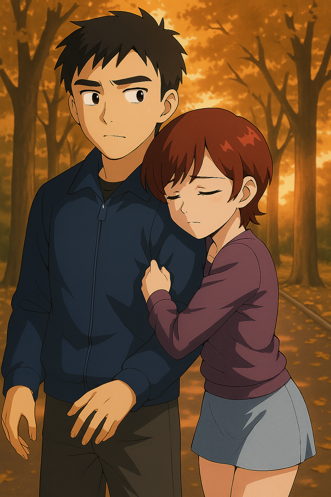
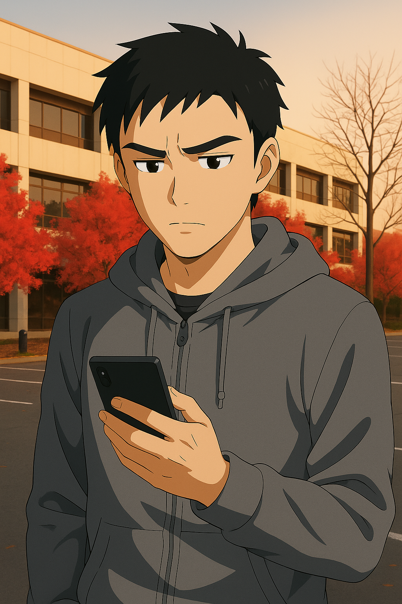
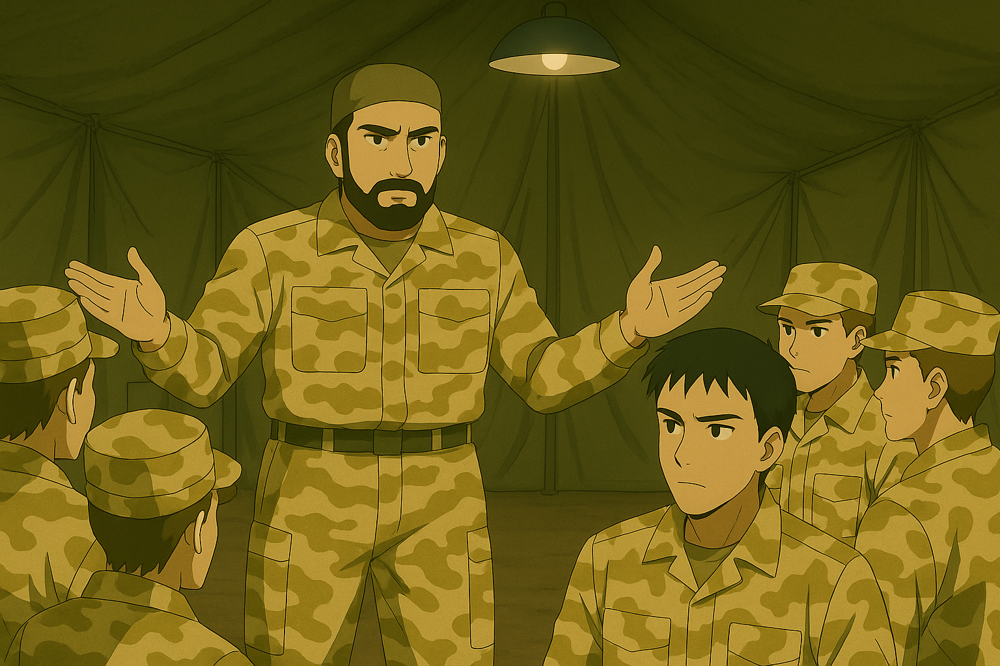
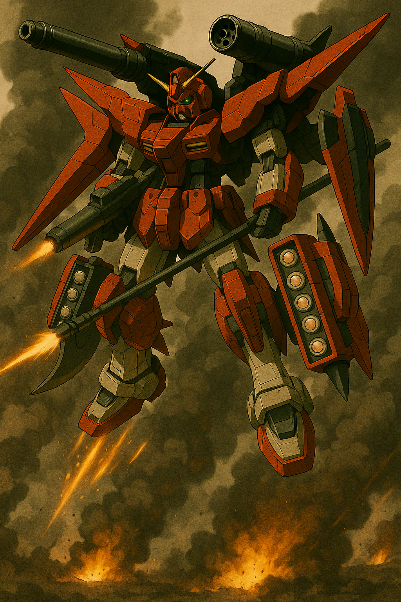

## 第七章：误杀
暑假一晃而过，时间很快就到了夏末初秋，林奕出发前一天傍晚。夕阳刚刚落下，校园里一片静谧。他刚把行李收拾好，就接到了柳怀真要求会面的紧急通知。他一路小跑赶到指挥楼，在那间熟悉的办公室门前站定。门开了，柳怀真正坐在办公桌后，神情比平日更加凝重。他抬手示意林奕进来，低声说："坐吧。"屋内的灯光昏黄，桌上一只银灰色的移动硬盘静静地放着，像是一件无声的信物。"关于明天的出征，"柳怀真语气缓慢，却带着压不住的重量，"我们相信你能代表我们出战，不辱使命，为国争光。"说着，他将那只硬盘推到了林奕面前。林奕愣了一下，"这个是......？"柳怀真点了点头："唐海和沈柏言——也就是你的两位前辈——的数据。包括他们的生平档案、全部的出战记录、战斗行为记录，以及他们留下的作战日志、他们所驾驶的MB的资料——盘古和刑天两个系列的机体——的全部数据以及相关的研讨会议记录等。这些是机密中的机密，我们对外宣称已经销毁，但我留了一份副本。现在，是时候交给你了。"他顿了顿，眼神望向窗外渐暗的天色："我知道你对这个好奇，也知道你一直在试图理解司命的神经映射逻辑——那些超常规的战斗反应，是他们亲手调教出来的。也许，这份数据，能帮你真正做到与机体共鸣。"林奕下意识把手放在硬盘上，却又收了回来。他的声音低了下去："可是......这么重要的东西，真的可以交给我吗？"柳怀真沉默了一会儿，眼神变得柔和又沉重。他缓缓说道："当年，你父亲出事的时候，我试图保住他的性命，但我做不到。那天之后，我就知道，人生最沉的债，不是欠国家的，是欠人的。"他的声音里藏着难以启齿的愧意："这次，如果我连交出这点信任都做不到，那我就真的，什么都没守住。"林奕怔在原地，心跳微乱。柳怀真看着他，忽然笑了，语气放松了些："你放心，这不是让我还债。是我看到了，你已经有那个资格，也有那个觉悟。"他站起身，绕到桌前，轻轻把硬盘塞进林奕的手里，"出去之后，就不再是来去自由了，回来的机会也许不会很多。必要的时候，你可以靠这个，把自己留下。"最后，他拍了拍林奕的肩膀，眼神里多了些父辈的厚重："记住，一定要活下去。"林奕点了点头，指尖轻轻收紧，仿佛握住了一份沉甸甸的托付。

林奕从柳怀真的办公室出来后，在国防理工那条种满了法国梧桐的林荫道上，慢慢地走着。夕阳的余晖，透过层层叠叠的树叶，在地上投下斑驳的光影，像一段段被打碎的、回不去的时光。他明天就要走了，去往一个他从未想过的地方。他心里很平静，没有激动，也没有恐惧，只是紧紧地握着那只移动硬盘。"林奕！"一个清脆的声音，从身后传来。他回头，看到陈旭怡站在不远处，穿着一身简单的运动外套和运动短裙，短发在晚风中微微晃动。她似乎是刚刚结束训练，脸上还带着细密的汗珠，呼吸也有些急促。"陈旭怡？有事吗？"林奕停下脚步，看着她。她快步走到他面前，仰起头，看着他的眼睛。她的眼神，一如既往地明亮、坚定，但林奕还是从中，捕捉到了一丝她极力想隐藏的、不舍的情绪。"我听说了，"她的声音很轻，像怕惊扰了这片宁静，"你明天就要走了？去纽约……加入维和部队？"林奕点了点头："嗯。上面安排的。""真好。"她低声说，像是在对自己说。林奕有些不解："好？"她抬起头，眼神里，重新燃起了一种林奕非常熟悉的光芒——那是他们三年前在数模竞赛中，一起攻克难题时，她眼中闪烁的那种，对挑战的渴望和兴奋。"是啊。我今年大四了。"她顿了顿，像是在鼓起巨大的勇气，然后，她用一种几乎是宣誓般的语气，一字一顿地说道："辅导员找我谈过，我的保研资格，已经拿到了。但是，我拒绝了。"林奕第一次，露出了真正惊讶的表情："什么？为什么？""因为，"陈旭怡看着他，眼神里，是毫不掩饰的、近乎滚烫的崇拜，"我想毕业后，直接应征入伍。"她向前走了一小步，离他很近，近到他能闻到她身上，那股淡淡的、属于夏日汗水的、青春的气息。她的声音放得更轻了，像是一个只愿与他分享的秘密："因为，我想追随你的脚步。"这句话，像一颗子弹，轻轻地，却又无比精准地，击中了林奕的心脏。他愣在那里，一时间，不知道该说什么。他知道瞬息万变的军旅生活是多么危险，想说"别傻了"，想说"那条路不好走"，想说"女孩子家家的，你不该像我一样"。但看着她那双燃烧着火焰的、不容置疑的眼睛，他发现自己，什么也说不出口，只能犹豫着问出一句："为什么？"

陈旭怡没有立刻回答，她的目光很亮，像是在审视他，又像是在审视自己。过了一会儿，她才轻声开口："你知道吗，林奕，我从小就好像一直在找一个答案。关于我们......关于人类，为什么要活着，能活成什么样。我总觉得，我们不该一辈子都陷在泥里，只为了生存本身而挣扎。"她顿了顿，眼神望向远方，仿佛看到了一个遥远的未来："我相信，一定会有那么一天，技术会发达到，让我们所有人，都不再需要为吃饭或看病而发愁。到了那天，我们或许才能真正地、奢侈地去思考——我们到底是什么，我们存在的意义又是什么。也许......那就是我们成为另一种、更高阶存在的开始。"她收回目光，重新望向林奕，眼神无比认真："而你让我看到了通往那一天的、唯一的路。你让我明白，在抵达那个未来之前，我们必须先守护好现在。守护和平，就是守护未来本身。"她向前走了一小步，离他很近，声音轻得像一个秘密："这就是我找到的答案。也是我......想追随你的脚步的、真正的理由。"林奕看着她，看着她那双在晚风中，因为信念而燃烧的眼睛。他第一次在一个同龄人身上，感受到了一种近乎神圣的、属于理想主义者的光芒。他想起了自己，想起了手中握着的，前辈们的数据，想起了那些在历史中燃烧又熄灭的名字。他忽然觉得，或许，他们这些被命运选中的人，存在的意义，就是成为火炬，去点亮后来者的路。

就在这份沉默中，陈旭怡突然，轻轻地上前，给了他一个极快、也极轻的拥抱。她的身体，是属于一个常年锻炼的运动员的，紧实、温暖，又带着一丝微微的颤抖。然后，她立刻就松开了，向后退了一大步，脸上重新挂上了那个爽朗的、仿佛什么都没发生过的笑容。她对他挥了挥手，转身，向着夕阳的方向，小跑着离开。只留下一句清脆的、被风送得很远的话："祝你一路平安，林神！"林奕站在原地，看着她远去的、充满活力的背影，许久，才缓缓地，抬手摸了摸自己刚才被她拥抱过的肩膀。他轻轻地，叹了口气。那声叹息里，似乎有感动，有欣慰，也有一种，他自己都未曾察觉的、关于"责任"的、沉甸甸的重量。

很快，林奕带着司命，只身来到了纽约。明面上，他的联合国维和身份为"技术特别顾问"兼"战术演示小组指挥官" ，挂靠于联合国维和行动部在纽约总部设立的"MB维和技术支援计划"。作为该项目的关键成员，他需时不时地常驻纽约联合国总部，负责参与高层磋商、技术成果展示、国际规则制定会议等工作。纽约是世界上当仁不让的最繁华的城市之一，但出生于上海的林奕厌倦了嘈杂的大城市，他特地把房子租在了40英里开外的新泽西，一个叫做皮斯卡塔韦的小镇。那里是新泽西大学附近的卫星城，住着不少学生和IT公司的工程师们，和纽约相比，有一份独立于世的宁静。林奕期待在没有任务的时候，可以自由地在院子里读读书，或者在附近的小公园里散散步。然而实际上，由于司命MB是中国派出的旗舰级维和技术展，维和部队会以技术展示为名，把他派遣至战火最紧张的地区执行任务。很快，林奕就接到了一个重大任务：赶往也门的首都萨那，调停那里一起由极端阿拉伯组织的自杀式袭击所引起的一场多方武装斗争，尽可能地保护平民不受损害，需要的时候被允许开火干预。他原以为此行不过是一次象征意义上的维和展示，直到任务简报上赫然写着"授权开火"四个字，他才意识到，这可能是一场他无法全身而退的战争。

林奕伴随着司命被空运至联合国驻也门首都萨那北部郊外的维和总部据点，那里有一个临时搭起的武装格纳库。说是格纳库，但实际上就是由一些乱石和防水油毡围成的一小块地。他的任务是，率领着一支由各国维和空军部队组成的10多架战斗机机群，配合已经出发的陆军部队，尽可能吸引双方战火的注意力，给人道主义医疗队在战场上争取时间。在一个帐篷里，给他们讲解任务的是临时战区司令侯赛因，是当地民兵组织的一个首领，拥有着高大的身材，黝黑的皮肤和满脸络腮胡。讲解完任务后，他用着不标准的英文讲道："自从阿拉伯之春失败以来，也门就成了阿拉伯世界的火药桶。而其中最苦的，自然是我们老百姓......无论是由沙特支持的也门政府，还是实际控制着包括这里在内的扎伊德军团，抑或是和我们的宗教水火不容的极端阿拉伯组织，在交火时都没有避开平民的意图。一场战争过后，往往是交战方一哄而散，留下一地平民的尸体......"侯赛因说着说着，眼眶不由得泛红，"这次战争也是，虽然只是一场小规模的局部战，但也是多方混战。对各位来说，只要不是联合国的维和部队，都可以看作是敌人。"最后，他诚恳地看着下面的战士们，把右手放在胸口："我只请各位勇士帮帮我们......这里的老百姓，真的太苦了。" 林奕转头看向帐篷外，目光落在了司命右肩上，新涂上去的联合国标志涂装，沉默不语。

很快，司命以战机形态一马当先，带领着一众战机冲向了交火现场。林奕很清楚，这些战斗机大多是从德国、印度、阿联酋调来的老式机型，火力有限，更多是为了空中威慑，真正要发挥战斗力的，恐怕只有自己的司命。正如侯赛因所说，这里的战场极为混乱，虽然他看不清到底是几方在同时作战，但作战方的武器从少量的战机、坦克、装甲车，到手持冲锋枪和火箭筒的士兵，再到戴着尺寸不合的钢盔、并拿着棍子和石头的骨瘦如柴的少年兵都有。战火所到之处，无不是遍地狼藉，尸横遍野，伴随着人们惊恐和绝望的呼号，连绵不绝，宛如人间炼狱。林奕本来尽可能地保持冷静，不想深入战争太多。他限制了AI接管自己机体的权限，尽可能只是开启头部机关炮骚扰敌方载具，或者低空飞行，利用自己的武器配合陆军维和部队，替他们在处处是断垣残壁的战场上开辟出一条条通路。但是，当他看到那些坦克为了攻击他，没有瞄准就一通乱射，丝毫不顾及射中了一群当地还在逃难的人们；以及一个对着同样低空飞行的战斗机发射反坦克炮的士兵，所弹出的炮弹壳当场砸死了路过他脚边的一个小男孩时，他觉得自己的理智被崩断了。"你们......就这么喜欢杀人吗？！"他一个人在驾驶舱内，对着空气怒吼着，"好，那我也让你们尝尝看这种滋味！"当反坦克炮再次瞄准联合国的战机时，司命的头部机关炮对着士兵扫射，士兵当场倒下，战机平安脱险。

林奕决定利用自己被授权的开火行为，不顾一切地保护平民和自己的队友。他解除了AI的限制，开始用尽全力回应这场战争。很快，随着AI的接管，加上林奕之前在坚持不懈的模拟战练习和几场实战中锻炼出来的驾驶能力，司命犹如脱胎换骨，怒吼着冲向敌方的立体包围圈。他趁两架敌机交汇的瞬间，抬手一枪，就将它们打了个对穿。后方的红外探测器又响了，他看到了三台坦克和一辆火箭车正在瞄准他。司命展开背后的光束炮，配合着手上的光束枪做扫射，在不溅起太多烟尘的情况下就干净利落地将它们都解决了。然后，他飞速冲往市中心，那里部署着一群也门政府武装的对空迫击炮台。林奕毫不犹豫地切换回战斗机形态，灵巧地躲避着炮弹的同时，打开了腿上的导弹舱，对着下面一通乱炸，几乎把整个炮台炸了个底朝天。同时，他手起刀落，抽出干将，一刀劈向了正准备偷袭他的一架敌机。"为什么还是不肯不明白！"林奕一边看着敌机被劈成两半，在空中解体爆炸，一边不甘心又绝望地喊道。这时，他用余光看到了右侧的不远处，又有一辆火箭车开了过来，火箭弹舱已经瞄准了他。"你还想继续作战吗！"林奕将司命变回了人形，调转机头，任由AI将手上的加特林锁定了敌人。这个时候，他惊恐地从摄像机里发现了，驾驶火箭车的是一个明眸皓齿，有着一头卷发，脸上稚气未脱的少年，看起来刚刚过了10岁！而且林奕注意到，火箭车旁边正好路过一对母子俩，妈妈惊恐地拉着看起来不过6岁的儿子，拼命地往前跑着。林奕想停下机体的动作，但来不及了，加特林已经开火了。瞬间，少年的火箭车当场爆炸，形成的一股热浪袭击了旁边的母子。林奕从耳机里听到了那位妇女和她的孩子因为被燃烧而发出的惨叫声，而很快两人就躺在地上不省人事，任由大火将他们烧焦。

