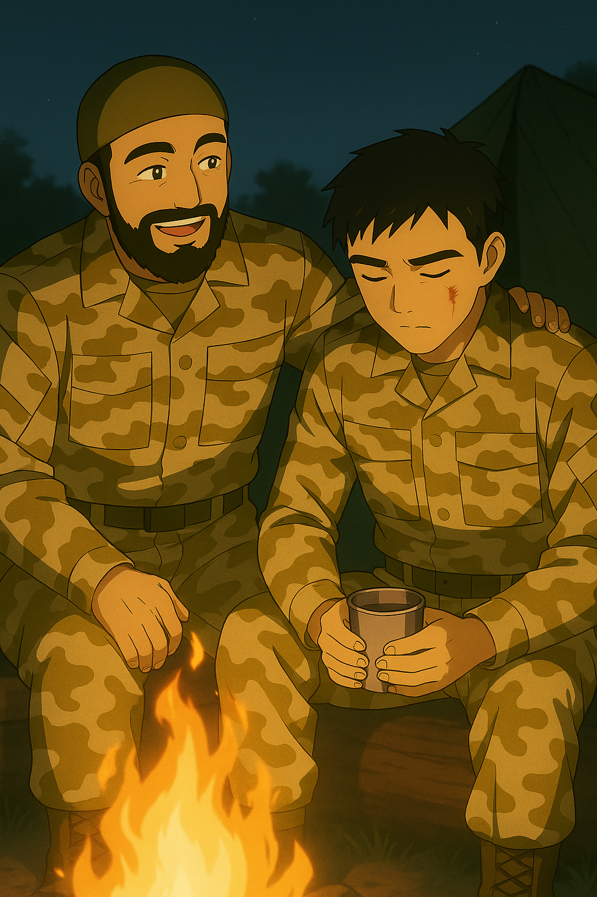
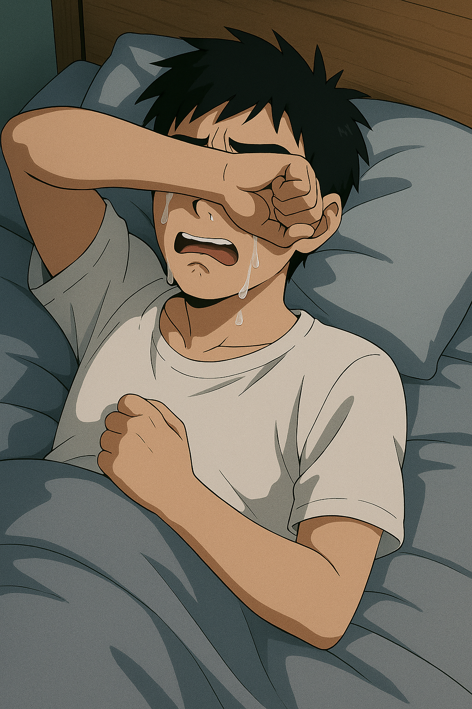
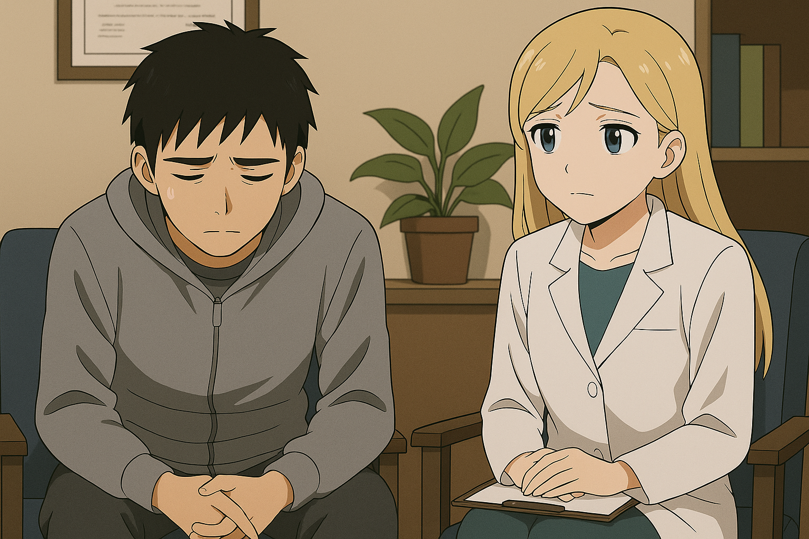

## 第八章：徒劳
林奕这才意识到自己干了什么，整个人惊呆了，司命悬停在空中没有一点动作。他看着自己的双手，嘴里失控地喊道："我......我做了什么？我做了什么？！"这时，控制台那里传来了侯赛因兴奋的声音："我们观测到，交战三方同时在从战场上撤退，医疗部队也已经基本完成了伤员回收任务。维和部队的各位辛苦了，请尽快停火，回到营地！"这时，林奕忍不住胃里的一阵翻江倒海，扯下头盔打开驾驶舱，就对着外面呕吐了起来。

等他回到营地时已经是半个小时以后，侯赛因已经在格纳库停机坪等着他了。当林奕刚拉着吊绳下来，侯赛因就忍不住冲上去拥抱了他，嘴里不停地重复着："林，太好了，真是太好了！谢谢，多亏了你，多亏了你啊！"旁边的队友们也纷纷涌了上来，确实也仰仗于林奕的神勇表现，整个部队没有牺牲一个人。刚才被他从反坦克炮的火光中救下来的，是一个来自德国空军的中年人。他带着德国人特有的不善言辞，什么话都没说，只是一只手紧紧地握住了林奕的手，另一只手用力地拍了拍他的肩膀。侯赛因没有顾上林奕一脸茫然的表情，转头就对大家宣布，今天晚上要在营地里开一个简单的篝火晚会，犒劳各位勇士。晚上，月亮升起，繁星点点，布满了整个天空。侯赛因叫来了夫人和自己14岁的女儿，和维和部队的大家一起庆祝今天的胜利。他特地让夫人带来了自己珍藏多时的私酿的葡萄酒，誓要和各位一醉方休。林奕没有喝酒，他只是拿着一杯水，坐在旁边静静地看着兴奋的人们。侯赛因借着酒劲，坐到了他身边："林，你怎么了？不舒服吗？"林奕没有抬头，他用手指摩挲着杯口，支支吾吾地说道："我今天......杀人了，对付一个少年兵时......误杀了一对母子。"侯赛因宽大的手掌往他身上一拍："嗨，我以为什么事呢。想开点，是你救了大家。被杀的母子固然可惜，但是在这乱世下，就算不是因为你，他们也很可能活不过今天。真的，没什么大不了的。"说完，他语气半是轻松半是认真："林，你知道吗？你今天救的不只是我们的战友，还有我这个家。"他指了指篝火那边笑着的小女孩，语气放得很轻："这是我14岁的女儿。我一直祈祷有一天真主会送来一个好人，能带她走。如果你不嫌弃......我是真的想——要是有你这样的人能带她离开这里，也许她这一生，就不用像我们这样活在乱世中了。" 林奕愣了一下，他一时没能反应过来，"女儿""14岁"两个词还在耳边回响。他下意识抬头看向那个女孩，对方脸上红扑扑的，黑巾裹头，眼神无比真诚。女孩也正好回头，看着林奕，她似乎察觉了什么，有些羞涩地低下头。他感到心里一阵难受，把手里的杯子搁下，站起身来："您说笑了......我心里还有些乱，想出去走走。" 火光映照下，士兵们的影子在地上跳跃，如同那些不愿被记起的亡魂。林奕站在人群之外，仿佛不属于这个庆祝的世界。

任务结束后的第二天，维和部队即将被联合国召回。士兵们将各自返回祖国，而林奕，是队伍中唯一要回美国的人。清晨的机场，侯赛因特意前来送行。他紧紧握住林奕的手，眼神里满是感激："林，你多保重！我再次代表我们的老百姓感谢你！"林奕把身上仅剩的几百美元现金拿出来，交到侯赛因手上："侯赛因先生，我也祝您和您的家人好运！"两人拥抱道别。然后分道扬镳。几天后，林奕回到了新泽西的出租屋。他的神情和战前一样麻木，食欲全无，整日盯着电视，无意识地换着频道。那天，CMM新闻频道正播报也门局势："虽然战局有所缓和，但当地仍有小规模冲突。昨天，一支不明来源的队伍发动了一场割喉行动，对于也门首都萨那的一支民兵部队发动了一场突袭，现场无人生还。据悉，该民兵组织的首领侯赛因确认死亡。专家称，高度怀疑是极端阿拉伯组织对之前的战败所展开的报复行为，但截至目前，尚未有组织对此做出表态。"画面停留了整整8秒，慢镜头扫过现场血迹斑斑的废墟——林奕一眼就认出了侯赛因的脸。他睁着眼，目眦欲裂，倒在血泊中，妻子和女儿的尸体就在旁边静静躺着，像睡着了一样。林奕呆坐在原地，颤抖着抬手指向屏幕，声音哽咽，连一句完整的话都说不出来。他的喉咙像是被什么堵住了，只剩下低低的呜咽。接下来的几天，他彻夜难眠。好不容易迷迷糊糊地睡着，梦中却总是反复出现——烧焦的母子，侯赛因睁着的双眼，女孩那天晚上的害羞微笑......每一次，他都在梦里惊醒，发现枕头已经被泪水打湿。他终于意识到，自己不能再这样下去了。于是，拨通了纽约联合国办公室的战后心理咨询服务电话，预约了一次评估。

这是唐以晴第一次见到林奕。那天的午后，阳光透过纽约联合国大楼厚重的玻璃窗洒落在灰白色地砖上，将影子切割得零碎。他坐在战后心理干预中心的角落里，一动不动，背脊紧绷，双手交握，目光始终垂着，仿佛一尊失语的雕像。穿着联合国制服的同事低声告诉她："他从也门回来后一直这样，什么也不肯说。我们见得多了，这很正常——真正的士兵，往往最难开口。"唐以晴点了点头，却没有立刻靠近。她试图用自己的感知能力去触碰他——就像她无数次做过的那样。但这一次，她感应到的不是痛苦、恐惧或羞愧，而是一整片令人窒息的混沌。没有边界，没有温度，甚至没有语言。那像是一场失控的风暴，却被他用尽全身力气压缩、束缚在心中，只露出沉默冰冷的表面。那不是她所熟悉的任何一种情绪反应，也不是普通创伤所带来的心灵裂隙——而更像一种无声的、孤绝的拒绝。唐以晴知道，此时的他不愿被碰触，也许，甚至不愿被理解。但是，出于责任感，她还是开口了："能告诉我......你在想什么吗？" 在沉默许久之后，他抬起眼睛看了她一瞬，随即垂下眼帘："说出来......不会让他们活过来。"他把脸转向窗外，不再言语。于是唐以晴没有再次出声，只在自己的记录表上写下一句话："极度抑制的共情者。悲伤未必是退缩，也可能是抵抗。"她以为他们之间的相遇就会这样匆匆过去——只是又一个沉默的来访者，又一张注定要归档的病历。她低下头写字时，脑海里闪过一丝不确定的念头。她忽然感觉——他似乎，在刚才的某一瞬间，抬头看了她一眼。她迅速抬头，但他依旧低着头，没有动，也没有说话。仿佛刚才那一丝知觉只是她的错觉。然而在那一刻，她却隐约感到，有什么悄然在空气中留下了痕迹：一段未竟的对话，一个未被言说的故事，一束未被允许靠近的光。他们的第一次见面，就这样结束了。她还在低头写字时，他就这样无声地离去了。没有留下姓名，没有交换太多言语。但两人都不知道的是，就在不久之后，双方将会再次见到对方。

