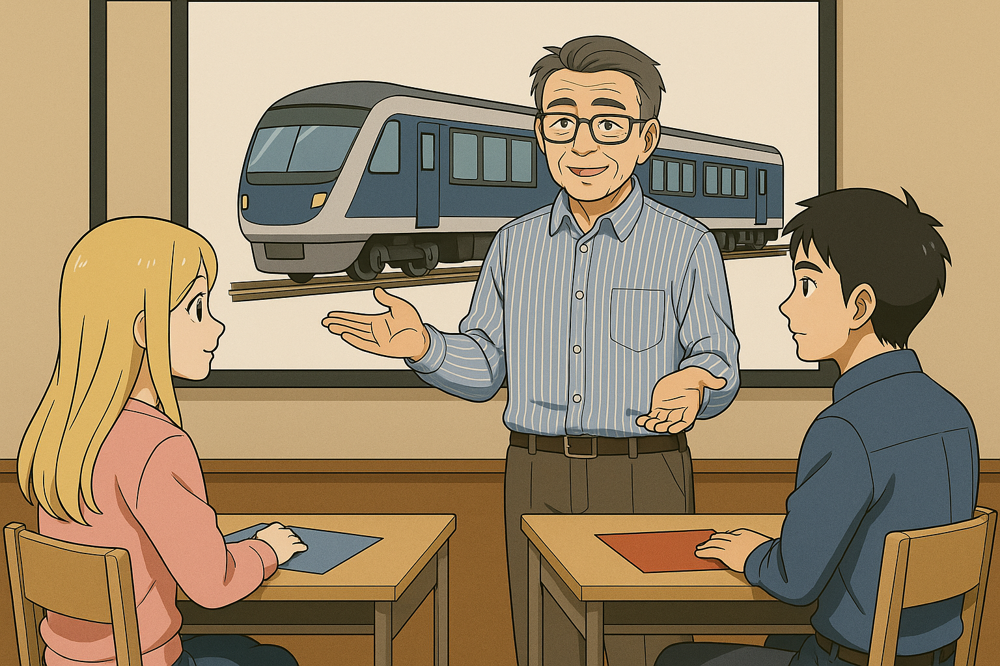
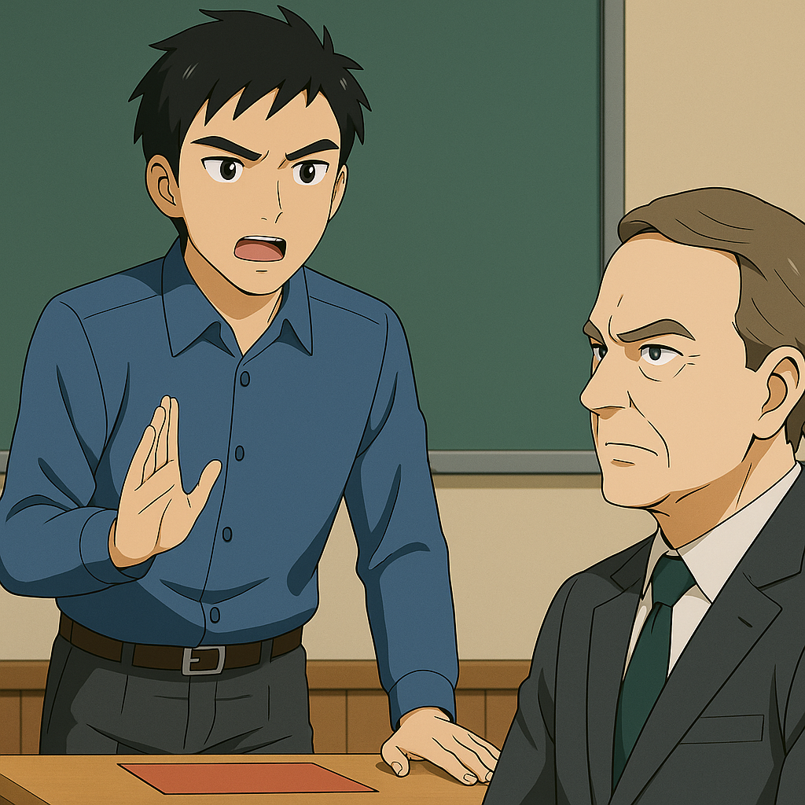
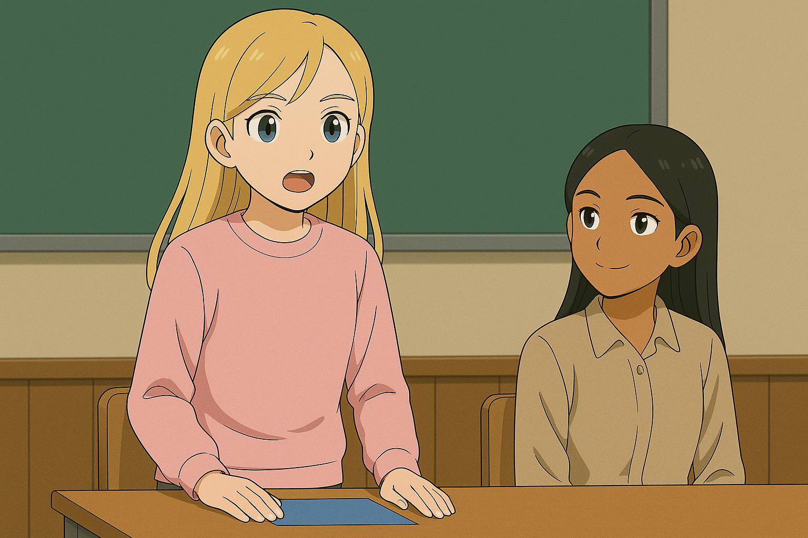
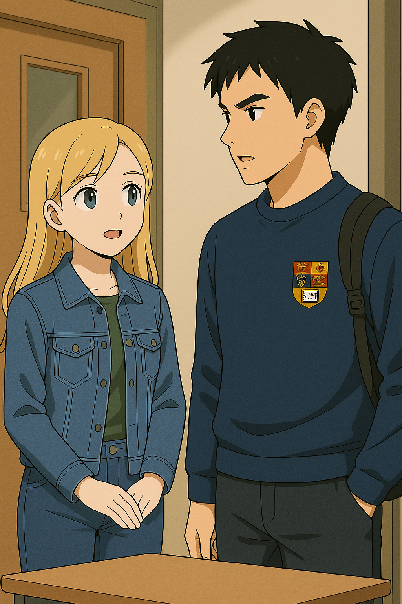

## 第九章：伦敦
联合国内部定期为一线与技术岗位职员提供培训福利，允许他们赴合作高校短期进修，以缓解长时任务带来的身心压力，也作为未来岗位晋升的学术补充。林奕从也门回来时，正好赶上战区轮休调整。作为常驻维和部队中执行纪录最佳的机师之一，林奕被选中赴英，前往伦敦皇家学院参与为期八周的进修项目。当然，这也是他的领导的意思：他是该好好休息了。他被选中去参加的课程名为"冲突创伤与行为决策"，内容聚焦于创伤性事件中个体的应激反应与干预机制，所修学分可计入军内专业晋升。林奕没拒绝，他在国内所属的解放军机动特别部队也给他发出了许可，他很清楚，自己需要一段穿便服的时间。唐以晴也申请了同一项目。她已经正式成为了战后创伤心理干预小组的一名中级研究员，研究方向是感知异常与创伤记忆。这段时间，她已接触过太多破碎的灵魂，因此她一直在试图寻找能从源头"预防崩溃"的答案。在看到课程大纲那一刻，她便决定报名——那正是她始终关心的议题。录取通知来得很快。她母亲提醒她说，这样的机会难得，她只是轻轻点了点头。

很快，他们的课程在伦敦皇家学院白城校区正式开始了。第一课，出人意料，又在情理之中，是一场哲学讨论课。教授是位六十岁上下、穿着讲究的老人，操着一口带有瑞士德语腔调的英语。他走进教室时，手里拿着一叠彩纸，发给每位学生两张红纸和两张蓝纸，然后淡淡宣布："我们今天的主题，是正义。"他抬起头，目光扫过全班，继续说道："请各位现在决定：你更倾向'程序正义'，还是'结果正义'。前者，请在你桌上放一张蓝纸，后者，请放红纸。"学生们纷纷低头权衡，最后陆续做出选择。林奕不出所料地放下红纸，唐以晴则毫不犹豫地放下蓝纸。

教授点点头，随后抛出了更具争议的第二题。"你们大概听说过电车难题。"他语气平静，如讲一个天气预报："一辆失控的列车正驶向前方铁轨，那里绑着五个人。你站在一旁，有一个拉杆，若你拉下，它将改道至另一轨道。但另一轨道上，也绑着一个人。"他顿了顿，扫视全场："请支持拉下拉杆的同学，再放一张红纸。支持不动手的同学，再放一张蓝纸。" 教授话音刚落，一个年轻的法国学生举手发问："我可以拒绝回答这个问题吗？因为现实中，若一个环境迫使我们只能在两种灾难之间做选择，那问题本身就出在这个环境。"教授像是早就预料到了，微微一笑："在课堂上，你当然可以拒绝回答。但别忘了，在现实中——没人能真正否定环境的存在。"这一次，教室内陷入短暂的沉默。讨论声悄然响起，犹疑与争执并存。最终，多数人面前是两张同色纸——不是两红就是两蓝，显出某种一以贯之的信仰。

只有两张桌子例外。林奕面前，摆着一红一蓝。而唐以晴，则是一蓝一红。两人都没有改变第一题的立场，却在第二题做出了"悖论式的选择"。教室安静了几秒。教授扫了一眼他们的桌面，轻轻笑了："看来，一对美丽的矛盾体出现了。这很好，至少说明你们不是在盲信正义。你们，不想解释一下吗？"

短暂的沉默后，林奕站起来开口了，"我是一个坚定的结果正义派。我的童年......有些复杂，我只能说，我活下来，不是因为谁给了我公平的程序，而是有人不讲规矩地拉了我一把。哪怕有一天这个世界变好了，我也不相信那是规则的功劳。因为我知道，它在最需要的时候从没保护过我们。因为我的出身，我坚信，程序只要是人定的，就一定会出错。只有掩藏在程序外的人和人之间的温情，才是我们赖以生存的根本。"他顿了顿，继续说，"按照最传统的结果正义来解电车问题，我当然知道，杀一个人能救五个人。但是各位，你们有没有想过，你们能不能承担杀了那一个人的后果？因为你主动的选择，你杀死了一条生命，一条活生生的生命。"旁边的英国本地同学提出了不同的看法："那么，你不拉，就会杀死五个人。你就没有心理负担？"林奕冷冷地反驳，"不，杀死那五个人的是上帝，是命运，不是我。相反，正是因为我知道如果我拉了，就是承担了做选择的重量。这是我作为一个人类，无法承受的结果。所以我宁愿选择沉默，也不愿代替上帝。"英国同学被说得哑口无言。

讨论落幕时，林奕缓缓坐下，全场一片沉默。唐以晴侧过头，望了他一眼。那一刻，她突然明白，面前这个男生并非"红纸"那一派典型的功利主义者。他的红，是血色，是他愿意背负因果、却绝不假装轻盈的沉默者的颜色。她忽然觉得头有些疼，不是因为共情，而是......一种极其罕见的情绪张力所化作的信号，在她脑中响起。她感知到了林奕发言时所展露的坦诚和澄澈，也听到了——那不是他的声音，却像是从他体内某个残存的意念里飘出来的低语："我不会放弃任何一个人，但我也绝不假装拯救谁。"她轻轻抬手，揉了揉太阳穴。她知道，她听见的，不是语言，而是残留在某种意识里的情感轨迹。她的眼神第一次停留在林奕身上，时间比任何一次都长。

全班的目光自然落到了唐以晴身上。她缓缓站起，组织了一下语言："和对面的这位先生观点不同，我始终是一个程序正义的忠实拥护者。"语气平和，但目光清澈坚定。"我的父亲是一位外交官，调停过各个国家之间纷争。而我的母亲是一位医学科学家，曾在战地一线救治过无数伤者。从小，我被教导要尊重每一个个体——不是靠个人判断去决定谁更重要，而是依靠制度和流程，尽力避免误判与偏私。"她微顿了一下，环视四周，"在我出生和成长的美国，一个充满多元文化的社会，正是程序——不完美但可调整的程序——让彼此尊重变得可能。如果连最基本的规则都无法被信任，那么我们之间，剩下的就只有暴力与报复了。"她目光落在林奕身上，轻轻点头，像是在表示对他经历的理解。但下一秒，她再次抬头，坚定地说道："所以在电车难题中，我选择拉下拉杆。不是因为我冷酷，也不是因为我代替了上帝，而是我相信：如果一个制度无法保障多数人的生存，那出错的不是人，而是程序本身。我们必须修复它。"她话音落下，一位泰国女生轻轻点了点头，低声说："确实......至少你保障了多数人的生命。"

她话音刚落，教室陷入了短暂的静默，不是冷场，而是两种信念间短兵相接后的凝思。林奕没有立刻说话。他只是看着唐以晴，眼神中多了一丝复杂的情绪。那不是辩驳，也不是认同，而像是第一次看清一个人——蓝纸的背后，流淌着冷静的血液，站在完全相反立场上，却依旧坚定而温柔的那种人。他轻轻抿了下唇，移开视线，右手在桌面上敲了两下，像是在压下什么思绪——却不知为何，心跳忽然快了半拍。他这才想起，这是之前给他做过心理咨询的医生。而在同一时间，他又突然意识到，自己记得她的眼神，却忘了她的名字。

教授微笑着扫视全场，似乎十分满意："很好。这才是真正的开学第一课。不过在那之前，让我们休息五分钟。"短暂的休息并没有挡住讨论的热潮，教室里很快嗡嗡作响。同学们低声交流着彼此的立场与选择，而林奕和唐以晴却在原地站了几秒，不约而同地走向了对方。四目相对。谁都没有先开口。直到唐以晴噗嗤一笑，打破沉默。她看着眼前这个一脸疲惫却依旧目光刚毅的男生，眼中闪过一丝调侃："你刚才——可没有选出最正义的结果哦，结果正义先生。"林奕本来板着脸，被她这句带刺的玩笑一激，嘴角却轻轻抽了一下。他撇撇嘴，声音低沉而不失礼貌："彼此彼此，程序正义小姐。"两人就这样，隔着两张纸的颜色，第一次短兵相接。很快，五分钟过去了。唐以晴转身回到自己的座位时，忽然想起了高中时那间逼仄的走廊。那时她只敢沉默地站着，用不动声色去回应羞辱。而此刻，她却在笑。那一瞬间，她并不孤独。林奕目送她离开，仍站在原地，目光停在她的背影上。他心里浮出一个陌生的念头：这个人，可能听得懂我。他轻轻皱了皱眉，仿佛不愿承认这点，又好像怕这是真的。

八天的培训很快就过去，转眼间就到了结课的下午。林奕听到了很多在国防理工从未听说过的人物，约翰罗尔斯，乔治奥威尔，哈珀李，让他应接不暇。甚至学校还为他们安排了一节宗教绪论课，用以理解世界各国由于宗教所引起的一系列纷争背后的源头，林奕感觉自己头脑里塞满了亚当，诺亚，以撒，摩西等千奇百怪的名字。事实上，通过这八天的学习，他发现自己并非对哲学和宗教完全没有兴趣，无论是皇家学院的教授们启发性的教学，还是同学们在课堂上激烈的讨论，都能引起他的思考，和高中政治课和历史课只强调记忆的学习完全不同。但马上要重回战场的他，实在是没有心情去深究这些知识背后的深层含义了。当他沉默地理着包时，被一个清脆的声音打断了，"嘿！"他抬起头，看到唐以晴略带笑意的眼睛。他不知为何心跳有些加速，但他定了定神，说道，"嘿！怎么了？"林奕不敢多说一个字，怕自己奇怪的情绪让自己失态。但他又隐隐觉得，自己在唐以晴这双漂亮的宝蓝色眼睛面前无处遁形。唐以晴眼中的笑意更浓了，"我记得你也是联合国的，我们应该见过面。"不等林奕回答，她继续道，"要不要一起吃个饭？我们既是同事，又是班里为数不多的东亚面孔——应该有着差不多的味蕾吧？"林奕愣了一下，然后有些结结巴巴地笑道，"是，是啊，哈哈，确实，学校附近的炸鱼薯条我实在吃不下去了。你想去唐人街吃中餐吗？"唐以晴眼睛在笑，但略微撅起了嘴，"我很喜欢中餐。但伦敦的中餐？饶了我吧。"正在他们交谈的时候，旁边路过的一个来自阿联酋的同学进来插话，"如果二位对中东菜感兴趣，我有一家很不错的黎巴嫩餐厅推荐哦！"唐以晴眼睛一亮，充满期待地转头看向林奕。林奕点了点头，拿起手机准备搜那家黎巴嫩餐厅。阿联酋的同学看着他们，嘴角露出一丝狡黠的笑，"我记得二位第一天的互动......第一天还在水火不容地辩论，今天就要去约会了？"林奕敲手机的手指停下了，脸有些涨红地抬起了头，眼里有些慌乱。倒是唐以晴落落大方地轻轻一笑，回道，"我猜你对约会的定义，和我们不一样呢。"说完，她对着林奕眨眨眼，眼中微微泛着一丝波澜。好在那位同学也没为难他们，笑着离开了，两人心里轻轻地松了口气。

