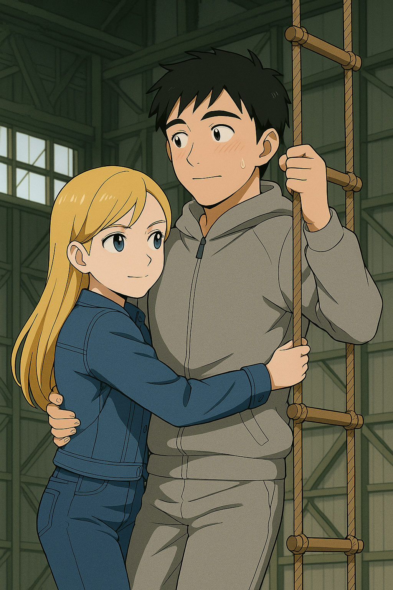
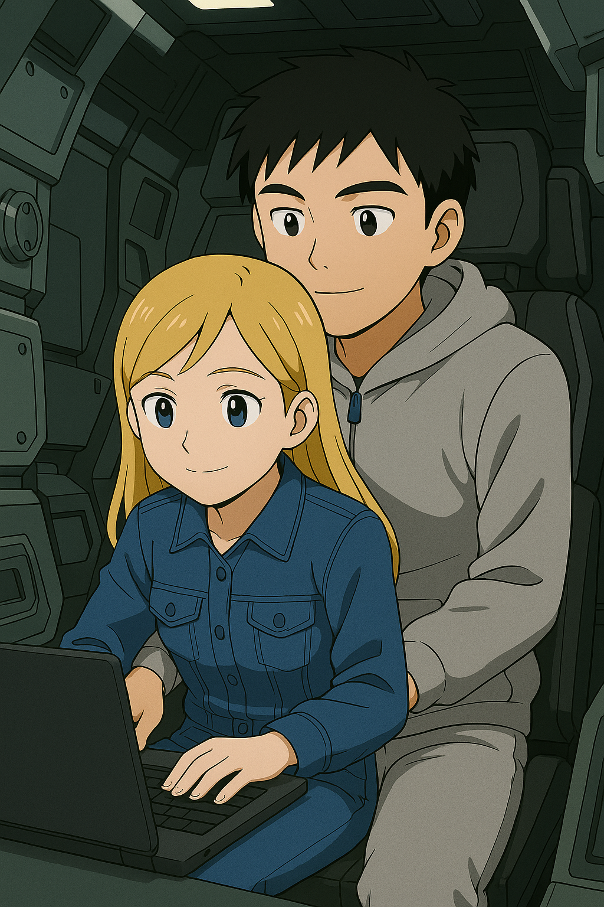

## 第十四章：唐海
林奕在受审后就一直呆在新泽西的家里。他当然不能再接触任何战斗相关的任务，但部队领导以他即将开始短期进修为理由，延缓他接受强制心理干预的期限，实则是用停薪留职的方式，想办法暂时保住他的职务。过两天，安排下来了，即刻启程。他拿着部队为他订的机票，麻木地坐上火车，前往纽瓦克机场。

而经历了一系列事件后，身心俱疲的唐以晴终于承认，自己已经无法再在工作岗位上多待一秒。她主动申请暂停所有心理干预任务，将全部心力投入到国际冲突法的硕士课程中。这是一个远程授课的学位，但唐以晴决定选修一节在校园里面授的课程，好好转换一下心情。

几天后，位于哥斯达黎加的联合国下属的和平学院的餐厅里，阳光透过百叶窗洒落在微微泛黄的瓷砖地面上。唐以晴在那里，意外地再次遇到了林奕，他一个人坐在室外的桌子上，慢慢地吃着午饭。自军事法庭以来，这是第一次两人再次相遇。唐以晴犹豫片刻，起身搬着托盘，坐到了林奕对面。林奕微微抬头，没有说话。他没有问她为什么也在这里，只是默默地看着她。唐以晴也静静地望着他，两人相顾无言。一会儿，唐以晴忍不住开口了，声音有些低哑："你是对的。比起执着于那个本就不存在的'程序正义'......我现在只希望，能少死几个人。"林奕垂下眼帘，沉默了几秒，轻轻摇头："你不知道，我试过‘少杀'。每一次出击都避开驾驶舱。但只要战争还在......他们迟早会死。"咖啡杯在桌面上轻轻一碰，发出闷响，像是将空气切成了两段。唐以晴忽然低声开口："我记得我妈提过一个人。她只见过他一次。但那个人，也说过和你一样的话。"林奕没有抬头，只是用指节缓慢敲击着桌面："巧了。我的'不杀哲学'......说实话，也不是原创的。是AI教我的。那套AI，是用一位前辈机师的行为数据训练出来的。"突然，他带有些笑意地说："那个人......也姓唐。可能我命里注定，和姓唐的绕不开吧。"唐以晴低低一笑，声音柔却清晰："你在伦敦的时候......不是问过我，为什么姓唐吗？"林奕终于抬头，看着她。她的眼神沉静，却无比认真。"我的姓，就来自那个人。就是我妈口中提到的那位。他是个中国人。救我命的骨髓......很可能就是他的。他也拥有和我一样的感应能力。"她说这句话时，眼神落在他敲击的手指上，仿佛在等待什么确认，又仿佛在逃避它。林奕怔了一下，喉头轻轻动了动，像被什么击中。但他没有出声。空气凝固在那一刻。两人对视，唇齿轻轻张开，几乎同时吐出一个名字——"唐海？"

空气里一阵安静，只有远处传来的海浪拍岸的声响，仿佛这个名字不是被说出口，而是被回忆唤醒。两人对视良久，像是在确认，又像是在回忆。最终，林奕率先开口："你那边，有他的资料吗？"唐以晴点点头："是他的战后行为及其心理状况分析报告，我妈当年和他接触了一天后整理的，之前为了我的研究交给我了。你呢？"林奕轻轻地打了个响指："战斗数据库的全部版本记录，以及他的个人档案，相关的会议记录，教学记录，等等。飞行、判断、反应曲线，还有一次完整的精神连接数据。我们曾用它训练了司命。"唐以晴喃喃道："那他就真的活过。"

两人稍一合计，便迅速拟定了一个计划——一个能让"唐海"开口的计划。一周后，他们一同回到了联合国纽约总部。借着夜色掩护，两人悄悄潜入了驻外基地后方的机库。因为唐以晴常为前线归来的士兵进行心理评估和干预，而这些士兵时间紧张，有时干脆就约在机库见面，因此她拥有这里的出入权限。"滴——"的一声轻响，门锁解开，机库的大门缓缓开启，没有触发任何警报。唐以晴狡黠地回头冲林奕一笑，林奕无奈地摇头，轻声自语："真拿你没办法......"他们一边小跑，一边在昏黄的灯光下摸索前行，最终停在了司命前。林奕熟练地找到驾驶舱垂下的升降踏板，手中握着两个移动硬盘——一个来自柳怀真，另一个是唐以晴的。他抓住绳梯，转头看向唐以晴："接下来交给我就行。你先回去等我？"唐以晴正点头回应，忽然听到远处传来脚步声——是巡逻的守卫！她来不及多想，猛地扑过去抱住林奕，低声而坚定地命令道："快上去！"林奕顾不上心跳加速，本能地回抱住她。绳梯启动，缓缓升起。他们刚抵达驾驶舱，守卫的脚步声已近在咫尺。"什么人？"守卫听见动静，举起手电四处扫射。林奕连忙一把将唐以晴拽进狭小的驾驶舱，迅速合上舱门。两人屏息静气，靠在驾驶舱的椅子上不敢动弹，听着外头脚步逼近。手电光束在舱外晃动片刻，守卫皱了皱眉，自言自语道："大概是我多心了......"他环顾四周，又抬头看了看，确认无可疑迹象后，转身朝远处走去。

过了好一会儿，林奕确认外头已经没有动静，悬着的心这才缓缓落地。"喂，你要抱着我到什么时候？"怀中忽然传来一声抗议。他这才意识到，唐以晴还窝在他怀里，正抬头看着他，脸颊微红。林奕心跳瞬间漏了一拍，连忙松开手臂。唐以晴正要起身，结果刚站起来就一头撞上了上方的荧幕，重心一晃，又跌了回来，正好再次扑进林奕怀里。"好家伙，这驾驶舱也太小了吧！"她嘟囔着，语气有些气恼，"我一米六不到的身材都站不直，你这样一米八几的大个儿，平时可真不容易啊。"林奕强压着快要跳出喉咙的心跳，清了清嗓子，故作镇定地道："咳，是啊是啊......好了，别闹了，赶紧开始正事吧。"他们的计划，是将手头的两份数据拼接整合，并接入司命所搭载的嵌入式战术AI系统。依托司命的GPU和战斗大模型底座，他们要"重建"一个以唐海行为数据为蓝本的对话模型。一开始，林奕打算独自完成这项工作，但他很快发现——唐以晴对AI架构与对话模型的理解，远远超过了他。于是，两人自然地分工合作：林奕负责底层的嵌入式程序开发，唐以晴则负责AI部分的编码与模型搭建。驾驶舱逼仄到几乎无法转身，唐以晴只得坐在林奕两腿之间，膝盖几乎贴上仪控板。林奕屏息凝神，死死盯着操作界面，仿佛一眨眼就会遗失思绪，只能强行把注意力钉在代码与参数上，逼着自己不去感受近在咫尺的体温。

当基础模型载入后，唐以晴尝试输入一组基本提示词。几秒后，终端报错：内存不足。"推理架构跑不动。"她皱起眉，"内存全吃光了。你这台破机器到底还剩多少内存？"林奕飞快地敲了几行指令，抬头回答："5个G，够不够？""5个G？！"唐以晴瞪大了眼睛，"别说训练模型了，连跑个推理都吃力吧？估计是为了战斗指令，预载了太多键值对。现在这个模型，只能吐出一百来个字符回答......"林奕也皱起眉头："那怎么办？我可不敢清内存。要是误删关键数据，下次启动司命可能直接变成一堆废铁。"唐以晴的眼睛转了转，转过头对林奕说："看来只能试试检索增强生成了。"她简要解释原理：建立数据库索引，将已有文本资料输入其中，通过语义检索挑出最相关的内容，再让大模型基于这些资料生成回答。虽然慢，但胜在节省内存，适合这个资源贫瘠的环境。林奕点头："这好办。"他立刻开始操作，找到系统自带的向量数据库。他们并肩协作，将唐海的资料切片、压缩、格式化，一点点写入数据库，整个过程几乎榨干了司命系统的资源。林奕在处理这些数据的时候，他也从一份唐以晴那边，唐海的战后分析中注意到了，唐海最终成了台湾自由防卫军的王牌，驾驶着一台叫做栞星II式的MB对抗解放军，也正是他击败了来自对岸的"高能光束"。他瞬间想到了沈柏言的赤烬，以及他临终时奇怪的话语。他意识到了，沈柏言可能通过某种方式，认出了这是来自自己导师的攻击。"这下一切都通了......"林奕一边庆幸自己终于能想明白了一切，也暗暗感慨战争对命运无情的捉弄。在等待加载的间隙，唐以晴忽然问："你说，我们该问他什么？不能太抽象，也不能太具体，更别想多轮对话——内存不够。"林奕沉吟着点头："对。不能问他什么是正义，也不能问他如何实现它......系统会崩。"两人一时无语。片刻后，唐以晴忽然轻轻笑了："不如，就问电车难题？"林奕也笑了："那个我们当年谁也不肯让步的问题？""嗯。"她望向屏幕，眼神里多了一丝决绝，"如果连他也无法回答......那这个世界，大概真的没有答案。"两人相视而笑，同时点了点头。

此时，数据库加载完毕，两人的测试代码也写好了。屏幕亮起，一行短的不能再短的提示词被送入模型中——电车问题中，你会拉下拉杆吗？【唐海AI系统v0.1】思考片刻，缓缓回答："一般情况下我不会拉，因为我不是上帝。 但如果轨道上有我爱的人，我会拉。因为我是人。我愿意背负偏袒的罪，只因我不能看着所爱的人死去。若世界不能容纳这份诚实，那我死，也不"。屏幕安静地停留在这行很短的，还没有写完文字上，那是模型的上下文窗口已然溢出。林奕和唐以晴沉默不语。就在那一刻，他们同时看见了一个词——诚实。他们终于明白：不管选择救一人还是五人，不管是选择代表程序的蓝纸还是代表结果的红纸，只要人不能说出我真实之所见，那么正义就永远是别人的工具：让结果正义成为了暴力横行霸道的遮羞布，让程序正义被当作权贵为所欲为的通行证。而唯有诚实，才是人之为人的基本底价。

