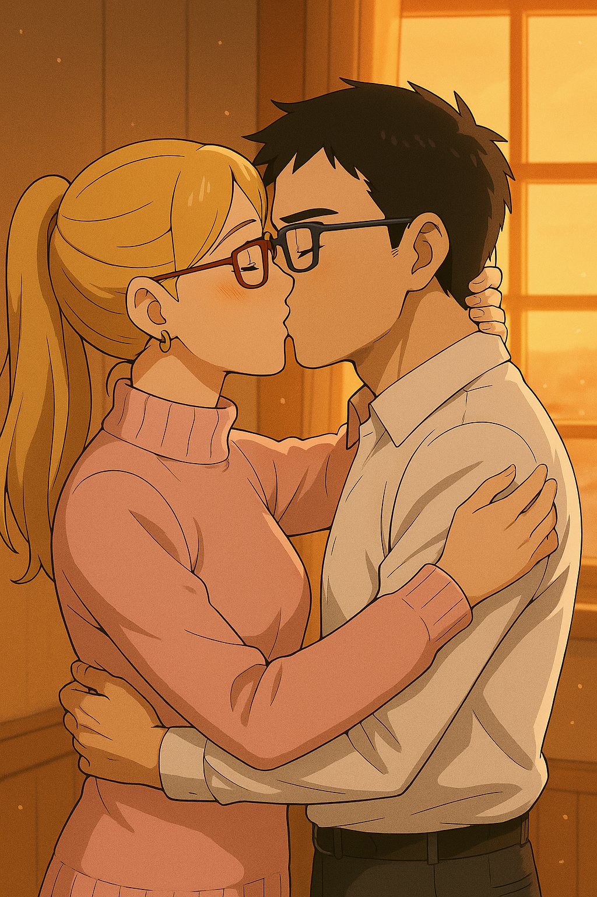
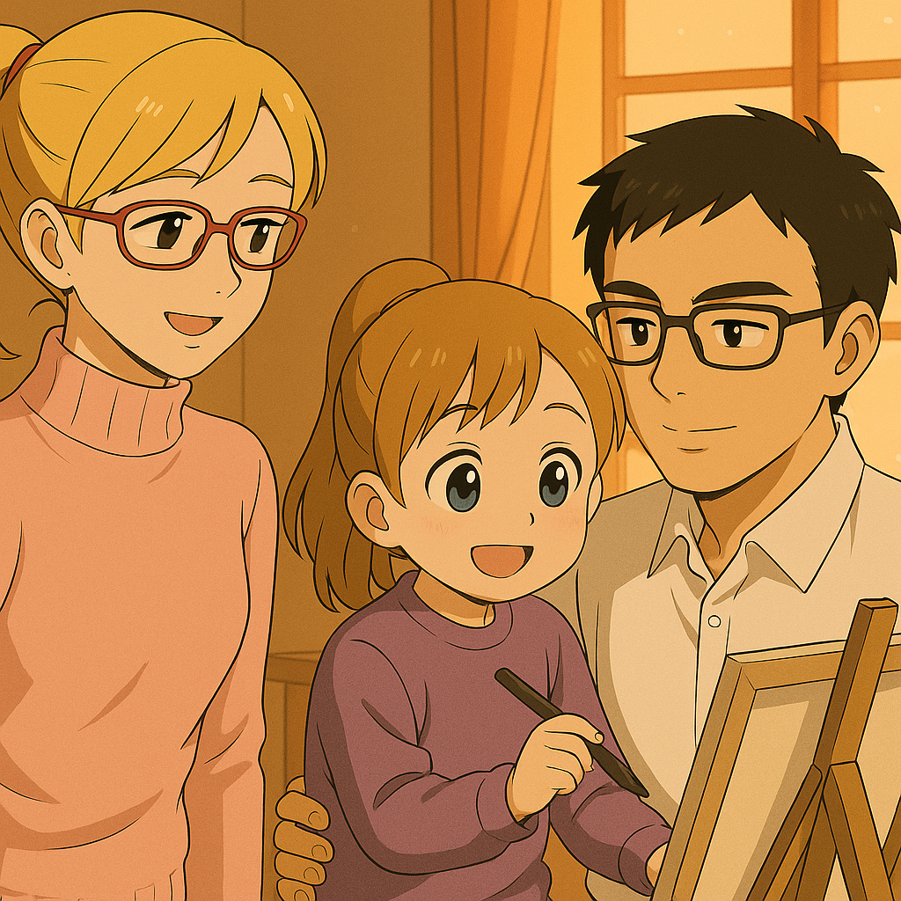

## 第二十二章：和平
战后，林奕与唐以晴决定辞去联合国的职务，将余生投身于新的事业。由于早年已被官方登记为【失踪人员】，林奕无法再使用曾在维和部队的身份，也无法恢复中国国籍，他的中国护照当然早已作废。最终，在联合国老同僚的协助下，他顺利入籍瑞士。林奕不愿再与战争为伍，因此就在联合国代表与瑞士政府的共同见证下，他亲手销毁了司命Ω的所有武器核心部件——所有武装驱动模块当场熔断，作战系统中的核心代码亦被彻底删除，仅保留AI训练与农业作业功能。这些武器的残骸被封存进了莫尔日兵器博物馆，展厅由联合国、瑞士中立委员会与红十字国际委员会三方共管，并在林奕与唐以晴的监督下签署协议，规定展品仅用于每年和平主题公开展览，不得维修、不得升级，不得再战。至于司命Ω本体，它顺利通过了瑞士联邦农业局的认证，正式登记为一台标准农用机体。

离开日内瓦之前，两人在市政厅登记了结婚，没有典礼，没有特别庆祝，只是在一个小的颇具当地特色的小餐馆里，请了几个朋友和自己的父母来见证。婚礼那天，下着细细的雪。日内瓦老城区的石板路因为前夜的霜冻而有些滑，唐以晴穿着一件深蓝色呢大衣，头发挽起，耳边戴着婆婆季思澜送的金耳环。林奕则一身简单西装，神情紧张，却在握住她手的那一刻，终于放松了下来。市政厅的工作人员用法语念完誓言后，又转用英语重复了一遍，两人相视一笑，几乎同时说出那句"我愿意"。 那顿饭吃得很简单，一瓶干白、几盘奶酪火锅和香肠拼盘，朋友们用蹩脚的法语和德语互相敬酒。季思澜坐在一旁，看着儿子久违的笑容，眼里泛着泪光。而瑟琳娜，则悄悄给了唐以晴一个拥抱，说了句："你长大了。"

尘埃落定之后，林奕与唐以晴一同搬去了弗里堡，隐居在弗里堡郊外的一片田野附近。林奕靠着唐以晴的帮助，艰难地在德语与法语的夹击中适应了新生活——毕竟连学英语时都已是九死一生。但最终，他成功加入弗里堡农业研究院，成为了农业机械方向的首席工程师。而唐以晴则凭借自身优秀的学术背景与多语言优势，顺利进入弗里堡州立大学心理学系读博，专注于神经科学与心理干预的交叉研究。

几年后的一个春天，司命Ω在一片研究田地边，喷洒着测试中的生态农药，动作温顺如一头被驯服的巨兽。林奕的头上已经悄悄地冒出了几根白发，他靠着窗，望着远处田野间劳作的司命Ω。那本是台战斗专用的机体，如今却在日光下缓缓耕作，与新赋予的使命虽仍有些格格不入，却也让人心生敬意。他沉吟片刻，心中浮现出一个念头： "或许......是时候重新设计一台真正属于和平时代的机体了吧。" 他取出一支钢笔，认真地在草稿纸上描起心中构想的模样。他特地把脑袋的部分设计得圆润一些，是因为他不希望机体看起来再那么得凶神恶煞。描了几笔，他不自觉看向身旁正翻阅脑科学论文的唐以晴。她察觉到他的视线，也抬头望向他。两人目光相接，默契而柔和地一笑。

她低头看了眼他的草稿，问："新机体？" 林奕点点头："嗯，司命Ω·II式。" 唐以晴微微蹙眉："Ω已经象征万物尽头，再加个II式，好像......有点奇怪呢。" 林奕思索片刻后，点点头："你讲的对。何况作为一台和平世界的机体，它不应该再追求武力上的更加强大，而是应该有能力去保护我们所创造的世界，一个终将可以包容所有人，所有思想的完美世界。"唐以晴不说话，心里默念着【包容】两个字。过了许久，她抬起头说出："∀？不属于任何自然语言，而是全称量符号，在数学上，表示包含一切的意思。"林奕笑了："好啊，我喜欢这个名字。而且，是时候让新机体抛弃司命的前缀了。我们的命运，已经无需神明的介入。"

然后，林奕又看向了东方，"当然，还有那个家伙，五月花，它的罪可还没赎完。" 他低头，又在草稿纸一角勾勒出另一台机体的轮廓。线条锋锐、结构分离，仿佛随时可以拆解重组，"Turn X。""Turn X？"唐以晴有些疑惑，"X倒过来不还是X吗？存在这个字符吗？"林奕笑着摇了摇头："没有，但这正是我想表达的。∀，犹如一把插入大地的犁头，开垦未来，孕育天下万物，代表技术之光，庇佑人类。Turn X，就像两种不同理念的交汇，和谐共存，翻转不改其心，象征律法之本，镇守世界。"唐以晴笑了："看来，是一对兄弟机呢。"

他们一边轻声交谈，一边望向不远处摇篮中安睡的小儿子。那孩子正轻轻吮着奶嘴，似在梦中咕哝着什么。唐以晴俯身，温柔地推着摇篮，但她的眼神暗了下去："也许......哪怕是这对兄弟机，终究也会被滥用到不该出现的地方。"林奕轻轻搂住了她："那又怎样？人类的进步，本就是一部螺旋上升的历史。希望的种子已经种下，总有一天会发芽。"她望向他，许久不语。然后，他们静静地吻在了一起。

"啊！爸爸妈妈在亲亲！！"一个清脆的童音打破宁静，四岁的女儿蹦蹦跳跳跑来，满脸坏笑，林奕和唐以晴赶忙红着脸分开。女孩儿一眼瞥见画板上的画稿，兴奋地爬上林奕的腿要抱抱。林奕抱着她看向画板，"哇！这是机器人吗？好像一个老爷爷哦！" 她抓起笔，在∀的脸上蹭蹭几笔，添上了两撇滑稽的大胡子。"乖，不要动爸爸的画稿！"唐以晴赶紧将她抱了下来，小女孩咯咯笑着跑开了。唐以晴无奈又宠溺地笑了笑，放下手中的论文，轻快地追了上去。林奕回头看着画稿，望着那突兀的大胡子，又看了看身旁熟睡的小儿子，忽然觉得——这好像也挺不错的。

