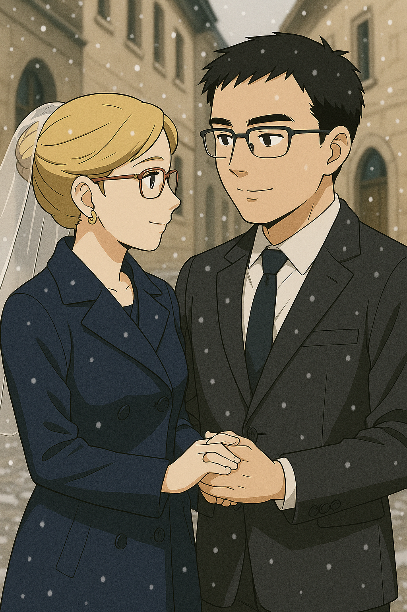
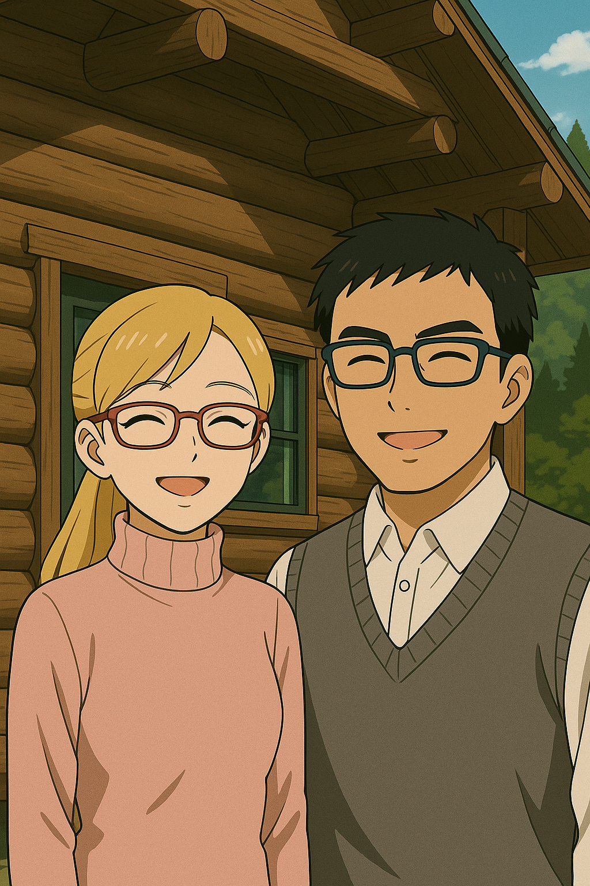
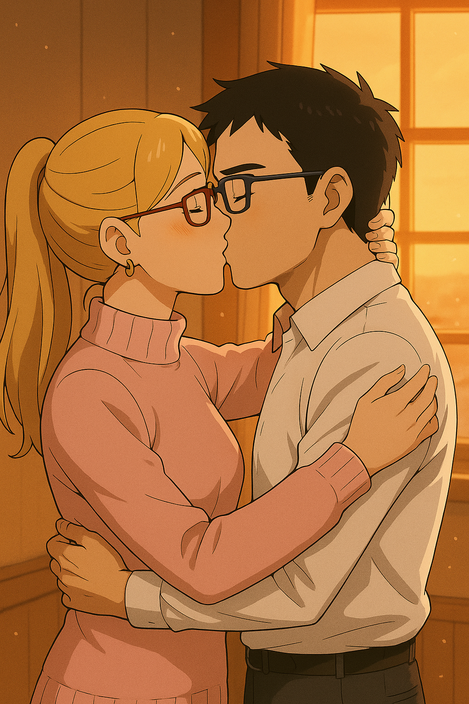
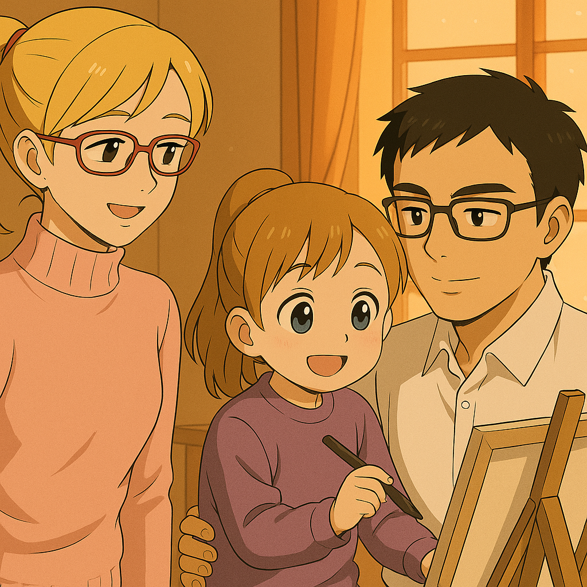

## 第二十三章：和平
随着那台叫做五月花的，凝聚着美国国防部的超额预算与军工业全部智慧的MB，在耶路撒冷的战场上殒落之后，它成了一尊无法被无视的墓碑，宣告了一个时代的终结。这场代价高昂到无法计算的失败，终于成为了压垮华盛顿鹰派的最后一根稻草。这群高高在上的白宫的战略家们认识到，与其说是一场战术上的失败，不如说是美国全球霸权战略的一次不可逆的'应力性骨折'。在国内一阵又一阵的反战浪潮与日渐空虚的国库的双重压力下，美国终于不得不开始重新审视其遍布全球的军事存在。他们不情愿地承认，美国作为'世界警察'的成本，早已超出了帝国的偿付能力。于是，一场漫长而混乱的全球性收缩开始了——军队从一个个曾被许以'正义'的泥潭中被陆续撤回，基地被废弃，盟约被重新评估。那头曾习惯于盘踞世界地图的雄鹰，终于在痛苦的挣扎中，开始将它那些早已疲惫不堪的利爪，一根根地，缓缓收回羽翼之下，将目光重新投回自己的巢穴。虽然不是所有人都为此感到高兴：那些依赖美国驻军保护的国家们，不得不开始考虑建设自己的国防体系。无论如何，整个世界都或多或少地感觉到了，人类要开始适应一套全新的，去中心化的民主规则了。

而与此同时，回到瑞士的林奕与唐以晴决定辞去联合国的职务，将余生投身于新的事业。由于早年已被官方登记为【失踪人员】，林奕无法再使用曾在维和部队的身份，也无法恢复中国国籍，他的中国护照当然早已作废。最终，在联合国老同僚的协助下，他顺利入籍瑞士。林奕不愿再与战争为伍，因此就在联合国代表与瑞士政府的共同见证下，他亲手销毁了司命Ω的所有武器核心部件的设计图，作战系统中的核心代码亦被彻底删除，仅保留AI训练与农业作业功能。那些从耶路撒冷战场上所回收的司命Ω以及五月花的武器残骸以及黑匣子，被封存进了莫尔日兵器博物馆，展厅由联合国、瑞士中立委员会与红十字国际委员会三方共管，并在林奕与唐以晴的监督下签署协议，规定展品仅用于每年和平主题公开展览，不得维修、不得升级，不得再战。在林奕帮忙回收五月花的本体时，找到了一只沾满血的吊坠。打开一看，是一个墨西哥男孩和他父母的合照。林奕知道，这是帝奥斯，这位他从未谋面的对手，最珍贵的东西。他有些不忍，悄悄地收下了这只吊坠。至于司命Ω本体，它已经在之前的冲击波中被燃烧殆尽。还是在前同事的帮助下，林奕和工程师们在维和部队的格纳库中，按照机体本体的图纸，重新搭建了一台没有武器系统的司命Ω。机体顺利通过了瑞士联邦农业局的认证，正式登记为一台标准农用机体。

离开日内瓦之前，两人在市政厅登记了结婚，没有典礼，没有特别庆祝，只是在一个小的颇具当地特色的小餐馆里，请了几个朋友和自己的父母来见证。婚礼那天，下着细细的雪。日内瓦老城区的石板路因为前夜的霜冻而有些滑，唐以晴穿着一件深蓝色呢大衣，头发挽起，耳边戴着婆婆季思澜送的金耳环。林奕则一身简单西装，神情紧张，却在握住她手的那一刻，终于放松了下来。市政厅的工作人员用法语念完誓言后，又转用英语重复了一遍，两人相视一笑，几乎同时说出那句"我愿意"。 那顿饭吃得很简单，一瓶干白、几盘奶酪火锅和香肠拼盘。麦普那天非常高兴，带着不同地方来的朋友们用法语和德语互相敬酒。季思澜坐在一旁，看着儿子久违的笑容，眼里泛着泪光。而瑟琳娜，则悄悄给了唐以晴一个拥抱，说了句："你长大了。"

尘埃落定之后，林奕与唐以晴一同搬去了弗里堡，隐居在弗里堡郊外的一片田野附近。林奕靠着唐以晴的帮助，艰难地在德语与法语的夹击中适应了新生活——毕竟连学英语时都已是九死一生。但最终，他成功加入弗里堡农业研究院，成为了农业机械方向的首席工程师。而唐以晴则凭借自身优秀的学术背景与多语言优势，顺利进入弗里堡州立大学心理学系读博，专注于神经科学与心理干预的交叉研究。

几年后的一个春天，司命Ω在一片研究田地边，喷洒着测试中的生态农药，动作温顺如一头被驯服的巨兽。林奕的头上已经悄悄地冒出了几根白发，他靠着窗，望着远处田野间劳作的司命Ω。那本是台战斗专用的机体，如今却在夕阳下缓缓耕作，与新赋予的使命虽仍有些格格不入，却也让人心生敬意。他沉吟片刻，心中浮现出一个念头： "或许......是时候重新设计一台真正属于和平时代的机体了吧。" 他取出一支钢笔，认真地在草稿纸上描起心中构想的模样。他特地把脑袋的部分设计得圆润一些，是因为他不希望机体看起来再那么得凶神恶煞。描了几笔，他不自觉看向身旁正翻阅脑科学论文的唐以晴。她察觉到他的视线，也抬头望向他。两人目光相接，默契而柔和地一笑。

她低头看了眼他的草稿，手指在纸角轻轻点了点："新机体？" 林奕点点头："嗯，司命Ω·II式。" 唐以晴微微蹙眉，把头靠到他肩膀上："Ω已经象征万物尽头，再加个II式，好像......有点奇怪呢。" 林奕他思索片刻，笑了笑，把手搭在她肩上："你讲的对。何况作为一台和平世界的机体，它不应该再追求武力上的更加强大，而是应该有能力去保护我们所创造的世界，一个终将可以包容所有人，所有思想的完美世界。"唐以晴不说话，心里默念着【包容】两个字。过了许久，她抬起头说出："∀？不属于任何自然语言，而是全称量符号，在数学上，表示包含一切的意思。"林奕笑了："好啊，我喜欢这个名字。而且，是时候让新机体抛弃司命的前缀了。我们的命运，已经无需神明的介入。"

然后，林奕又看向了东方，"当然，还有那个家伙，五月花，它的罪可还没赎完。" 他低头，又在草稿纸一角勾勒出另一台机体的轮廓。线条锋锐、结构分离，仿佛随时可以拆解重组，"Turn X。""Turn X？"唐以晴有些疑惑，"X倒过来不还是X吗？存在这个字符吗？"林奕笑着摇了摇头："没有，但这正是我想表达的。∀，犹如一把插入大地的犁头，开垦未来，孕育天下万物，代表技术之光，庇佑人类。Turn X，就像两种不同理念的交汇，和谐共存，翻转不改其心，象征律法之本，镇守世界。"唐以晴笑了："看来，是一对兄弟机呢。"

这时，林奕的思绪，被窗外的一片银辉打断了。他下意识地看向窗外，不知何时，夕阳已经完全沉入地平线。一轮满月升起，今天是农历十五。清冷的月光，像一层流动的、无声的液态白银，静静地洒在远处的田野上，也洒在他面前的画稿上。他看着司命Ω的巨大轮廓在月光下缓缓移动，那银色的月光，映在机体的金属外壳上，也透过窗户，照在他的画稿上，环绕着那两台新机体的草图。光晕很柔和，像一个拥抱，也像......几年前，在东京上空，另一台名为精卫的机体，在核爆的余晖中，被纳米机器人包裹时，所散发出的、那种修复中的微光。陈旭怡......这个名字，像一根极细的针，毫无预兆地，刺入了他此刻的平静。他没有说话，但他知道，唐以晴一定感觉到了什么。因为他握着笔的右手，正在微不可查地颤抖。他感觉到自己的手，不受控制地，开始在草图上，为那两台机体，沿着月光的轮廓，描绘出一层巨大、轻盈、又充满了复杂纹路的薄纱。"这是......"唐以晴的声音很轻，她没有问"这是什么"，她从林奕的脑电波中，读出了一种她熟悉的悲伤和不舍——自从耶路撒冷回来后，他的脑海里，时不时会冒出这种情绪。她带着一丝不忍，继续问道："你......在想她，对吗？"林奕没有回头，声音有些发颤："你记得......我救过她一次。在东京的上空，用纳米机器人，修复了精卫。"他深吸一口气，像是要压下喉咙里的哽咽，"可是在耶路撒冷......我什么都做不了。如果......如果当时，我能把那些修复的纳米群，用六曜制导引擎，大规模地喷洒在战场上......就像今晚的月光一样，提前笼罩她......或许，她就不会......"他的话没有说完，但唐以晴已经全都"听"懂了。她没有回应，只是静静地，将自己的手，轻轻地覆在了他那只正在颤抖的手背上。林奕的笔尖，在那巨大的薄纱上，画下了最后一点。那薄纱的轮廓，在月光下，泛着淡淡的光辉。林奕忍不住想到了在耶路撒冷的上空，精卫最后一次翱翔的样子。他望着自己的画，许久，才低声说："我想......就叫它【月光】吧。"

这时，房间角落的摇篮里，传来了一声婴儿的哼唧。两人的目光同时转向摇篮中，他们六个月不到的，正在安睡的小儿子，赛亚克。那孩子正轻轻吮着奶嘴，似在梦中咕哝着什么。唐以晴俯身，温柔地推着摇篮，但她的眼神暗了下去："也许......哪怕是这对兄弟机，哪怕是为了人类的福祉所设计的月光，终究也会被滥用到不该出现的地方。"林奕轻轻搂住了她："那又怎样？人类的进步，本就是一部螺旋上升的历史。希望的种子已经种下，总有一天会发芽，只要......愿意等着它发芽的人还在。"她望向他，许久不语。然后，他们静静地吻在了一起。

"啊！爸爸妈妈在亲亲！！"一个清脆的童音打破宁静，3岁的女儿索雷尔，蹦蹦跳跳地跑来，看着两人，满脸坏笑，林奕和唐以晴赶忙红着脸分开。索雷尔一眼瞥见画板上的画稿，兴奋地冲过来抓着林奕的手，抬起头："爸爸抱！"林奕抱着她看向画板，"哇！这是机器人吗？好像一个老爷爷哦！" 她抓起笔，在∀的脸上蹭蹭几笔，添上了两撇滑稽的大胡子。"乖，不要动爸爸的画稿！"唐以晴赶紧将她抱了下来，索雷尔咯咯笑着跑开了。唐以晴无奈又宠溺地笑了笑，放下手中的论文，轻快地追了上去。林奕回头看着画稿，望着那突兀的大胡子，又看了看身旁熟睡的赛亚克，忽然觉得——这好像也挺不错的。

