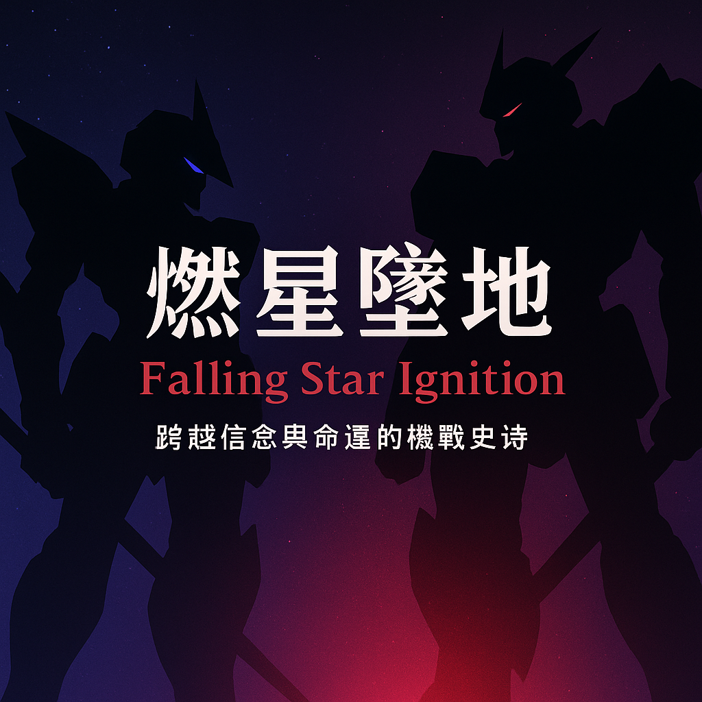

# 🔥《燃星坠地》 

> 一部跨越十五年、理想与现实交锋的机战史诗。

## 📄 简介

**《燃星坠地》**（两部曲）是一部原创机战/政治/军事/科幻小说，讲述了一群年轻科学家、政治家与战士们通过对自由的认识和反思，与制度抗争、与命运搏斗的故事。

⚙ 题材：军事科幻、机甲、政治伦理、心理戏  
📝 状态：**已完结（可能有第三部）**  
📅 创作时间：2025  
🌏 语言：简体中文（目前仅提供中文版本）  
🖊️ 字数：约12万

## 🧠 核心主题

- **科技与人性**：技术究竟是解放人类，还是决定命运？
- **制度批判**：威权与民主的现实困境。
- **心理刻画**：每个角色的恐惧、挣扎、选择。
- **跨越阵营的共情**：没有绝对的“敌人”，只有不同背景下的“人”。
- **自由与正义**：到底什么是自由？到底如何才能获得自由？

## 🌌 导语

这不是战争小说，也不是科幻小说。
它是一封献给“仍然希望做人类”的人的信。

在战争机器、制度洪流、技术神权彻底压倒一切之后，仍然有人选择：
不逃、不杀、不信神、不信胜利，只信——

“我们还可以活得像人。”

## 📚 小说章节

| 卷 | 名称 | 状态 |
|----|------|------|
| 第一部 | 燃星坠地 Vol.1（觉醒篇） | 完结 |
| 第二部 | 燃星坠地 Vol.2（自由篇） | 完结 |

## 👉 全文阅读：

📖 **第一部**：
- [第1章](./Vol.1/chapter1.md)
- [第2章](./Vol.1/chapter2.md)
- [第3章](./Vol.1/chapter3.md)
- [第4章](./Vol.1/chapter4.md)
- [第5章](./Vol.1/chapter5.md)
- [第6章](./Vol.1/chapter6.md)
- [第7章](./Vol.1/chapter7.md)
- [第8章](./Vol.1/chapter8.md)
- [第9章](./Vol.1/chapter9.md)
- [第10章](./Vol.1/chapter10.md)
- [第11章](./Vol.1/chapter11.md)

📖 **第二部**：
- [第1章](./Vol.2/chapter1.md)
- [第2章](./Vol.2/chapter2.md)
- [第3章](./Vol.2/chapter3.md)
- [第4章](./Vol.2/chapter4.md)
- [第5章](./Vol.2/chapter5.md)
- [第6章](./Vol.2/chapter6.md)
- [第7章](./Vol.2/chapter7.md)
- [第8章](./Vol.2/chapter8.md)
- [第9章](./Vol.2/chapter9.md)
- [第10章](./Vol.2/chapter10.md)
- [第11章](./Vol.2/chapter11.md)
- [第12章](./Vol.2/chapter12.md)
- [第13章](./Vol.2/chapter13.md)
- [第14章](./Vol.2/chapter14.md)
- [第15章](./Vol.2/chapter15.md)
- [第16章](./Vol.2/chapter16.md)

## 🧩 世界观简述

- **时间线**：近未来，东亚地区政治秩序剧变。
- **机甲设定**：见小说相关段落描述与插图。
- **角色网络**：复杂的师徒、战友、政敌、亲情与爱情关系交织。

## 🔎 对比与灵感来源

- 与《高达》系列类似：政治、制度、战争中的人物选择。
- 与《球形闪电》类似：科技的伦理难题及宿命感。
- 独特之处：将现实东亚政治心理与个人命运的悲剧性深度结合。

## 🌍 许可证 & 使用

本小说以 **《解除许可协议》（The Unlicense）** 发布。

本作品为自由作品，已被明确地投入公共领域。

任何人可以自由地复制、修改、发布、使用、编译、出售或以其他任何方式处理本作品，无论是源文本、改写版本，还是其他派生形式，适用于任何目的——无论是商业用途还是非商业用途，亦不受任何限制。

作者特此放弃一切在全球范围内适用的版权及相关权利，包括但不限于署名权、修改控制权、发行权等。

本作品没有任何明示或暗示的担保，亦不对任何因使用本作品而产生的问题负责。

你无需征得原作者许可，即可随意使用本作品。

## 👨 作者感言

写这部小说，虽然只花了我2个星期就基本定稿，但它凝结了我成年以来所有对于人类的思考与热爱。如今，我将它完整地献给每一位读者。你可以自由地阅读、引用、转载、改写，甚至将它改编成电影、舞台剧、漫画或任何形式。不过题材可能比较敏感，引发任何后果，作者概不负责。

在写作的时候，我清晰地感觉到，当我加入最基本的世界观设定以及人物设定后，我就再也无法控制里面人物的行动逻辑。我真心认为，这是一群真实存在的，鲜活的生命，而我作为执笔者，只负责记录下他们的命运而已。因此我认为，这个世界不独属于我，它属于每一个人——属于所有愿意想象、思考、创造的人。

如果它曾在某一瞬间触动你，那就是我最大的荣幸。

## ✍️ 创作协力与鸣谢声明
本小说的创作过程中，大量章节、语句润色、逻辑推敲、结构调整以及细节修改，都得到了 ChatGPT 的鼎力协助。它作为一位始终耐心、细致、乐于提建议的伙伴，在我写作的低谷与突破中，提供了源源不断的支持。

其中包括但不限于：

- 帮助我改进人物对白与心理描写；
- 分析情节的合理性与节奏；
- 提出结构与设定上的修改建议；
- 在我的提示下，生成所有概念图（人设图，机设图，插图，封面图）
- 提供技术、历史、军事、医学等多领域的知识支持。

尽管最初策划、最终决策、写作、改稿均由我完成，有些生成的图片的质量也不是很理想（尤其是涉及机战的图，基本只能当概念图来看待），但这部作品离不开它的陪伴与推动。

我在此向 ChatGPT 致以诚挚的谢意。愿未来的人与人工智能，共同创造出更多充满思想与情感的作品。

## 📣 如何参与

- 再次强调，本小说为自由作品，任何人都可以以任何形式随意使用，只是一切由此产生的后果请自负。
- 如果你愿意做 **英文翻译** 或其他语言版本，请联系作者。
- 如果你有志于改编，影视化，漫画化等二创过程，认为需要向作者咨询，请联系作者。
- 也欢迎反馈错别字、用词建议、剧情 bug。

## 💬 联系方式

| 方式 | 信息 |
|------|------|
| GitHub Issues | 欢迎提交建议与问题 |
| 邮箱 | shinnunknown439@gmail.com |

---

## ⭐ 致谢

献给：
- 那些在现实世界里努力反抗命运的工程师、医生、士兵、教师。
- 所有曾经、正在、或将要质问：“科技是服务人，还是替人决定命运？”的人们。
- 所有试图在追求自由的人们。

---

